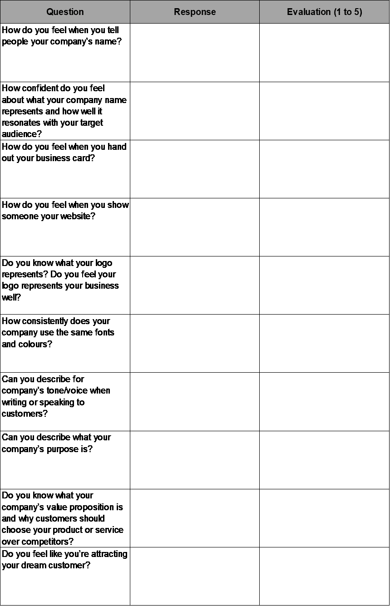

# 品牌真的那么重要吗？

> 原文：<https://medium.datadriveninvestor.com/is-branding-really-that-important-cb21cf918d49?source=collection_archive---------12----------------------->

前几天，我正在向一群电子商务企业家介绍营销战略研讨会。品牌是我们讨论的众多方面之一。快结束时，有人跳起来说:“但我是一个刚起步的人。在这个阶段，拥有一个品牌肯定没那么重要吧？!"

品牌有时会让人觉得有点难以捉摸——就像你无法准确定位的东西。

但是想一想:世界上所有最大的公司有什么共同点？从苹果到可口可乐，路易威登，谷歌等等。他们都有自己独特的品牌，世界各地的人们都清楚地知道这些公司代表什么，以及为什么他们会选择他们的产品或服务。

 [## 2019 年需要关注的 20 个数字营销趋势和技术——数据驱动的投资者

### 展示本周的电子学习模块。做一个终身学习者！关于技术、金融、工作场所的每日剂量…

www.datadriveninvestor.com](https://www.datadriveninvestor.com/2019/02/04/20-digital-marketing-trends-techniques-to-watch-out-for-in-2019/) 

无论你处于哪个行业，无论你处于哪个阶段或你在卖什么，你的客户都需要了解你是谁，你代表什么，以及为什么他们应该选择你而不是竞争对手——在他们决定雇佣你或购买你的产品之前。

这就是品牌的由来。

设身处地为潜在客户着想:在你有机会推销或展示你的产品之前，他们对你公司的第一印象通常是什么？你的品牌。第一印象很重要，所以重要的是你觉得第一次经历真正代表了你的公司和你想出名的一切。

显然，你的品牌不仅仅是一个标志。它融入了你公司的每一个视觉、每一篇文字、每一次体验和每一次互动。因此，一个稳固的品牌不仅能给你留下深刻的第一印象，还能与你的客户建立持久的关系。

要建立一个强大的品牌，你需要始终如一、有目的性和战略性。因此，无论何种语言，无论在哪个国家，你的公司、产品或服务都会在时间和空间上被认出来，你的现有或潜在客户会知道为什么他们会一次又一次地选择你。

如果你已经有了一个品牌，你如何评估它是否足够强大？

在此之前，让我们更详细地了解一下构成品牌的要素:

*   **视觉识别:**什么人*遇到你的公司就看*；你的观感。这可能包括您的徽标、字体、颜色、图像、包装、宣传材料和物理外观，无论是在线、印刷还是现实世界。
*   **声音:**你如何*对你的客户说话*。你的写作方式，你的员工在电话上、面对面或在线与客户交流的方式，以及你在沟通中的总体语气。
*   **价值主张:***定义的*你和*定义的企业核心组成部分让你与众不同* t，给你竞争优势和对客户的吸引力。这可以从你如何提供你的产品到你的价格点，你的价值观，使命等等。

现在你已经对品牌的内涵有了一个大致的了解，你可以使用下面的工作表来评估你的品牌优势。

在“回答”一栏，尽可能快地回答每个问题，写下你首先想到的。在“评估”栏中，用 1 到 5 的等级对每个回答进行评级，1 表示缺点，5 表示优点。

完成整张表格后，仔细阅读您的回答。你应该清楚自己可以利用哪些优势，以及可以从哪里开始提升自己的品牌。

# 品牌实力自我评估

如果你在这些方面中的任何一个方面给自己打了三分或三分以下，那么肯定还有一些工作要做。如果您想就您的结果进行交流，[联系我](https://www.the-emms.com/contact-us)进行免费的初步讨论，或者请求加入我们在脸书[的企业家网络](http://www.facebook.com/groups/emmsentrepreneurnetwork)，从您的同行那里获得有用的信息。