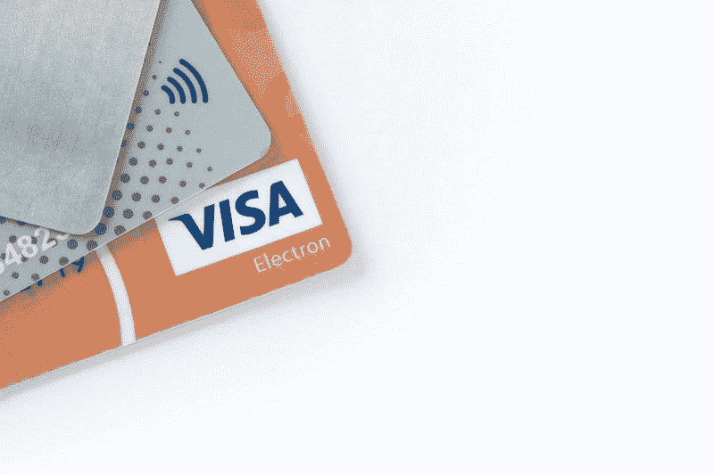
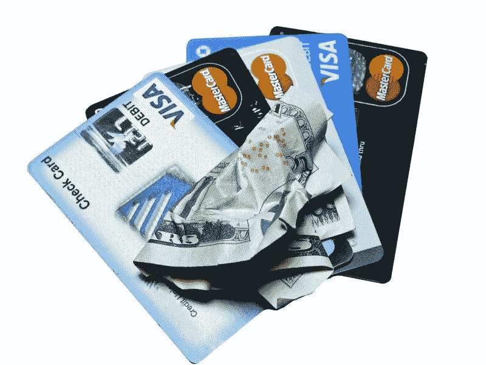
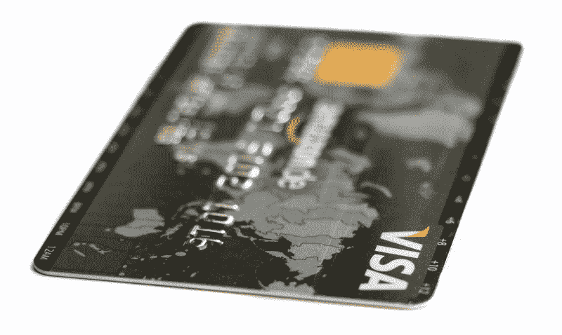
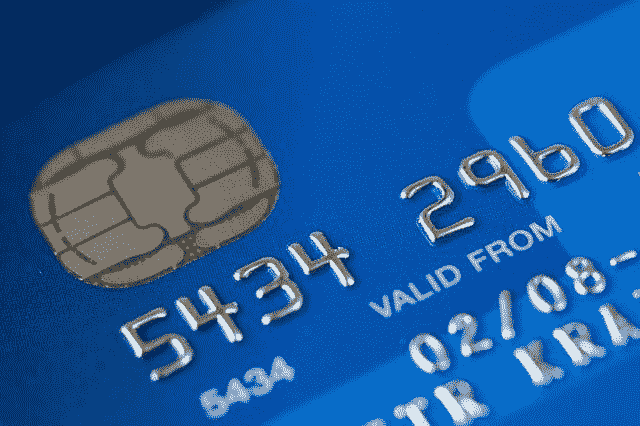
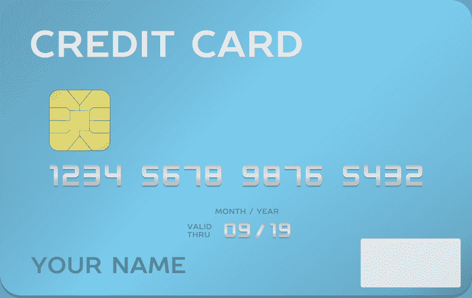

# 资本一号赚钱吗？—市场疯人院

> 原文：<https://medium.datadriveninvestor.com/is-capital-one-making-money-market-mad-house-8b8f2d3aef4b?source=collection_archive---------8----------------------->

**第一资本金融公司(纽约证券交易所代码:COF)**；美国第五大信用卡发行商因为各种错误的原因出现在新闻中。

七月，Capital One 承认所谓的黑客 Paige Thompson 涉嫌窃取了大约 1 亿美国人和 600 万加拿大人的数据，*The Verge*T4 报道。此次违规可能会在 2019 年让 Capital One 损失 1 亿至 1.5 亿美元。

 [## 分散金融的出现|数据驱动的投资者

### 当前的全球金融体系为拥有资源、知识和财富的人创造了巨大的财富

www.datadriveninvestor.com](https://www.datadriveninvestor.com/2019/03/14/the-emergence-of-decentralized-finance/) 

一份联邦诉状指控汤普森从 Capital One 的亚马逊网络服务(AWS)服务器窃取数据，并将其放在一个公开的 GitHub 页面上。不过，尚不清楚 One data Thompson 通过 GitHub 曝光了多少资本。此外，汤普森还将一些 Capital One 的客户数据放在了云协作平台 Slack 上。

The Verge 推测汤普森的行为并无恶意。另一方面，犯罪分子可能会利用她暴露的数据进行身份盗窃。

# 这次泄露会给 Capital One 带来多少损失？

无论汤普森的动机是什么，Capital One 都面临着重大问题。追查所有受害者并找出她偷了什么可能需要几年时间。此外，无法判断是否有任何 Capital One 数据在犯罪分子手中。

很明显，当局花了数年时间追踪 2013 年塔吉特(纽约证券交易所:TGT) 数据泄露事件的所有数据、罪犯和受害者。值得注意的是，Zdnet.com[声称](https://www.zdnet.com/article/anatomy-of-the-target-data-breach-missed-opportunities-and-lessons-learned/)黑客从微软网站上发布的对塔吉特公司 IT 的详细案例研究中获得了进入塔吉特公司系统的权限。

2017 年，Target 最终向 47 个州和哥伦比亚特区的客户支付了 1850 万美元，以解决因违规引起的索赔，*今日美国* [报道](https://www.usatoday.com/story/money/2017/05/23/target-pay-185m-2013-data-breach-affected-consumers/102063932/)。据《今日美国》 [报道](https://www.usatoday.com/story/money/2019/07/30/capital-one-data-breach-what-do-if-you-were-affected-and-know/1864628001/),纽约州司法部长 Letitia James 表示，她的办公室将调查首都一号的违规事件。

# 违约会伤害到 Capital One 吗？

Capital One 是美国第五大信用卡公司。*今日美国* [估计](https://creditcards.usnews.com/articles/what-are-the-largest-us-credit-card-companies) Capital One 有 3369.1 亿美元；或者说在 3 万亿美元的美国信用卡市场中占 10%多一点。

Stockrow [计算](https://stockrow.com/COF/financials/income/quarterly)，Capital One 上个季度以 57.82 亿美元的毛利和收入形式盈利。然而，在截至 2019 年 6 月 30 日的季度，Capital One 的收入增长萎缩了 2.96%。这是过去七个季度以来，第一季度 Capital One 收入增长首次出现萎缩。

相反，Capital One 的收入和毛利从 2019 年 3 月 31 日的 53.90 亿美元增长至 2019 年 6 月 30 日的 57.82 亿美元。截至 2019 年 6 月 30 日，Capital One 的净收入为 16.25 亿美元，营业收入为 20.03 亿美元。

# 第一资本正从其信用卡中产生现金

在截至 2019 年 6 月 30 日的季度，Capital One 从其产品中产生了 42.36 亿美元的运营现金流和 40.13 亿美元的自由现金流。相比之下，在同一季度，Capital One 报告的投资现金流为负 51.38 亿美元，融资现金流为负 27.05 亿美元。

重要的是，Capital One 是一家现金充裕的公司。它在 2019 年 6 月 30 日报告了 151.11 亿美元的现金和等价物。因此，Capital One 可以轻松弥补违约造成的任何损失。

此外，Capital One 有资源支付因违约而产生的和解或诉讼费用。例如，Capital One 在 2019 年 6 月 30 日报告的总资产为 3726.16 亿美元。

# 资本一号是价值投资吗？

许多人会怀疑 Capital One 是否是一项价值投资，因为其股价在 2019 年 9 月 13 日为 93.9 美元。相比之下，市场先生在同一天将 Visa Inc. (NYSE: V) 的股价定为 177.16 美元。

值得注意的是，Capital One 于 2019 年 8 月 2 日支付了 40₵的股息。此外，Dividend.com 认为 Capital One 在 2019 年 9 月 13 日的股息率为 1.7%，年化派息为 1.60 美元，派息率为 14.5%。

因此，与其他金融股相比，Capital One 看起来像是市场先生低估的一只不错的股息股。特别是，Capital One 比其他试图进入信用卡市场的大型金融机构更便宜

比如投行传奇**高盛(NYSE:GS)**；这是[在](https://marketmadhouse.com/goldman-sachs-plans-apple-pay-credit-card/) [Apple Pay](https://marketmadhouse.com/no-cryptocurrency-is-not-coming-to-apple-pay-soon/) 的帮助下发行的第一张信用卡，2019 年 9 月 13 日交易价格为 219.95 美元。奇怪的是，Capital One 已经做了高盛试图做的事情。

# Capital One 能和高盛竞争吗？

例如，Capital One 运营着一家在线消费者银行。与此同时，高盛(Goldman Sachs)正试图用其人工智能解决方案打造这样一家银行。

从积极的方面来看，Capital One 已经涉足个人银行业务。从负面来看，Capital One 发现自己正与高盛(Goldman Sachs)展开直接竞争，这不是一个好位置。

高盛是一个无情的竞争对手，拥有巨大的资源。例如，高盛报告称，2019 年 6 月 30 日，现金和短期投资为 910.92 亿美元，总资产接近 1 万亿美元。

此外，高盛将部分资金用于研发金融技术，如人工智能、加密货币和 stablecoins。如果高盛(Goldman Sachs)对技术的押注获得回报，这家投资银行可能会偷走 Capital One 的许多客户。

例如，高盛(Goldman Sachs)正通过其 Apple Pay Visa 虚拟信用卡潜入普通美国人的智能手机。这种基于应用的金融解决方案对 Capital One 的信用卡业务构成了直接威胁。

下一个合乎逻辑的步骤是高盛通过 Apple Pay 提供支票、储蓄和投资账户。很明显，马库斯提供储蓄账户。我怀疑 stablecoins 是 Marcus 能提供的下一个产品。

特别是，高盛可能会带走许多高收入客户，只给 Capital One 留下中产阶级或工薪阶层客户。因此，高盛可能最终把钱留给客户，迫使 Capital One 依赖低收入客户，从而增加该行的风险。

# 资本一是金融中的价值投资

因此，Capital One 已经在高盛想要进入的业务中。

因此，我认为 Capital One 是高盛(Goldman Sachs)和维萨(Visa)等价格较高的金融服务类股的良好替代品。如果你正在寻找一个低成本的金融投资，调查一下第一资本金融公司(纽约证券交易所代码:COF) 。尽管数据泄露，我认为 Capital One 仍然是一项价值投资。

*原载于 2019 年 9 月 13 日*[*【https://marketmadhouse.com】*](https://marketmadhouse.com/is-capital-one-making-money/)*。*