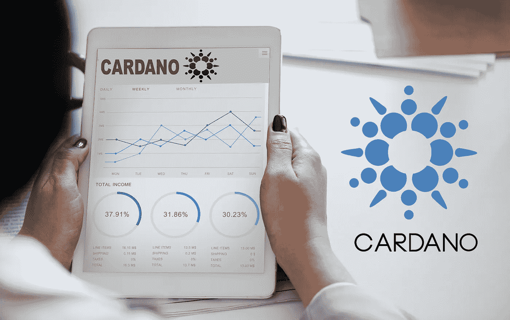

# 卡尔达诺是投资的最佳加密货币吗？

> 原文：<https://medium.datadriveninvestor.com/is-cardano-the-best-cryptocurrency-to-invest-in-6e57bf1e8199?source=collection_archive---------5----------------------->

***(免责声明:文章所表达的观点和看法仅属于作者，不一定反映数据驱动投资者的立场。这篇文章无意成为投资建议。)***

[*过去几周，比特币*](http://Bitcoin Accepted $3 Million on Valletta Palazzo Mansion in Malta which is on Sale) 在市场上表现不佳。在密切关注 [*加密货币*](https://www.thecoinrepublic.com/iran-dabbling-into-cryptocurrency-a-positive-sign-for-the-middle-east/) 市场后，一种新的范式被发现正在出现。比特币正在失去动力。与此同时，其他加密令牌正在触底反弹。一枚吸引了所有人注意力的硬币是卡尔达诺。

[*卡达诺*](https://www.thecoinrepublic.com/cardano-ada/) 是最基本健全的加密货币之一。但是加密货币(ADA/BTC)在 7 月 16 日低至 0.00000524 就说不通了。此时，加密令牌从 0.00008788 的历史高点下跌了 94%以上。然而，被一些人称为“ [*以太坊*](https://www.thecoinrepublic.com/ethereum-price-news-ethereum-shows-intact-uptrend-even-though-it-has-seen-a-drop-of-40/) 黑仔”的加密货币似乎正在筑底。实际上，它的交易水平可以创造一个新的基础和大规模泵。

 [## 如何创建自己的加密货币，让您的企业为未来做好准备|数据驱动…

### 加密货币是如何工作的？如何制作加密货币？如何推出我的加密货币？所有这些问题必须…

www.datadriveninvestor.com](https://www.datadriveninvestor.com/2019/03/25/how-to-create-your-own-cryptocurrency-and-make-your-business-ready-for-the-future/) 

快速看一下周线图，卡尔达诺的交易价格接近历史低点 0.0000057。即使空头能够在 7 月 16 日突破这一水平，多头也迅速做出反应，并在 7 月 17 日将价格推至支撑上方。支撑的短暂突破现在可以解释为空头陷阱。除此之外，6 月 24 日的交易量也显著上升。这可以看作是投降式成交量。换句话说，许多人放弃了他们的卡达诺头寸，转而投资 [*比特币*](https://www.thecoinrepublic.com/bitcoins-price-now-in-a-slump-of-fluctuating-lows/) ，因为他们对市场失去了希望。

如果你看一下市场周期的心理图表，你会发现卡尔达诺是如何进入萧条时期的。当然，它仍然可以走得更低，但如果这是底部，那么那些现在购买的人将能够最大化他们的利润。记住这一点，这将是投资卡多纳的最佳时机。

同意我们分析的投资者可能希望尽可能在 0.0000057 附近买入。如果多头守住支撑，直接目标 0.00001255。卡尔达诺 可能仍然看跌，因此考虑在 0.00000524 的新低下方设置紧密止损。通过这种方式，你可以获得超过 120%的收益，承担大约 8%的风险，这是一个非常好的风险回报比。