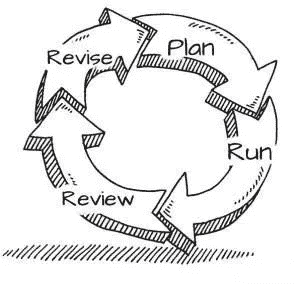

# 转行真的可能吗？

> 原文：<https://medium.datadriveninvestor.com/is-career-change-really-possible-c29c9a0d791c?source=collection_archive---------16----------------------->

# 关于如何成功转向的 5 个技巧

几乎每个人一生中都至少经历过一次:你醒来，上班的景象让你希望闹钟从未响过。做你的工作感觉痛苦而徒劳。你真的讨厌它，并且对你公司的光明未来不抱任何希望。回到家，你唯一能想到的就是你有多痛苦。你也不会闭嘴。如果你继续这样下去，你可能会精神崩溃，失去所有的朋友(如果你不断的哀叹还有幸存者的话)。

你可以申请调到不同的部门，或者在其他地方找一份类似的工作。但有时这还不够。你需要一个真正的改变。

不要绝望。许多人在你之前就已经经历过了，并证明了这是可行的*。系好安全带，你需要做的是:

## 1.做出一个决定，并致力于它。

许多人说他们想改变生活中的一些事情。问题是他们中的大多数人从来没有采取任何行动。抱怨比行动容易，所以记住:

> 如果你想改变你的生活，你必须改变你的生活。

在我们继续之前，您可能应该回答自己这些问题:

*   你想要一个职业支点吗？
*   你准备好为之努力了吗？**

如果你至少得到一个“不”，也许你可以在那里找到更多相关的文章。像[这个](https://www.instructables.com/id/Electric-Coffee-Maker/)比如，教你如何建造一个咖啡机(实用，嗯？).否则，请继续阅读。

## 2.制定一个计划。测试一下。调整。重复一遍。

这是你成为自己职业生涯的项目经理的地方。恭喜你。要想在这个新职位上取得成功，你需要一个计划。这并不意味着你不能改变它——恰恰相反。为了获得最好的结果，改变往往是必要的。总有一些你无法预见的因素，所以你不得不把你的计划建立在(更好或更坏的)假设上。

这一过程相对简单，源于[精益思想](https://en.wikipedia.org/wiki/Lean_thinking):

Lean Business Planning

因为你将来知道的可能比现在多，所以你的计划应该随时保持变化。*修订*应该是*审查*哪些地方出了问题，哪些地方可以改进的结果。

## 3.辞掉现在的工作。

不管这听起来有多鲁莽，辞去目前的工作——尽管需要提前做一些准备——会带来很多好处:

*   你有更多的时间真正专注于你的计划。别再找借口了。去工作吧。
*   根据你的工作让你筋疲力尽的程度，辞职可能会让你感觉精神焕发。因此，除了额外的时间，你还会有更多的精力去应对挑战。
*   除非你有很多积蓄，否则不得已辞职会给你提供一个**期限**，众所周知，我们大多数人在合理的压力下工作效率最高。
*   **没有后备计划**会让你更难回头，当事情看起来不顺利时，这可以成为你的额外动力。你*必须*以某种方式*实现*。

## 4.不要放弃。

这一点可能是最难的。你下定决心和做出承诺的那一天可能会是辉煌的，非常令人满意的。你终于觉得找到了自己的目标。但是现实来了。你报名参加的课程结果证明是无用的而且价格过高。一个本该帮你联系人事经理的朋友无限期地推迟了。没有人回复你的求职申请。回复的人只是提醒你你不够资格/经验不足(让我们面对现实吧:他们大多是对的)。

保持高度的动力对你的成功是绝对必要的。不过有几件事可能会对你有所帮助:

*   **记住这是你自己的目标**。没有人为你设定，你选择了它，所以它很可能是激励或吸引你的东西。你只需要记住它。
*   不要对自己太苛刻——设定现实的期望会让你更容易成功。
*   **焦点**。很容易说你花了一整天发简历，然而你在大多数时间里所做的是毫无意义的滚动。
*   为每一天制定一个日程，并尽可能严格执行。即使你已经辞掉工作，有足够的时间，也要保持有条理。列一个小的、可实现的任务清单，并试着在一天结束前完成。

## 5.把合适的人留在身边。

当事情变得艰难，你无法在自己身上找到动力时，你周围合适的人可能会拯救你的计划。

首先，避开那些质疑你所做事情的完整性的人。相信我，你自己也会质疑的。那些天生消极的人也不会给你带来任何好处。

这并不意味着你需要一群啦啦队员。一个就够了。无论是你的伴侣、妈妈、最好的朋友还是你在那个昂贵的课程中遇到的同事。你需要有人放你一马，给你对时事的评价提供一点客观性。事情往往不像你头脑中想象的那么悲观。如果是的话，稍微超脱一点可能会让你的啦啦队长帮你修改计划。

快乐旋转！

你自己有没有经历过转行，有没有一些小技巧可以分享？

— — — — — — — — — — — —

**不要与“容易”混淆。
* *你确定？*