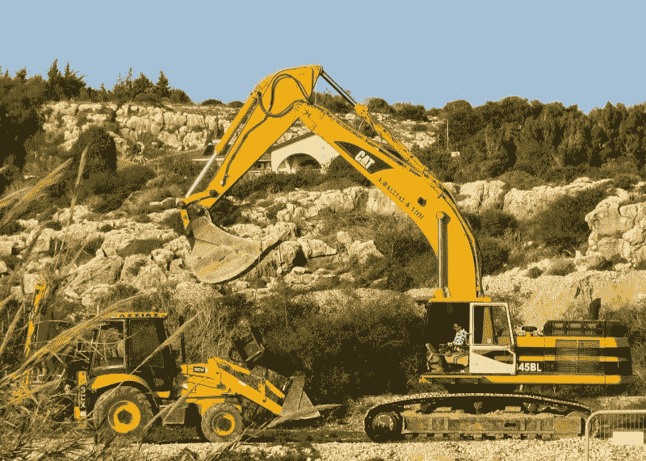
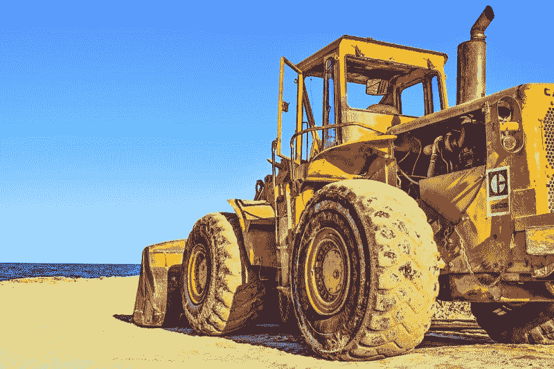
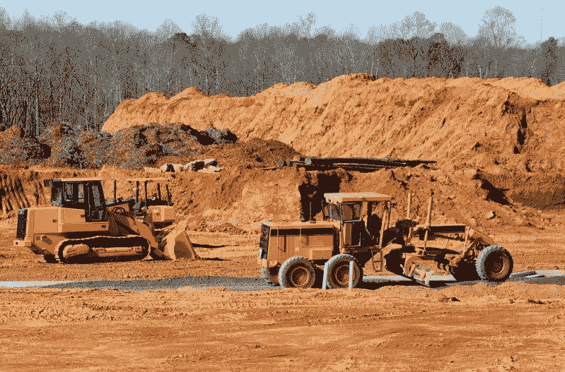
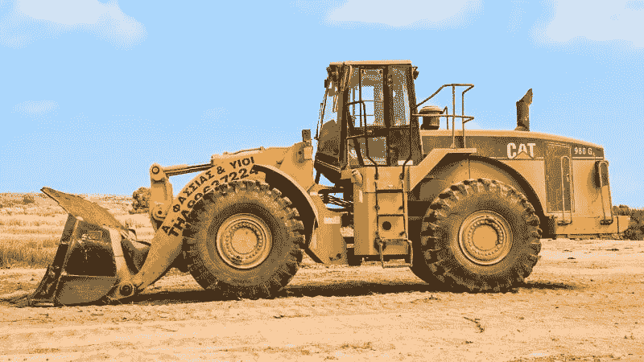
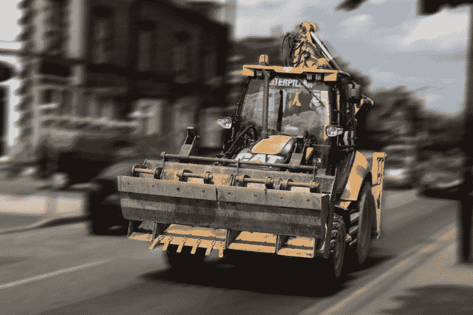
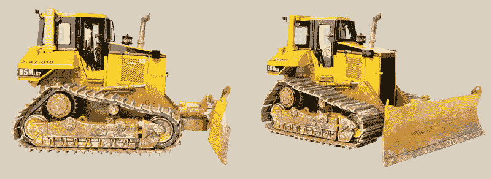

# 卡特彼勒赚钱了吗？—市场疯人院

> 原文：<https://medium.datadriveninvestor.com/is-caterpillar-making-money-market-mad-house-b2b5620c697c?source=collection_archive---------9----------------------->

重型设备和柴油发动机制造商**卡特彼勒公司(纽约证券交易所代码:CAT)** 可能向美国发出衰退警告。

Stockrow [估计，卡特彼勒上个季度的收入增长率下降了-5.57%。上一季度，卡特彼勒；或称 Cat，报告收入增长率为 3%。](https://stockrow.com/CAT/financials/income/quarterly)

 [## 算法交易的机器学习|数据驱动的投资者

### 当你的一个朋友在脸书上传你的新海滩照，平台建议给你的脸加上标签，这是…

www.datadriveninvestor.com](https://www.datadriveninvestor.com/2019/01/30/machine-learning-for-stock-market-investing/) 

此外，卡特彼勒的季度收入从 2019 年 6 月 30 日的 144.32 亿美元降至 2019 年 9 月 30 日的 127.58 亿美元。此外，卡特彼勒的季度毛利从 2019 年 6 月 30 日的 42.99 亿美元降至三个月后的 40 亿美元。

# 贸易战是在伤害卡特彼勒吗？

因此，卡特彼勒的业务减少，并受到唐纳德·特朗普总统(纽约州共和党人)对中国发动的[贸易战](https://www.theamericanconservative.com/articles/trumps-trade-war-has-consequences/)引发的经济动荡的影响。

例如，美国农场局联合会声称，2019 年 1 月至 9 月，农场破产数量上升了 24%，达到 580 家。*市场内幕* [估计](https://markets.businessinsider.com/commodities/news/farm-bankruptcies-jump-24-as-trump-trade-war-tariffs-bite-2019-10-1028649836)农场破产是自 2011 年以来的最高水平。

该联合会和市场内幕人士指责中国政府对美国农产品征收的高额关税导致了破产数量的增加。中华人民共和国实施关税是为了报复特朗普的关税。

“农民和牧场主正在与农业经济的长期低迷做斗争，美国农业不公平的报复性关税以及连续两年不利的种植、生长和收获条件使这种情况变得更糟，”约翰·纽顿声称。牛顿是该联合会的首席经济学家。

我认为农业衰退伤害了卡特彼勒，因为农民是重型设备和柴油发动机的大买家。此外，中华人民共和国正在为项目购买卡特彼勒重型设备；包括其新的丝绸之路计划，路透社[声称](https://www.reuters.com/article/us-caterpillar-china-b-r/caterpillar-drives-sales-on-chinas-new-silk-road-idUSKBN1GG146)。此外，卡特彼勒正在中国大举投资，在这个全球最大的建筑和采矿设备市场建立了 25 家工厂。

详细地说，价值 9000 亿美元的新丝绸之路是连接欧洲和中国的一系列公路、铁路和海路。有趣的是，新丝绸之路包括沿着欧洲和中国之间历史悠久的[丝绸之路](https://www.ancient.eu/Silk_Road/)贸易路线的铁路线和公路。

# 卡特彼勒赚了多少钱？

**卡特彼勒(纽约证券交易所代码:CAT)** 赚钱越来越少。值得注意的是，卡特彼勒的季度营业收入从 2019 年 6 月 30 日的 22.13 亿美元降至 2019 年 9 月 30 日的 20.2 亿美元。

此外，卡特彼勒的季度净收入从 2019 年 6 月 30 日的 16.2 亿美元降至 2019 年 9 月 30 日的 14.94 亿美元。因此，由于贸易战，卡特彼勒的资金可能会减少。

引人注目的是，由于贸易战，卡特彼勒正在产生现金。例如，卡特彼勒的季度营业收入从 2019 年 6 月 30 日的 25.88 亿美元降至 2019 年 9 月的 7.69 亿美元。

此外，卡特彼勒的季度自由现金流从 2019 年 6 月 30 日的 21.23 亿美元降至 2019 年 9 月 30 日的 5.28 亿美元。此外，卡特彼勒的融资现金流从 2019 年 6 月 30 日的-13.76 亿美元增长到 2019 年 9 月 30 日的 2000 万美元。

相比之下，卡特彼勒的现金及等价物从 2019 年 6 月 30 日的 74.29 亿美元增长至 2019 年 9 月 30 日的 79.06 亿美元。然而，卡特彼勒的总资产从 2019 年 6 月的 791.87 亿美元降至 2019 年 9 月的 779.93 亿美元。

# 卡特彼勒公司宣布裁员

可以预见的是，卡特彼勒计划在其位于德克萨斯州维多利亚的液压挖掘机工厂解雇 120 名临时工。维多利亚工厂雇佣了大约 600 名员工。

我的猜测是，这可能是卡特彼勒美国工厂的第一次裁员。为了解释这一点，我怀疑卡特彼勒的管理层认为美国正在经历一场经济衰退。因此，该公司正准备削减其业务和费用。

因此，我们可以看到卡特彼勒股票的大幅下跌。相比之下，猫的股票从 2019 年万圣节的 137.8 美元的低点上涨到 2019 年 11 月 6 日的 145.40 美元。因此,“市场先生”对美国经济比对卡特彼勒的管理层更有信心。

只有时间才能证明卡特彼勒的高管或股票投资者是否更聪明。然而，我认为了解日常销售和业务的高管可能比股票迷更了解经济。

# 卡特彼勒是价值投资吗？

我认为卡特彼勒是一个估值过高的价值投资，因为它是一家面临收入严重下降的好公司。因此，**卡特彼勒(纽约证券交易所代码:CAT)** 可能很快会面临股价下跌，但它仍在赚钱。

卡特彼勒很有价值，因为它拥有一些很棒的技术，而且在中国有很大的市场。因此，如果中国继续崛起为主导经济强国，卡特彼勒可能会赚很多钱。

然而，如果美国经济收缩，卡特彼勒可能会在美国面临巨大损失。我认为，由于普通美国人收入的下降，美国经济活动的大幅下滑即将到来。

因为，职业建设者[估计](http://press.careerbuilder.com/2017-08-24-Living-Paycheck-to-Paycheck-is-a-Way-of-Life-for-Majority-of-U-S-Workers-According-to-New-CareerBuilder-Survey)2017 年 78%的美国工人过着领薪水的生活。令人震惊的是，这一比例高于 2016 年的 75%。因此，普通美国人的钱少了，我认为这将导致经济活动减少。

# 美国的经济活动将会大幅下降

此外，婴儿潮一代的退休以及由此引发的退休危机等趋势会让事情变得更糟。解释一下，我相信在接下来的几十年里，数百万美国人退休时将一无所有，只有社会保障。

例如，社会保障局估计，2019 年 9 月的社会保障老年和遗属保险平均支付额为每月 1402 美元。这相当于年收入 16，824 美元。

与此同时，人口研究局[估计](https://www.prb.org/justhowmanybabyboomersarethere/)有 7640 万婴儿潮；1946 年至 1964 年在美国出生的人。因此，2029 年将有 7140 万美国人年龄在 65 岁或以上。

因此，在未来十年里，如果联邦政策没有重大改变，美国将面临个人收入和经济活动的大幅下降。因此，像卡特彼勒这样的公司正在向海外扩张；削减美国业务，积累更多现金储备。

# 卡特彼勒是好的股息投资吗？

我认为**卡特彼勒(纽约证券交易所代码:CAT)** 目前是一只很棒的分红股票。例如，卡特彼勒在 2019 年 10 月 18 日支付了 1.03 美元的股息。

令人印象深刻的是，卡特彼勒的股息在 2019 年增长了 17₵。具体而言，卡特彼勒于 2019 年 4 月 18 日支付了 86₵股息，并于 2019 年 7 月 19 日支付了 1.03 美元的股息。

Dividend.com[估计](https://www.dividend.com/dividend-stocks/industrial-goods/farm-and-construction-machinery/cat-caterpillar-inc/)总体而言，卡特彼勒股东在 2019 年 11 月 6 日获得的股息收益率为 2.81%，年化股息为 4.12 美元，股息支付率为 37.63%。此外，卡特彼勒已经连续九年实现股息增长。

总之，我认为**卡特彼勒**是“市场先生”高估的好股票。投资者需要关注卡特彼勒，而不是购买它，因为它的股价和财务数据可以向我们展示美国经济可能的走向。

*原载于 2019 年 11 月 6 日*[*https://marketmadhouse.com*](https://marketmadhouse.com/is-caterpillar-making-money/)*。*