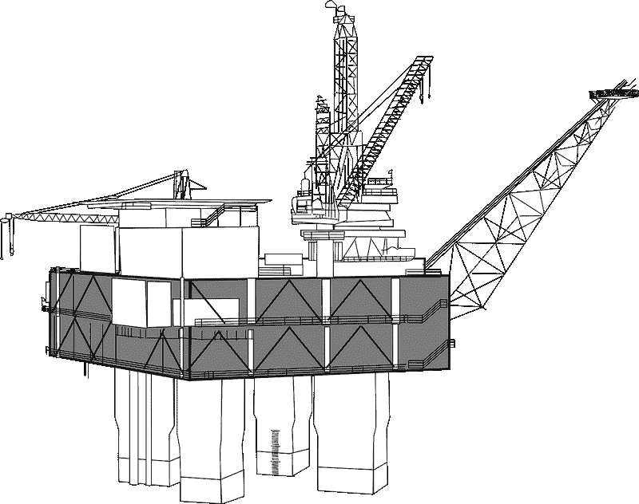
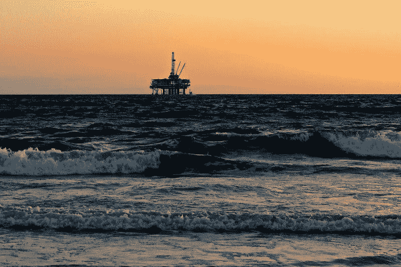

# 雪佛龙在亏损吗？—市场疯人院

> 原文：<https://medium.datadriveninvestor.com/is-chevron-losing-money-market-mad-house-64748eb6a8b9?source=collection_archive---------7----------------------->

雪佛龙公司(纽约证券交易所代码:CVX) 正在为一家石油公司做着不平凡的事情。雪佛龙公司在 T2 发布的新闻稿中承认将注销价值 110 亿美元的石油和天然气资产。

基本上，雪佛龙承认它永远不会从价值 110 亿美元的页岩气和其他资源中赚钱。这些资产中的大部分包括阿巴拉契亚的天然气和石油；和美国其他地方一样，*的油价* [报道](https://oilprice.com/Energy/Energy-General/Chevrons-11-Billion-Write-Down-Is-A-Warning-For-The-Oil-Industry.html)。

注销金额很大，因为雪佛龙在 2019 年 9 月 30 日报告的季度毛利为 151.75 亿美元。此外，雪佛龙在同一天公布了价值 361.16 亿美元的季度收入。

 [## 气候变化、ESG 和对更好数据的追求|数据驱动的投资者

### 在地球上许多地方经历了另一个令人难以置信的炎热夏季后，来自 S&P 的最新发现…

www.datadriveninvestor.com](https://www.datadriveninvestor.com/2018/08/24/climate-change-esg-and-the-quest-for-better-data/) 

此外，雪佛龙在 2019 年 9 月 30 日拥有 117.55 亿美元的现金和短期投资。因此，雪佛龙冲销了几乎和储蓄一样多的资产。

# 雪佛龙赚钱了吗？

资产减记来得不是时候，因为雪佛龙的盈利减少了。例如，雪佛龙的毛利从 2019 年 6 月 30 日的 169.68 亿美元降至 2019 年 9 月 30 日的 151.75 亿美元。

此外，雪佛龙的营业收入从 2019 年 6 月 30 日的 59.35 亿美元降至 2019 年 9 月 30 日的 40.49 亿美元。与此同时，同期雪佛龙的净收入从 43.05 亿美元降至 25.8 亿美元。

此外，雪佛龙的运营现金流从同期的 87.83 亿美元降至 78.17 亿美元。然而，同期雪佛龙的期末现金从 31.29 亿美元上升。

最后，收入从 2019 年 6 月 30 日的 388.5 亿美元下降到三个月内的 361.16 亿美元。因此，雪佛龙在冲销资产时赚的钱更少了。

# 令人难以置信的收入缩水

雪佛龙的收入正以惊人的速度缩水。斯托克罗估计，在截至 2019 年 9 月 30 日的季度，雪佛龙的收入萎缩了-17.89%。

此外，截至 9 月 30 日的这段时间是雪佛龙收入增长萎缩的第三个季度。雪佛龙于 2019 年 6 月 30 日报告收入负增长 8.02%。因此，雪佛龙的负收入增长率在三个月内翻了一倍多。

雪佛龙的收入增长全年都在萎缩。该公司于 2019 年 3 月 31 日报告收入增长率为-6.79%。

# 雪佛龙有什么价值？

雪佛龙(纽约证券交易所:CVX) 仍然拥有很多价值，包括一些令人印象深刻的能源项目。

例如，雪佛龙拥有 Gorgon 项目 4.73%的股份，该项目被其称为澳大利亚历史上最大的单一资源开发项目。雪佛龙声称 Gorgon 可以生产高达 26 亿立方英尺的天然气和 18000 桶石油。

与此同时，雪佛龙声称墨西哥湾的[杰克/圣马洛](https://www.chevron.com/projects/jack-stmalo)项目可以回收 5 亿油当量桶石油。2018 年，雪佛龙声称 Jack/St. Malo 每天生产 139，000 桶液态石油和 2100 万立方英尺的天然气。

此外，对于 Jack/St. Malo，雪佛龙的 Big Foot Project foot 每天可以在墨西哥湾开采 75，000 桶石油和 25 立方英尺天然气。雪佛龙[声称](https://www.chevron.com/projects/big-foot)大足可以容纳超过 2 亿桶石油当量。

在更接近本土的地方，雪佛龙在二叠纪盆地有大量投资，它在那里拥有 220 万净英亩的石油和天然气资产。雪佛龙[声称](https://www.chevron.com/projects/permian)在 2018 年已经在二叠纪生产了 15.9 万桶原油和 5.01 亿立方英尺的天然气。

# 雪佛龙可以开发中国市场

此外，雪佛龙拥有澳大利亚第一个第三方天然气中心[Wheatstone](https://www.chevron.com/projects/wheatstone)64.1%的股份。雪佛龙声称惠斯通每年可以处理多达 890 万公吨的液化天然气。

他们可以从惠斯通向中国运输液化天然气。中华人民共和国明年可能成为世界上最大的经济体。

渣打银行预计中国将在 2020 年成为世界上最大的经济体。此外，他们可以从惠斯通向印度输送天然气，渣打银行预计印度将在 2030 年成为世界第二大经济体。

雪佛龙[声称](https://www.chevron.com/projects/tengiz-expansion) Tengiz 在 2018 年生产了 269，000 桶原油、3.97 亿英尺天然气和 19，500 桶液化气。Tengiz 是一个重要的资源，因为他们可以从这里修建通往欧洲和中国的管道。

而且，滕吉兹靠近中国的[一带一路](https://www.businessinsider.com/what-is-belt-and-road-china-infrastructure-project-2018-1)；或者新丝绸之路。“一带一路”是一项通过铁路、海运、管道和公路连接中华人民共和国和欧洲的计划。“一带一路”倡议的几个部分穿过哈萨克斯坦。*商业内幕*声称中国政府可能会在这项倡议上花费 1 万亿到 8 万亿美元。

# 雪佛龙是价值投资吗？

鉴于这些潜在资源，我认为雪佛龙是一项价值投资。值得注意的是，我认为市场先生在 2019 年 12 月 16 日将雪佛龙的价格合理地定为 119.34 美元。

雪佛龙是价值投资，因为雪佛龙的产品还有巨大的潜在市场。电动汽车；如**特斯拉汽车公司(纳斯达克股票代码:TSLA)** 的产品，令人印象深刻，但远未得到广泛应用。

事实上，汽车制造商联盟[估计](https://interestingengineering.com/6-interesting-statistics-about-electric-vehicles)电动汽车在 2018 年仅占美国汽车份额的 1.2%。此外，有趣的工程声称，电动汽车在高采用率地区的销售额中占 7.84%，如加利福尼亚*。因此，我们中的大多数人仍然会在多年内用雪佛龙的标志性产品来填充我们的油箱。*

欧洲汽车制造商；然而，他们面临着销售电力的压力。路透社[报道](https://www.reuters.com/article/us-autoshow-frankfurt-acea-electric/european-automakers-tell-governments-they-must-help-sell-electric-cars-idUSKCN1VW1OL)欧盟(EU)可能会迫使欧洲汽车制造商通过销售电动汽车在 2021 年前减排 37.5%。

奇怪的是，雪佛龙可以从电动汽车中赚钱，因为天然气是一种受欢迎的发电厂低污染燃料。事实上，Geology.com[估计](https://geology.com/articles/natural-gas-uses/)在 2018 年，公用事业公司将雪佛龙 34%的天然气用于电力生产。燃烧天然气产生的二氧化碳比燃烧煤炭少 45%。

# 作为价值投资的雪佛龙

因此，**雪佛龙(纽约证券交易所代码:CVX)** 能源资源在很长一段时间内都有很大的价值。即使使用新技术；比如太阳能电力，还有理论上的能源，比如热核聚变。

此外，雪佛龙于 2019 年 11 月 15 日支付了 1.19 美元的年度股息。目前，雪佛龙在 2019 年 12 月 16 日提供的股息收益率为 4.04%，年化派息为 4.76 美元，派息率为 74.5%。Dividend.com 报道，引人注目的是，雪佛龙提供了 33 年的股息增长。

因此，雪佛龙是一个伟大的股息股票，但它是一个高风险的投资，因为技术正在扰乱能源业务的方式。那些可以承受一定风险但希望获得股息收入的人，需要研究一下**雪佛龙(纽约证券交易所代码:CVX)** 。

*原载于 2019 年 12 月 16 日*[*【https://marketmadhouse.com】*](https://marketmadhouse.com/is-chevron-losing-money/)*。*