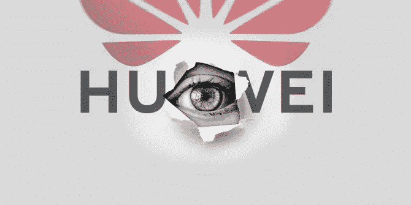
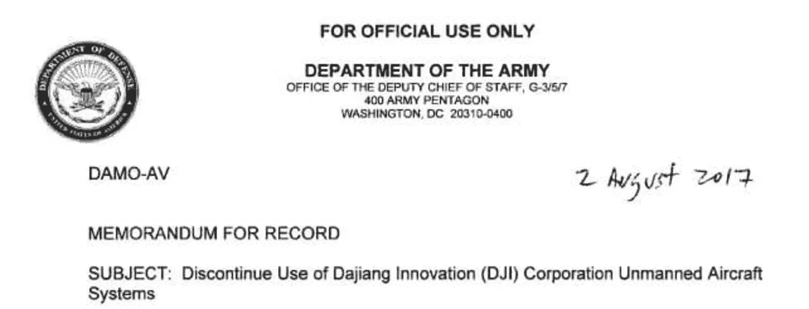
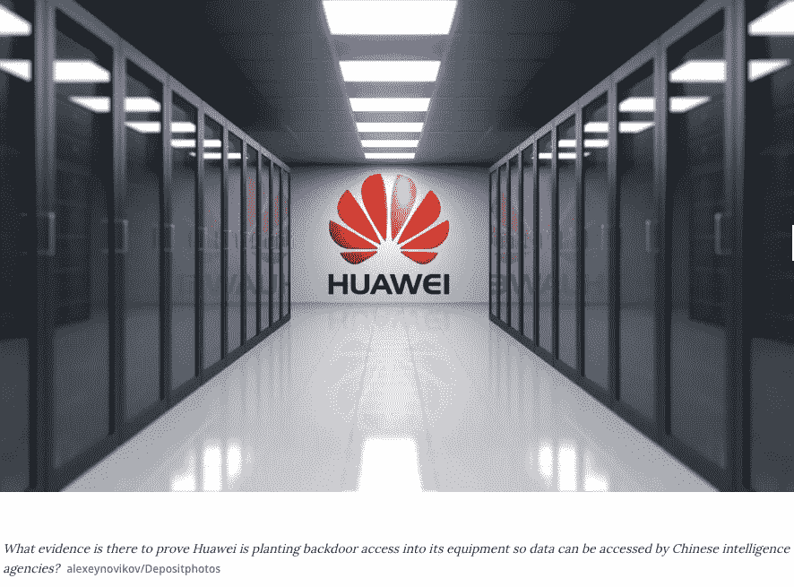
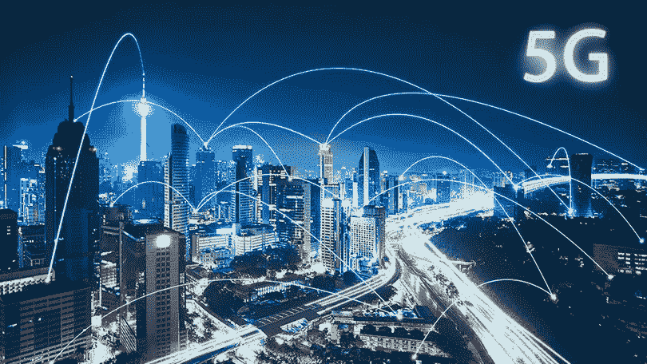
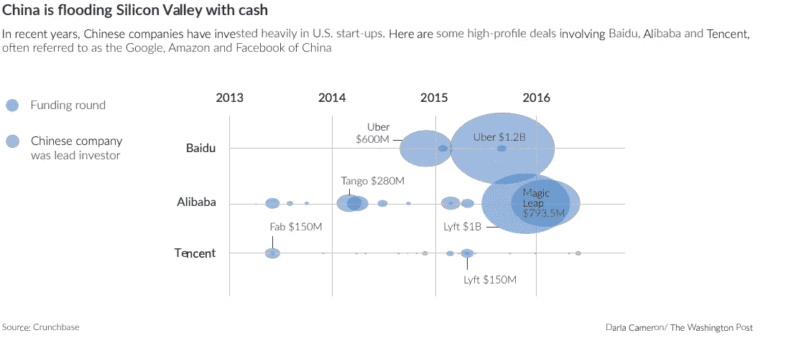
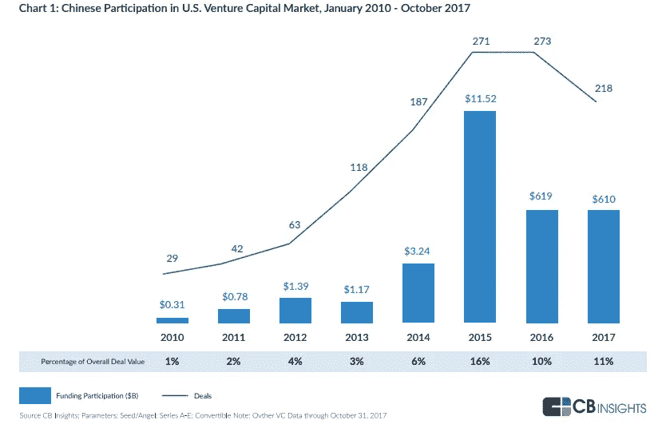
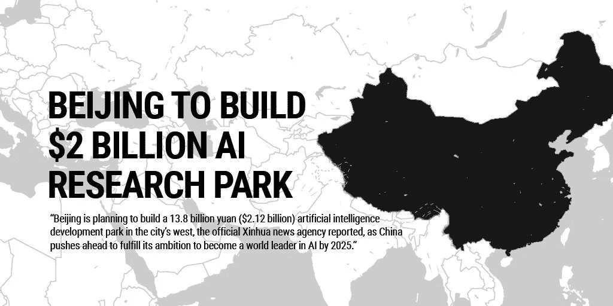

# 中国是一个人工智能安全问题吗？

> 原文：<https://medium.datadriveninvestor.com/is-china-an-ai-security-concern-393ff8ab604e?source=collection_archive---------4----------------------->

过去一周，内政部下令停飞中国制造或含有中国零部件的无人机。此前，国土安全部在 5 月份和美国陆军在 2017 年采取了类似的行动。虽然政治学者将禁令归功于特朗普政府针对亚洲超级大国的政策举措，但许多网络安全分析师提出了合理的安全担忧。

因此，有一项两党法案悬而未决，即 2019 年美国安全无人机法案，禁止所有联邦机构使用任何中国制造的飞行器。正如参议员理查德·布卢门撒尔解释的那样，“不管喜欢与否，无人机是我们的未来。如果国会不采取行动，像中国和伊朗这样的对手将利用无人机技术作为微型特洛伊木马来监视我们的政府、我们的关键基础设施——甚至我们的医院和住宅。该法案将确保我们不会向中国和其他国家发出窃取我们知识产权、破坏我们国内技术和监视我们社区的镀金邀请。”

多年来，中国操纵互联网和移动技术来监视自己的公民，限制言论自由。《T2 华尔街日报》的阿卡什·卡普尔(Akash Kapur)报道称，这个共产主义大国已经部署了一项“数字主权”政策，以限制其公民进入其视为生存威胁的国际社会。“防火长城”策略已被许多其他专制政权所采用，用于创建他们自己的过滤器，如朝鲜的光明网、伊朗的“清真网”和俄罗斯的 Runet。弗拉基米尔·普京最近签署了“主权互联网法案”，有效地实现了切断开关，阻止俄罗斯用户使用公共互联网。作为回应，许多美国科技公司心甘情愿地遵从了限制网络自由的要求。上个月，应中国政府的要求，苹果从其应用商店中移除了亲民主抗议者使用的“ [HKMap Live 应用](https://www.macrumors.com/2019/10/18/us-lawmakers-condemn-apple-decision-hkmap-app/)”。

 [## 在中国做生意:如何优化您的运营|数据驱动的投资者

### 中国是一个受本地和外国公司欢迎的商业中心。在一个国家设立实体存在…

www.datadriveninvestor.com](https://www.datadriveninvestor.com/2019/03/17/doing-business-in-china-how-to-optimize-your-operations/) 

蒂姆·库克抱歉地解释道:“技术可以被用来行善或作恶，这已经不是什么秘密了。这个案例也不例外。该应用程序允许众包报道和绘制警察检查站、抗议热点和其他信息。就其本身而言，这些信息是良性的。然而，在过去几天里，我们从香港网络安全和技术犯罪局以及香港的用户那里收到了可靠的信息，称该应用被恶意用于针对个别警察实施暴力，并在没有警察在场的情况下伤害个人和财产。这种使用方式违反了香港法律。同样，广泛的滥用显然违反了我们禁止人身伤害的‌‌App Store‌‌准则。”

今年 5 月，美国和中国之间的冲突达到了顶点，特朗普总统签署了国家紧急行政命令，禁止政府使用“对国家安全构成风险的电信设备”。这一举措微妙地暗示了中国芯片制造商华为对美国和欧洲用户进行间谍活动的指控。多年来，网络安全分析师一直报告华为产品中的安全漏洞和软件错误，这些漏洞和错误可能会导致不法活动。许多人认为，这些后门是中国庞大的安全机构故意打开的，用来监视华为国内外的用户。虽然没有具体行为的证据，但中情局在 4 月份表示，有证据表明制造商和中国军方之间存在金融交易。据报道，华为“从北京国家安全机构的分支机构获得资金……向英国展示的美国情报显示，华为从中国人民解放军、中国国家安全委员会和中国国家情报网络的第三个分支机构获得资金。”中国和西方之间的紧张关系对无人驾驶系统的全球创新有着直接的监管影响，特别是在更多自主机器连接到云的情况下。根据[国家情报总监办公室](https://www.dni.gov/index.php/search?q=5g)的说法:“我们将不得不在 5G 世界中找到一种方法，我们能够在多样化的网络中管理风险，其中包括我们不信任的技术(例如华为)。你必须假定一个肮脏的网络。”

The current state of tech paranoia started two years ago when Chinese President Xi Jinping presented his “China Dream” of world technology dominance by 2030, specifically in the areas of artificial intelligence and robotics. This has led to a spending boom by almost every Chinese agency in acquiring talent, research and intellectual property. [Professor Amy Webb of New York University](https://www.stern.nyu.edu/faculty/bio/amy-webb) complains “We are being outspent. We are being out-researched. We are being outpaced. We are being out-staffed. We have failed and are continuing to fail to see China as a militaristic, economic, and diplomatic pacing threat when it comes to AI.” She further suggests that President Xi “sees artificial intelligence as an integral point in shifting geopolitics and geo-economics.” Webb points to the fact that the Asian superpower’s R&D budget is three times the size of the United States. Professor Webb’s sentiment was echoed by [Elsa Kania](https://www.cnas.org/people/elsa-b-kania) of the Center for a New American Security who claimed, “the city of Tianjin alone plans to spend $16 billion on AI — and the U.S. government investment still totals several billion and counting. That’s still lower by an order of magnitude.”

The investments made by the Chinese extend to US startups in the form of capital infusions into AI and mechatronic innovations, many that originated in the Defense Department’s grant system. An unclassified report entitled [China’s Technology Transfer Strategy](https://admin.govexec.com/media/diux_chinatechnologytransferstudy_jan_2018_(1).pdf) by the Defense Innovation Unit Experimental (DIUx) states that “Chinese participation in venture-backed startups is at a record level of 10–16% of all venture deals (2015–2017) and has grown quite rapidly in the past seven years” from 6% participation a decade earlier. The study asserted that “the technologies where China is investing are the same ones where U.S. firms are investing and that will be foundational to future innovation: artificial intelligence, autonomous vehicles, augmented/virtual reality, robotics and blockchain technology.”

DIUx 的作者警告说，接受中国资金的创始人精力充沛，因为“国防部对这些技术感兴趣，以建立今天美国军方的技术优势。双重用途技术在商业部门的迅速发展对战争的性质产生了重大影响；在竞争对手之前掌握它们将确保我们能够赢得未来的战争。”正如卡尼亚女士所说，“(人民解放军)正在探索利用人工智能增强指挥决策能力，寻求在未来战场上取得决策优势。”DIUx 推荐的解决方案是升级美国外国投资委员会(CFIUS ),通过对交易的系统评估而不是逐案评估来限制投资。此外，对技术转让和投资进行严格的出口控制以包括早期技术可以防止对手获得“美国创新皇冠上的宝石”。

虽然苏联和美国之间的冷战于 1991 年结束，但最近的联邦法令和抵制应该通过“人工智能军备竞赛”的棱镜来看待。正如一位中国政府官员所说，“到 2030 年，我们将使人工智能理论、技术和应用处于世界领先水平。(中国将)成为世界主要的人工智能创新中心。”澳大利亚[新闻服务](https://www.abc.net.au/news/2018-10-06/china-plans-to-become-ai-world-leader/10332614)已经发布了一个国家人工智能能力的全球评级，美国得分 33 分(满分 100 分)，中国上升到第 17 位。2050 年，中国的国内生产总值将达到 105 万亿美元，相当于美国的 150%,这一预测使这一数据更加复杂。然而，我意识到，美国的成功故事不一定是基于我们培养博士和工程师能力的数字游戏。美国发明家应该被富兰克林、爱迪生和乔布斯的故事所鼓舞，套用罗伯特·巴尔的不朽名言，“美国人最可怕；他在规划自己的项目时运用了更多的独创性，在实施过程中也比地球上任何人都要冒更大的风险。