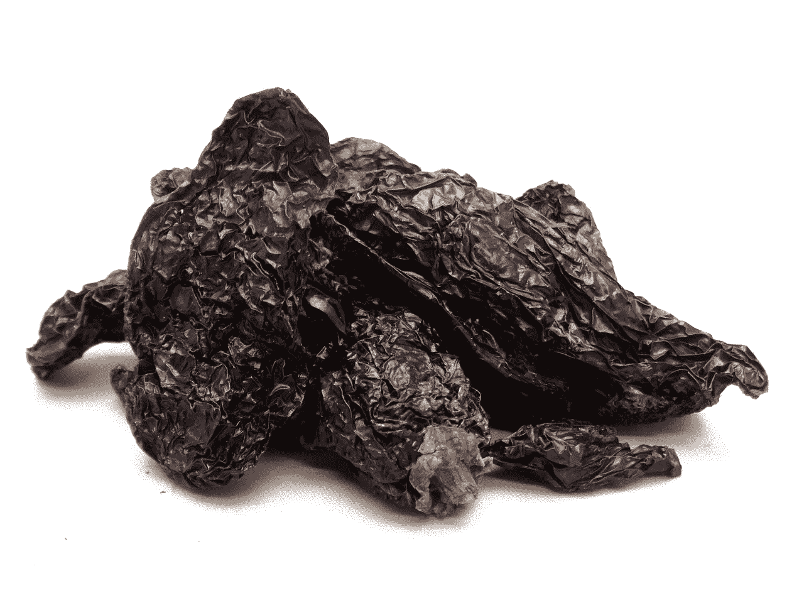
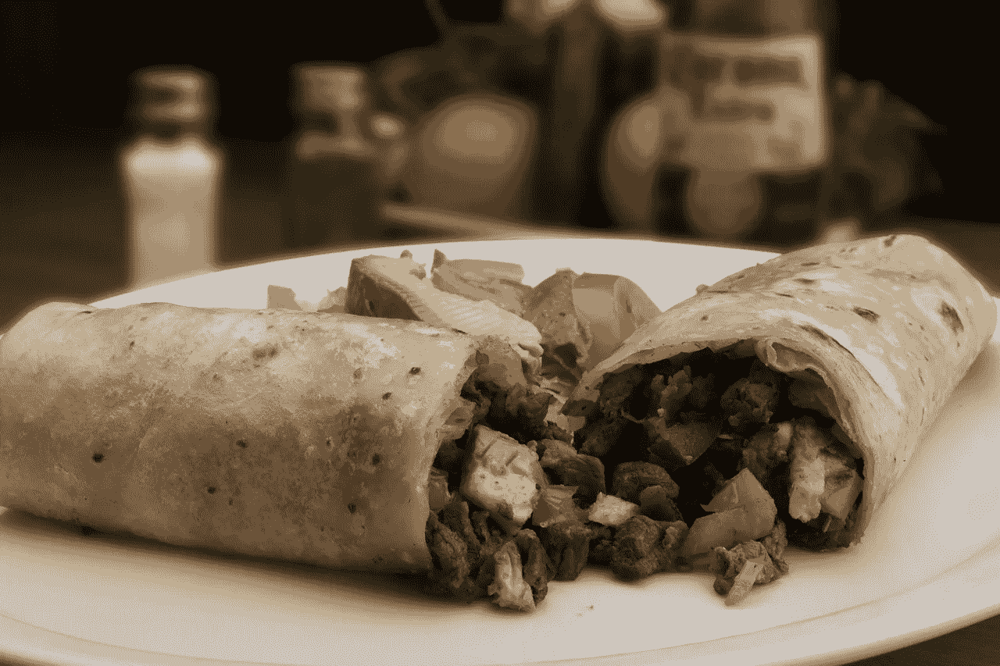
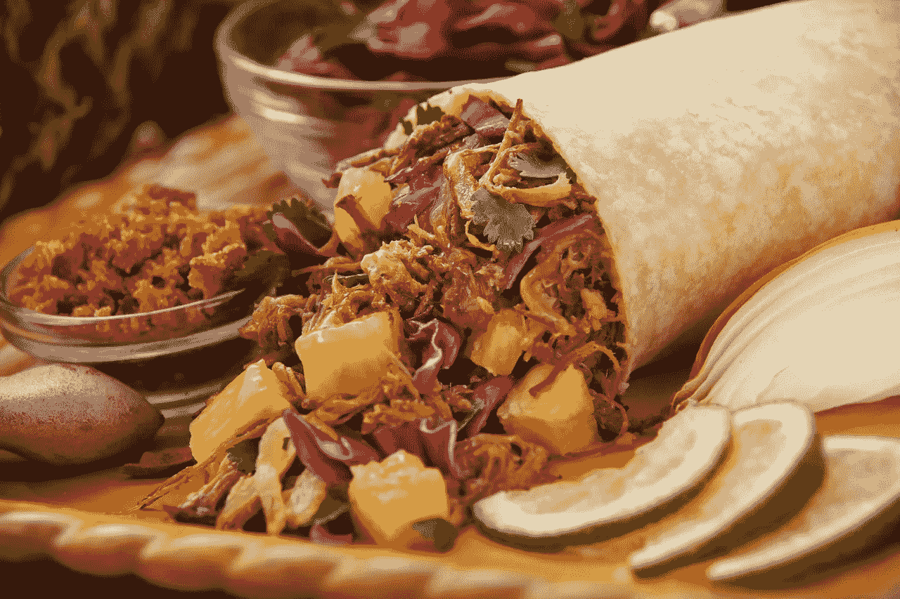
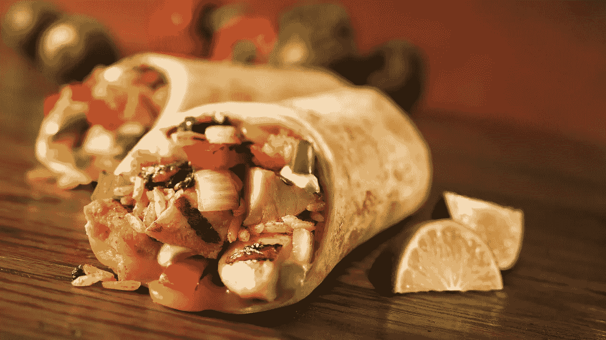

# 股票:墨西哥墨西哥烧烤快餐的未来？

> 原文：<https://medium.datadriveninvestor.com/is-chipotle-mexican-grill-the-future-of-fast-food-11dae4528cd2?source=collection_archive---------4----------------------->

Chipotle Mexican Grill(纽约证券交易所代码:CMG) 因其商业模式可能成为快餐的未来。解释一下，Chipotle 卖的是非常适合外卖的高价值食物(墨西哥卷饼)。

事实上，Chipotle 的商业模式似乎非常适合现代美国人的生活方式。例如，价格更高、质量更好的食品很好地适应了日益加剧的收入不平等。

值得注意的是，皮尤研究中心[计算出](http://www.pewresearch.org/fact-tank/2018/09/06/the-american-middle-class-is-stable-in-size-but-losing-ground-financially-to-upper-income-families/)，自 2000 年以来，上层阶级的收入一直在增长，而中产阶级的收入却停滞不前。此外，美国中产阶级的比例在 1991 年至 2016 年间从 56%萎缩至 52%。与此同时，在此期间，上层阶级从 17%略微增长到 19%。

 [## 2019 年需要关注的 20 个数字营销趋势和技术——数据驱动的投资者

### 展示本周的电子学习模块。做一个终身学习者！关于技术、金融、工作场所的每日剂量…

www.datadriveninvestor.com](https://www.datadriveninvestor.com/2019/02/04/20-digital-marketing-trends-techniques-to-watch-out-for-in-2019/) 

# 【Chipotle Mexican Grill 如何推动 Postmates 的增长

此外，Chipotle 的产品非常适合外卖配送。具体来说，Postmates 在大多数市场运送墨西哥薄饼食品。据 CNN 财经[报道](https://www.cnn.com/2019/02/07/tech/postmates-ipo/index.html)，Postmates 是一个快速增长的基于应用程序的按需交付服务，最近[申请](https://blog.postmates.com/san-francisco-february-7-2019-postmates-inc-2760fd929bc)进行首次公开募股(IPO)。

解释一下， [Postmates](https://onezero.medium.com/how-i-became-addicted-to-the-gig-economy-2a8baf6017d8) 提供 9.99 美元或一个月的无限制递送；或者 15 美元以上的订单一年 96 美元。因此，普通母亲可以通过邮局免费为家人订购一份完整的墨西哥卷饼餐。

Postmates 尚未盈利，但该公司正计划在 2019 年进行 18.5 亿美元的 IPO。此外，Postmates 还在私募股权中筹集了 6.75 亿美元。

# **Chipotle Mexican Grill 在成长吗？**

很明显，Chipotle 本身正在稳步增长。例如，Stastia [估计，Chipotle 餐厅的数量从 2016 年的 2250 家增长到 2017 年的 2408 家。](https://www.statista.com/statistics/221456/number-of-chipotle-restaurants/)

令人印象深刻的是，Chipotle 的足迹从 2007 年的 704 家餐厅增长到 2017 年的 2408 家。因此，墨西哥辣椒的数量在 10 年内增长了三倍。

此外，Chipotle 在 2018 年第四季度的收入增长率为 10.36%。然而，同期 Chipotle 的毛利略有萎缩，从 2.2875 亿美元降至 2.0831 亿美元。

因此，Chipotle 可以迅速扩大业务，但它很难维持毛利润。另一方面，Chipotle 仍在从这个足迹中赚钱。

# **Chipotle 墨西哥烤肉赚钱吗？**

**Chipotle Mexican Grill(纽约证券交易所代码:CMG)** 仍在从墨西哥卷饼中赚钱。然而，Chipotle 比 2017 年赚的钱少了。

例如，Chipotle 报告 2018 年第四季度的净收入为 3202 万美元，营业收入为 3916 万美元。然而，Chipotle 报告 2018 年第四季度净收入为 4379 万美元，营业收入为 6903 万美元。

另一方面，Chipotle 报告 2018 年第四季度的收入为 12.25 亿美元，2017 年第四季度为 11.10 亿美元。因此，与 2017 年相比，墨西哥卷饼似乎卖得更多，但赚的钱却更少。

# 【Chipotle Mexican Grill 有多少现金？

毫不奇怪，Chipotle 正从其高价食品中获得现金。例如，Chipotle 报告 2018 年第四季度的运营现金流为 1.29 亿美元，自由现金流为 5166 万美元。

因此，我得出结论，Chipotle 将因为这些现金而长期运营和增长。值得注意的是，Chipotle 在扩大业务范围和与新的特许经营者合作方面处于有利地位。此外，Chipotle 可能有资源来适应快递业崛起等趋势。

然而，Chipotle 的现金储备很低，但正在增长。例如，截至 2018 年 12 月 31 日，Chipotle 拥有 2.0015 亿美元的现金和等价物，以及 4.2685 亿美元的短期投资。

因此，截至 2018 年底，Chipotle 拥有 7.07 亿美元现金。相比之下，Chipotle 在 2017 年底拥有 5.3855 亿美元现金。因此，Chipotle 正在慢慢积累更多的现金。

# Chipotle Mexican Grill 支付股息吗？

如果管理层愿意，Chipotle Mexican Grill 有资源支付可观的股息。

然而，Chipotle 选择不支付股息。很容易理解为什么 Chipotle 不支付股息。2019 年 3 月 13 日，该公司的股票交易价格为可笑的每股 637 美元。

在这种情况下，Chipotle 支付股息毫无意义。解释一下，股息的通常目的是使股票对投资者更有吸引力，并提高其价格。

然而，在没有股息的情况下，Chipotle 的股价已经很高了。因此，Chipotle 不会很快支付股息。

# **为什么 Chipotle Mexican Grill 是快餐行业的主要参与者**

我的结论是，Chipotle 是一家好公司，股价过高。然而，Chipotle 不断增长的现金和 2019 年 3 月 13 日 176.5 亿美元的高市值将使其成为快餐行业的主要参与者。

解释一下，如果管理层愿意的话，Chipotle 可能有资源进行收购或实现重大增长。特别是，我认为收购一家像 Shake Shack Inc. (NYSE: SHAK) 这样成长中的高质量快餐供应商对 Chipotle 来说是有意义的。

具体来说，Shake Shack 的市值仅为 19.65 亿美元，2019 年 3 月 13 日的股价为 53.11 美元。收购 Shake Shack 对 Chipotle 来说是有意义的，因为公司以略高的价格出售高质量的快餐。

此外，两家公司服务于相同的市场和社区，因此合并后可能会产生协同效应。特别是，Chipotle/Shake Shack 商店的组合将更容易为交付应用服务。解释一下，送货员可以在一家商店领取几份订单。

# **为什么 Chipotle Mexican Grill 是一家值得关注的公司**

一个更大的机会可能是在[亚马逊 Go](https://sf.curbed.com/2019/3/4/18250596/amazon-go-san-francisco-sf-shopping-location) 或**星巴克(纳斯达克股票代码:SBUX)** 里的一个墨西哥小吃店。解释一下，Go 就是**亚马逊(NASDAQ: AMZN)** 的无收银员高度自动化实验便利店。

有趣的是，Amazon Go 和 Chipotle 的目标客户是相同的。比如有很多现金但时间不多的高收入都市职场人士。值得注意的是，亚马逊正在西雅图、伦敦、旧金山、芝加哥和纽约等富裕城市测试 Go 位置。因此，带有 Chipotle 的 Go 型商店是有意义的。特别是，顾客可以在这样的组合中同时拿到亚马逊订单和墨西哥卷饼。

因此，Chipotle 很可能是美国快餐的未来。那就是高质量、高价格、注重交付。然而，Chipotle 的股票对我来说还是太高了。

因此，Postmates 的股票可能是 IPO 后更好的投资。因此，我认为 Chipotle 是一只值得关注而非买入的股票。