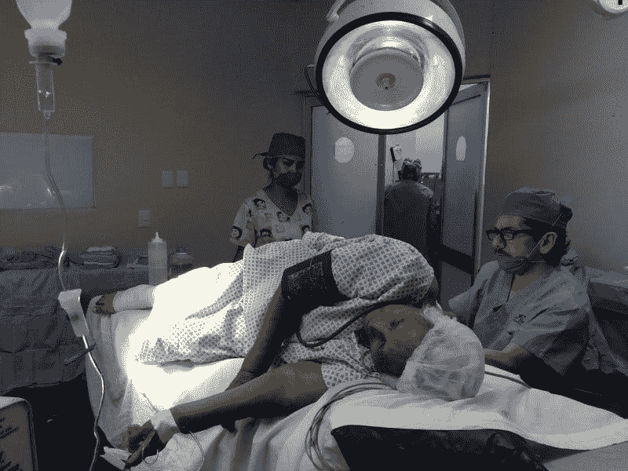

# Cigna Express 脚本赚钱吗？—市场疯人院

> 原文：<https://medium.datadriveninvestor.com/is-cigna-express-scripts-making-money-market-mad-house-4738e0a21f8a?source=collection_archive---------13----------------------->

判断药品利润有多丰厚的一个好方法是询问 Cigna Express 脚本是否在赚钱。解释一下， **Cigna Corp (NYSE: CI)** 是美国第四大保险公司，也是最大的邮购和专业药房。

*福布斯* [估计](https://marketmadhouse.com/is-cigna-express-scripts-making-money/#51fa62fdf826)2018 年，Cigna 是美国第四大健康保险提供商，拥有 1590 万投保人。此外，*药物频道*估计，Cigna 是美国第三大药房运营商，2018 年的处方收入为 465 亿美元。由于这一收入，*药品渠道* [计算出](https://www.drugchannels.net/2019/02/the-top-15-us-pharmacies-of-2018-m.html) Cigna 在 2018 年控制了美国处方药市场的 11%。

 [## 医疗保健的未来正在被一场大型技术入侵所塑造|数据驱动型投资者

### 过去十年，全球经济的所有部门都经历了大规模的数字颠覆，而卫生部门现在…

www.datadriveninvestor.com](https://www.datadriveninvestor.com/2018/11/02/the-future-of-healthcare-is-being-shaped-by-a-big-tech-invasion/) 

详细来说， **CVS Health (NYSE: CVS)** 是美国最大的药房运营商，2018 年收入 1028 亿美元， *Drug Channels* 计算。具体来说，CVS 从 15.1%的零售药店市场创造了 642 亿美元的收入。此外，CVS 从 9.1%的邮购药店市场获得了 386 亿美元的收入。

此外，**沃尔格林公司(纳斯达克股票代码:WBA)** 从整个处方市场的 17.5%获得 744 亿美元的收入。**联合健康集团(NYSE: UHC)** OptimumRX 子公司排名第四，从邮购药房业务的 6.1%中赚取了 259.5 亿美元。最后，**沃尔玛(纽约证券交易所:WMT)** 排名第五，从零售药店市场的 4.9%中积累了 209 亿美元的收入。

# Express Scripts 正在失去市场份额

Cigna 公司遇到了一些问题，因为它是美国十大药房运营商中唯一一家收入下降的公司。详细来说，*药品渠道*估计 2018 年 Cigna/Express 脚本收入下降了-1.8%。

相比之下，2018 年，CVS 的收入增长了 7.7%，沃尔玛的收入增长了 15.6%，UnitedHealth 的药店收入增长了 23.4%，沃尔玛的药店收入增长了 2.1%。因此，Cigna 的药房收入正在缩水。

然而，Stockrow [声称](https://stockrow.com/CI/financials/income/quarterly)在截至 2019 年 6 月 30 日的季度中，Cigna 的收入比 2018 年增长了令人难以置信的 238.14%。澄清一下，Cigna 于 2018 年 12 月[购买](https://www.pharmacytimes.com/news/cigna-completes-purchase-of-express-scripts)的 Express Scripts 带来了惊人的收入增长。

值得注意的是，Stockrow 在 2018 年最后一个季度给了 Cigna 37.61%的收入增长率。相反，信诺在 2019 年第一季度的收入增长率为 232.48%。

# 为什么 Express 脚本正在失去市场份额？

Express Script 的收入正在下降，因为美国人似乎正在远离邮购药店。

值得注意的是，*药品渠道*估计，CVS 的专业药房收入在 2018 年萎缩了-0.1%。然而，联合健康集团的收入在 2018 年增长了 23.4%。然而，快递脚本骇人听闻的名声可能会导致缩水。

例如，glass door[labels](https://www.glassdoor.com/Reviews/Employee-Review-Express-Scripts-RVW24728008.htm)Express Scripts 公司“被药剂师评为最不适合工作的公司”此外，一个匿名的个人 Glassdoor 确定为一名前 Express Scripts 雇员，声称 Express Scripts 解雇了没有达到配额的药剂师。此外，同一位匿名投诉者指责 Express Scripts 像对待孩子一样对待成人。

我怀疑糟糕的工作条件导致了糟糕的客户服务，这使得客户远离 Express Scripts。然而，管理层可以通过雇佣更好的主管和取消不受欢迎的规则来轻松解决这个问题。

# 信诺赚了很多钱

另一方面，财务数据显示，信诺集团正在赚大钱。

例如，截至 2019 年 6 月 30 日的季度，Cigna 的总利润为 62.8 亿美元，收入为 388.19 亿美元。此外，Cigna 报告同一季度的营业收入为 21.63 亿美元，净收入为 14.08 亿美元。

相比之下，截至 2018 年 6 月 30 日，信诺报告的收入为 114.8 亿美元，毛利为 40.22 亿美元，营业收入为 11.61 亿美元，净收入为 8.06 亿美元。因此，购买 Express Scripts 对 Cigna 来说是一个明智的选择，该公司正在赚更多的钱并产生更多的收入。

然而，信诺的现金流几乎没有增长。为了解释，Cigna 报告 2018 年 6 月 30 日的运营现金流为 9.95 亿美元，自由现金流为 8.78 亿美元。一年后，Cigna 报告自由现金流为 7.36 亿美元，运营现金流为 8.78 亿美元。

因此，Cigna 的 Express Scripts 购买并未导致现金流的显著增加。相反，Cigna 手头有更多的现金用于 Express 脚本。具体来说，Cigna 在 2019 年 6 月 30 日拥有 52.75 亿美元的现金，一年前拥有 38.54 亿美元的现金资产。详细来说，Cigna 当天有 16.65 亿美元的短期投资和 36.1 亿美元的现金及等价物。

# 信诺是好的分红股吗？

我认为**信诺(NYSE: CI)** 是一只可怕的分红股票，因为它的年派息很低；2019 年 4 月 10 日，4₵。值得注意的是，自 2013 年以来，股息一直没有增长。

因此，Dividend.com 估计，截至 2019 年 8 月 19 日，信诺的股息率为 0.02%，4₵的年化派息率为 0.3%。如果这种支出持续下去，股东将很难从 Cigna 的股息中获利。

此外，市场先生在 2019 年 8 月 19 日将 Cigna 的定价过高，为每股 161.98 美元。澄清一下，我认为缺乏可观的股息使得 Cigna 成为一只糟糕的保险股。

# Cigna 不是一项价值投资

Cigna 不是价值投资，因为它的价格很高。然而，我认为 Cigna 是价值投资的候选对象，因为它的增长率很高。

我认为 Cigna 没有什么价值，因为它似乎无法从健康保险业务中获得大量浮存金。澄清一下[浮存金](https://medium.com/datadriveninvestor/is-float-the-key-to-wealth-building-82c03d5ce076)是客户向公司持续支付的现金流。

沃伦巴菲特(Warren Buffett)以保险费为例，这是他最喜欢的浮动例子。然而，我在 T4 的伯克希尔哈撒韦公司(纽约证券交易所代码:BRK)找不到值得注意的健康保险股份。B) [列出子公司的](https://www.berkshirehathaway.com/subs/sublinks.html)。然而，**伯克希尔哈撒韦公司(纽约证券交易所代码:BRK。A)** 拥有数十家保险公司。

# 健康险赚钱吗？

我猜沃伦叔叔不喜欢健康保险，因为它不能产生稳定的浮动。此外，巴菲特可能对政府过度介入医疗保险持怀疑态度。

CNN 财经[透露，值得注意的是，巴菲特是单一付款人医疗保健或全民医疗保险的直言不讳的支持者。解释一下，单一支付者是一个政府所有、税收资助的全民健康保险体系。](https://money.cnn.com/2017/06/28/news/warren-buffett-single-payer-health-care/index.html)

鉴于他对单一支付者的支持，我怀疑巴菲特认为医疗保险本质上是无利可图的，所以他远离它。我不得不同意沃伦叔叔的观点；我觉得医保本来就是无利可图的，所以对于股票投资者来说，置身医保之外是明智之举。

*原载于 2019 年 8 月 19 日*[*【https://marketmadhouse.com】*](https://marketmadhouse.com/is-cigna-express-scripts-making-money/)*。*