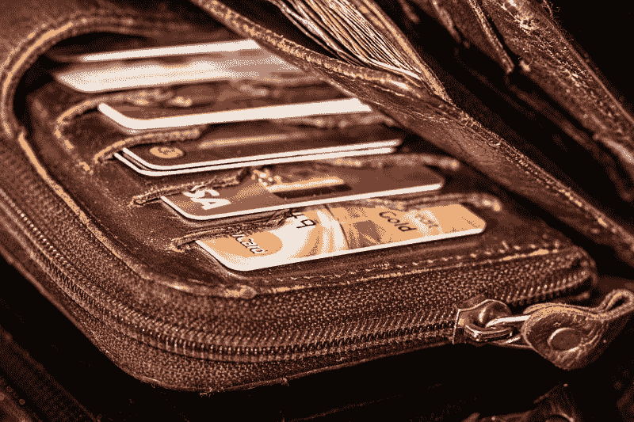
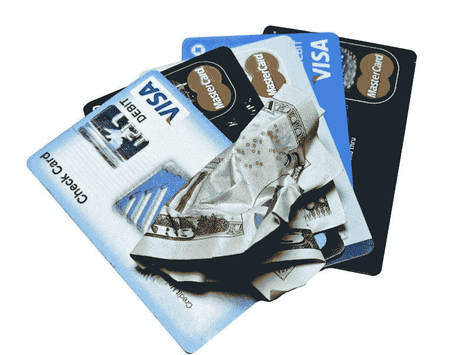
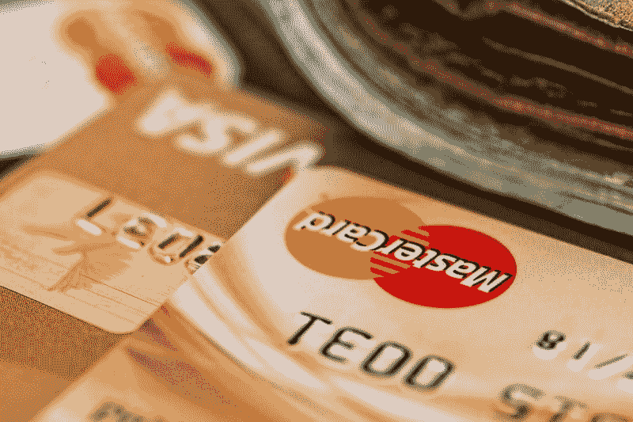
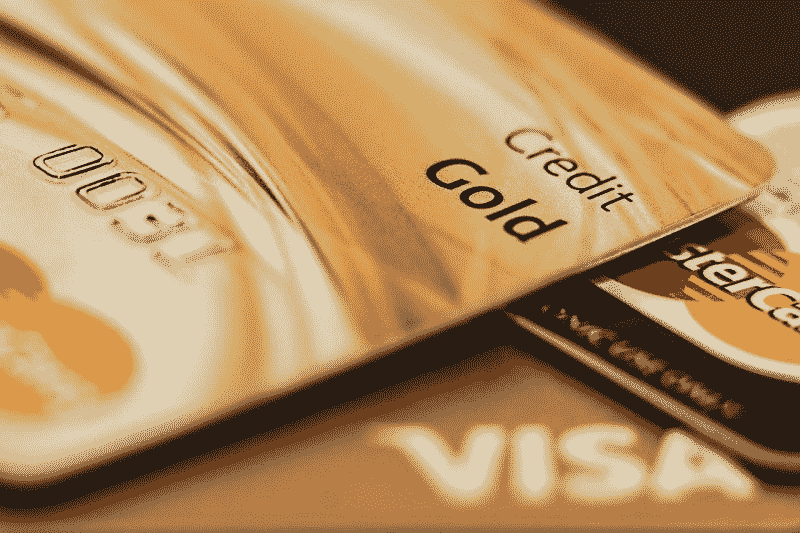
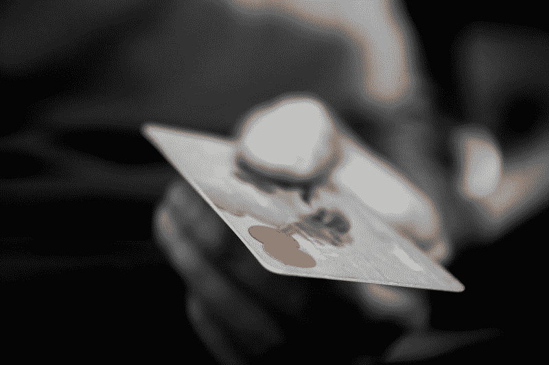
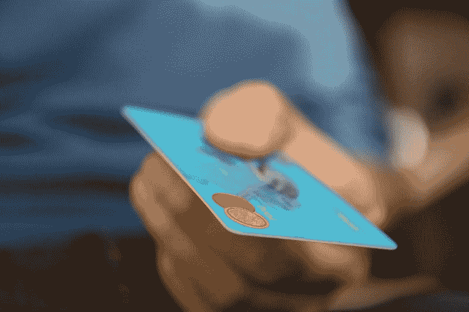

# 花旗集团赚钱了吗？—市场疯人院

> 原文：<https://medium.datadriveninvestor.com/is-citigroup-making-money-market-mad-house-46632778210e?source=collection_archive---------3----------------------->

花旗集团是一家迷人的公司，因为它结合了一家巨型银行、一家保险公司和一家信用卡公司。

名义上，花旗集团有很多价值。例如，花旗集团[声称](https://www.citigroup.com/citi/about/consumer_businesses.html)支持 1 . 42 亿信用卡账户。令人印象深刻的是，花旗声称这些卡在 2018 年产生了 5340 亿美元的年购买销售额和 1600 亿美元的应收账款。

特别是花旗集团声称，2018 年它拥有 5500 万个品牌卡账户。花旗集团估计，2018 年其品牌卡的年购买销售额为 4480 亿美元，平均贷款组合为 1120 亿美元。

 [## 算法交易的机器学习|数据驱动的投资者

### 当你的一个朋友在脸书上传你的新海滩照，平台建议给你的脸加上标签，这是…

www.datadriveninvestor.com](https://www.datadriveninvestor.com/2019/01/30/machine-learning-for-stock-market-investing/) 

此外，花旗集团声称，2018 年它支持 8600 万张自有品牌和联名信用卡。发行花旗卡的标志性品牌包括；L.L. Bean、**卡特彼勒(NYSE: CAT)** 、壳牌、**百思买(NYSE: BBB)** 、**埃克森美孚(NYSE: XOM)** 、**梅西百货(NYSE: M)** 、**家得宝(NYSE: HD)** 。

# 花旗集团的商业模式

因此，花旗是信用卡和银行业的主要参与者。花旗集团的全球消费者银行声称经营着 2140 家分行。

很明显，其他主要银行都在模仿花旗集团的商业模式。例如， *Business Insider* [声称](https://markets.businessinsider.com/news/stocks/apple-snubbed-goldman-sachs-bank-spent-300-million-apple-card-2019-9-1028563659) **高盛(NYSE: GS)** 花费了 3 亿美元开发其苹果品牌的信用卡。

此外，高盛凭借其[马库斯](https://www.marcus.com/us/en?prd=pl&chl=ps&schl=psg&cid=979005033&agp=52483357590&cre=340493355821&kid=marcus&mtype=e&adpos=1t1&gclsrc=ds&gclsrc=ds)和 [Clarity Money](https://www.marcus.com/us/en/clarity-money) 人工智能平台，正在大举进军消费者银行业务。目前，马库斯正在提供高收益的在线储蓄账户和免费个人贷款。

高盛通过采用花旗集团的商业模式来证明其合理性。因此，我们需要问，花旗集团赚了多少钱？

# 花旗集团赚了多少钱？

**花旗集团(纽约证券交易所代码:C)** 报告称，2019 年第三季度的季度收入为 186 亿美元，净收入为 49 亿美元。

令人印象深刻的是，Macrotrends 认为花旗集团 2019 年第三季度的毛利为 186 亿美元。我喜欢银行，比如花旗，因为银行的收入就是毛利。因此，银行赚的任何钱都是毛利。Macrotrends 估计，2018 年第三季度至 2019 年第三季度，花旗的毛利增长了 1.01%。

然而，花旗集团报告称，2019 年 9 月 30 日的自由现金流为负 396.46 亿美元。Macrotrends [估计](https://www.macrotrends.net/stocks/charts/C/citigroup/free-cash-flow)花旗集团的自由现金流在 2017 年至 2018 年间下降了 383.98%。

# 花旗集团是一家现金充裕的公司

高盛正在模仿**花旗集团**，因为花旗集团是一家现金充裕的公司。

令人印象深刻的是，宏观趋势[估计](https://www.macrotrends.net/stocks/charts/C/citigroup/cash-on-hand)花旗集团在 2019 年 9 月 30 日手头有 7883.92 亿美元现金。2018 年 9 月至 2019 年 9 月，花旗的手头现金增长了 6.87%。

由于其业务性质，花旗集团拥有大量现金。花旗集团的客户必须每月支付信用卡款项以保持信用。

因此，花旗集团的信用卡产生了大量的浮存金。浮存金是客户通过定期付款产生的现金流。“浮存”一词的创始人沃伦·巴菲特用浮存建立了他的伯克希尔·哈撒韦公司(纽约证券交易所代码:BRK)。帝国。

高盛正在花大价钱开发苹果信用卡和马库斯，因为它想要浮动。花旗集团已经有了这部分股份。

# 科技是花旗集团最大的机会

奇怪的是，我认为科技公司是这样的；正如**苹果(纳斯达克股票代码:AAPL)** 和 **Alphabet(纳斯达克股票代码:谷歌)**一样，花旗集团面临的威胁最大。

**字母表(NASDAQ:GOOG)**；例如，谷歌正在探索通过谷歌提供信用卡接入的可能性。有趣的是，花旗集团正在研究他们称之为缓存的谷歌支票账户项目。

我认为 Alphabet 可以通过 Google Pay 提供进入花旗集团支票账户的途径。因此，Alphabet 和 Google Pay 可能成为花旗集团新的利润中心。

# 智能手机是银行业的未来

我猜，花旗试图通过与最强大的科技公司合作来对抗高盛的苹果联盟；字母表。特别是，花旗集团希望获得运行在 Alphabet Android 平台上的 25 亿台移动设备。

Android 是世界上最受欢迎和最成功的智能手机操作系统。花旗集团希望获得安卓系统的一个原因是为了进入发展中国家的新市场。

例如，花旗集团可以在没有实体银行的国家和地区拓展新客户。那些地区的人们有钱，但没有银行渠道。

然而，其中许多人拥有智能手机。据统计，2021 年世界上将会有 38 亿部手机。智能手机连接正在快速增长，Statista 估计 2016 年全球只有 25 亿部智能手机。

智能手机是银行业的未来，花旗集团希望在这一未来中分一杯羹。为了获得这一块，花旗集团正在与智能手机领域的主导品牌 Alphabet 的 Android 合作。

我认为 Google Pay 和 Android 可以帮助花旗集团的数字银行服务进入全球市场。因此，Alphabet 可以帮助花旗集团赚更多的钱。

# 花旗集团是价值投资吗？

我认为**花旗集团**是价值投资。事实上，我认为市场先生在 2019 年 12 月 27 日低估了花旗集团 79.67 美元。

花旗集团是一个价值投资，因为它提供了良好的股息。花旗集团于 2019 年 11 月 1 日支付 51₵股息。此外，花旗集团的股息从 2019 年 5 月的 45₵增长到 2019 年 8 月的 51₵。

总体而言，2019 年 12 月 27 日，每股花旗集团股票的股息率为 2.62%，年化派息为 2.04 美元，派息率为 26.35%。另外，Dividend.com[估计，花旗集团的股息已经连续四年增长。](https://www.dividend.com/dividend-stocks/financial/money-center-banks/c-citigroup/)

归根结底，花旗集团是一项价值投资，因为市场先生低估了它的价值。此外，花旗集团是一个很好的收益股，因为它的股息。想要稳定收益的投资者需要调查花旗集团。

*原载于 2019 年 12 月 27 日*[*https://marketmadhouse.com*](https://marketmadhouse.com/is-citigroup-making-money-2/)*。*