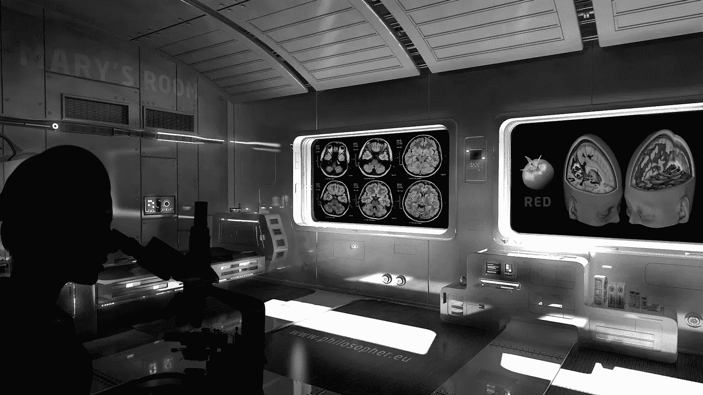
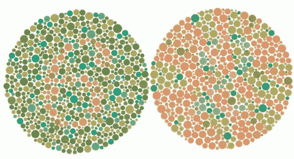
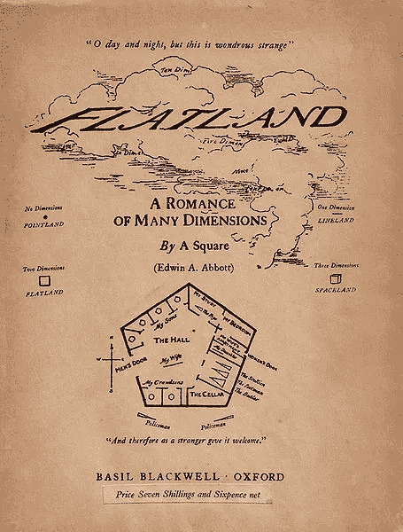

# 颜色真的如你所想的那样吗？

> 原文：<https://medium.datadriveninvestor.com/is-colour-truly-what-you-think-it-is-4fce06b64461?source=collection_archive---------22----------------------->

想象玛丽是一位专家科学家。她住在一个黑白的房间里，在一台黑白电脑上工作，她一生中从未见过或经历过彩色。

然而，她已经花了很多年来学习颜色。她知道天是蓝的，草是绿的，但她从未见过蓝天或绿草。

An impression of Mary’s room

她知道我们的大脑是如何从我们大脑中的视锥细胞和视杆细胞看到颜色的。玛丽也意识到可见光只是从红色到紫色的电磁光谱的一部分。她所知道的关于颜色的一切都是纯理论的，然而，她了解所有已经发表的关于颜色的科学事实。

一天，一个图像出现在她的屏幕上，显示一个红苹果。

> 玛丽从第一次看颜色中学到了什么新东西吗？

显然不是，因为她已经知道了关于颜色的一切。然而，在看这张图片之前，她永远也不会知道红色到底是什么样子。

玛丽学习新东西的事实暗示了**感受性**的存在。感受性是体验无法描述的事物的概念。例如，如果任何人看着同一个“红”苹果，那么无论“红”这个词在不同的文化和语言中是否指同一种颜色，颜色看起来总是一样的。

这可能导致这样的争论，例如，虽然我们可能看到“蓝色”的天空，但我们可能指的不是同一种颜色，因为准确描述颜色几乎是不可能的。

## 石原试验

然而，由于**石原试验**的存在，这被部分反驳。这些测试用于检查某人是否是色盲，方法是测试受试者是否能辨认许多图案:

Example of an Ishihara Test

这种感知和理解从未经历过的事物的想法也在 1884 年的小说《平地》中得到了证明。

在这本书里，2D 的形象过着平淡的生活，无法体验第三维度。他们无法理解另一个维度的概念，直到一个球体给深度的概念引入了一个正方形。

同样，我们都生活在三维空间，任何人都不可能想象生活在第四维空间会是什么感觉。

然而，就像在玛丽的房间里，我们意识到它的存在，任何人都很容易讨论第四维、第五维甚至第 100 维的存在。但是，就像在《平地》中一样，我们都是三维的形状，过着三维的生活，没有意识到我们周围所有的多维美。

The original edition of Edwin A. Abbott’s ‘Flatland’

【www.quora.com】最初发表于**。**