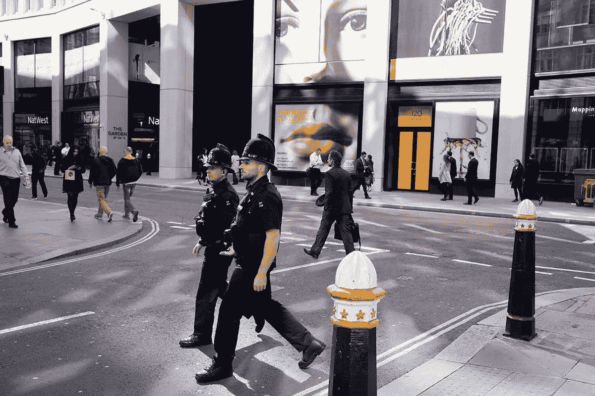

# 犯罪预测分析是歧视性的还是救命的？

> 原文：<https://medium.datadriveninvestor.com/is-crime-prediction-analytics-discriminatory-or-life-saving-efd6d4bae977?source=collection_archive---------10----------------------->

## 该项目的批评者警告说，这将导致警察基于偏见进行逮捕。支持者表示，对数据的分析和解释将有助于警方有效管理他们的稀缺资源。

这听起来像是反乌托邦电影*少数派报告*中的东西，但是[犯罪预测分析已经在英国的 14 个警察部队中发生或发展。](https://www.bbc.com/news/technology-47118229)这项由西米德兰兹郡警方发起的名为“国家数据分析解决方案(NDAS)”的项目在英国越来越受欢迎，让一些市民感到恐惧和着迷。一本流行时尚杂志 [Dazed 甚至说这个节目有“机械战警的感觉”。](http://www.dazeddigital.com/politics/article/42363/1/police-want-to-use-ai-to-predict-whether-you-will-commit-a-crime)那么这个备受争议的预测软件是如何工作的呢？

Richard Baker/In Pictures/Getty

NDAS 是由西米德兰兹郡警察和犯罪专员出资 1600 万英镑的项目“数据驱动洞察”发展而来的。西米德兰兹郡警察局长和 NDAS 项目经理伊恩·唐纳利(Iain Donnelly)将该项目的[目标描述为寻求“从一个屏幕访问多个系统[并找出]关于一个人或位置的所有信息”。通过该计划，西米德兰兹郡警察局组建了自己的内部数据实验室，由一组全职数据科学家对数据进行分析和解释。](https://publictechnology.net/articles/features/how-police-wants-use-ai-and-analytics-%E2%80%98adopt-public-health-approach-crime%E2%80%99)[总的来说，该分析包括 1400 个指标和 30 个因素，以评估个人的暴力犯罪倾向。](https://www.tomsguide.com/us/ndas-crime-prediction-uk,news-28747.html)

> 程序覆盖的[数据集包括与刑事司法系统的所有相关交互的详细信息，包括犯罪记录、犯罪报告、定罪和拘留数据的信息，以及指挥和控制、犯罪情报和一些内部警方人力资源数据。](https://publictechnology.net/articles/features/how-police-wants-use-ai-and-analytics-%E2%80%98adopt-public-health-approach-crime%E2%80%99)

然后使用预测数据分析来识别被认为最有可能成为刀枪暴力实施者的人。他们观察了一组犯有持枪或持刀犯罪的重罪犯，并评估了他们的数据集，以找到一组导致他们犯下暴力犯罪的预测指标。有了这些知识，警方相信他们可以识别出有类似轨迹的人，并在他们到达持枪或持刀犯罪点之前进行干预以提供支持。Donnelly 主管认为，该计划未来的成功将导致更多来自教育、卫生或社会服务等来源的数据使用，以便做出更清晰的预测和见解。

不需要太多的想象力就可以看到这种技术被歧视性地用来根据一个人的过去对其做出结论。警方打算使用人工智能(AI)结合他们的数据分析来做出预测，但人权组织认为，这只会进一步将人类偏见植入我们的刑事司法系统。美国公民自由联盟(ACLU)、艾伦·图灵研究所和布伦南司法中心等团体都批评了这个项目。然而，西米德兰兹郡警察部队和其他英国警察部队已经成立了一个道德小组，调查他们对该项目的关注。NDAS 的战略顾问汤姆·麦克尼尔说:[“在这个有害的紧缩时期，我们希望看到分析被用来证明对社会流动性的投资是合理的，解决根深蒂固的不平等，并有助于防止犯罪。”](https://www.bbc.com/news/technology-47118229)

麦克尼尔提出了另一个观点。该计划实际上可以通过识别暴力犯罪的根源并在人们到达那个点之前创造干预措施来帮助消除系统性不平等。用这个逻辑，它不仅仅是一个救命软件，而是改变人生。这是一种技术，它有能力让脆弱的人走上非暴力的道路，并最终改变他们的生活。

然而，由于透明度问题和该项目的数据不对公众公开，人们仍然持怀疑态度。英国著名的人权组织 Liberty 警告说，NDAS 威胁言论自由和隐私，并可能鼓励种族偏见和歧视。尽管警方可能会承认偏见，并试图将道德纳入该计划，但事实是，所使用的大部分数据“已经充满了过去人们维持治安的歧视和偏见”，并且“被算法所固化”，Liberty 的政策和活动官员 Hannah Couchman 解释道。

很明显，在进一步扩大该计划之前，必须讨论和考虑明显的道德和伦理难题。虽然将数据分析纳入公共安全可以改善犯罪统计，但它也可能对我们的社会产生可怕的道德后果，值得未来的辩论。

# DDI 特色数据科学课程:

*   [**用于数据科学的 Python**](http://go.datadriveninvestor.com/intro-python/mb)
*   [**Scikit-Learn**](http://go.datadriveninvestor.com/scikitlearn/mb)
*   [**深度学习**](http://go.datadriveninvestor.com/deeplearningpython/mb)

**DDI 可能会从这些链接中收取会员佣金。我们感谢你一直以来的支持。*