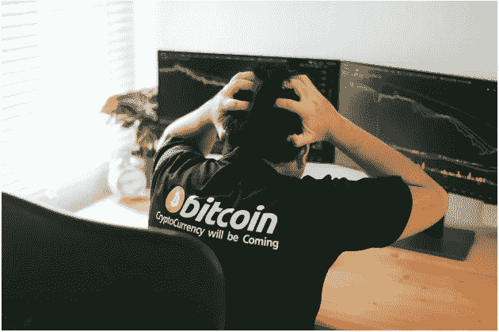

# 加密货币的下场不好吗？

> 原文：<https://medium.datadriveninvestor.com/is-cryptocurrency-coming-to-a-bad-end-7ae4131c7b8f?source=collection_archive---------11----------------------->

Photo by [Escapejaja](https://www.freepik.com/escapejaja) on [Freepik](https://www.freepik.com/premium-photo/despair-man-down-stock-bitcoin-graph-market-background_5502219.htm#page=1&query=crypto%20loss&position=1)

对于那些从事加密货币交易的人来说，上周的日子并不太好过。我们得到了一个又一个坏消息，直到我们中的一些人想用头撞墙。

一个欺诈性的投资计划导致一些人被捕，这让人们担心比特币的价格现在可能会进一步下跌。

你还记得 Plus Token 的创始人被捕时比特币的价格发生了什么变化吗？是的，它从大约 14，000 美元的本地顶部开始下跌。

这一次，逮捕来自 BitCloud 网络，这令人惊讶，因为他们甚至在某个时间点具有良好的哈希能力。

 [## 总部位于瑞士的 ETP 进入加密交易市场|数据驱动的投资者

### 虽然金融市场几乎没有沉闷的时刻，特别是在引入…

www.datadriveninvestor.com](https://www.datadriveninvestor.com/2019/03/10/swiss-based-etp-enters-the-crypto-trading-market/) 

除此之外，还有 2.2 亿美元被套牢，这些钱正在离开市场，而且不会很快回到市场。

我们也从日本得到了关于收养 XRP 的可怕消息，我们也将在本文中讨论。

## Plus Token 骗局

如上所述，当 Plus Token 骗局的六名创始人被捕后，比特币的价格开始暴跌。我们还可以在区块链上跟踪 Plus Token 骗局的一些资金仍然在流动，而且最有可能的是即使在混合之后也不会被抛弃。这实际上是一个 29 亿美元的骗局！

为什么西半球并不真正了解这一点？这很简单——因为这是一个来自中国的骗局。

## 比特云骗局

实际上还有更复杂的方案，比特云网络曾经是其中之一。BitCloud 可能在一开始为比特币做了一些好事，但也许在某个时候，创始人决定他们需要更大的支付。所以他们停止增加散列率，尽管有新人进来。然后在 2018 年初，我们开始意识到它的一些东西听起来不那么真实，之后很多人停止了对它的投资。有些事情在某些时候是可疑的，尽管一开始看起来很合法。

三名男子于 2019 年 12 月 10 日被捕，与一项秘密采矿计划有关。诈骗金额达 7.22 亿美元。由于这个数额与 29 亿美元相比仍然很大，让我们希望比特币的价格不会进一步下跌。总体而言，现在乘坐比特币或加密货币的感觉已经不好了。

但是坏消息不止于此。实际上还有更多..

## 收养 XRP

在过去的几年里，XRP 在日本被大量采用。但上周，我们看到了一个标题，上面写着“[洗钱之战驱使日本银行加入摩根大通的网络](https://www.bloomberg.com/news/articles/2019-12-09/money-laundering-battle-drives-japan-banks-to-jpmorgan-network)”。这绝对不好，事实上对所有 XRP 持有者来说都是一个打击。

## 系绳烧的比印的多吗？

价值 2 . 2 亿美元的绳索上周被烧毁。燃烧系绳意味着一些人实际上兑现了，这意味着他们把他们的美元给了 USDT。这意味着所有的钱都离开了生态系统或加密空间，无论是比特币还是替代币。这并不完全乐观。事实上，这让人们想知道系绳燃烧的比打印的多。

## 我们能从这一切中学到什么？

首先，骗局可能比你想象的要复杂得多。其次，合法的公司有时也会变成骗局。我们已经看到了比特云的创始人和矿业领域的重要人物。他们甚至有哈希权力。然而，它们变成了一个彻头彻尾的骗局。也许他们从一开始就是欺诈性的，也许不是——谁知道呢？

我们需要警惕欺诈者，他们可能会策划一个带有非常漂亮的掩饰的欺诈或庞氏骗局，无论是以所谓的媒体公司、发布网站、虚假的加密交换地址的形式，还是声称自己是加密领域一些关键人物的“合作伙伴”。很难指出真假，但迟早可疑的迹象会出现。

这些事件在金融界的一些知名人士中引发了激烈的争论。虽然有人说加密货币是金融的未来，但也有人在问，

> 加密货币会有坏下场吗？

*原载于 2019 年 12 月 13 日*[*【https://opinined.com】*](https://opinined.com/a-very-bad-week-for-bitcoin-and-crypto-enthusiasts/)*。*