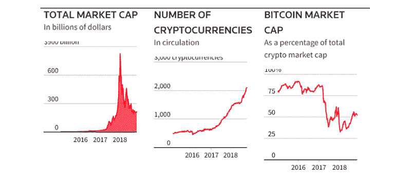

# 加密货币是为我们制造的吗？

> 原文：<https://medium.datadriveninvestor.com/is-cryptocurrency-made-for-us-f1b780242403?source=collection_archive---------13----------------------->

包括比特币在内的虚拟货币自 2008 年以来变得非常受欢迎，并成为一些人热情的原因，而另一些人则是怀疑和恐惧的原因，并让我们其他人感到困惑。

除了噪音和发表的文章，大多数人——金融家、顾问、科学家和开发人员——对加密货币的了解非常有限。

 [## 如何创建自己的加密货币，让您的企业为未来做好准备-数据驱动…

### 加密货币是如何工作的？如何制作加密货币？如何推出我的加密货币？所有这些问题必须…

www.datadriveninvestor.com](https://www.datadriveninvestor.com/2019/03/25/how-to-create-your-own-cryptocurrency-and-make-your-business-ready-for-the-future/) 

在这篇文章中，你将会明白为什么我们今天离不开新技术？为什么加密货币仍然无法为大众所用，以及如何将加密货币用于像 VOLT 这样的项目，并找到让每个人都跟上潮流的解决方案。

**精英技术**

***电脑***

让我们记住一些技术是如何进入我们的生活的。我们的第一台数字计算机是由约翰·文森特于 1937 年开发的，ABC 命名为电子计算机，用于数字计算，但不可编程。只是在 20 世纪 80 年代，当 IBM 首次推出个人电脑时，与以前的电脑相比，更多的普通人可以使用它。

我们花了 50 多年才创造出我们现在拥有的东西，便携、轻便、快速、电池寿命长。主要问题是用户界面的观点。普通人无法使用它们，或者需要几个小时才能收到命令的输出。

***互联网***

技术进步的另一个例子是互联网。互联网——随着商业互联网服务提供商在 20 世纪 80 年代末开始出现。只是从 20 世纪 90 年代中期开始，互联网对文化、商业和技术产生了革命性的影响，包括通过电子邮件、即时消息和创建万维网进行快速通信的兴起。

今天，互联网对政府、商业、公民社会和个人都具有全球重要性。互联网无处不在，由于移动革命，几乎在地球上的任何地方都可以访问互联网。

互联网的问题和电脑一样，用户不知道如何使用它！它使用起来并不友好，速度慢且出乎意料。

在这两种情况下，深入理解我们需要什么样的技术，以及如何实际使用计算机和互联网来造福于你，需要很长一段时间。尽管有一小部分人是这些方面的专家，但普通人在生活中并没有注意到这一点。

**加密货币——对每个人来说都是一项新技术**

今天，加密货币是一个特殊群体的工具，就像当时的计算机或互联网一样。为了使用加密，你应该有机会接触区块链技术，你应该知道它是如何工作的，如何使用新的工具，并学习如何进行交易操作。

普通用户将会遇到技术上的困难，例如访问数字钱包、转移资金、在交易所交易和创建代币。作为一个普通人，你会问自己，“*这是真正的加密货币和区块链技术吗？*

为加密货币和区块链技术创建一个简单的界面以使其对人们有用，就像计算机或互联网正在发展一样，这需要时间。我们可以问自己“用户需要多长时间才能得到它？”

**从比特币到 2000 年数字货币的路径**

自 2008 年比特币问世以来，数字金融工具的概念仍在不断创造新的创新技术。虽然多年过去了，但比特币仍然活着，并继续着他的旅程，而在同一时期，比特币是全球 2000 种新代币和 100 多种加密货币交易所的基础。

[https://blockchaintimes.news/2018/11/28/wednesday-november-28-2018-daily-news-digest/](https://blockchaintimes.news/2018/11/28/wednesday-november-28-2018-daily-news-digest/)

比特币是数百种使用区块链技术和开放空间安全的应用之一，任何人都可以决定制作自己的版本。既然我们已经意识到阻碍区块链采用的主要因素，我们将寻找一个项目，它将成为新技术与普通用户的集成器。

作为当今服务提供商如何采用区块链和加密货币的一个很好的例子，让我们关注一下在日常使用中引入加密货币和区块链技术的 VOLT。

*有什么能比日常使用和实践更好地理解它的工作原理呢？*

VOLT 是一家最后一英里配送和物流公司，利用区块链的 P2P 平台，它的配送速度更快、成本更低。VOLT 的 P2P 直接交易模式是一种高效的模式，旨在通过将客户和信使的直接成本降至 5%以下，甚至有望在未来完全消除经纪费，从而消除经纪费。

VOLT 的 3 个核心概念如下:

*   分散
*   透明度
*   安全性

今天，伏特送货服务的用户可以使用名为伏特 ACDC 的加密货币作为服务支付。所有的支付系统都是全自动的，用户只需点击几下鼠标就可以购买加密货币并支付服务，这一切都发生在 VOLT 的交付应用程序中。

当普通人能够轻松使用加密货币时，才会有真正的进步。加密货币社区已经由早期采用者组成。对于所有其他人来说，进入这个社区是强加了一个陡峭的学习曲线，需要追求，同时试图在所有的新闻嗡嗡声，骗子和非官方信息中找到正确的信息。