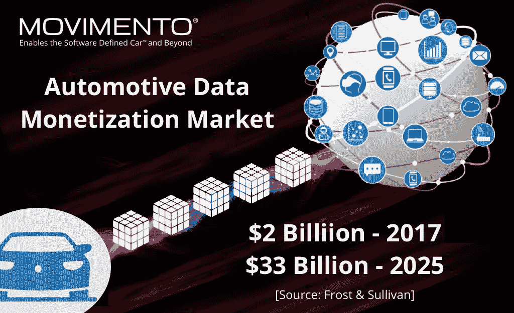

# 如果数据是我们的新货币会怎样？

> 原文：<https://medium.datadriveninvestor.com/is-data-our-new-voice-f8a42da55456?source=collection_archive---------2----------------------->

我们生活在一个数字经济时代，数据正成为当今最有价值的资源。各行各业的公司都在学习从他们的产品和服务中提取数据，并利用它们为客户带来更好的安全性和增强的用户体验。麦肯锡预测，到 2030 年，联网汽车数据的[价值可能达到 1.5 万亿美元。今天，](http://www.digitalistmag.com/iot/2016/09/14/connected-car-data-worth-1-5-trillion-04460178)[联网汽车每小时产生大约 25 GB 的数据](https://qz.com/344466/connected-cars-will-send-25-gigabytes-of-data-to-the-cloud-every-hour/)，这相当于十几部高清电影，超过了大多数智能手机的存储容量。单个自动驾驶测试车辆每天产生大约 [30 TB，是 Twitter 每天数据](http://wardsauto.com/technology/storage-almost-full-driverless-cars-create-data-crunch)范围的 3000 倍(2.7 亿用户每天产生大约 100 GB 的数据)。理解处理这些海量汽车数据的不同方法可能是一个相当大的挑战，在本文中，我们将类比其他行业，以概念化的监管框架来有效地创建、管理和保护数据。

## 钱=银行账户，数据=？

互联网使用的增加导致了数据的爆炸。在[的每一分钟](http://www.visualcapitalist.com/happens-internet-minute-2017/)，Youtube 上大约有 410 万个视频被观看，近 100 万人登录脸书，在互联网上发生的数十亿次其他数据交易中，有 75 万美元用于电子商务。这些数字每年都在增长。据波士顿咨询集团(BCG)称，到 2035 年，包括连接在内的汽车数据货币化将从目前的 10 亿美元增长到 280 亿美元。随着软件定义的汽车通过额外的软件、硬件和连接功能得到增强，将会产生越来越多的数据。[Aptiv 的首席技术官 Glen De Vos 表示，该公司每天存储大约 2 TB 的数据](http://wardsauto.com/technology/storage-almost-full-driverless-cars-create-data-crunch)，并且多年来已经了解了哪些数据需要保留，哪些数据可以丢弃，但他还表示，目前的数据存储需求超过了 Delphi(现在的 Aptiv)一个多世纪以来生成的数据量。很明显，汽车行业没有逃脱数据爆炸。

如果[数据是新的货币](https://www.weforum.org/agenda/2015/08/is-data-the-new-currency/)，那么它必须像虚拟货币一样被对待。因此，我们需要创建一个像银行账户一样有效管理这种新货币的系统。银行储存我们的钱，并跟踪每一笔交易，但他们没有权力在没有账户持有人批准的情况下使用或出售这些钱。如果有欺诈行为发生，可以通过信用卡或支付记录进行追踪。它们还受到监管机构的持续审查，以确保符合所有联邦和州政策。他们确保额外的安全层，以防止欺诈交易。想象一下，在一个系统中，公司拥有像银行账户一样工作的个人数据平台，账户持有人可以管理他们的数据，公司可以在获得账户持有人的同意后使用数据产生收入，监管机构可以持续监控这些数据交易。

## 电信=合法拦截，联网汽车=？

2017 年，全球移动连接超过[80 亿](https://venturebeat.com/2017/06/13/5-billion-people-now-have-a-mobile-phone-connection-according-to-gsma-data/)。我们使用蜂窝技术进行语音通话、发送文本消息、即时消息、电子邮件、文件传输等等。想象一下一天之内产生的数据量。然而，我们并不担心这些电话和信息的隐私，因为电信行业有一个关于隐私的监管框架，限制数据的收集和共享。然而，在现代电信网络中，为了帮助执法机构调查和起诉犯罪活动，一个称为“合法截取通信”的过程是必要的。该过程使执法机构(LEA)能够根据司法或行政命令的授权对个人(目标)进行电子监控。这种监视是通过对语音、数据和多服务网络中的传统电信和互联网服务进行窃听来进行的。

联网和自动驾驶汽车每辆车每小时将产生 [4 TB 的数据](https://newsroom.intel.com/editorials/self-driving-cars-big-meaning-behind-one-number-4-terabytes/)。未来拥有一个生态系统，车辆将能够与一切进行通信，[“车对一切”(V2X)](http://www.iotevolutionworld.com/smart-transport/articles/420596-vehicle-to-everything-technology-will-be-life-saver.htm)——包括车对车(V2V)、车对行人(V2P)、车对基础设施(V2I)、车对设备(V2D)、车对家(V2H)、车对电网(V2G)和车对网络(V2N)。想象一下这样一种场景，车辆与云或其他第三方数据平台之间的通信可以通过合法的拦截被监管机构持续监控。这可能会让原始设备制造商、供应商和科技公司承担责任，确保他们遵守所有州和联邦法律，特别是那些有关数据隐私的法律。随着网络犯罪成本的上升，到 2021 年将达到每年约[6 万亿美元，合法监听也可能成为追踪和惩罚那些滥用汽车数据并造成人员伤害的人的有用法律工具。在远程操作员的帮助下，它还可以使紧急服务能够处理危急情况，并有望拯救人类生命。](https://itsecuritycentral.teramind.co/2018/01/03/cyber-security-statistics-2017-data-breaches-and-cyber-attacks/)

数据货币化将是未来大多数汽车商业模式的关键要素。例如，集成到车辆中的汽车软件将来需要用新软件进行更新。空中下载(OTA)技术提供了双向数据传输能力[,可以报告车辆诊断、预测并实现预防性分析，这使汽车制造商能够对客户做出实时反应，并可以为保险和其他目的向第三方公司提供数据。除非应用智能分析或开发出实际挖掘数据的能力，否则收集大量数据毫无价值，尤其是在机器学习算法可以提供宝贵见解的世界里。尽管存在利用联网汽车数据赚钱的机会，但理解隐私问题和数据所有权的商业影响可能会被证明是最终的障碍。如果数据是我们的新声音，我们需要的是一个能够自由创新的监管框架，帮助我们有效地创建、管理和保护我们的数据。](https://www.convergedigest.com/2015/06/movimento-launches-automotive-ota.html)

**免责声明:本文表达的观点和意见仅代表我个人，不代表任何其他人或公司。所有内容都受版权保护。*