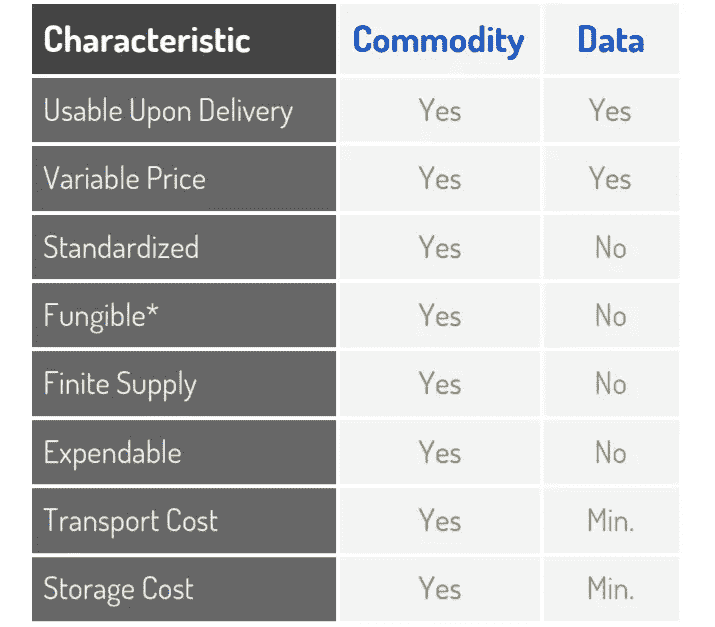
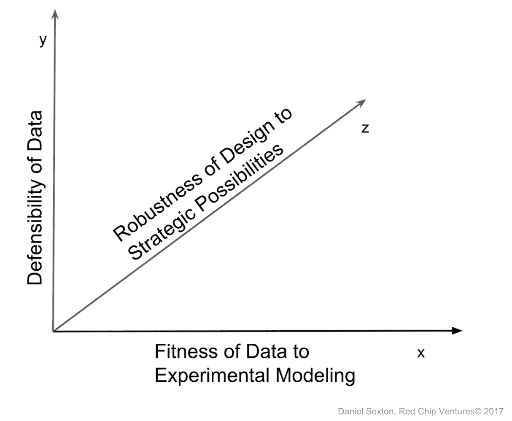

# 数据是新的油…还是秘方？

> 原文：<https://medium.datadriveninvestor.com/is-data-the-new-oil-or-secret-sauce-de4f939b43e5?source=collection_archive---------7----------------------->

> 1673 年，多岛的大米仓库面临着今天数据聚合器面临的同样问题。

1673 年秋天的一个下午，一个大米商人来到了日本大阪的多岛河北岸。他在科梅一叶附近的一条路上，那里的稻米交易通常在多岛稻米交易所进行。他刚刚在喧闹的街头拍卖中赢得了一张米票(承诺大米的票据)。

他购买的大米被存放在中之岛附近的*仓谷市*(大米仓库),预计将被运送到大阪，在那里他将把大米带回家乡出售。

因为这份大米账单是双方——商家和仓库——之间的一份合同，所以这位大米商家最大的担忧之一就是将运往大阪的大米的**质量**。里面会有多少 bug？会干净吗，可以接受吗？他能使用多少？

商家的另一个担心是，在大米交付之前，大米的价格可能会上涨。如果出现这种情况，仓库可能会退出合同，以更高的价格将大米卖给其他人。他毕竟只是一个商人；他经常被提醒的一个事实:

> “蟾蜍的后代是蟾蜍；商人的后代就是商人。”— [日本德川省的流行说法](https://www.jstor.org/stable/312302?seq=1#page_scan_tab_contents)

同样，仓库担心大米的价格可能会大幅下降，因为这样一来，商家可能会找到其他人以更低的价格购买大米，而不会提货和付款。

这些类型的问题被称为[交易对手风险](https://www.investopedia.com/terms/c/counterpartyrisk.asp)。停下来，想一想你可能如何解决这些问题。如果你是仓库，你会怎么做？还是商人？

这些问题在许多方面类似于围绕数据交换的问题。市场目前如何解决一方有另一方想要的数据的情况？谷歌、网飞、脸书、亚马逊、Acxiom 这些公司都以完全不同的方式向不同的人出售数据。

上述的多岛大米市场(非正式的、场外交易的、专业的)被称为远期市场。1710 年，日本通过建立期货市场解决了这些问题。远期和期货的主要区别在于，期货是通过第三方使用标准化合约在交易所交易的。这使得“公平交易”成为可能——价格和数量都是有报价的，这是任何一方都需要知道的。交易所执行标准化合约，消除交易对手风险。

每当你将数据视为一种商品，比如石油或大米，商业模式就开始反映交换模式。这些类型的商业模式今天确实存在，但市场很小，公司利润不高。在下一节中，我们将探究原因。

# 数据不是[新油](https://www.cnbc.com/2017/10/24/mastercard-boss-just-said-data-is-the-new-oil.html)

在某些方面，将数据比作一种商品，比如石油或大米，是有意义的。毕竟，它是人工智能、机器学习、分析和数据科学的“原始输入”。没有数据，算法就没什么用了。

> “数据是新的石油。它很有价值，但如果不提炼，就不能真正使用。它必须转化为气体、塑料、化学物质等，以创造一个有价值的实体，推动盈利活动；因此，必须对数据进行分解和分析，使其具有价值。”—克莱夫·亨比，2006 年

然而，这种类比并不十分有用。首先，它意味着数据可以在双方之间交易，然后被“分解、分析”这通常是不可能的，因为大多数数据是耦合的——与收集数据的上下文相关联。即使它们测量相同的东西，任何两个耦合的数据集也是不同的。非耦合数据由独立的数据集组成；它们是相互可互换的，同质的；你可以把它们换出来。耦合数据集是不可互换的。对于耦合的数据，您能做的最好的事情是使用试探法和统计学来尝试匹配它们。而非耦合数据不仅仅指 RDBMS/NOSQL 数据存储中具有匹配列/属性的数据集；数据必须具有完全相同的含义。

例如，如果两组商用冰柜的温度数据都是相同的，例如，50" X 28" X 54 "，53.5 立方英尺的冰柜，每个冰柜内的温度计安装在相同的位置。如果温度计、传感器、固件、网络一致性和测量间隔相同，即使列名不同，这两个数据集也是相同的。

现实世界中几乎没有数据是这样的。即使表示简单的温度数据，大多数数据也是异构的。更复杂的数据类型，如情感或面部分析，就更加难以捉摸了。仅仅使用数据集本身是不可能完全标准化和规范化两个或多个异构数据集的。当数据不可避免地与外部因素绑定在一起，并且不具有独立的含义时，就无法对其进行清理或调整以准确匹配另一个数据集。如果你把一些冰柜中的温度计降低 1.5 英尺，就不可能仅用数据来推断数据集之间的温度差异(有未知的因素，比如门，相信我)。

除了这些区别之外，商品的供应也是有限的，可能会耗尽。数据是无限的，永远不会耗尽，而且随着数据的消耗，它会变得更有用，而不是更少。数据几乎是不可摧毁的，并且具有高度的流动性；大宗商品两者都不是(黄金可能例外[)。最后，商品可以在公平交易中交换——报价和数量概括了你需要知道的一切。我能想到的大多数数据集的报价和数量没有什么意义。数据基本上是商品的对立面。](https://seekingalpha.com/article/4182550-gold-commodity)

****Fungible*** *— (of goods contracted for without an individual specimen being specified) able to replace or be replaced by another identical item; mutually interchangeable.*

可能被视为最像*商品的简单数据集类型*由 Acxiom、Nielson 和 InfoGroup 等数据聚合商出售，包括调查、抵押贷款数据、商业和个人信息、公共数据、税务信息、信用报告等，只占数据相关市场份额的一小部分。这些数据集通过专门的双方交易进行买卖，这与 17 世纪在多岛通过大米票据进行大米包交易的方式没有什么不同。但即使是这些买卖了几十年的琐碎数据集，仍然没有标准化。

在《T4 的大转变》(1944)一书中，卡尔·波兰尼认为，人类历史上最重要的发明**是交换*。波兰尼认为，一万多年前，在原始社会，没有交换。最早的证券交易所可能是 15 世纪在比利时创建的，第一家公开交易的公司是荷兰东印度公司(阿姆斯特丹证券交易所**，** 1602)。最早的期货交易所于 1710 年在多岛成立。为了从更广阔的视角来看待我们在世界历史和数字时代中的地位，请考虑到，今天甚至连最简单的数据集都还没有有组织的交换。*

# *数据可能是你新的秘密武器*

**

*1920s advertisement*

*由于大多数数据的行为不像商品，因此将其视为商品是没有用的。我发现，只要你对过度使用的类比持开放态度，一个更好的类比是把数据想象成你秘制调味汁中的配料。由于数据的价值源于其独特性，因此有些数据可以为您的组织提供战略优势。*

*几年前，我创建了**战略数据矩阵**来帮助我确定什么类型的数据是战略数据，并帮助定位数据以变得具有战略意义。在所有三个轴上都很高的数据被我定义为**战略数据**。*

**

## *轴 1。数据的可辩护性*

*如果任何人都可以获得或复制数据集，那么很难从中创造价值。其他人很难或不可能在内容或功能上复制或再现可防御数据。防御数据有多个维度，包括以下数据:*

*   *需要独特的专有知识来制作或解释*
*   *需要独特的知识和专业技能来擦洗和准备*
*   *是一个品牌所独有的*
*   *是专有公司特有的情况*
*   *是一种独特的、可预测的、其他人难以重现的未来情况*
*   *具有高维度(大量属性)和广度(一系列可能的属性值)*
*   *不易腐烂(长期保持价值和相关性)*
*   *非常容易腐烂，但有一个持续的未来流*
*   *具有正反馈回路；随着时间的推移，数据变得更加强大和有价值*

**注意:收集大量数据可能会提供一些短期的防御，但也会使过程变得复杂和缓慢。相反，有选择地收集哪些数据以及如何收集数据，对于利益相关者来说是一个很好的信号，告诉他们什么对组织是重要的。收集一切可能会阻碍数据计划。**

## *轴 2。数据对实验模型的适用性*

*当数据设计不当或孤立时，从中提取价值是困难的。这与技术设计关系不大，而与实验建模关系更大。数据设计在技术上可以是原始的，遵循所有的最佳实践，并且仍然是封闭的，除了其主要目的之外基本上是不可用的。*

*关键是以这样一种方式设计数据，即利益相关者——程序员、数据科学家、统计学家、分析师、销售人员、经理、高管——可以自由地跨数据集创建和测试一系列有效的假设。理想情况下，数据被设计为允许有意义的实验建模。考虑以下来自约翰霍普金斯大学的[布莱恩·卡弗的话:](https://sites.google.com/view/bcaffo/home)*

*   ***明确定义的数据假设**在您开始收集数据时指定了先验的*而不是弱假设或无假设**
*   *在设计的各个阶段访问**丰富多样的数据集***而不是大量数据，也不是使用相同的数据来形成假设，您可以使用这些数据来询问假设**
*   ***实验设计的控制。**数据是如何收集的？它是如何构造和设计的？*
*   ***稳健，数据完整**。允许 A/B 测试、随机化和分层*
*   ***干净的数据**允许您询问假设*而不是稀疏或代理数据**
*   ***随机样本数据***
*   ***数据可以得出清晰的结论** —决策是显而易见的，只需极少的知识*

## *轴 3。设计对战略可能性的稳健性*

*与组织战略的形成一致并提供洞察的数据收集和设计构成了战略数据的最终维度。这些数据对于组织的战略和未来可能的情况应该是可靠的。如果数据/设计允许利益相关者在业务和公司战略层面测试和探索一系列可行的战略选项*，那么它就不仅仅是特定于一些运营或类似流程的 it 闭环功能。它是业务的转型。**

*将数据视为一种战略资产，一种你的秘方，而不是一种可以被挖掘和使用的商品，这开启了新的商业机会。三个战略矩阵轴可以帮助您找到这些机会所在。前两个轴，数据防御和实验建模，有助于提供对新的战略选项和业务模型的洞察。当你可以自由提问并根据可辩护的数据测试假设时，你就可以开始用你的竞争对手所没有的洞察力和答案来建立战略优势。第三个轴，对您的策略稳健的数据设计，建立在您的数据和设计的可防御和开放的基础上；但这也有助于提供信息。当你的假设与公司的战略一致并有助于决定公司的战略时，那么你就处在一个独特的位置，可以采取战略行动，提供现实世界的竞争优势。*