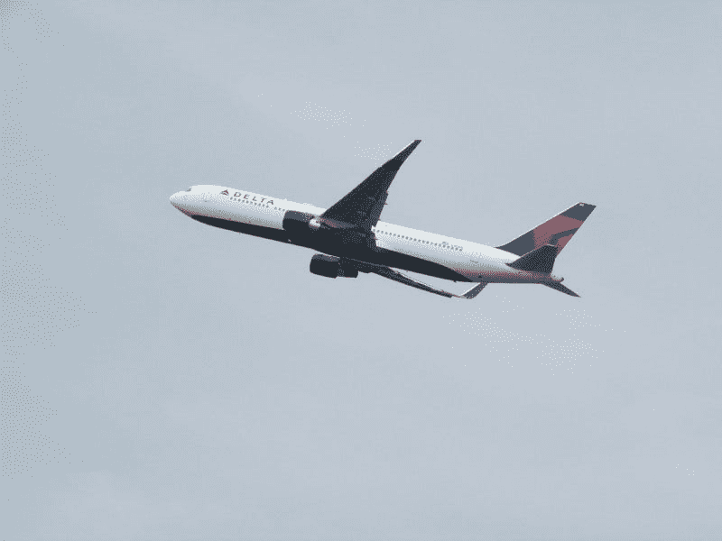
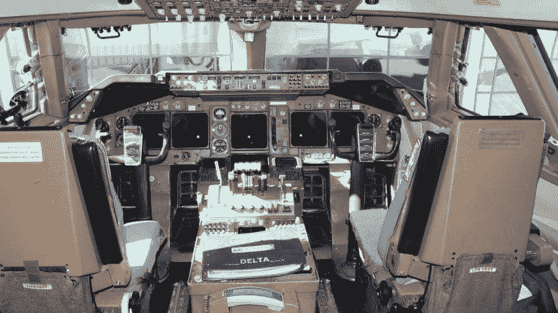
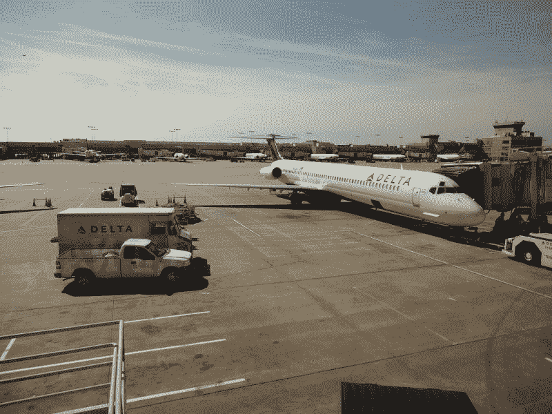
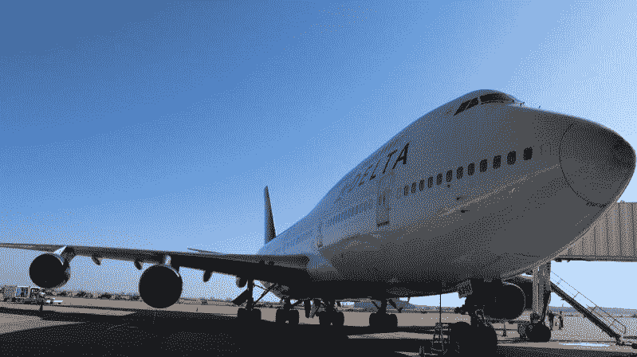
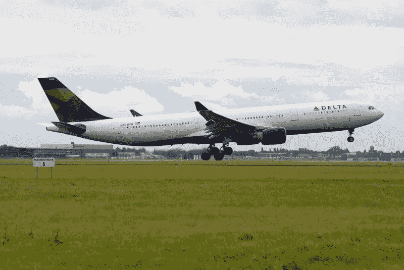

# 达美航空赚钱吗？—市场疯人院

> 原文：<https://medium.datadriveninvestor.com/is-delta-airlines-making-money-market-mad-house-27f999c0db36?source=collection_archive---------5----------------------->

传统观点认为，航空公司不是一项价值投资。然而，伯克希尔哈撒韦公司(纽约证券交易所代码:BRK。b)2019 年夏天持有**美国航空公司(NYSE:AA)**9.8%股权，美国消费者新闻与商业频道[预估](https://www.cnbc.com/berkshire-hathaway-portfolio/)。

沃伦·巴菲特对美国航空公司的兴趣让我对这家世界第二大航空公司产生了好奇；**达美航空(纽约证券交易所代码:DAL)** 。2019 年 10 月 8 日，达美航空的股价为 53.92 美元，因此很便宜。

 [## 算法交易的机器学习|数据驱动的投资者

### 当你的一个朋友在脸书上传你的新海滩照，平台建议给你的脸加上标签，这是…

www.datadriveninvestor.com](https://www.datadriveninvestor.com/2019/01/30/machine-learning-for-stock-market-investing/) 

有趣的是，Points Guy 认为达美航空可能会在 2019 年超过美国航空，成为世界上最大的航空公司。因此，达美航空是一家拥有低价股票的成长型企业。

# 航空公司是一个成长中的行业

空中旅行是一个正在增长的行业，尤其是在美国。例如，美国运输统计局[估计](https://www.bts.dot.gov/newsroom/2018-traffic-data-us-airlines-and-foreign-airlines-us-flights)2018 年航空客运量增长 4.8%，2017 年和 2018 年增长 8.5%。

该局称，事实上，美国航空乘客人数在 2018 年达到了 10 亿人的历史新高。此外，美国客运量从 2017 年的创纪录高位 9.654 亿人次上升。此外，该局估计，2018 年美国航空公司的国内航班乘客量增加了 4.9%，国际航班乘客量增加了 3.1%。

因此，达美航空是一家成长中的企业。此外，达美航空的业务在可预见的时间内是安全的，因为在美国没有真正的航空旅行替代方案。

# 美国的航空公司没有真正的竞争对手

美国国家客运铁路美国国家铁路客运公司是东北走廊外的一个坏笑话。

例如，乘坐美国国家铁路客运公司火车在丹佛和盐湖城之间旅行需要 16 小时 50 分钟。而且，丹佛和盐湖城之间至少还有火车。包括拉斯维加斯和洛杉矶在内的许多美国城市之间没有客运铁路服务。

然而，在丹佛和盐湖城之间行驶 519.4 英里需要 7 小时 58 分钟。同时，在丹佛和盐湖城之间飞行大约需要 1 小时 35 分钟。考虑到时差，我认为航空公司在美国的旅行垄断是安全的，直到有人建立一个工作的超级回路。

美国的高速公路系统过于拥挤，分崩离析，阻碍了汽车出行。值得注意的是，在美国偏远的乡村公路上，交通堵塞现在是常见的景象。

最后，美国一直没有能力建设高速铁路线；航空公司最危险的竞争对手。例如，加利福尼亚州在高速铁路上花费了 205 亿美元，但只有两个较小城市之间的一条短程线；贝克斯菲尔德和默塞德。因此，州长加文·纽瑟姆(D-San Francisco)和州议员希望将高速铁路资金转向洛杉矶的通勤铁路，*《洛杉矶时报》* [推测](https://www.latimes.com/california/story/2019-07-28/california-redirects-funds-high-speed-rail-project)。

# 德尔塔和航空公司收费亭

因此，航空公司是大多数美国人长途旅行的唯一现实选择。只有极少数人买得起私人飞机；很少有人会花几天时间开车或坐火车去度假或出差。

因此，航空公司在北美的长途旅行中有一个收费站。因此，美国航空公司符合沃伦·巴菲特的收费站投资策略。具体来说，巴菲特喜欢购买有巨大经济护城河的公司，在*价值漫步*时购买[票据](https://www.valuewalk.com/2016/03/warren-buffett-investment-process/)。

拥有护城河意味着一个企业可以设立一个收费站，向任何想要穿越护城河的人收取通行费。同样，任何住在东北走廊以外的美国人，想要在不到 10 个小时的时间内前往另一个城市，都需要支付航空公司的通行费。此外，任何居住在东北走廊的美国人都需要在合理的时间内乘飞机到达美国的任何其他地方。

# 达美赚钱了吗？

好的，那么**达美航空公司(纽约证券交易所代码:DAL)** 是一家成长中的公司，拥有巨大的护城河，但它赚钱了吗？

目前，答案是肯定的，达美航空报告称，截至 2019 年 6 月 30 日，季度收入为 125.36 亿美元，季度毛利为 77.45 亿美元。此外，达美当天公布的季度营业收入为 21.28 亿美元，季度收入为 14.43 亿美元。

此外，达美航空产生现金。2019 年 6 月 30 日，达美航空报告运营现金流为 32.72 亿美元，自由现金流为 17.12 亿美元。Plus Stockrow [报告](https://stockrow.com/DAL/financials/balance/quarterly)达美航空在 2019 年 6 月 30 日拥有 20.09 亿美元的现金和等价物。

因此，达美航空赚了钱，但该公司积累现金的能力有限。尤其是安全边际低的让我害怕。为了解释，我把现金等同于安全边际。在我看来，一家公司的现金越多，它就越安全。

# 德尔塔是好的分红股票吗？

然而，我认为德尔塔是一个体面的股息股票；因为它在 2019 年 7 月 24 日支付了 40.25₵季度股息。此外，5.25₵在 2019 年的股息增长从 2019 年 5 月 1 日的 35₵开始。

Dividend.com 估计 **Delta(纽约证券交易所代码:DAL)** 股票在 2019 年 10 月 8 日提供的股息收益率为 2.99%，年化派息为 1.61 美元，派息率为 28.8%。此外，达美航空已经经历了五年的股息增长。

我认为德尔塔是一个不错的收益股，但成长性较差。解释一下，我认为扩大航空公司运营的成本会消耗掉达美的大部分利润。此外，达美航空非常容易受到外部威胁，包括油价上涨、新技术和经济衰退。

归根结底，我认为有更便宜的股票，更好的股息和增长潜力更安全。因此，我认为对于普通投资者来说，远离航空股仍然是明智之举。

*原载于 2019 年 10 月 9 日*[*【https://marketmadhouse.com】*](https://marketmadhouse.com/is-delta-airlines-making-money/)*。*