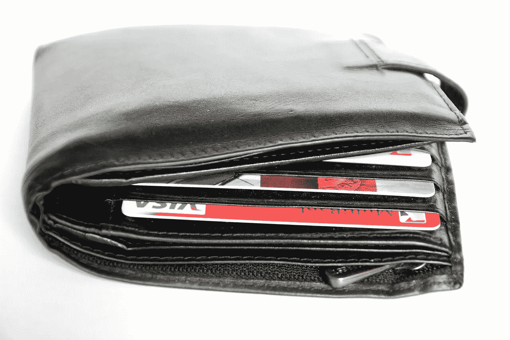

# Discover Financial (DFS)是赚钱还是冒险？

> 原文：<https://medium.datadriveninvestor.com/is-discover-financial-dfs-making-money-and-taking-risks-bb23c716386d?source=collection_archive---------12----------------------->

由于其独特的商业模式，Discover Financial 是一个根基不稳的信用卡品牌。解释一下，大部分 Discover 的信用卡都是在美国发行的。

不同于 **Visa(纽约证券交易所代码:V)** 和 **MasterCard(纽约证券交易所代码:MA)** Discover 只在美国发行其 Discover 品牌的产品。然而，**发现金融服务(纽约证券交易所股票代码:DFS)** 与[用餐者俱乐部](https://www.dinersclubus.com/home/about/dinersclub/story)合作，这是一个历史悠久的全球信用卡品牌。

Discover 以美国为中心的商业模式冒了两大风险。首先，在可预见的未来，大部分经济增长将发生在美国以外。其次，我认为 Discover 的业务对美国经济的不稳定性造成了严重影响。

**工资停滞如何威胁发现金融**

比如，它们没有解决导致 2007—2008 年金融大崩溃的大部分条件。值得注意的是，美国的收入不平等和工资停滞问题没有得到解决。

布鲁金斯学会(Brookings Institution)称，特别是在 1979 年至 2016 年间，美国中上层阶级的工资每小时仅增长了 3 美元。因此，在美国，最有可能使用信用卡的人的收入增长停滞不前。

因此，大量的美国人很可能积累起他们无法支付的巨额信用卡余额。例如，许多家庭在经济困难时会求助于信用卡进行紧急融资。

**医疗破产如何威胁 Discover Financial (DFS)**

高额医疗费用导致的医疗债务是美国 Discover Financial (DFS)面临的最大威胁之一。

显然，2016 年有 770，846 起医疗破产，余额[估计](https://www.thebalance.com/medical-bankruptcy-statistics-4154729)。美国的医疗破产率很高，因为它缺乏针对中产阶级的政府医疗保险计划。

医疗破产威胁着 Discover，因为许多美国人依赖信用卡购买医疗保险。具体来说，没有健康保险或健康保险不好的人使用塑料来支付医疗账单，然后宣布破产。

金融不稳定威胁着 Discover Financial，因为在经济不景气时，医疗破产率会增加。例如，2010 年，也就是危机发生后的第二年，大约有 150 万起医疗破产。

**Discover Financial (DFS)正在全球扩张**

在这种情况下，Discover 的明智策略是全球扩张。可以预见，这正是 Discover Financial 正在做的事情。

为了证明这一点，Discover 正在建立一个 Discover 全球网络，在全球范围内接受 Discover 和 Diners 俱乐部卡。事实上，一份新闻稿表明 Discover 正在 PXP 的帮助下扩展其网络。

PXP 是一家英国公司，为零售和其他行业提供销售点(POS)和其他支付解决方案。因此，Discover 的管理层明白过度接触美国市场的危险，并试图使其客户基础多样化。

例如，Discover 正在欧洲扩张，那里的政府通过单一付款人健康保险计划承担了大部分医疗债务风险。因此，它避免了在美国经营的固有风险。

**发现金融公司(DFS)收入不断增长**

现在是 Discover 扩张的好时机，因为它正从美国不断增长的收入中赚钱。

例如，Discover 报告称，2018 年第三季度的毛利润为 19.82 亿美元，营收为 19.82 亿美元。因此，Discover 处于令人羡慕的地位，能够将其所有收入列为利润。因此，Discover 记录了 100%的毛利率。

此外，Discover 年第三季度的营业收入为 9.67 亿美元，净收入为 6 亿美元。因此，Discover 正从其美国信用卡业务中赚钱。

目前，国际扩张对 DFS 来说是一个很好的举措，因为它有足够的资源来支付。特别是，Discover 在 2018 年 9 月 30 日拥有 166.09 亿美元的现金和等价物。

除此之外，2018 年第三季度 DFS 的运营现金流为 16.06 亿美元，融资现金流为 21.2 亿美元，自由现金流为 1.547 亿美元。因此，如果你正在寻找一家现金充裕、增长前景强劲的公司，Discover Financial 是一个不错的选择。

**Discover Financial(DFS)是一只好的分红股票吗？**

**Discover Financial Services(纽约证券交易所代码:DFS)** 也是一只股息强劲的股票。例如，Discover 在 2018 年 12 月 6 日支付了 40 英镑的股息。

此外，2018 年股息增加了 5。为了证明这一点，DFS 于 2018 年 4 月 20 日支付了 35 英镑的股息。

DFS 还提供良好的股票股息数据。例如，2018 年 12 月 6 日的股息收益率为 2.46%，年化派息为 1.60 美元，派息率为 20.5%。最后，Discover 即将完成七年的股息增长。

我认为 Discover 在 2018 年 12 月 11 日的定价低于每股 64.24 美元。如果你想在信用卡股票中寻找便宜货，那就去调查 Discover 吧。这家赚钱的公司有着强劲的增长前景和精明的管理。

这件作品最初出现在 2018 年 12 月 10 日的 [Market Mad House](https://marketmadhouse.com/) 。