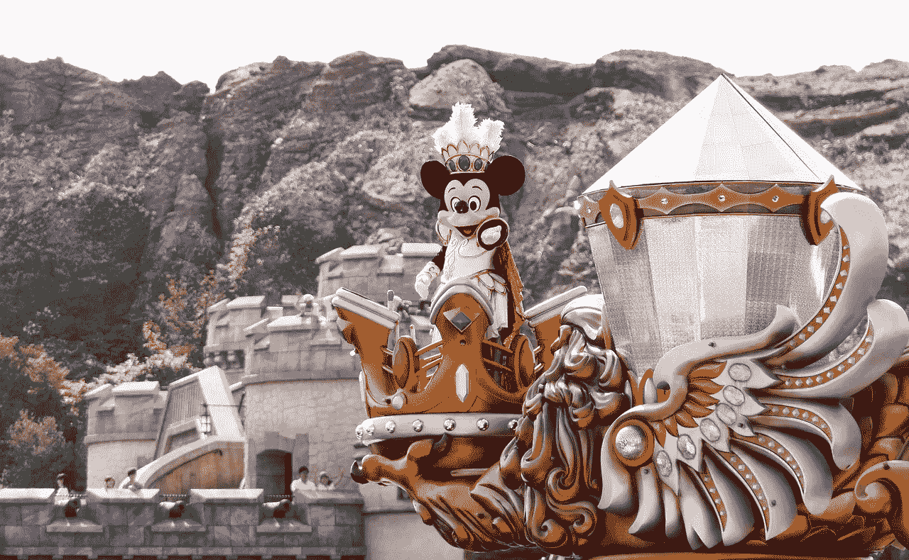
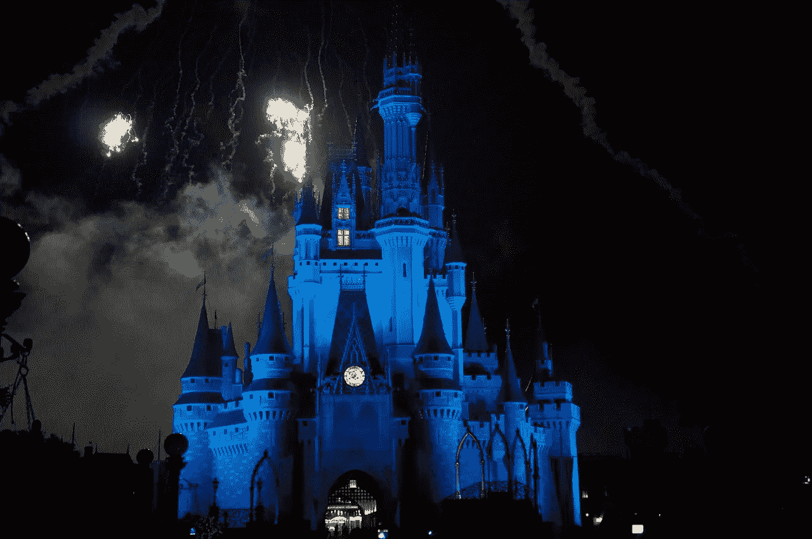
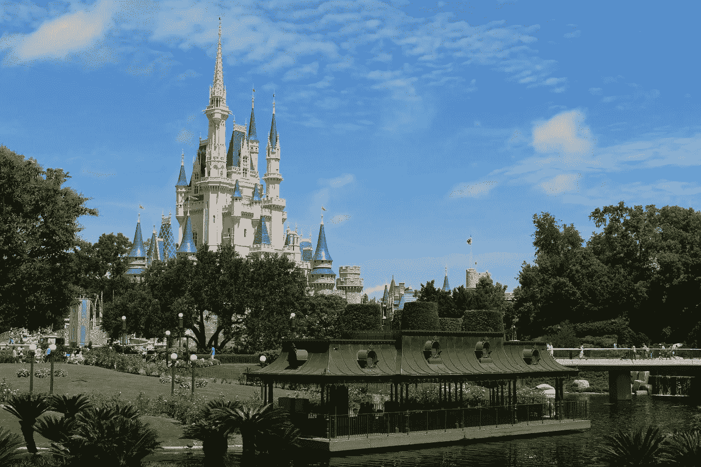
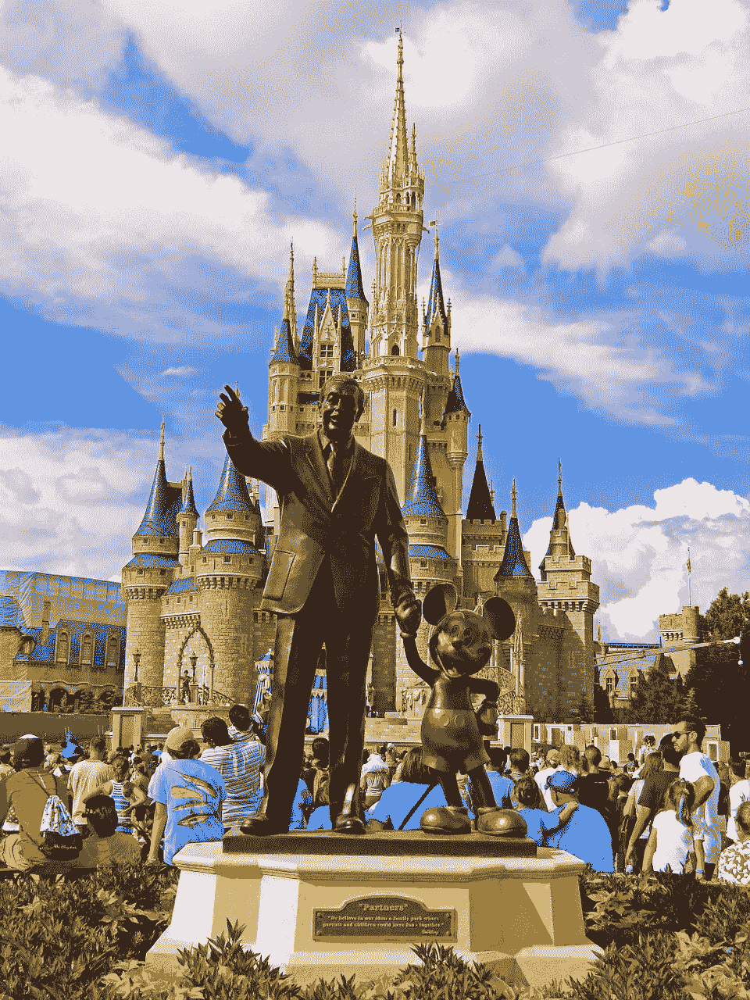

# 迪士尼(Disney)是垄断吗？

> 原文：<https://medium.datadriveninvestor.com/is-disney-dis-a-monopoly-970f1cbf9a3?source=collection_archive---------1----------------------->

由于其商业模式，迪士尼将面临垄断的指控。特别是，针对采取类似策略的公司的垄断指控已经满天飞。

解释一下，像莎拉·米勒这样的反垄断活动家指控大公司通过拥有几十个品牌来掩盖他们的垄断。比如**百威英博** **(NYSE: BUD)** 旗下拥有几十个品牌的啤酒。

事实上，开放市场研究所声称，百威英博是控制美国 75%啤酒市场的三大啤酒商之一。The Verge 确认米勒是公开市场研究所的副主任。

**迪士尼可能成为垄断者**

华特·迪士尼公司符合米勒的标准，因为它拥有几十个娱乐品牌。

例如，迪士尼拥有漫威、卢卡斯影业、美国广播公司、ESPN 80%的股份、试金石影业、A&E 50%的股份、香奈儿历史 50%的股份、生命 50%的股份、皮克斯、好莱坞唱片公司、Vice Media 10%的股份以及核心出版公司。

此外，迪士尼正在收购 21 世纪福克斯和 20 世纪福克斯电影工作室。美联社[报道](https://www.deseretnews.com/article/900043332/heres-when-fox-and-disney-will-close-their-deal.html)详细来说，迪士尼/福克斯交易可能在 2019 年 1 月 1 日完成。

**迪士尼的(非)角色垄断**

垄断指控将对迪士尼不利，因为它将很快拥有所有受欢迎的角色。

例如，迪士尼拥有所有漫威超级英雄的漫画和动画版权。这包括蜘蛛侠、美国队长、钢铁侠、金刚狼、x 战警、防御者、卢克·凯奇、毒液、复仇者联盟、尼克·弗瑞、幽灵骑士、绿巨人、雷神、神奇四侠、潜水艇和死侍等等。

此外，迪士尼收购 21 世纪福克斯后，将获得《x 战警》、《金刚狼》和《死侍》的电影版权。因此，迪斯尼拥有漫威和星球大战宇宙。

然而，这只是冰山一角。比如迪士尼将收购*吸血鬼猎人巴菲*；和所有的 Buffyverse 角色，如天使，通过购买 21 世纪福克斯。除此之外，迪士尼还将通过福克斯拥有*辛普森一家*、*阿彻*、*外星人、人猿星球、*和*捕食者*。

这种角色垄断给了迪士尼巨大的权力。例如，迪士尼强迫索尼将蜘蛛侠加入漫威电影宇宙。

Hulu 会让迪士尼(Disney)成为垄断吗？

如果这还不够的话，在获得福克斯的控制权后，迪士尼将获得 Hulu 60%的股份。因此，当迪士尼收购福克斯时，它将控制最大的视频流媒体服务之一的多数股权。

解释一下，Hulu 是迪士尼、福克斯、康卡斯特(CMNSA)和**通过时代华纳在& T (NYSE: T)** 的合资公司。据*投资者商业日报* [估计，私有的 Hulu 每年亏损 17 亿美元，但它在美国有 4750 万用户，在全国有 1.3 亿用户。](https://www.investors.com/news/technology/click/hulu-disney-fox-netflix/)

然而，迪士尼有资源将 Hulu 扩展成一个主要的流媒体视频平台。例如，迪士尼在 2018 年 9 月 29 日记录了 41.5 亿美元的现金和等价物。

值得注意的是，迪士尼可以将 ESPN 的所有体育项目作为独家内容添加到 Hulu。此外，迪士尼可以提供其图书馆中的所有电影和电视节目作为独家 Hulu 内容。

迪士尼会拥有电视吗？

独特的是，迪士尼将会有难以置信的大量内容可以加载到 Hulu 中。该内容包括迪士尼和 20 世纪福克斯电影库，以及来自福克斯电视网、ABC、FX、迪士尼频道、历史、A&E 等的所有电视节目。更不用说迪士尼为网飞制作的所有漫威秀了。

除此之外，迪士尼还可能拥有美国四大广播电视网 ABC 和 Fox 中的两家。因此，迪斯尼将通过福克斯宣传它的角色和作品。例如，辛普森一家参观迪斯尼乐园或会见美国队长。

**迪士尼为什么要废弃网络电视**

另一方面，网络电视是一个垂死的媒介。事实上，福克斯 2017 年的收视率(473.3 万)是 Hulu 美国用户群(4750 万)的十分之一。

值得注意的是，ABC 在 2017 年拥有 559.2 万观众；比 HBO Premium 少，后者有 726 万观众，Statista [估计](https://www.statista.com/statistics/530119/tv-networks-viewers-usa/)。因此，如果迪斯尼收购福克斯，它将拥有 1032.5 万广播电视观众。

在这种情况下，我认为迪士尼 CEO 鲍勃·伊格尔应该将资源从福克斯和 ABC 转移到 Hulu。Hulu 是迪士尼将获得最大的“性价比”，因为它在美国的收视率是美国广播公司和福克斯的近五倍。

一个明智的举措将是在 Hulu 上创建福克斯、辛普森一家、巴菲、星球大战、漫威和迪士尼独家内容频道。例如，一个你可以看到辛普森一家或漫威电视节目的地方。

**迪士尼(Disney)会面临反垄断行动吗？**

我预测，由于 Hulu 及其角色垄断，迪士尼(Disney)将面临反垄断行动。

像哥伦比亚广播公司(NYSE: CBS) 和 T2 网飞(NASDAQ: NFLX) 这样的广播网络可能会出于对迪士尼制作能力的担忧而推动这种行动。澄清一下，竞争对手会担心迪士尼可以迅速建立一个内容几乎无限的数字视频平台。

这样一个平台将成为数字视频的**亚马逊(NASDAQ: AMZN)** ，几乎每一种数字娱乐都可以通过一个应用程序获得。值得注意的是，观众可以从经典的 20 世纪福克斯电影中进行选择；像布奇·卡西迪和圣丹斯小子，蜘蛛侠卡通，上周的辛普森一家。

显然，像网飞和哥伦比亚广播公司这样的小公司将很难与这样的迪士尼平台竞争。因此，友好的政治家提起的反垄断诉讼和监管行动将不可避免。

**迪士尼在娱乐方面有经济护城河吗？**

价值投资者会喜欢这个声音，因为迪士尼可以建造一台与亚马逊竞争的赚钱机器。

例如，迪士尼可以从 Hulu 订阅中获得大量浮存资金。具体来说，float 是沃伦·巴菲特用来表示持续认购付款的术语。这种支付为公司提供了源源不断的现金流，可以用于扩张或分红。

除了浮动，迪斯尼还可以在娱乐业拥有一条有效的经济护城河。经济护城河是竞争者无法突破的市场壁垒。例如，想要播放《辛普森一家》或《美国队长》电影的流媒体服务必须向迪士尼付费。

显然，围绕防御工事修建的沟渠或屏障启发了护城河这个术语。他们设计了一条护城河，通过增加难度来阻止攻击。因此，经济护城河应该通过增加进入市场的难度来加大竞争。

**迪士尼是不是超棒的价值投资？**

具有讽刺意味的是，据说沃伦叔叔在讨论迪斯尼时提出了“护城河”这个术语。因此，迪士尼(Disney)是一项长期价值投资，可能会变得更好。

特别是迪士尼的收入在 2018 年第三季度以 11.96%的速度增长。值得注意的是，Stockrow 记录的华特·迪士尼公司第三季度收入为 143.07 亿美元，毛利为 61.99 亿美元。

因此，迪斯尼已经充分利用了它的资源，而且这些资源还在增长。例如，迪士尼报告 2018 年第三季度营业收入为 30.78 亿美元，净收入为 23.22 亿美元。

毫不奇怪，迪士尼正在创造大量现金。具体来说，迪士尼 2018 年第三季度的运营现金流为 38.53 亿美元，自由现金流为 26.52 亿美元。

迪士尼(Disney)是亚马逊(Amazon)的好替代品吗？

我认为现金、角色垄断和 Hulu 使**迪士尼**成为价值投资者**亚马逊**的一个很好的替代选择。

重要的是，迪士尼的股票比亚马逊便宜得多——2018 年 12 月 4 日，迪士尼的交易价格为每股 113.06 美元。相比之下，亚马逊当天的交易价格为每股 1686.42 美元。

锦上添花的是，迪士尼支付股息，而亚马逊没有。事实上，他们计划迪士尼股东在 2019 年 1 月 10 日获得 88 英镑的现金股息。此外，股息将比 2018 年 7 月 9 日支付的 84 英镑增加 4 英镑。

据 Dividend.com 报道，目前迪士尼股东的股息收益率为 1.52%，年化派息为 1.76 美元，派息率为 25.4%。然而，Dividend.com 仅记录了迪士尼一年的股息增长。

如果你正在寻找一个可能与亚马逊竞争的潜在垄断，调查一下华特·迪士尼公司。此外，魔法王国为对垄断没有道德异议的投资者提供了不断增长的红利。