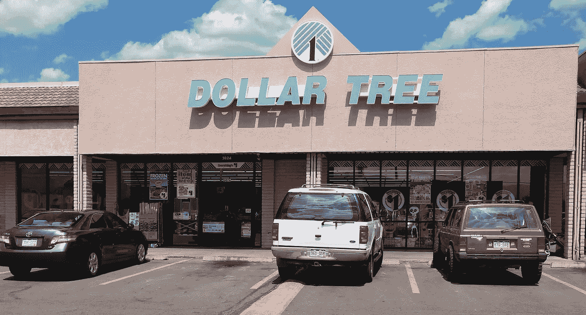
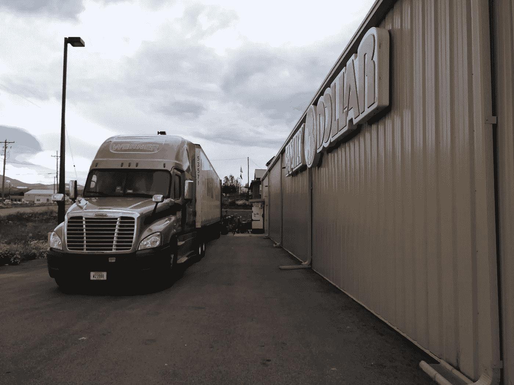
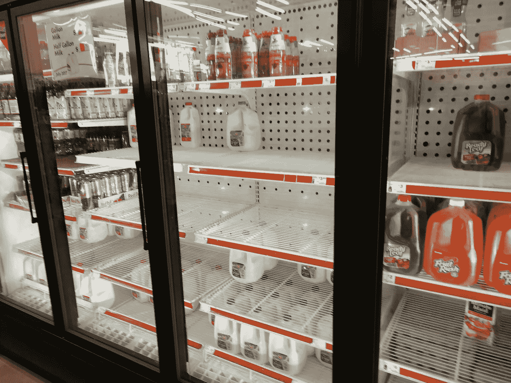
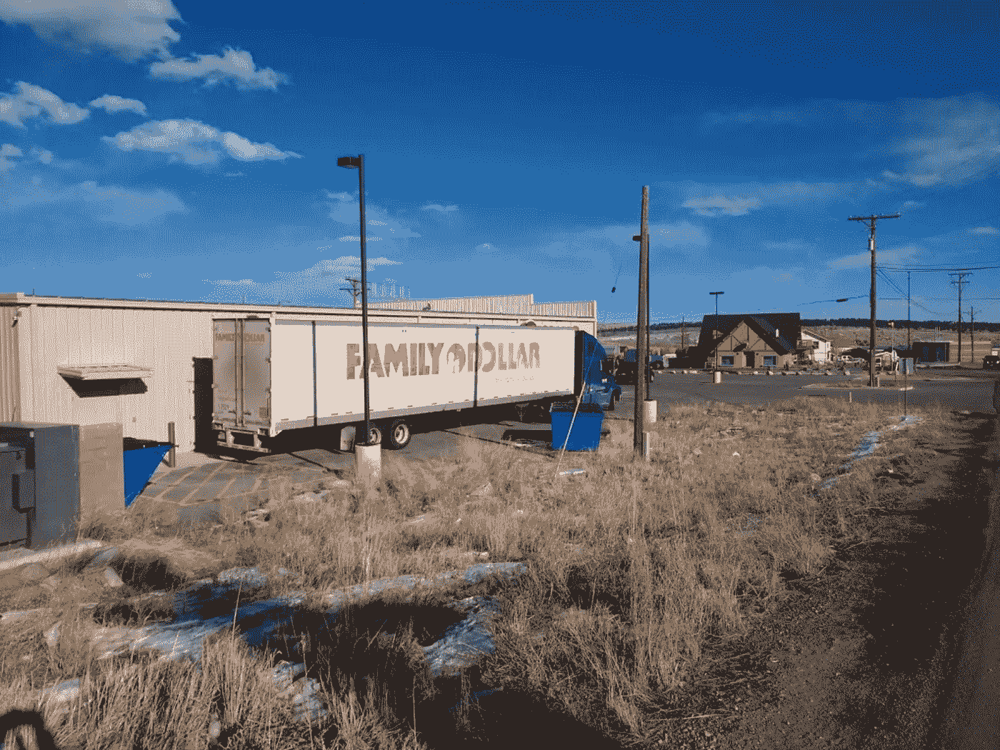
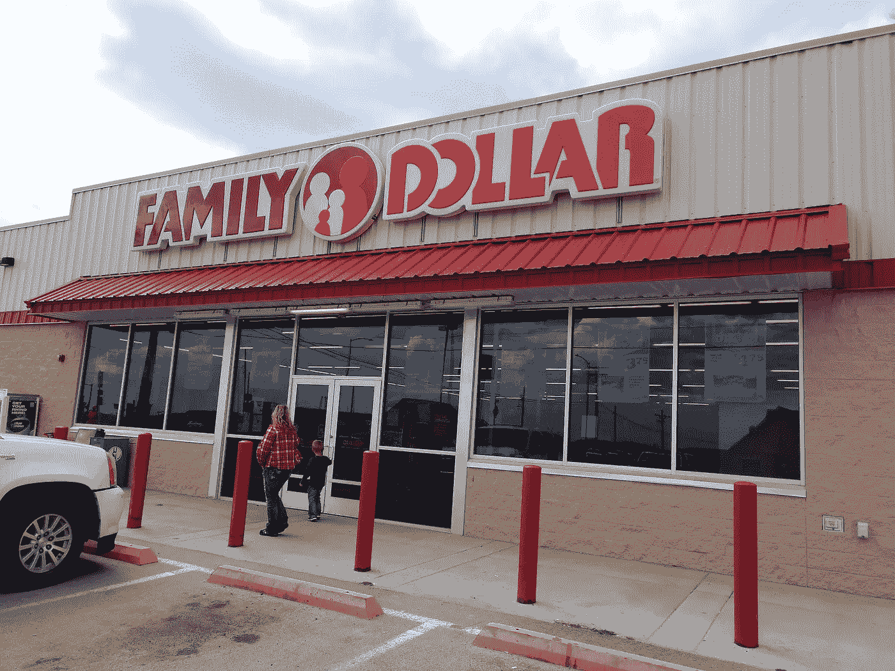

# 美元树(DLTR)在劫难逃吗？

> 原文：<https://medium.datadriveninvestor.com/is-dollar-tree-dltr-doomed-73916d6e7e39?source=collection_archive---------7----------------------->

美元树(DLTR) 证明了投资者的眼光要远远超越数字和媒体炒作，这总是值得的。

例如，头条新闻是[大肆宣传](https://pilotonline.com/inside-business/news/retail/article_0a6d1ee4-fc8f-11e8-8626-ef7ff44cf3e8.html) **美元树公司(纳斯达克代码:DLTR)** 在弗吉尼亚州切萨皮克的新总部，以及连续 43 周的同店销售额上升。然而，到我当地的家庭美元的访问；美元树子公司，揭示了一个正在展开的零售灾难。

例如，我的家庭美元店的许多货架都是空的。事实上，像垃圾袋、牛奶和洗碗机清洁剂这样的基本物品已经缺货。

此外，科罗拉多州家庭美元市场的过道里堆满了未开封的盒子。因此，商品可能在店内，但顾客买不到。

**美元树(DLTR)开了数百家新店，但无法上架**

美元树(DLTR)显然没有基本的零售功能，但它正在开设数百家新店。

具体来说，美元树在 2018 年第三季度开设了 127 家新店。*汉普顿路商业杂志* [报道](https://pilotonline.com/inside-business/news/retail/article_0a6d1ee4-fc8f-11e8-8626-ef7ff44cf3e8.html)该公司在第三季度推出了 87 家美元树和 40 家家庭美元商店。

我想知道这些商店中有多少是空货架和未开封的商品。或许美元树可以把花在新店上的钱用于增加库存人员或改善库存系统。

此外，美元树正在开设一个新的 12 层总部，并翻新或重新品牌的 194 家商店。特别是，164 家一元店变成了一元树直销店。

**美元树(DLTR)会倒闭吗？**

美元树(DLTR)是如此之大，以至于它可能会失控，并有可能崩溃。例如，该公司经营着 15，587 家商店。

Randy Guiler 称，具体来说，有 6923 家一元店和 8264 家一元店在运营。很明显，Guiler 是 Dollar Tree 的投资者关系副总裁。

我不得不怀疑一个不能让商品继续上架的公司是如何管理 15，587 家店铺的。我个人认为，美元树太大了，难以控制，将会崩溃。

有趣的是，这正是几年前发生在 Family 身上的事情。详细来说， [Family Dollar](https://en.wikipedia.org/wiki/Family_Dollar) 是一家独立的上市公司，过度扩张耗尽了资金，于 2011 年倒闭。

很明显，Family Dollar 在倒闭前一直在盲目地开设新店。**美元树(纳斯达克股票代码:DLTR)** 崩溃后收购了家族美元。

现在美元树似乎也有同样的苦恼。也就是说，傲慢而无能的管理层认为自己可以永远扩张下去。此外，美元树的管理层假装不存在竞争。

**美元树(DLTR)赚钱了吗？**

另一方面，美元树(DLTR)正在赚钱。特别是，美元树在 2018 年第四季度的收入为 55.38 亿美元，毛利润为 16.72 亿美元。

这些数字使美元树第四季度的营业收入达到 3.87 亿美元，净收入达到 2.81 亿美元。因此，美元树从它的生意中赚了一点钱。

例如，美元树并没有产生那么多现金，它报告 2018 年第四季度的自由现金流为 5740 万美元。此外，美元树公司的运营现金流为 2.821 亿美元。

因此，我认为美元树可能会陷入死亡漩涡。澄清一下，死亡螺旋发生在零售商现金耗尽，无法维持运营的时候。关于死亡螺旋的教科书示例，请参见 Sears。

**美元树(DLTR)不可持续**

简而言之，我认为美元树(DLTR)缺乏维持运营的现金。例如，美元树在 2018 年 11 月 3 日报告了 7.083 亿美元的现金和等价物。

因此，美元树缺乏资源来维持运营或借入大量资金。因此，美元树可能最终会关闭门店以削减开支。

一种可能的情况是，Guiler 会在某一天吹嘘新店开业，然后在第二天宣布关门。我认为这将会发生，因为看起来美元树正在利用新店的势头来维持其运营。

**美元树(DLTR)将如何死去**

为了解释这一点，新店开张给美元树带来了销售增长。然后，管理层向投资者兜售这一数字，以推高股价。

然而，当顾客厌倦了去美元树时，销售增长就结束了；或家庭美元，并找到空货架。因此，美元树吸引顾客的唯一方法是在人们不熟悉的地区开业。

一个相关的骗局是美元树和家庭美元商店的“重新品牌化”。美元树公司没有改善运营，而是在同样古老的建筑上挂上了新的招牌。一旦进入店内，顾客会发现同样的员工、糟糕的服务和空荡荡的货架。

显然，这样的恶作剧只能让公司维持这么久。在某些时候，顾客会厌倦在家庭美元和美元树浪费时间，不再来了。

**对不起美元树(DLTR)，亚马逊来找你了**

更糟糕的是，**亚马逊(NASDAQ: AMZN)** 正在争夺美元树的客户。

一个流行的牛市论点是，美元树(DLTR)是“亚马逊证明；因为它出售给低收入人群，并经营便利的社区位置。现在，Everything Store 正在测试一个小小的 Amazon Go 概念店。

Amazon Go 是一家超级方便的无收银员便利店。Go 威胁着一元店，因为它是一种方便、小型的购物体验，运营成本可能更低。例如，Go 需要更少的员工，因为它没有收银机和收银员。

杰夫·贝索斯正在计划亚马逊几乎可以在任何地方开设的小型 Go 商店。例如，一个 450 平方英尺的亚马逊 Go 正在西雅图市中心的梅西百货(纽约证券交易所代码:M)的第六层运作，*《西雅图时报》* [报道](https://www.seattletimes.com/business/amazon/smaller-amazon-go-store-tested-in-seattle-as-retailer-eyes-new-venues/)。

相比之下，现有的 Go 商店面积约为 1800 平方英尺。亚马逊正在梅西百货进行测试，因为它在大楼里租赁了办公空间。

**Amazon Go 如何走进你的社区**

因此，亚马逊正在开发它几乎可以在任何地方开设的 Go 足迹。例如，在超市、办公楼、工厂、履行中心、机场、火车站、大卖场甚至卡车停靠站。

Amazon Go 对 Dollar Tree (DLTR)是一个直接威胁，因为它可以出售 Dollar 家族的所有商品。例如，洗衣液、洗碗精、垃圾袋、宠物食品和衣服。

此外，Amazon Go 还可以作为在线订购商品的提货点。举例来说，如果你去亚马逊找不到 Tide 你可以明天在同一个地方订购来取。

**亚马逊 Go 如何威胁美元树(DLTR)**

此外，亚马逊可以使用送货生态系统，将包裹送到你的门口，以供应 Go 商店。例如，UPS、FedEx 或 Ship by Amazon 可以将商品从履行中心运送到 Go 商店。如果 Go 店需要 Tide，UPS 的人第二天就会送来几箱。

因此，亚马逊可以在几乎任何地方开设数百或数千个 Go 站点，而无需新的交付基础设施。值得注意的是，亚马逊正在向戴姆勒(OTC: DAI)订购 20，000 辆奔驰 Sprinter 面包车，由亚马逊发货。

在这种情况下，亚马逊可以迅速在美国各地的社区开设数百或数千家 Go 商店。此外，亚马逊可以保持这些地点的库存，而不必让数百辆半卡车上路。

**美元树(DLTR)无法与亚马逊 Go 竞争**

我不禁要问，像 Dollar Tree 这样经营不善、库存如此匮乏的零售商，如何能与 Amazon Go 竞争。从逻辑上讲，美元树无法与运营良好的亚马逊 Go 竞争。

此外，我认为一元店将是继便利店之后亚马逊 Go 的第一批目标零售商。亚马逊有这样一个历史:在挑战大玩家之前，首先追逐一个行业的“软肋”。

例如，贝佐斯通过卖书发起了他的零售革命。因此，战略性地瞄准了美国最老式、受传统束缚、管理最差的行业之一:出版业。

现在，亚马逊对经营不善的便利店发起了第一次实体攻势；低利润的零售市场经常被大公司忽视。我认为一旦在便利方面取得成功，亚马逊将会瞄准一元店。

**小心美元树(DLTR)沃尔玛、克罗格和塔吉特也来找你了**

阐述；像许多便利店一样，一元店人手不足，库存不足，经营不善。因此，美元树和它的主要竞争对手**美元通用(纽约证券交易所代码:DG)** 都是亚马逊和其他大型零售商的活靶子。

一元店将不得不与之抗衡的不仅仅是亚马逊。**Kroger**和**Walgreens Boots-Alliance(NASDAQ:WBA)**正在[尝试](https://marketmadhouse.com/kroger-and-walgreens-team-up-for-pickup/)混合药店和杂货店。此外，Kroger、 **Walmart(纽约证券交易所:WMT)** 和 **Target(纽约证券交易所:TGT)** 正在试验或讨论较小的格式商店。

一个可能的情况是，亚马逊 Go 的成功将激励克罗格、沃尔玛、塔吉特、**好市多(纳斯达克股票代码:COST)** 和其他公司开设类似的商店。因此，美元树的几十个直接高科技竞争对手可能会在一夜之间出现。

**为什么投资者应该避开美元树(DLTR)**

因此，投资者应该避免**美元树(纳斯达克:DLTR)** 。这是一家经营不善的零售商，面临着来自亚马逊和其他零售巨头的直接竞争。

最后，美元树不支付股息，因此我认为市场先生在 2018 年 12 月 14 日将其股票定价过高，为每股 85.76 美元。你应该避免美元树，除非你喜欢内爆零售商。

这个故事最早见于 [*市场疯人院*](https://marketmadhouse.com/) 。