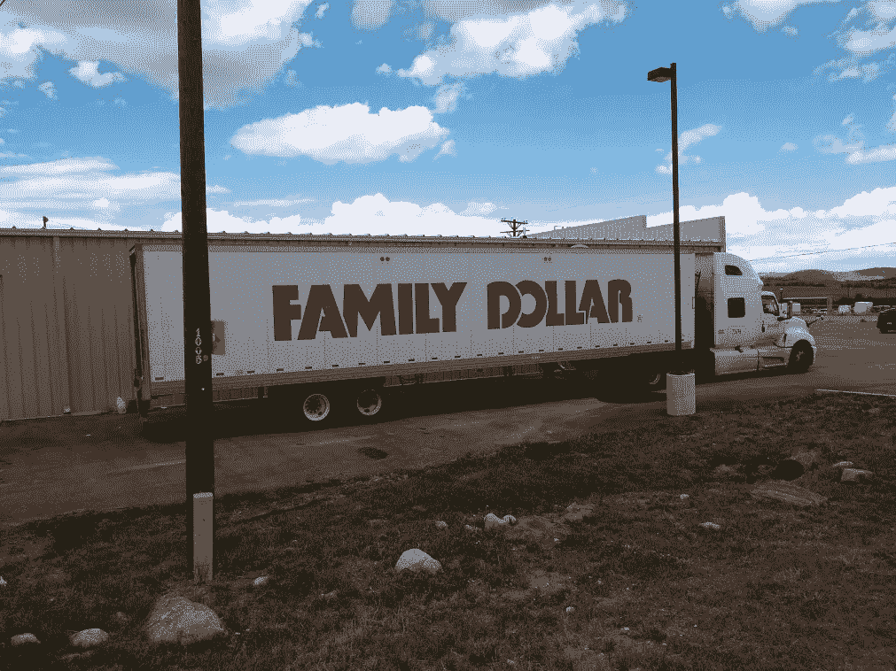
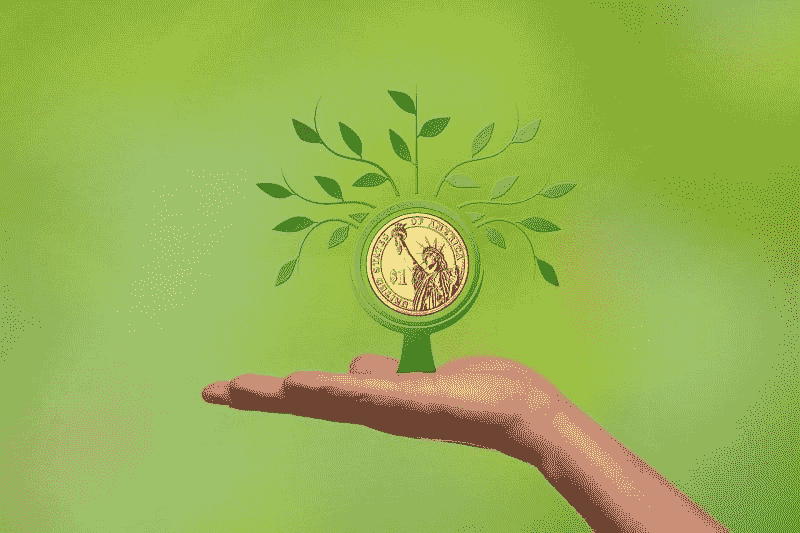
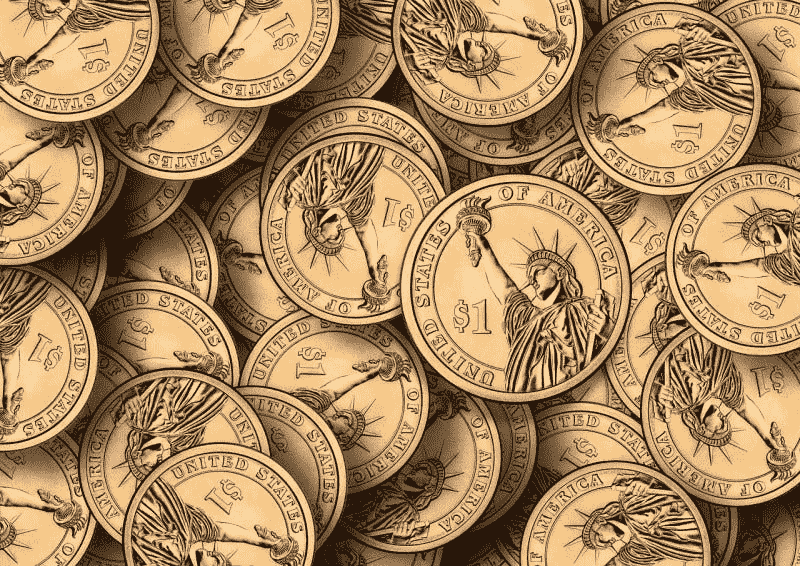
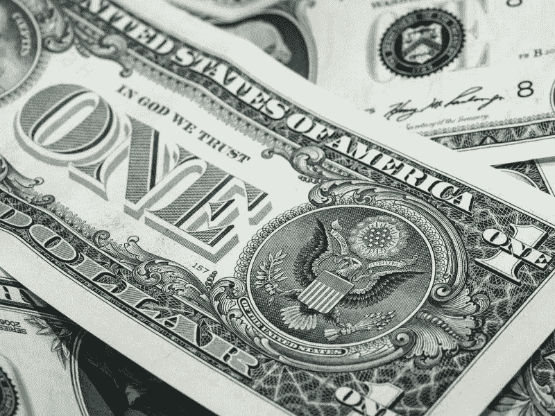
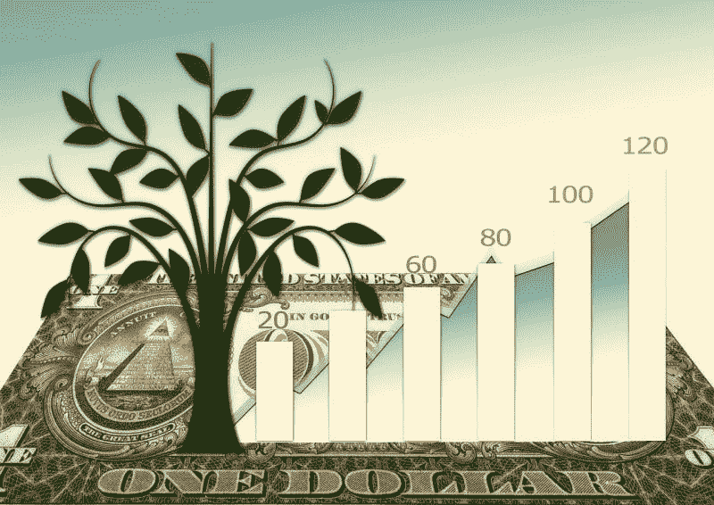
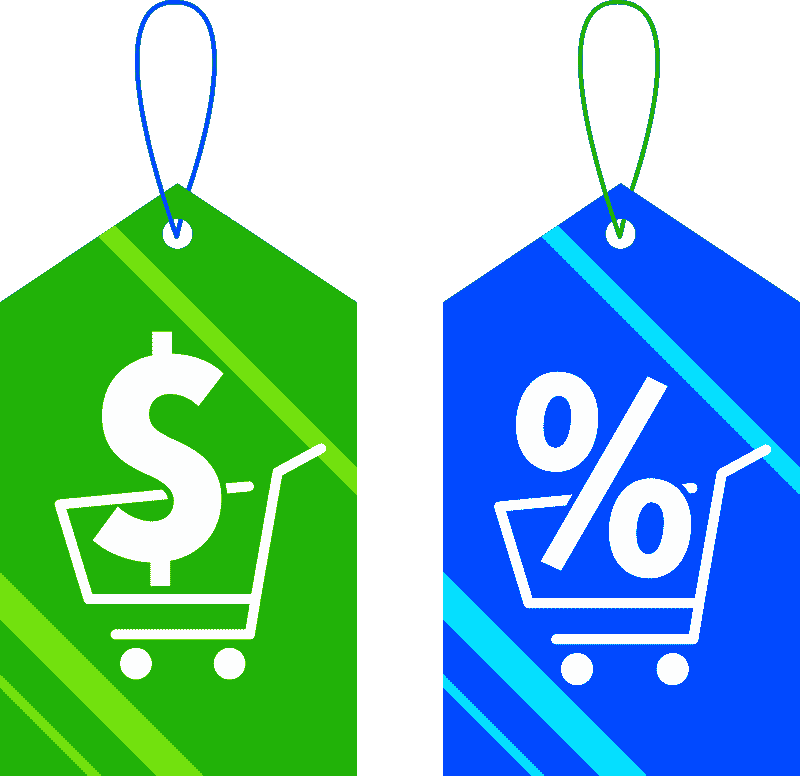
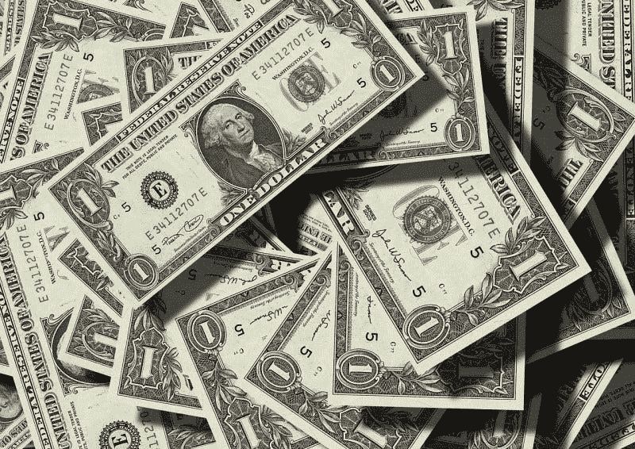
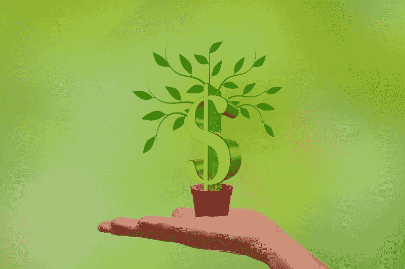

# 美元树是注定的吗？—市场疯人院

> 原文：<https://medium.datadriveninvestor.com/is-dollar-tree-doomed-market-mad-house-ae678cc6a500?source=collection_archive---------3----------------------->

观察小盒子折扣的人在问，美元树是不是要完蛋了。最近，**美元树公司(纳斯达克代码:DLTR)** 已经采取了一些激烈的行动。

首先，有传言称，该公司正在将其 Family Dollar 子公司的商店转换为科罗拉多州等州的 Family Dollar/Dollar Tree 混合商店。

 [## 算法交易的机器学习|数据驱动的投资者

### 当你的一个朋友在脸书上传你的新海滩照，平台建议给你的脸加上标签，这是…

www.datadriveninvestor.com](https://www.datadriveninvestor.com/2019/01/30/machine-learning-for-stock-market-investing/) 

第二，美元树可能会关闭多达 390 家家庭美元店，并将另外 200 家家庭美元店转变为美元树的位置，*今日美国*报道。

Family Dollar in Colorado My Photo

第三，美元树可能会放弃其传说中的 1 美元一切的销售模式，销售更高价格的商品，*今日美国* [声称](https://www.usatoday.com/story/money/2019/03/06/dollar-tree-change-name-and-close-hundreds-family-dollar-stores/3078239002/)。因此， *Business Insider* [透露](https://www.businessinsider.com/dollar-tree-breaks-dollar-promise-more-expensive-products-2019-5?fbclid=IwAR0toZLPXv6YGwcvEOlJ78bnSazmOFmL9mV25QSmNYqUO9_1hK2arkVqqk8&r=US&IR=T) Dollar Tree 正在增加一系列价格更高的商品管理电话 Dollar Tree Plus！

第四，Dollar Tree 将在其 1000 家门店出售酒，*商业内幕* [声称](https://www.businessinsider.com/dollar-tree-to-sell-alcohol-at-1000-family-dollar-stores-2019-5)。*商业内幕*没有给出酒精美元树可以出售的细节。

# 美元树绝望了吗？

除非走投无路，否则零售商不会对商业模式做出如此剧烈的改变。因此，我认为美元树是一个绝望的零售商。

美元树绝望了，因为亚马逊正在蚕食它的业务。例如，美元树正计划销售亚马逊不能销售的酒类产品。希望添加廉价的酒或啤酒可以吸引更多的步行交通到美元树。

此外，我猜美元树公司不可能以 1 美元的价格出售大部分啤酒或白酒。此外，Dollar Tree 声称，拥有更多食物和更大冷冻区的商店的客流量增长了 10%。因此，美元树管理层认为他们可以通过出售更多的食物来扩大业务。

# 美元树怕什么，亚马逊？

我怀疑美元树害怕两个成长中的零售商；亚马逊和阿尔迪。亚马逊威胁美元树正在大力推进消费必需品市场。

例如，亚马逊正在通过其 Dash 噱头推广洗衣液和咖啡等产品。解释一下，Dash 让你只需按下一个按钮或一个应用程序，就可以通过亚马逊订购像 Tide 这样的商品。Dash 和亚马逊 Prime 的免费送货等便利设施让亚马逊比美元树更方便。

美元树的部分吸引力在于它的便利性。美元树很小，而且就在附近，所以你可以跑进去拿你上次**沃尔玛(纽约证券交易所代码:WMT)** 或**好市多(纳斯达克代码:成本)**跑丢的东西。亚马逊让你足不出户就能订购被遗忘的商品，这威胁到了美元树存在的全部理由。

一个相关的问题是，杰夫·贝索斯；像沃尔玛的管理层一样，会牺牲亚马逊的利润来换取[的长期增长](https://seekingalpha.com/article/4281617-amazon-sacrifices-long-term-growth?dr=1)。与此同时，像美元树这样的传统零售商以下一季度客流量和销售额的形式为短期增长和利润进行规划和投资。

因此，沃尔玛和亚马逊都会亏本出售某些商品来吸引顾客。然而，美元树必须在它出售的所有东西上赚钱。因此，与亚马逊和沃尔玛竞争对美元树来说是不可能的。

# 阿尔迪对美元树有威胁吗？

私人控股的超廉价小盒折扣杂货商 Aldi 是一个更复杂的威胁。像 Dollar Tree 一样，Aldi 在一个没有装饰的环境中以低价出售有限的商品。

然而，Aldi 专注于杂货，而 Dollar Tree 是一家综合零售商，专营干货。此外，Aldi 专注于以低价销售高质量的商品。

总部位于德国的 Aldi 正在积极扩张，计划很快在美国增加 400 家新店，市场狂人 [报道](https://marketmadhouse.com/why-aldi-is-americas-most-disruptive-grocer/)。阿尔迪现在在美国经营着 1800 多家商店，并计划进一步扩张。

Aldi 就像 Dollar Tree 一样便宜方便，在许多相同的市场都有业务。重要的是，Aldi 出售酒精，这使其在一些市场上比 Dollar Tree 更有优势。因此，美元树正在进入啤酒，葡萄酒和烈酒业务。

# 美元树如何从亚马逊获利

奇怪的是，美元树有一种方式可以在亚马逊上赚钱。Family Dollar 出售亚马逊和其他折扣礼品卡以换取现金。

因此，没有信用卡或银行账户的人可以用这种卡在亚马逊购物。例如，美元树销售亚马逊接受的**美国运通(纽约证券交易所:AXP)** 礼品卡。而且我在 Family Dollar 看到过亚马逊、**万事达卡(NYSE: MA)** 、 **Visa (NYSE: V)** 礼品卡出售。

美元树可以从这种卡中赚钱，因为 2017 年 25%的美国家庭没有银行账户或银行存款不足，联邦存款保险公司(FDIC) [估计](https://www.cnbc.com/2019/03/08/25percent-of-us-households-are-either-unbanked-or-underbanked.html)。澄清一下，无银行账户意味着一个家庭没有银行账户。

Inside a messy Colorado Family Dollar by Me

此外，没有银行账户意味着一个家庭的银行选择有限。例如，一个家庭可以有一个支票账户，但没有信用卡或借记卡。

然而，你需要信用卡、借记卡或礼品卡才能在亚马逊购物。如果这些家庭想在亚马逊购物，他们可以在 Family Dollar 或 Dollar Tree 购买礼品卡。值得注意的是，[亚马逊礼品卡](https://www.amazon.com/gift-cards/b?ie=UTF8&node=2238192011)售价 15 美元、25 美元、50 美元或 100 美元。因此，美元树放弃“一美元一切”的一个原因是销售购物卡。

# 美元树计划如何从穷人身上获利

亚马逊只是一个销售礼品卡的流行数字服务。你可以购买礼品卡的其他受欢迎的数字产品和服务包括**网飞(NASDAQ: NFLX)** 、**优步(NYSE: UBER)** 、**迪士尼(NYSE: DIS)** 、 [STEAM](https://store.steampowered.com/digitalgiftcards/) 、Hulu、视频游戏、 **Spotify (NYSE: SPOT)** 和**易贝(NASDAQ: EBAY)** 。

如果现代美国的穷人想要娱乐；他们需要礼品卡，美元树会出售。因此，美元树至少可以从电视的死亡、Fortenite 热潮和亚马逊的零售末日中赚些钱。此外，礼品卡是一种易于销售的产品。

除了礼品卡，Dollar Tree 还销售无线服务，这是现在许多美国人的必需品。值得注意的是，2017 年，只有 6.5%的美国家庭只使用固定电话， *The Verge* [估计](https://www.theverge.com/2017/5/4/15544596/american-households-now-use-cellphones-more-than-landlines)。此外，2017 年 50.8%的美国家庭只有无线。

特别是，美元树可以向没有银行账户的人出售流媒体视频、电话服务和亚马逊服务。此外，礼品卡是一种很容易出售的商品，只需要很少的地面空间，也没有特殊的存储空间。此外，外部承包商可以储存和维护礼品卡，这可以降低美元树的运营成本。

# 美元树的管理层比你想象的要聪明

因此，美元树可以通过销售亚马逊无法销售的商品生存，比如烟酒和礼品卡。这一行业很难称得上光彩照人，在道德上也令人生疑，但还是有市场的。

如果联邦存款保险公司估计 25%的美国家庭没有银行账户或银行服务不足。美元树公司的礼品卡和无线服务可能拥有 3190 万个家庭的市场。

为了详细说明，Statista [估计](https://www.statista.com/statistics/183635/number-of-households-in-the-us/)2018 年美国有 1.2759 亿个家庭。我算了一下 1.2759 亿的 25%大致是 3190 万。

鉴于这些数字，我认为美元树的管理层是在进行长期投资。因此，美元树的管理层可能比批评者想象的要聪明。该公司本可以找到一种在急剧变化的零售环境中生存和赚钱的方法。

# 美元树赚钱了吗？

目前的财务数据显示，美元树的一些变化正在产生回报。例如，**美元树公司(纳斯达克股票代码:DLTR)** 在 2019 年 5 月 4 日报告的收入为 58.09 亿美元，收入增长率为 4.59%。

另外，Dollar Tree 当天报告的毛利为 17.27 亿美元，营业收入为 3.86 亿美元，净收入为 2.68 亿美元。因此，美元树正在赚钱，并在 2019 年 2 月 2 日停止了亏损。

引人注目的是，2019 年 2 月 2 日，美元树报告营业亏损-21.47 亿美元，净亏损-23.07 亿美元，收入增长率萎缩-2.44%。因此，美元树可以用目前的商业模式赚钱，但能维持多久呢？

# 美元树产生的现金减少了

有趣的是，美元树的现金流随着收入的增加而下降。为了解释这一点，Dollar Tree 于 2019 年 5 月 4 日报告了 4.052 亿美元的自由现金流和 6.141 亿美元的运营现金。然而，Dollar Tree 在 2019 年 2 月 2 日报告的运营现金流为 7.151 亿美元，自由现金流为 5.178 亿美元。

实际上，美元树公司从运营中产生的现金越来越少。此外，2019 年 5 月 4 日，Dollar Tree 报告了投资(-1.924 亿美元)、融资(-1.175 亿美元)和资本支出(-2.059 亿美元)的负现金流。

最后，美元树的银行存款很少。值得注意的是，Dollar Tree 在 2019 年 5 月 4 日报告了 7.505 亿美元的现金和等价物。当亚马逊拥有令人难以置信的现金储备时，如此微小的现金流储备可能是致命的。详细来说，Everything Store 在 2019 年 6 月 30 日有 414.63 亿美元的现金和短期投资。

# 美元树的未来如何？

在这种情况下，美元树的未来是显而易见的。未来将涉及礼品卡、酒精、烟草和混合商店安排。

首先，美元树必须专注于其他零售商回避的产品，如酒精和烟草。尤其是 Vape 或电子烟业务正在蓬勃发展。

具体来说，彭博[报道](https://www.bloomberg.com/news/articles/2019-02-22/juul-expects-skyrocketing-sales-of-3-4-billion-despite-flavored-vape-ban)朱尔实验室公司预计 2019 年收入为 34 亿美元。2018 年收入 11.22 亿美元的三倍。此外，朱尔在 2018 年第四季度的收入为 4.24 亿美元。因此，增加 Vape 产品可能是 Dollar Tree 的明智之举。

第二，美元树需要成为购买礼物和无线卡的地方。T2 统计局估计 2018 年美国礼品销售额为 1600 亿美元。

# 美元树需要与其他零售商合作

第三，美元树需要探索与其他零售商分享其店面空间的可能性。有趣的是，PYMTs.com[报道](https://www.pymnts.com/news/retail/2019/aldi-kohls-partnership-department-store-grocery/)，**美国柯尔百货公司(纽约证券交易所:KSS)** 和阿尔迪正在中西部开设联合商店。

阿尔迪/美元树组合，或美国柯尔百货公司/美元树杂交是这个概念的逻辑扩展。美元树的另一个明智的合作伙伴可能是德国折扣杂货商 Lidl，该公司正在扩大其美国业务。

美元树的其他有趣的合作伙伴可能是亚马逊、**克罗格(纽约证券交易所代码:KR)** 和**沃尔格林(纳斯达克代码:WBA)** 。美国柯尔百货公司正在接受亚马逊的退货，亚马逊正在通过亚马逊 Go 和其他概念扩大其实体足迹。与此同时，克罗格和沃尔格林正在肯塔基州试验联合商店。

美元树需要探索的概念是接受亚马逊退货，亚马逊 Go 和美元树的组合，美元三通的克罗格杂货店，美元树商店的沃尔格林药房。

# 美元树是价值投资吗？

市场先生在 2019 年 8 月 7 日将美元树定价过高，为 92.38 美元。目前，我认为美元树是一只糟糕的股票，因为它定价过高，而且不支付股息。

投资者需要远离美元树，因为这家零售商为他们做的很少。此外，我认为还有更好的支付股息的零售股票，包括克罗格和 T2 沃尔玛。

*原载于 2019 年 8 月 7 日*[*https://marketmadhouse.com*](https://marketmadhouse.com/is-dollar-tree-doomed/)*。*