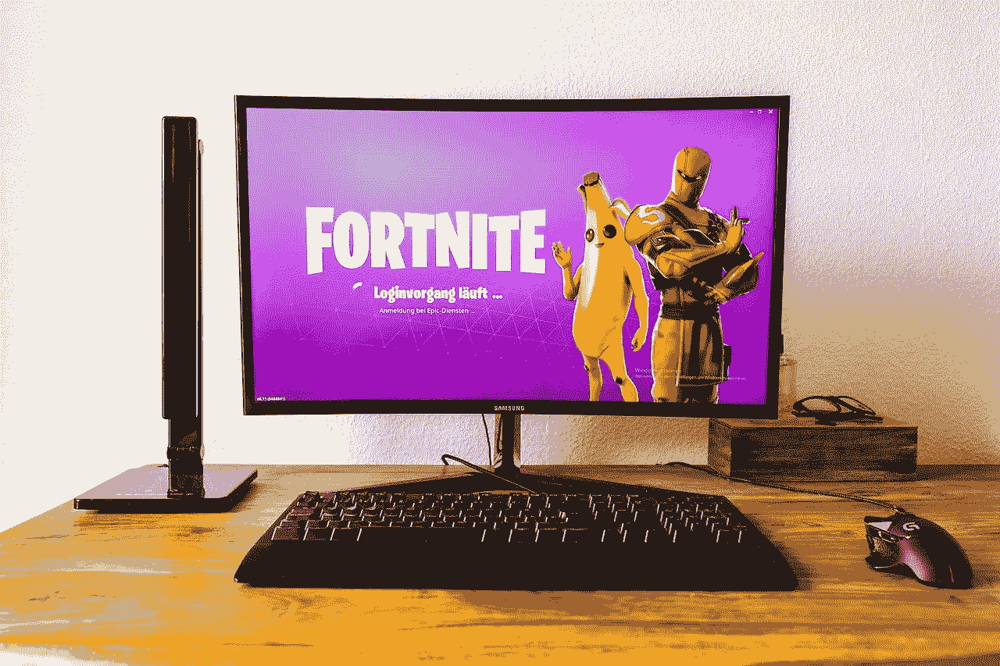

# 电子艺界赚钱吗？

> 原文：<https://medium.datadriveninvestor.com/is-electronic-arts-making-money-c2f0b381581d?source=collection_archive---------9----------------------->

游戏玩家和价值投资者问艺电是否因为其竞争对手 Epic Games 的*堡垒之夜*取得的惊人成功而赚钱。特别是，许多人会想知道**电子艺界**有多安全。

还有人问艺电或艺电是否是价值投资，因为它可以从多人射击游戏热潮中获利。在线玩家组队参加在线皇家战役的射击游戏现在很热门。

 [## 股票市场投资的机器学习——数据驱动的投资者

### 当你的一个朋友在脸书上传你的新海滩照，平台建议给你的脸加上标签，这是…

www.datadriveninvestor.com](https://www.datadriveninvestor.com/2019/01/30/machine-learning-for-stock-market-investing/) 

事实上，最受欢迎的皇家战役；*堡垒之夜可能是现在世界上最热门的娱乐品牌。值得注意的是，Epic Games [声称](https://www.esquire.com/lifestyle/a26897209/fortnite-250-million-players-apex-legends-competition/) *堡垒之夜*在全球拥有 2.5 亿玩家。*

*因此，*堡垒之夜*比**网飞(纳斯达克代码:NFLX)** 拥有更多的观众；其中[声称](https://www.hollywoodreporter.com/news/netflix-grows-subscriber-base-139-million-worldwide-1176934)在 2018 年 1 月已经拥有全球 1.39 亿用户。此外，*堡垒之夜*在 2018 年为私人举办的史诗游戏创造了 30 亿美元的利润， *Tech Crunch* [声称](https://techcrunch.com/2018/12/27/epic-fortnite-3-billion-profit/)。*

**

# ***艺电是价值投资吗？***

*在这种情况下，视频游戏制造商可能是一种价值投资。值得注意的是，2019 年 4 月 8 日，艺电股票的交易价格为每股 98.21 美元。与此同时，网飞股票当天的交易价格为每股 362.69 美元。*

*因此，我对 EA 的价值投资观点很简单。视频游戏制造商比流媒体服务更便宜，但他们有更多的观众。*

*自然有人会问为什么网飞比艺电贵？奇怪的是，不同代人的娱乐习惯提供了这个问题的答案。*

*首先，问问你自己谁看电视，网飞的产品。答案是老年人大多是婴儿潮；54 岁到 74 岁之间的人。此外，老年人更有可能拥有股票。*

*例如，盖洛普估计，62%的 50 岁至 64 岁的美国人和 54%的 65 岁以上的人拥有股票。相比之下，29 岁以下的人中只有 31%拥有股票。*

*因此，这些数字影响了 EA 和网飞的价格。网飞的股价很高，因为婴儿潮一代更有可能看电视，拥有更多股票。与此同时，艺电的价格较低，因为大多数购买股票的人不熟悉其产品。*

# ***为什么电子艺界可以成为价值投资***

*电子艺界是潜在的价值投资，因为游戏行业观察家认为这是皇家之战；*顶点传说*可能比*堡垒之夜*更受欢迎。*

*例如， *Apex Legends* 在 2019 年 2 月推出后的一个月内吸引了 5000 万用户，Esquire [估计](https://www.esquire.com/lifestyle/a26897209/fortnite-250-million-players-apex-legends-competition/)。令人印象深刻的是， *Apex Legends* 在 2019 年 2 月 4 日上线 8 小时后就有[100 万](https://www.vg247.com/2019/02/05/apex-legends-over-one-million-players/)玩家，上线第一天就有 250 万玩家。*

*此外，EA 首席执行官安德鲁·威尔逊吹嘘说 *Apex Legends* 在 2019 年 2 月 4 日拥有 60 万巅峰和当前玩家以及近 300 万独立用户， *VG 27/24* [报道](https://www.vg247.com/2019/02/06/apex-legends-two-and-a-half-million-players/)。因此， *Apex Legends* 在首映前就吸引了人们的兴趣。*

**

*另外， *Apex Legends* 据报道是 2019 年 2 月 Twitch 上最受关注的游戏，*VG 24/7*估计。Twitch 是视频游戏最重要的广告渠道，因为它让玩家可以观看其他玩家的游戏。详细来说， *Apex Legends* 在 2019 年 2 月 6 日拥有 23.2 万 Twitch 观众。*

# *Apex Legends 的观众是有线电视的观众吗？*

*因此， *Apex Legends* 拥有超过美国任何有线电视频道的观众。例如，最受欢迎的美国有线电视网福克斯新闻频道在 2019 年 3 月拥有 139.2 万观众，Statista [估计](https://www.statista.com/statistics/347040/cable-networks-viewers-usa/)。*

*此外，威尔逊对 Apex Legends 的峰值和当前用户的估计超过了美国前 10 大有线电视网。为了解释这一点，Statista 计算出历史频道和霍尔马克频道在 2019 年 3 月都有 564，000 名每日观众。相反，威尔逊声称 *Apex Legends* 在 2019 年 2 月 6 日吸引了 60 万峰值用户。*

*此外， *Apex Legends* 的受众也超过了广播电视。令人印象深刻的是，Endgadget 估计有 2500 万人在《T2》第一个直播周玩了《顶点传说》。相比之下，最受欢迎的美国广播节目；哥伦比亚广播公司的*生活大爆炸*，在 2019 年 4 月 8 日这一周有 1288.6 万观众，*电视剧大结局* [算](https://tvseriesfinale.com/tv-show/cbs-2018-19-season-ratings/)。*

*价值投资者应该注意到这一点，因为 [EA](https://www.ea.com/games) 至少还有另外两款射击游戏，分别是 *Anthem* 和*Command and and Conquer:friends*，看起来像是 *Apex Legends* 。此外，艺电还拥有 *FIFA19* 、 *NHL 19* 、*马登 NFL 19* 、 *NBA Live 19* 等体育热门赛事的版权。此外，还有旧游戏产业的战马*各种化身的星球大战*，以及*战场*。*

# ***艺电是价值投资吗？***

*可以预见的是，市场先生已经注意到了游戏的受欢迎程度。例如，2019 年 4 月 8 日，电子艺界的股价几乎是历史悠久的广播电视和广播网络 **CBS(纽约证券交易所代码:CBS)** 的两倍。*

*具体来说，当天 CBS 股价为 51.23 美元，EA 股价为 98.21 美元。然而，赔钱的网飞当天的交易价格为每股 362.79 美元。所以，是的，市场先生还是和以前一样疯狂。*

*是的，艺电在赚钱。例如，EA 报告 2018 年第四季度的毛利为 8.76 亿美元，收入为 12.89 亿美元，营业收入为 2.42 亿美元，净收入为 2.62 亿美元。所以没错，艺电是靠游戏赚钱的。*

# *电子艺界是一家现金充裕的公司*

*我认为艺电是一项价值投资，因为它是一家现金充裕的公司。*

*例如，艺电报告营运现金流为 9.54 亿美元；2018 年第四季度的投资现金流为 3.73 亿美元，自由现金流为 9.33 亿美元。*

*此外，艺电在 2019 年 12 月 31 日拥有 38.7 亿美元的现金和等价物，以及 12.74 亿美元的短期投资。因此，EA 在 2018 年新年前夕拥有 51.61 亿美元现金。事实上，艺电拥有的现金比迪士尼更多，迪士尼在 2018 年 12 月 31 日拥有 44.55 亿美元的现金和等价物。*

*这些现金让艺电成为一家好公司，因为它可以主宰游戏。例如，艺电有钱雇佣最好的游戏创作者，并收购崭露头角的游戏公司。*

*因此，电子艺界就像是通过收购其他成功的娱乐公司来发展业务的华特·迪士尼公司。比如迪士尼拥有漫威漫画和星球大战。因此，艺电与迪士尼同床共枕。*

*此外，该商业模式得到了证明，因为迪士尼报告 2018 年第四季度的收入为 153.03 亿美元。有趣的是，市场先生对艺电的评估已经接近他对迪士尼的估值。值得注意的是，2019 年 4 月 4 日，魔法王国的股票交易价格为 114.75 美元，仅比艺电股票高 15 美元。*

# ***艺电是 21 世纪的价值投资***

*不幸的是，艺电没有分红。虽然我预测艺电总有一天会分红。财务数据显示，如果管理层愿意，艺电现在有现金支付股息。*

*此外，我预测电子艺界在很长一段时间内会是一个可靠的摇钱树。解释一下，游戏是 45 或 50 岁以下的人的首选娱乐方式。*

**堡垒之夜*和 *Apex Legends 的*成功表明人们对某些游戏的兴趣很高，而且还在增长。更重要的是，游戏公司正在建立专营权，这种专营权可能会像《蝙蝠侠》这样的流行漫画一样具有影响力和持久性。*

# *视频游戏的观众正在快速增长*

*最后，x 一代(49 岁至 54 岁)、千禧一代(23 岁至 34 岁)和 Z 世代(22 岁以下)都是伴随着电子游戏长大的。随着年龄的增长，这些人会继续玩游戏，赚更多的钱，就像婴儿潮一代无法停止看电视一样。*

*因此，游戏的观众是巨大的，而且还在增长。例如，Statista [估计](https://www.statista.com/statistics/797321/us-population-by-generation/)2017 年美国有 6571 万 x 世代，7186 万千禧一代和 8643 万 Z 世代成员。因此，艺电仅在美国就有 2.24 亿潜在客户。*

*因此，艺电有潜力成长为美国最富有和最强大的娱乐品牌。更重要的是，你可以购买 EA 的股票。*

# ***电子艺界将成为 21 世纪的主导娱乐品牌***

*相比之下，中国游戏和社交媒体巨头**腾讯控股**拥有*堡垒之夜*开发商 Epic Games[40%的股份，信念资本研究](https://seekingalpha.com/article/4200438-fortnite-tencents-value-creation-work)透露。因此，购买艺电的股票可以让你在不与中国政府有关联的情况下投资游戏。北京政权偏袒腾讯，这引发了严重的道德问题。*

*归根结底，我认为**电子艺界(NASDAQ: EA)** 是 21 世纪的价值投资，因为它可能成为美国的主导娱乐品牌。因此，艺电及其股东可以为未来几代人赚钱。*

*因此，我建议年龄较大的价值投资者将目光从电视屏幕上移开，看看他们的子女和孙辈在做什么。那些卖出网飞，买入艺电的人可以从今天的娱乐中赚钱。*