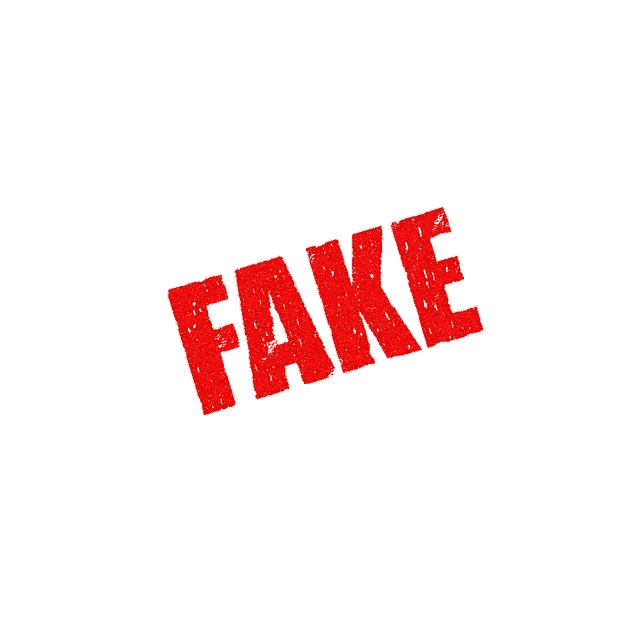
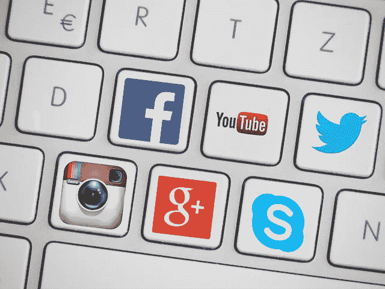
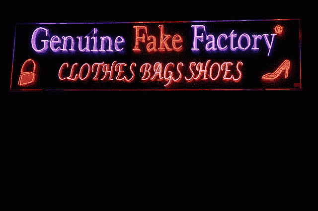

# 造假是新时尚吗？

> 原文：<https://medium.datadriveninvestor.com/is-fake-the-new-fad-29469382c6cd?source=collection_archive---------16----------------------->

Image: Fake Forgery Counterfeit Fraud Imitation False. Source: TheDigitalArtist, Pixabay.com

我终于决定今天早上去健身房。我想我为什么要骗自己，说服自己我要像每年一样努力去健身房，作为新年的决心？当我知道我无意遵守它的时候，给自己一个开始的日期是没有意义的。所以我就去了。我拿了一份本周的《纽约杂志》,随手放在我的工作台面上，这样我就可以一边叫卖一边翻阅文章。当我兜售我的新身体时，我看到了一篇关于互联网的有趣文章，以及它是多么的虚假。这个标题并没有让我感到震惊，今天的新闻中有那么多关于假新闻的内容，我不认为我会阅读任何我还没有意识到的东西。虽然这仍然是真的，但在读完这篇文章后，我确实学到了比我预期的更多的东西。它让我思考我们读到的、听到的和看到的一切。

虽然文章的大部分内容与互联网有关，但我们可以应用到其他领域，这些领域也影响着我们，至少在感觉上是如此。我们听到了太多关于假食品、假约会资料、假公司和假统计数据的事情。我们如何知道我们吃的、喝的或看到的是真实的？我们的生活中有多少被虚假的东西所包围？

Image: Social Media Media Social Facebook Youtube Twitter. Source: Kropekk_pl, Pixabay.com

简单的回答是很多。我们把我们看到的、吃的、喝的东西看得那么真实，以至于一些人和公司通过创造虚假的产品、内容、新闻和数据发了小财，因为他们知道如果这些东西来自我们认为真实的地方或人，我们不会质疑。如果它出版了，你说它是真的，我们为什么不相信你？我们真的在乎它是不是真的吗？大多数人会在乎他们是否为此付出了代价。那么是谁在为假货买单呢？比如公司，公司花的钱越多，就有越多的费用转嫁到我们消费者身上。例如，你知道吗，多年来，YouTube 和脸书通过使用恶意软件来操纵由同一家公司收集的数据，从而利用机器人的行为方式来推广广告空间。根据这篇文章,《纽约时报》今年早些时候曾报道，2013 年，YouTube 上包括点击量和浏览量在内的约一半流量实际上是观看视频和点击广告的机器人，而不是人类。文章接着说，如果这种增长继续下去，YouTube 用来跟踪和检测欺诈活动的相同系统将开始识别真正诚实的人类活动是假活动，假的是真的。他们称之为“*反转点”*为什么这会影响我们？因为公司在广告上花费数百万美元，尤其是网络广告。他们为浏览量和点击量付费，相信他们得到的是真正的人类点击量来浏览和购买他们的产品。公司把广告预算计入运营成本，反过来又影响了卖给我和你这样的人的产品成本。

有些假冒产品，我们甚至在不知道的情况下直接购买。我们知道餐馆供应的大部分鲑鱼都是人工养殖的。事实上，大多数餐馆都诚实地标注农场三文鱼和野生三文鱼。但是你知道吗，养殖鲑鱼并没有我们习惯看到的那种漂亮的粉红色肉色。农场鲑鱼实际上是灰色的，因为人工养殖鲑鱼的饮食。野生鲑鱼以虾和磷虾等甲壳类动物为食，这就是它们呈粉红色的原因。农民将虾青素药片添加到他们养殖的鲑鱼中，这种虾青素来自赋予野生鲑鱼亮粉色的类胡萝卜素。还是三文鱼，虾青素对人体的危害不是特别大。这只是一个额外的步骤，花费了农民很多钱，因为我们喜欢我们的鲑鱼粉。三文鱼是真的，只是颜色是假的。大多数餐馆不会告诉你那部分。虽然野生三文鱼仍然比养殖三文鱼贵，但我们还是会为添加到养殖三文鱼中的粉色额外付费。

我们都听说过“钓鱼”这个词。我们没有犯过捕风捉影的错误，但我们都犯过在这里或那里添加一点过滤器的错误。我们调整灯光，努力捕捉美好的一面。也许我们会试图隐藏一些不想让跟踪我们的人看到的功能。有时我们会贴一张穿着我们最喜欢的衣服的照片，即使我们无处可去。\我们都至少做过一次。但是你知道吗，有影响力的人，那些在社交媒体上有很多追随者的人，并不总是他们看起来的样子。那里有一些服务，收取很少的费用，就可以使用机器人跟踪你。人们会为关注者和喜欢付费。有影响力的人使用各种策略来创造更大的在线存在，这样他们就可以从代言中赚钱。他们发布穿着特定品牌服装或使用某品牌牙齿增白剂的照片。他们因此得到报酬，对吗？不一定。你知道吗，许多有影响力的人会做虚假代言，以哄骗潜在的代言人请他们代言他们的产品。据《大西洋月刊》报道，真正有影响力的人会发布虚假的赞助内容，这些内容看起来像免费的付费内容，以吸引公司为他们的代言付费。是的，假赞助商。

Image: Car Vw Bus Vw Bully Volkswagen Van Camper. Source: OpenClipArt-Vectors, Pixabay.com

一家汽车制造商，大众汽车，因为使用虚假的排放数据在美国和加拿大销售他们的柴油发动机汽车而被查封。他们使用简单的技术来限制汽车空转时的柴油排放量，以进行排放测试。来自西弗吉尼亚大学的一组科学家获得了一笔赠款，用于测试大众柴油发动机汽车在正常行驶条件下的排放，发现排放远远超过了法律要求的限制。接下来的掩盖比最初的欺骗更糟糕，可能会成为一部非常好的电视电影。简而言之，大众汽车被迫支付了数百万美元的罚款，目前仍在从随后的公关灾难中恢复。大众失去了无数忠实的大众客户，他们选择了更省油的柴油发动机，而不是标准的汽油发动机，尽管和解协议提供了“大量补偿”，并回购了近 50 万辆汽车。

Image: Genuine Fake Factory Shop Clothes Bags Shoes. Source: PublicDomainPictures, Pixabay.com

我们可以原谅自己买了我们认为是真的假东西。但是我们买的东西总是因为它是假的。想一想所有那些实际上宣传销售假冒产品的网上商店。假币生意正在蓬勃发展。在背街小巷寻找廉价假冒商品的日子已经一去不复返了。今天，你只需要在网上搜索假冒产品，他们就会送货上门。你可以找到专门销售假冒包、鞋甚至瑞士手表的网上商店。这些产品也不便宜。基本原理是花数百元购买价值数千元的假冒正品，因为它们看起来和感觉上都像真的。这是一个很好的例子，说明你知道你买的是假货，所以你知道为什么你会为它少花很多钱。嗯，至少，我想当有人点击“立即购买”按钮时会这么说。多好的一个办法*把它粘到男人*身上。你买了这个人产品的仿制品，钱却没有到他手里。哦，但是钱还是会从你的口袋里流出，某个不诚实的骗子会从别人的产品中获得可观的利润。有人总是从假货中获利，在某个地方，有人总是它的受害者。

我可以举出无数其他的假东西被当作真东西传播的例子，但我不想被指责制造了假歇斯底里症。我只是想给你一些启发。假的东西在我们周围到处都是，而且不仅仅是假新闻。然而，真正让我恼火的是，即使我们已经知道它可能是假的，我们为什么还要继续购买所有这些假货。让我想知道，假冒是新的时尚吗？