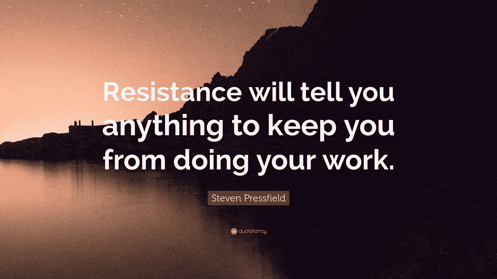

# 恐惧阻止了你发挥潜力吗？

> 原文：<https://medium.datadriveninvestor.com/is-fear-stopping-you-from-reaching-your-potential-2b0fe36257d5?source=collection_archive---------9----------------------->

## 因为它通常会阻止我。

Photo by [Eduardo Sánchez](https://unsplash.com/@eduardoequis?utm_source=medium&utm_medium=referral) on [Unsplash](https://unsplash.com?utm_source=medium&utm_medium=referral)

> “如今变得伟大是如此容易，因为其他人都是弱者。如果你有任何精神上的坚韧，如果你有任何一点自律；不想做，但还是做的能力；如果你能坚持做你讨厌做的事情:另一方面就是伟大。”—大卫·高金斯

[大卫·高金斯](https://theascent.pub/david-goggins-an-inspirational-leader-or-unhappy-fanatic-9eecf920d7f2)是个有趣的家伙。他说话不拐弯抹角。“大家都是弱者。”

好吧，好吧，你到底是怎么想的大卫！？！？

对[感到恐惧是人的本性](https://medium.com/datadriveninvestor/5-self-awareness-tools-that-will-change-your-2019-b6fbedeecc9e)。它被植入我们的大脑和生理。但是恐惧阻止我们做我们应该做的事情。它阻止我们和我们的孩子发挥他们的潜力。我们应该负起责任，一个接一个地面对我们的恐惧。

作为穴居人，当逃跑或战斗的反应袭击我们时，我们要么与老虎搏斗，逃离老虎，要么被老虎吃掉。

 [## 算法诱人的商业逻辑——数据驱动的投资者

### 某些机器行为总是让我感到惊讶。我对他们从自己的成就中学习的能力感到惊讶…

www.datadriveninvestor.com](https://www.datadriveninvestor.com/2019/03/22/the-seductive-business-logic-of-algorithms/) 

# 如何战胜恐惧——停止思考，行动起来。

大脑和身体的生理机能并不知道兴奋和恐惧的区别。

在现代生活中，这种恐惧反应会随时袭击我们。当我们开车时，有人拦住了我们。当我们思考人生的方向，感觉它正在悄悄溜走。当我们想要什么却得不到的时候。当我们赚不到足够的钱时。当我们感觉不受控制的时候。

这时焦虑袭来，我们寻求帮助。

我们倾向于逃避恐惧或焦虑，因为它让我们走出了舒适区，但是成长通常发生在何时何地呢？

作为一名职业运动员，当你穿过它并完成工作时，它就会发生。你挖掘这种情绪，并把它转化为积极的行动和工作。

父母不希望他们的孩子感到害怕，但这真的会在体育、学校或现实生活中帮助他们吗？

难道我们不应该讨论一下恐惧在现代生活中的影响，以及它们看起来像什么，它们是如何表现为焦虑、抑郁和瘫痪的？

# 恐惧的对立力量是勇气。

勇气(对我来说)正在取代恐惧的积极兴奋。它用“我能做到”来代替消极的想法。我会这样做，”咒文。兴奋地对抗恐惧。当你感觉到它来了，握紧你的手，感谢上苍给你一个机会去玩耍，去工作，去交谈，去表达，去窒息，去分享，去做大多数人不会做的事。

我将永远记得 2002 年三月在拉普竞技场举行的疯狂比赛中，我们跑出来观看肯特州立大学对印第安纳精英八人队的比赛。有 30，000 人声嘶力竭地尖叫。他们中的大多数都不是肯特州立大学的球迷(我的学校)。恐惧和紧张突然抓住了我。我记得我惊讶于一个体育馆能容纳这么多的红色和白色。我以前感受过这种恐惧，肾上腺素激增，但这是另一个层面。

这是真正的电。

事实是，我们总是有恐惧——害怕分享，害怕改变，害怕脱离舒适区，害怕发挥自己的潜力，害怕承认离开，害怕转型，害怕破产，等等。

> 竞技体育，就像那场精英八人赛，教会了我:**接受你会感到恐惧，然后果断行动，去做任何你想做的事情。**

Photo by [Oliver Cole](https://unsplash.com/@oliver_photographer?utm_source=medium&utm_medium=referral) on [Unsplash](https://unsplash.com?utm_source=medium&utm_medium=referral)

> *斯坦·比彻姆在《精英头脑**一书中写道:“*恐惧让你无法发挥自己的潜力。战胜恐惧应该是你人生的首要目标。

*NCAA 锦标赛对世界有着不同的吸引力——它是大学篮球的压轴戏——也是体育史上最大、最受关注、最赚钱的体育赛事。然而，我想打大学篮球，向世界展示我有能力在最高水平上实现我的梦想。*

*我坚持我的惯例，闭上眼睛，向上帝祈祷，走上球场，尽我所能。这是你可以开始的地方——知道你尽了最大努力就足够了。尽最大努力总是足够的。做好准备，不要自毁前程。我没有躲在阴影中，而是接受了被称为失败者的命运，接受了媒体称我为失败者的命运，接受了教练、朋友和同龄人对我热爱的这项运动的表现进行评判的命运。*

*请记住，你或你的孩子的最大努力是你所能要求的，然而我们每天都要求吗？*

*不，我们通常会逃避责任。我们表现得很温柔。软弱。我们屈服了。因此，大卫·戈金斯说得有点对——伟大属于一小部分坚持坚韧、自律和勇气的胜利者。*

*我们应该让我们的孩子、我们的员工、我们的朋友和我们爱的人对勇敢、一致和果断的行动负责，以高度的努力迎接我们面前的挑战——保持体形，变得更好，更多地交流，分享，表达，抓住机会，以及变得脆弱。*

> *因为这就是生活——一个巨大的挑战！*

# *你真正的潜力在于对思想的掌控。*

**

*我们的努力和果断行动，去分享、去工作、去战斗、去摔跤、去承认、去跑步、去锻炼、去交流、去倾听、去投资、去储蓄、去做任何有助于你发挥潜力的事情，将会比忽视恐惧更能让你战胜恐惧。*

*如果你容忍恐惧，并让它控制你的生活，它将表现为焦虑、抑郁和未利用的潜力——正如马斯洛总结的那样，将成为你人类最大的不快乐。*

*[战胜恐惧始于意识到恐惧——作为父母、运动员、教练，然后开发工具对抗恐惧并利用它为你服务。挖掘恐惧所代表的情绪，并对战胜恐惧的挑战感到兴奋，你就会开始在生活、创业、商业、企业家精神和体育运动中利用肾上腺素。](https://theascent.pub/3-rules-of-an-unbreakable-you-dbafd9005624)*

**@Trevor_Huffman 是前职业篮球运动员，正面看台中央的撰稿人。打个招呼。**

*他的新播客“赛后”在赛后回顾了这场比赛，他与退役运动员谈论了体育之外的生活。他喜欢旅行，并通过自我意识、勇气、问题和理解人类状况来帮助他人过上更美好的生活。*