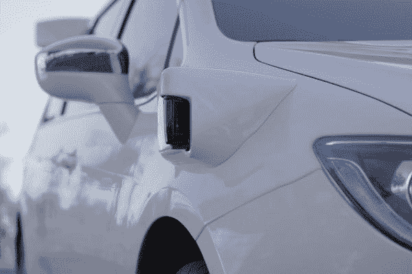
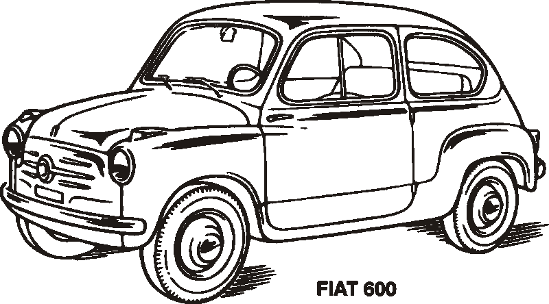
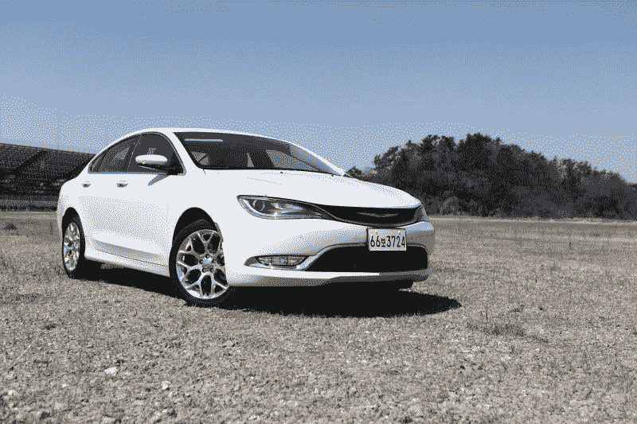
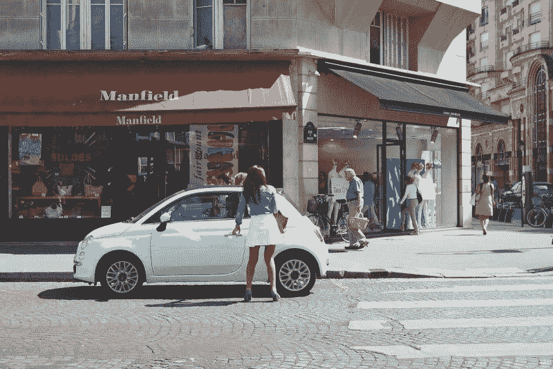
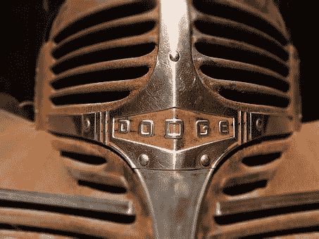

# 菲亚特克莱斯勒是自动驾驶汽车的便宜货吗？—市场疯人院

> 原文：<https://medium.datadriveninvestor.com/is-fiat-chrysler-a-bargain-in-self-driving-cars-market-mad-house-e41bb8d8ca1?source=collection_archive---------7----------------------->

NVA 菲亚特克莱斯勒汽车公司(NYSE: FCAU) 可能是无人驾驶汽车中的便宜货。

为了解释这一点，*TechCrunch*T4 声称，自主克莱斯勒 Pacifica 小型货车在加州运营的第一个月就运送了 6299 名乘客。总体而言，由 **Alphabet(纳斯达克股票代码:GOOG)** 子公司 Waymo 运营的面包车在 2019 年 7 月完成了 4678 次乘客出行。

因此，克莱斯勒 Pacifica 是世界上最成功的自动驾驶汽车。相比之下，**特斯拉汽车公司(纳斯达克股票代码:TSLA)** 自吹自擂的 robotaxi 仍然是埃隆马斯克想象中的虚构人物。马斯克[希望](https://www.vanityfair.com/news/2019/04/elon-musk-robot-taxis-replace-uber-and-lyft)明年让特斯拉机器人轴车队上路。

[Waymo](https://waymo.com/journey/) 现在街上有一支克莱斯勒 Pacifica 自动驾驶出租车车队。为了澄清，Waymo 正在圣何塞的几个郊区测试自动出租车服务。 [Waymo](https://marketmadhouse.com/alphabets-waymo-one-self-driving-taxis-hit-the-road-with-drivers/) 已经在凤凰城地区测试自动驾驶出租车近一年了。

# 特斯拉 vs 菲亚特克莱斯勒

因此，菲亚特克莱斯勒可能是自动驾驶汽车的价值投资，因为其股票在 2019 年 9 月 26 日的交易价格为 12.98 美元。相比之下，特斯拉股票当天的交易价格为 242.56 美元。

重要的是，菲亚特克莱斯勒赚钱，而特斯拉报告亏损。菲亚特克莱斯勒报告称，2019 年 3 月 31 日的毛利为 29.88 亿美元，收入为 244.81 亿美元。此外，菲亚特克莱斯勒公司报告 2019 年 3 月 31 日的净收入为 6.14 亿美元。

与此同时，特斯拉公司(Tesla Inc .)报告称，2019 年 6 月 30 日的毛利为 9.2105 亿美元，收入为 63.49 亿美元。然而，特斯拉在同一天报告了 4.0833 亿美元的净亏损。

# 特斯拉在产生现金吗？

有趣的是，特斯拉在截至 2019 年 6 月 30 日的季度产生了一些现金。详细来看，特斯拉报告的运营现金流为 8.6361 亿美元，融资现金流为 21.43 亿美元，自由现金流为 5.9573 亿美元。

相比之下，2019 年 3 月 31 日，菲亚特克莱斯勒报告的营业现金流为 2.81 亿美元，负融资现金流为-8.11 亿美元，负现金流为-12.65 亿美元。因此，特斯拉正在产生一些现金，而菲亚特克莱斯勒正在烧钱。

有趣的是，菲亚特克莱斯勒在 2019 年 3 月 31 日仍有一些现金剩余。FCAU 报告的现金及等价物为 131.51 亿美元，短期投资为 6.6172 亿美元。与此同时，特斯拉在 2019 年 6 月 30 日报告了 50.83 亿美元的现金和等价物。

# 特斯拉比菲亚特克莱斯勒做得好吗？

因此，特斯拉在现金产出方面比菲亚特克莱斯勒做得更好。我认为这证明了埃隆·马斯克的预购汽车商业模式的部分合理性。

此外，特斯拉正在大幅增长。Stockrow 估计，截至 2019 年 6 月 30 日的季度，特斯拉的收入增长率为 58.65%。相比之下，Stockrow 在截至 2019 年 3 月 31 日的季度中给予菲亚特克莱斯勒 4.87%的负收入增长率。

特斯拉目前正在经历一些惊人的销售增长。 *CleanTechnica* [估计](https://cleantechnica.com/2019/09/20/tesla-model-3-is-1-best-selling-vehicle-in-norway-3-in-netherlands-7-in-switzerland-cleantechnica-report/)特斯拉的经济型汽车 Model 3 是挪威最畅销的汽车；2019 年 1 月至 8 月，荷兰第三大畅销车型，瑞士第七大畅销车型。

具体来说，同期特斯拉在挪威售出了 11，517 辆 Model 3 汽车，在荷兰售出了 7，823 辆 Model 3 轿车，在瑞士售出了 2，871 辆 Model 3 杂货车。因此，特斯拉证明了普通人也有电动汽车的市场。

然而，特斯拉在汽车行业仍然是一个小角色。Statista [估计](https://www.statista.com/statistics/502208/tesla-quarterly-vehicle-deliveries/)特斯拉在 2019 年第二季度全球销售了 95，200 辆汽车。相比之下，Statista [计算出](https://www.statista.com/statistics/239964/chrysler-groups-vehicle-sales-in-the-united-states-by-segment/)菲亚特克莱斯勒 2019 年第一季度在美国销售了 60 万辆汽车。

相比之下，菲亚特克莱斯勒 2018 年在美国销售了 223.5 万辆汽车，2019 年前六个月在美国销售了 109.6 万辆汽车，菲亚特克莱斯勒权威[估计](http://fcauthority.com/fiat-chrysler-automobiles/fiat-chrysler-automobiles-sales-numbers/)。因此，特斯拉在国外是一个成功的利基参与者。

# 电动汽车有市场吗？

特斯拉的成功证明了电动汽车是有市场的。作为回应，菲亚特克莱斯勒正在意大利测试车联网(V2G)技术。

在 V2G 中，它们将汽车电池的电力输入电网。例如，你可以用汽车电池给你的房子供电。菲亚特克莱斯勒计划与意大利公用事业公司 Terna 一起测试多达 700 辆 V2G 汽车，*汽车新闻欧洲* [报道](https://europe.autonews.com/automakers/fiat-chrysler-test-vehicle-grid-technology-italy)。V2G 的用途可能包括为工地上的电动工具供电。

此外，菲亚特将于明年在意大利生产菲亚特 500 掀背车的全电动版本。然而，菲亚特将于明年停止在美国销售 500，*福布斯* [透露](https://marketmadhouse.com/is-fiat-chrysler-a-bargain-in-self-driving-cars/#d183fbc7b1fa)。相反，菲亚特将在美国市场推出一款 500X 跨界车。然而，目前还没有电动 500X 的计划。

# 无人机攻击会助推电动汽车吗？

我认为，由于 9 月 14 日沙特阿拉伯的无人机袭击，电动汽车市场可能会增长。彭博[估计，无人机摧毁了两个加工厂，使沙特的石油日产量减少了 570 万桶。因此，无人机对世界石油供应造成了有史以来最大的一次破坏。](https://www.business-standard.com/article/international/saudi-drone-attack-where-are-we-a-week-on-and-what-happens-next-119092100162_1.html)

此外,[无人机](https://marketmadhouse.com/is-america-defenseless-against-drone-attacks/)证明了像美国和沙特阿拉伯这样的大规模军事力量无法保护世界石油供应免受破坏。例如，沙特阿拉伯的 313 架战斗机和 122 组防空导弹没能阻止无人机的袭击。因此，无人机袭击成了埃隆·马斯克的一天。

因此，全世界数百万人将会得到这样的信息:如果我想开车，我需要一辆电动车。此外，人们还会收到这样的信息:“我需要一辆电动车去上班，去杂货店买东西来养家糊口。”

美国和伊朗之间的战争恐慌只会增加这种恐惧。比如，伊朗及其盟友可以发动更多无人机袭击，向美国及其盟友展示战争的代价有多大。

# 福特电动汽车如何威胁菲亚特克莱斯勒

这种战争恐惧对菲亚特克莱斯勒是一种威胁，因为它没有电动皮卡。菲亚特克莱斯勒的 Ram 皮卡是该公司在美国最畅销的车型。

Ram 1500 现在是美国第二大畅销皮卡，销量超过通用汽车(纽约证券交易所代码:GM) 雪佛兰 Silverado。 *CarBuzz* [估计](https://carbuzz.com/news/ram-1500-defeats-chevrolet-silverado-as-second-best-selling-truck)菲亚特克莱斯勒在 2019 年第一季度销售了 120，026 辆公羊，而通用汽车销售了 114，313 辆 Silverados。

Ram 1500 甚至威胁到皮卡领域的领头羊**福特的**看似不可战胜的 F150 的销量。 *CarBuzz* [估计](https://carbuzz.com/news/ram-is-so-successful-it-s-approaching-f-150-sales-figures) FCA 在 2019 年 6 月售出了 68，098 辆公羊，而 F150s 的销量为 71，500 辆。值得注意的是，Ram 1500 的销量在 2019 年 6 月增长了 56%， *Carbuzz* 声称。

高油价；以及对汽油短缺的担忧，可能会威胁到 Ram 的成功，因为 FCA 没有电动皮卡。与此同时，Electrek [声称，福特计划在 2022 年前将全电动 F150 推向市场。](https://electrek.co/2019/09/02/fordl-electric-f150-market-2022/)

重要的是，电动 F150 的原型已经存在。福特播放了电动 F150 牵引轨道车的视频，据称轨道车重达 100 万吨。此外，福特向 Rivian 投资了 5 亿美元，Rivian 是一家小型制造商，计划明年推出一款电动皮卡。

另外，**亚马逊(NASDAQ: AMZN)** 计划到 2030 年从 Rivian 订购 10 万辆电动送货车， *TechCrunch* [报道](https://techcrunch.com/2019/09/19/amazon-orders-100k-electric-delivery-trucks-from-rivian-as-part-of-going-carbon-neutral-by-2040/)。有趣的是，Rivian 送货车的图像看起来很像福特全顺车。

因此，当公众担心汽油短缺时，克莱斯勒可能会以其一些最畅销产品的电动版本，货车和皮卡来面对竞争对手。

# 克莱斯勒是价值投资吗？

目前，我认为克莱斯勒是一个潜在的价值投资，因为它与 Alphabet(NASDAQ:GOOGL)way mo 结盟。我认为自动驾驶出租车可能是一个大生意，菲亚特克莱斯勒和 Waymo 在这个市场上处于领先地位。

然而，菲亚特克莱斯勒公司依赖另一家公司的自动驾驶汽车技术。值得注意的是，菲亚特克莱斯勒不会从 Waymo 的自动驾驶实验中获得最有价值的副产品数据。相反，数据将留在 Alphabet 中。

相比之下，福特和 Autonomic 正在建立一个交通移动云，以收集自动驾驶汽车的数据，*市场疯人院* [报道](https://marketmadhouse.com/will-ford-motor-f-make-money-from-self-driving-cars/)。因此，福特可以出售其自动驾驶汽车测试的数据，而克莱斯勒只提供货车。相反，Alphabet 从数据中赚钱。

总之，我认为**福特**比菲亚特克莱斯勒有更好的商业模式。因此，我认为自动驾驶汽车和电动汽车是更好的价值投资，因为它比 FCAU 便宜，而且有股息。

目前，菲亚特克莱斯勒不支付定期股息，而福特在 2019 年 9 月 26 日支付了每股 9.14 美元的 15₵股息。因此，我认为菲亚特克莱斯勒汽车公司和特斯拉汽车公司是高风险的投机股票，而福特是自动驾驶汽车的价值投资。我建议投资者远离菲亚特克莱斯勒和特斯拉。

*原载于 2019 年 9 月 27 日*[*https://marketmadhouse.com*](https://marketmadhouse.com/is-fiat-chrysler-a-bargain-in-self-driving-cars/)*。*