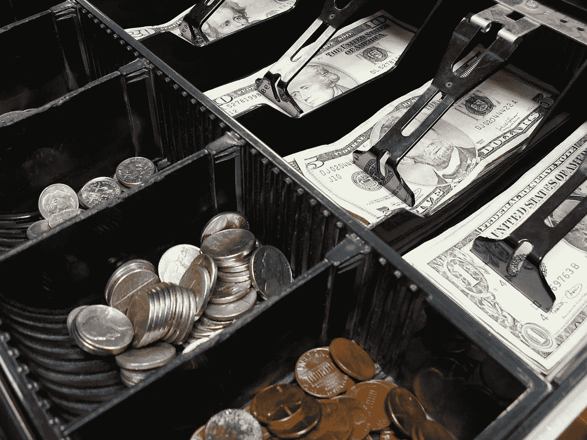
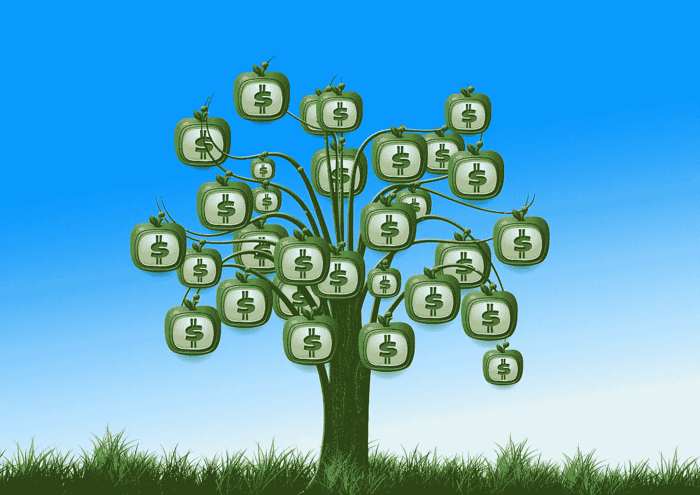

# 浮动是财富积累的关键吗？

> 原文：<https://medium.datadriveninvestor.com/is-float-the-key-to-wealth-building-82c03d5ce076?source=collection_archive---------1----------------------->

沃伦巴菲特(Warren Buffett)称之为浮动的一个简单想法可能是积累财富的关键。

事实上，浮动是巴菲特在他购买的公司和股票中寻找的主要特征之一。此外，许多观察家认为巴菲特建立了他的 817.5 亿美元的伯克希尔哈撒韦公司(纽约证券交易所代码:BRK。B) 运势随浮。

 [## 算法交易的机器学习|数据驱动的投资者

### 当你的一个朋友在脸书上传你的新海滩照，平台建议给你的脸加上标签，这是…

www.datadriveninvestor.com](https://www.datadriveninvestor.com/2019/01/30/machine-learning-for-stock-market-investing/) 

因此，很好地理解浮存和它是如何工作的可以帮助你从股票中赚钱。那么什么是浮动，它是如何工作的呢？

# **什么是浮动？**

按照巴菲特的定义，浮存金是客户通过定期向公司认购或支付溢价而创造的现金流。

例如，**亚马逊(NASDAQ: AMZN)** 每次用户支付 12.99 美元的 Prime 会员费，就会收到 float。此外，**伯克希尔哈撒韦公司(纽约证券交易所代码:BRK。当 1700 万人每月支付保险费时，A** 从其 GEICO 子公司获得浮动资金。

GEICO 产生浮存金是因为如果客户想要汽车保险，他们必须支付保险费。重要的是，在美国 50 个州中的 49 个州，没有汽车保险开车是违法的。

特别是，GEICO 在 2019 年第一季度为伯克希尔创造了 3.89 亿美元的收入， *Insurance Journal* [估计](https://www.insurancejournal.com/news/national/2019/05/07/525650.htm)。然而，GEICO 只是伯克希尔的浮存金保险投资之一。事实上，2019 年第一季度，伯克希尔·哈撒韦公司的保险投资收益增长了 22.2%，达到 12 亿美元。

# **巴菲特为什么要浮存？**

伯克希尔·哈撒韦公司的投资组合充满了可浮存的股票和公司，*解放的股票交易员* [报道](https://www.liberatedstocktrader.com/what-companies-does-warren-buffett-own/)。

例如，**苹果(纳斯达克股票代码:AAPL)** 从超过 6000 万的苹果音乐订阅中收获浮存，占伯克希尔 2019 年第一季度股票持有量的 9.5%。此外，包括 Gen Re 和伯克希尔哈撒韦能源公司在内的许多伯克希尔子公司都产生了浮存金。

通用再保险公司通过支持或资助保险公司来实现浮存。与此同时，伯克希尔·哈撒韦能源公用事业公司；像 NV 能源和北方电网，向客户收取月租费。如果顾客需要电力，他们必须支付电费。

沃伦叔叔想要所有的浮存金，因为这是他的公司可以立即利用的现金流。因此，伯克希尔的子公司通常有现金支付账单、弥补开支或扩张。此外，伯克希尔子公司通常可以借到钱，因为他们有现金。

# **浮现现金**

巴菲特喜欢浮存，因为浮存就是现金。本质上，一个产生浮存的公司，产生现金。

更重要的是，该公司定期产生现金。例如，GEICO 每月收取保费，亚马逊每月收取 Prime 订阅费。

因此，GEICO 和亚马逊每个月都有一些现金收入。两家公司在其生态系统中没有现金的可能性很小。

# **为什么你的投资组合需要浮存金**

因此，产生浮存金的公司总是有现金支付股息。值得注意的是，苹果公司于 2019 年 5 月 16 日支付了 77₵股息。令人印象深刻的是，苹果在 2019 年 3 月 31 日拥有 800.9 亿美元的现金和短期投资。

*“不一定要做不平凡的事才能得到不平凡的结果。”——*股神巴菲特，来源[*解放了的股票交易员*](https://www.liberatedstocktrader.com/warren-buffet-quotes-explained/) *。*

因此，现金是财富最重要的钥匙之一。巴菲特的哲学是，如果你没有现金，你就不能赚钱。因此，伯克希尔·哈撒韦公司在 2019 年 3 月 31 日拥有 1141.7 亿美元的现金和短期投资。

总之，浮存是巴菲特能教给投资者的最重要的概念。如果你明白什么是浮存，你就能理解巴菲特的投资哲学。