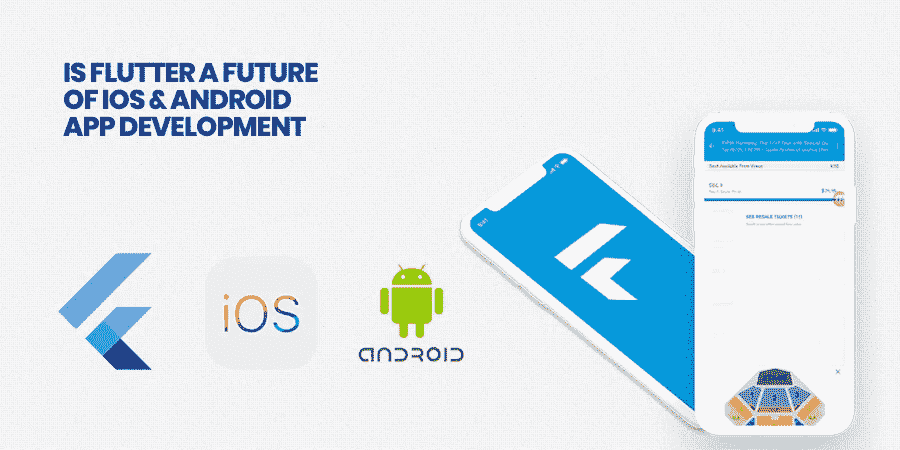
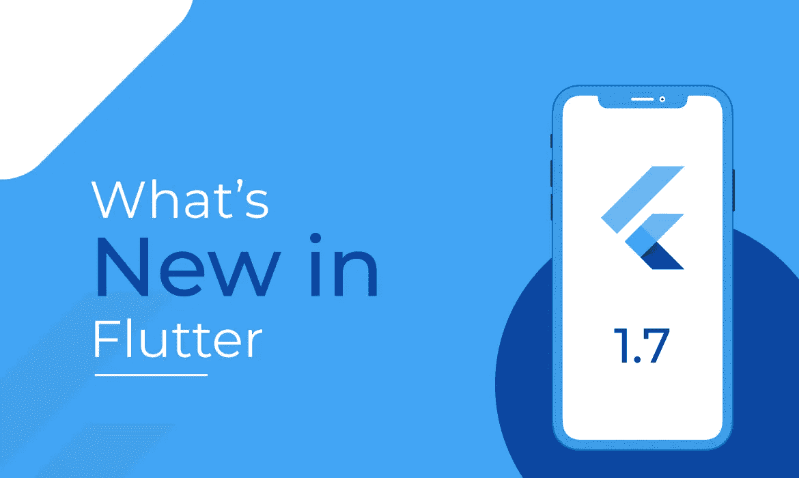
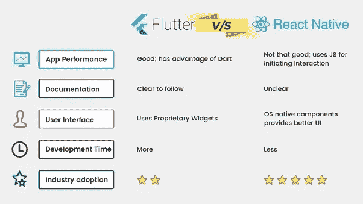
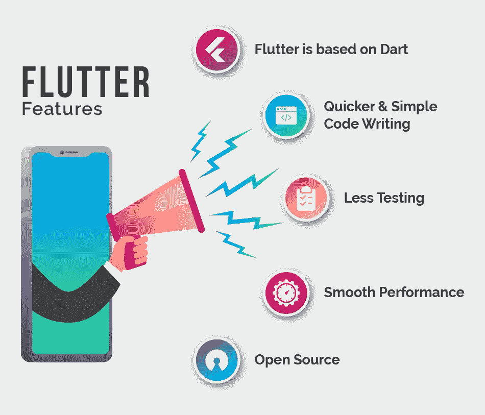
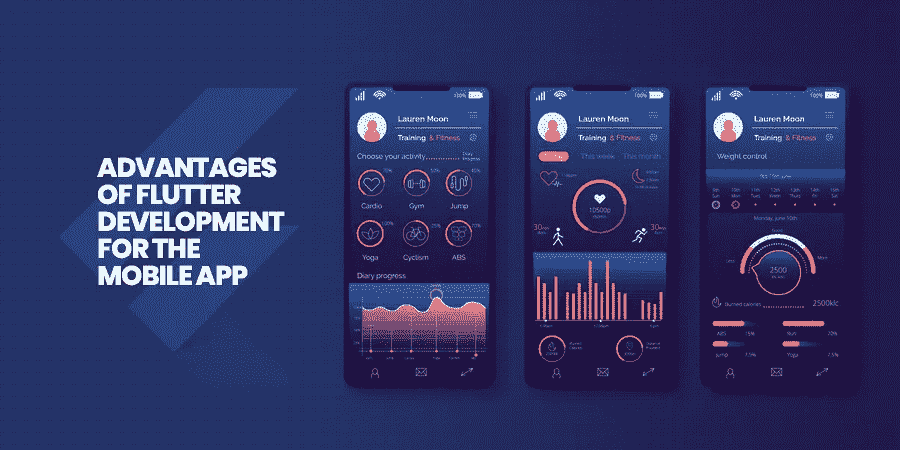
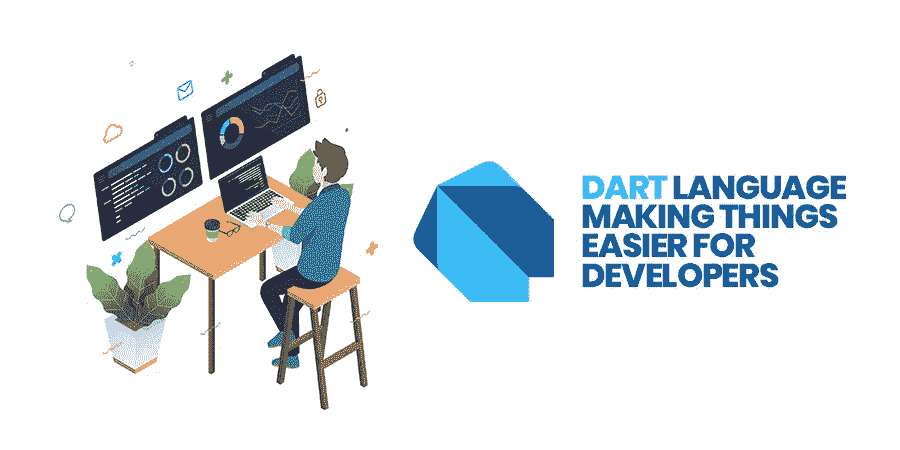
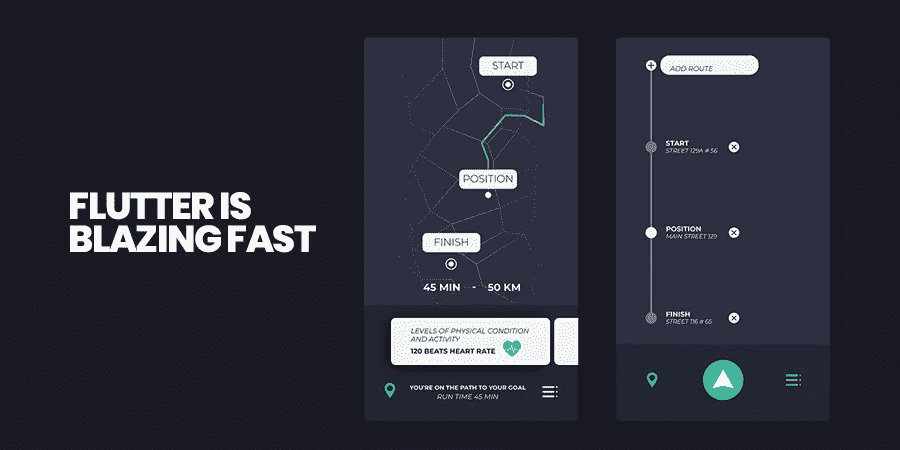
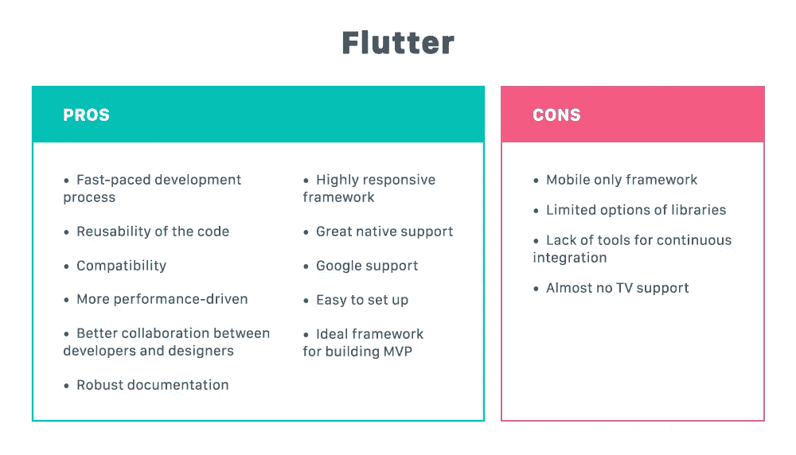
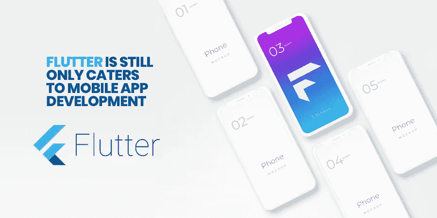

# Flutter 是 iOS 和 Android 应用开发的未来吗？

> 原文：<https://medium.datadriveninvestor.com/is-flutter-a-future-of-ios-and-android-app-development-2e762b482f66?source=collection_archive---------1----------------------->

对于应用开发者来说，转向 Flutter 真的是个好主意吗？为什么不呢……毕竟，Flutter 是谷歌的宝贝。

> **Google 2019 为 Flutter 投入了大量的注意力，相信我，这对 Android 和 iPhone 应用程序开发者来说是一个完美的微风。**

Xamarin、PhoneGap、React Native——但现在是 Flutter 一枝独秀的时候了。凭借其强大的功能和跨平台性能，Flutter 迅速成为领先移动应用开发框架的一部分。Flutter 由于其开源的特性，为你提供了一个灵活的框架来开发一个完美的移动应用程序，这一切都将在商业的海洋中掀起波澜。

 [## 2019 年移动应用开发之路|数据驱动的投资者

### 任何在移动应用程序开发行业工作的人，无论他们是专注于在伦敦开发 iOS 应用程序还是…

www.datadriveninvestor.com](https://www.datadriveninvestor.com/2019/01/15/the-path-of-mobile-app-development-in-2019/) 

虽然跨平台应用已经存在多年，但 Flutter 是第一个能够正确管理这些东西的应用。谷歌最近关于这项令人难以置信的技术的声明简直令人瞠目结舌。

*   *市场上不再有蜂鸟存在。谷歌已经为 web 发布了旋舞* *的* [*预览版，称为旋舞 Web。而*](https://codeburst.io/quick-start-flutter-for-web-on-windows-ef666870217e) [*《纽约时报》益智游戏*](https://www.nytimes.com/games/prototype/kenken#/) *就是旋舞 Web 的完美例子。*
*   *谷歌发布* [*旋舞 1.7*](https://github.com/flutter/flutter/wiki/Release-Notes-Flutter-1.7.8) *重大改进。*
*   *最新的 Flutter 版本集成了对构建 Chrome OS 应用的支持。*
*   *Google 发布了* [*Dart 2.3，新增了对 UI-as-Code*](https://medium.com/dartlang/announcing-dart-2-3-optimized-for-building-user-interfaces-e84919ca1dff) *特性的支持。*

Flutter 的产品经理 Tim Sneath 也对 Flutter 在 2019 年宣布的所有重大更新进行了汇总。与此同时，人们注意到，在 Google Play 上推出的 Flutter 应用程序的数量将继续增加。

无论移动应用开发者是否决定使用它，Flutter 正迅速成为他们的热门话题。如果你想开发或提高你的应用程序的性能，你应该知道 Flutter 是什么，它带来的好处和风险，以及这个框架在 it 领域的未来。

# **颤振——新手和专家入门**

[*图片来源*](https://kodytechnolab.com/img/blog/big/release-notes-flutter-1-7.jpg)

*据产品经理“蒂姆·斯内思”称，去年 12 月 4 日是谷歌发布 Flutter 1.0 的日子。*谷歌利用同一事件推出了蜂鸟，这是一个新项目，专注于将 Flutter 应用程序带到网络上，运行在相同的代码上。

在采用这种变革性技术之前， [**移动应用程序开发**](https://www.xicom.ae/services/mobile-app-development/) 团队必须有一个关于 *Flutter 的问题，即“它与 Xamarin、React、Native 或 ionic 有何不同？”迈向这个新框架背后的逻辑是什么？*

如果你非常熟悉混合和跨平台开发，那么这是一个值得向 Flutter 团队询问的问题。虽然我们无意在各种其他技术上推广 Flutter，但我们的简单目标是让您了解 Flutter 的各种特性。

以防万一，如果你还不知道 Flutter， **Flutter 是一个开源、跨平台的移动 SDK，也是许多 Android 应用程序开发团队使用相同源代码管理应用程序的技术新兴平台。** Flutter 的出现由来已久，但自从 2018 年谷歌公布了 Flutter 的发布预览后，它才开始流行起来。在那一刻，你可以认为 Flutter 就像 React Native 一样集成了对原生特性的全面支持。

# **Flutter 与 React Native 有何不同？**

很多人都相信这个事实，Flutter 是谷歌对脸书 React Native 最强有力的回应。在某个地方，我部分同意这个事实，这根本不是对脸书的答复或本土的反应。事实是， **Flutter 没有使用任何互联网上最流行的技术栈**。然而，React Native 正在使用包括 HTML、CSS、JavaScript 在内的各种语言来支持他们的流程。**Flutter 和 React Native 的基本区别在于，Flutter 关注的是单一的代码库。** **这种单一的代码库通常是接入开发安卓** [**iOS 应用**](https://www.xicom.ae/services/iphone-app-development/) **的。**因此，这个单一的代码库不能用于 JavaScript、Swift、C++和其他。

[*图片 Via Quora*](https://qphs.fs.quoracdn.net/main-qimg-915d6406a2d5dab2cd165a84afd5c941)

如果你想了解更多关于 Flutter 的知识，你可以进一步阅读来了解这个框架的优缺点。

[*图片来源*](https://www.iglobsyn.com/wp-content/uploads/2019/08/Flutter-Features.png)

# ***为什么会飘起？Flutter 的哪些关键特性使其成为 2019 年 web 应用开发者的首选…***

## **颤振 App 开发关键特性亮点:**

和其他的一样，Flutter 也是一个开源的 app 开发框架，当然，它是免费的。

它基于面向对象的编程语言，也称为 Dart 编程语言。这是新的，但很容易学习，并以可承受的价格开始。

Flutter 还有一个名为 Hot Reload 的自动重新加载功能，允许开发人员查看实时变化，并使他们能够在短时间内开发出高质量的应用程序。

Flutter 开发的应用程序不仅看起来很棒，而且还能提供出色的用户体验。

## **手机 App 开发 Flutter 的优势**

从一个[移动应用开发者](https://www.xicom.ae/services/mobile-app-developers/)的角度来看，Flutter 受欢迎的基本原因是它以最低的成本加快了应用开发过程，并使您的团队能够开发出具有流畅动画的漂亮应用 UI。让我们更深入地了解一下。为了让你做出自信的决定，我们制作了下面的列表。

> **“我已经用跨平台工具构建了应用程序，然后用户想要一些只属于原生平台的附加功能。你重新开始吗？你是否花了很多时间试图创建一个看起来更本地的平台？当您这样做时，成本很容易就会超过多个本机应用程序的成本。”**

根据 Club Pro Card 联合创始人华莱士·麦克卢尔的说法。

希望每个人都想在他们的整个工作生涯中跳过这一场景。如果你也准备好实现一个兼容的移动应用框架，那么当 Flutter 可以轻松满足你不断增长的应用开发需求时，为什么还要到处寻找呢…

## **无限制的跨平台访问保证了开发者的流畅表现！**

毫不奇怪，Flutter 克服了跨平台的标准限制，满足了移动行业的模糊需求。现在，开发人员可以利用 Flutter 的新方法，提供比原生应用程序更丰富的用户体验。

有了 Flutter，你不仅拥有“一次编写”的优势，还可以在 iOS 和 Android 上提供完整的原生性能。最吸引人的部分是，它克服了其他跨平台带来的最传统的挑战，包括耗时的代码编写、多重测试、有限的设计和一般的用户体验。

## **两个应用程序的单一代码库**

减少为每个应用程序编写不同代码的麻烦！有了 Flutter，开发者可以为你的两个应用程序使用一个代码库，涵盖 iOS 和 Android 平台。

虽然 Flutter 有自己的小部件和设计，但你可以在两个平台上使用相同的应用程序。最重要的一点是，如果你想让你的应用与众不同 Flutter 可以做到！

## **Dart 语言让开发者更容易**

毫无疑问，即使在 Java 8 发布之后，Java 也在显示它的老态。另一方面，Dart 借用了很多其他语言最流行的特性，而又不失对 Java 或类似语言的熟悉。Dart 语言是通过牢记开发人员的基本任务并使事情变得毫不费力而开发出来的。

> **毕竟，“程序最重要的属性是它是否完成了用户的意图。”**
> 
> ― **C.A.R .霍尔**

**来一段** [**镖语之旅**](https://hackernoon.com/why-flutter-uses-dart-dd635a054ebf) **更好的理解！**

## **飘起如火如荼**

Flutter 更快的开发周期使其成为移动应用开发者的首选。你会惊讶地发现，开发者最快可以在 25 秒内完成开发。此外，这个框架的热重载特性加快了编译过程。

此外，你不需要花很长时间去纠正，它可以在一瞬间反映出来。应用程序的平稳运行不会受到干扰。

## **具有增强用户界面功能的定制部件**

Flutter 是一个面向对象的框架，用于开发各种 UI 特性。因此，像脚手架、应用程序栏和从字体到按钮的任何东西都可以很容易地构建不同的布局。

将一个小部件包装在另一个小部件中以支持功能组合是很简单的。Flutter 确保出色的用户体验，无论你用什么平台运行应用程序都没关系。

## **Firebase 独家支持**

有了 firebase 的广泛支持，移动应用程序开发人员可以在短时间内启动他们的移动应用程序。包括云存储在内的 Flutter 的一些功能只是让它变得更好。

firebase 的快速服务器配置可以为您节省大量时间和资源，因为您不再需要构建后端。此外，很容易将它与自动化开发工具结合起来，并释放像浪子这样的方法，它提供连续交付。

## **更少的测试，更少的工作量**

通过选择雇佣一个 Flutter 开发者来开发移动应用，你可以用更少的测试得到更好的最终产品。当两个不同的框架有相同的应用程序时，自然减少了进行更多测试的需要。

这可以在不影响质量和节省时间的情况下加快程序。Flutter 提供的单一代码库可能只需要运行一次自动测试。最后，更少的测试意味着更少的工作要处理！

[*图片来源*](https://www.dashbouquet.com/static/5ff60578b9e8ec96dfa5de2218e0e926/1a3b4/flutter-pros-cons.jpg)

# **弊端？**

该框架还很年轻，仍处于成长和发展阶段，因此 toolkit 还存在一些缺陷。除此之外，没有一个框架是完美无缺的。然而，在你考虑转换到 Flutter 之前，这里有几个你应该考虑的…

## **Flutter 仍然只迎合移动应用开发**

Web 应用程序开发仍然无法使用 Flutter。当您选择要使用的技术堆栈时，这会影响您的决策。如果你想要最大化设备灵活性，那么 Flutter 将不会是只适合你的 iOS 和 [**Android 应用开发**](https://www.xicom.ae/services/android-app-development/) 需求的框架。

## **框架文件非常大**

使用 Flutter，开发人员需要浏览大量文件来减小应用程序的大小。用户已经限制了手机的存储空间，并且用户总是欢迎那些在他们的手机中积累更少空间的应用。

为了压缩应用程序的大小，创作者通常会避免动画，压缩图像，并尽量减少包和库的数量。

## **第三方库——令人印象深刻，但仍然不够**

第三方库是指开源的、经过预先测试的、容易获得的库，在软件开发过程自动化中发挥着重要作用。在大多数领先和流行的技术中，获得所需的包是很容易的。

不过，Flutter 是最近才推出的移动开发 app，所以搜索免费包和库并不容易。放心吧！它的官方资源包仍在改进，工具列表也在增加。

# **结论**

如果你一直在寻找一个移动应用程序开发框架，它有一个温和的学习曲线，高性能，良好的可访问性，现成的定制部件，即时更新，那么 flutter 就是你的选择。

虽然开发人员经常需要在质量和生产率方面做出妥协，但谷歌正在为跨平台开发的未来铺平道路，并将为 iOS 和 Android 使用两个独立应用程序的风险降至最低。Flutter 是专门为弥补这一差距而设计的，主要关注本机性能、复杂的视觉效果和工作效率。

如果您对该应用程序如何工作以及是否易于访问感到困惑，那么您可以与我们联系。我们将确保跨平台开发完美而高效地为您的业务服务。