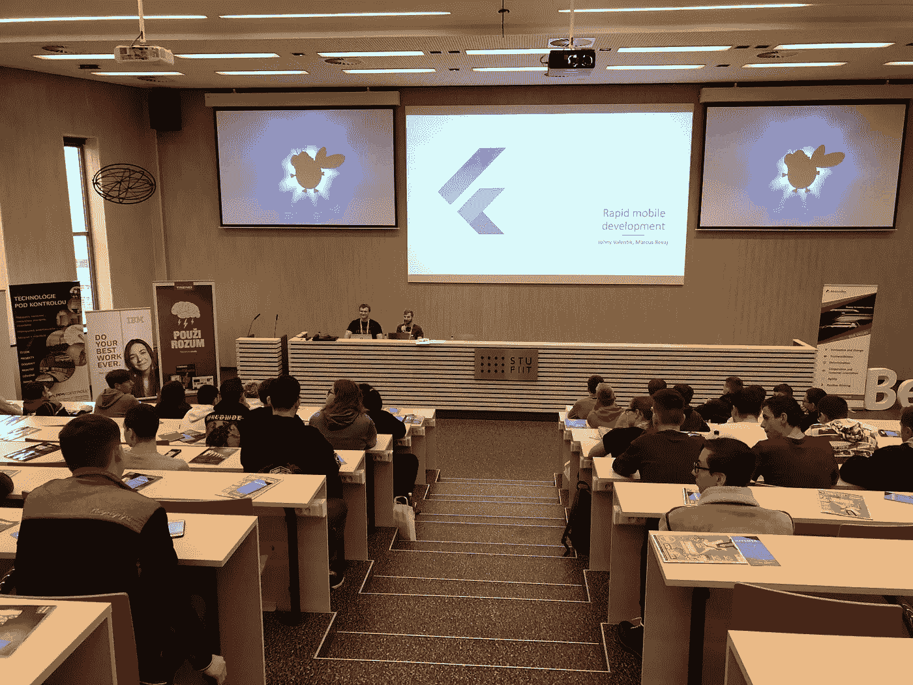

# 即使对孩子来说，颤振也很容易吗？

> 原文：<https://medium.datadriveninvestor.com/is-flutter-easy-even-for-kids-6e243efa0fe2?source=collection_archive---------2----------------------->

So, lets talk about Flutter :)

几周前，我和我的同事有机会为高中生准备了两个工作坊。我很快就同意了，我的大脑已经充满了想法，我可以告诉聪明的年轻人，这将使他们踏上知识之旅，并产生对计算机科学的渴望。

然后我突然想到。

> 如果我们使用 Flutter 呢？

它结合了两个方面，这将是我们激发孩子积极性的最佳选择。

 [## 数据科学和软件工程哪个更有前途？数据驱动的投资者

### 大约一个月前，当我坐在咖啡馆里为一个客户开发网站时，我发现了这个女人…

www.datadriveninvestor.com](https://www.datadriveninvestor.com/2019/01/23/which-is-more-promising-data-science-or-software-engineering/) 

他们可以创建移动应用程序，不仅为他们的设备，也为他们的朋友，他们可能有不同的品牌(android / iOS)。

他们可以轻而易举地创建应用程序。你们中的一些人可能不同意我的观点，但是的，我真的认为用 flutter 编写应用程序很简单。肯定比 Java/Kotlin ( android)或 Swift (iOS)简单得多，并且在概念上更容易理解为 web 开发。

> 就这样决定了。我们要和 Flutter 一起去！耶！

于是我们拼凑了一个小描述，将讲座集命名为“快速移动开发”。

几天后，我们收到了组织者的电子邮件，说“嘿，伙计们，我们有 40 名学生报名参加第一场，70 名学生报名参加第二场，所以我们将在大礼堂推你。”

哦，哇，这是意想不到的。我们希望得到一些孩子，但我们在会议中得到一半的学生(这不是一个大会议，虽然:D)。这激励着我们去做一场完美的演讲，让每个人都能从中受益。

日子过得飞快，我们为现场编码进行了数小时的训练，为了不漏掉重要的部分，并把我们的悬崖笔记放在一起，所以表演是完美的。D 日到了，我们坐在礼堂里，等待第一堂课开始，我们可以看到学生进来。

第一堂课旨在教授构建 UI 的基础知识。因此，我们开始添加一些文本，修改字体，添加图像，摆弄栏，对齐，间距，在 15 分钟内，我们有一个工作的移动简历应用程序。它没有做太多，它只是一个屏幕应用程序，但当你看着观众时，你可以看到眼睛盯着屏幕看。

> 那表情，那是在说，哇，我该怎么做？我想这么做！

当我们来到问答部分时，从观众那里引出问题有点困难。他们年轻，害羞，不想站在聚光灯下。但是，在我和我的同事回答了一些我们认为学生可能会问的问题(为了缓和气氛，可以装傻)之后，我看到有人举手了。从那一刻起，我们开始了一个伟大的问答，围绕移动应用的概念，如何部署它们，我们可以用它们来构建什么，我们在这里没有看到什么，以及一些深入的问题。

甚至在讲座结束后，孩子们来到小组，获取更多信息，他们应该从哪里开始，如何开始，它是否比 Swift 或 Kotlin 更好，为什么他们应该使用它？

如果让我用语言来表达我的感受，它会是这样的:

> “看起来很酷！从哪里可以学到？看起来好轻松！”

那太棒了，但是我仍然有点害怕第二次演讲，因为它在不同的层面上。我们试图解释一个真正的移动应用程序的构建模块，比如路由、使用来自 pub.dev 的包、通过 http 请求获取数据，但是我似乎毫无理由地害怕。

这种趋势从第一次讲座开始延续，参加第一次讲座的孩子们希望从问答环节获得更多的知识。

当然，我们会看到一些困惑的面孔，但是想象一下，在这个讲座之前，我们正在向具有最少 CS(计算机科学)知识的孩子们展示一些完全陌生和新的东西(甚至是概念上的，不谈论框架)。

总结整个经历。颤振在概念上很容易理解，甚至对高中生来说，可以教他们与最小的努力。这很酷，所以它本身就是对孩子们的激励。

我认为，应该教给他们，因为这种语言结构优美，易于理解，利用了大多数现代最佳实践。

因此，如果你是一个颤振爱好者，你想给你的社区带来一点价值，尝试传播知识。

如果你有可以在家教的人，那就去吧。如果你有机会参加讲座，向他们展示，有更容易和更好的方法来构建应用程序。

不一定要痛苦和恐惧。

**任何人都能学会。**

我向你保证，他们会倾听并心存感激:)

_________________________________________________________________

**PS:** 如果你不知道什么是 flutter 或者它能做什么，直接去 [https://flutter.dev](https://flutter.dev) 看看吧:)