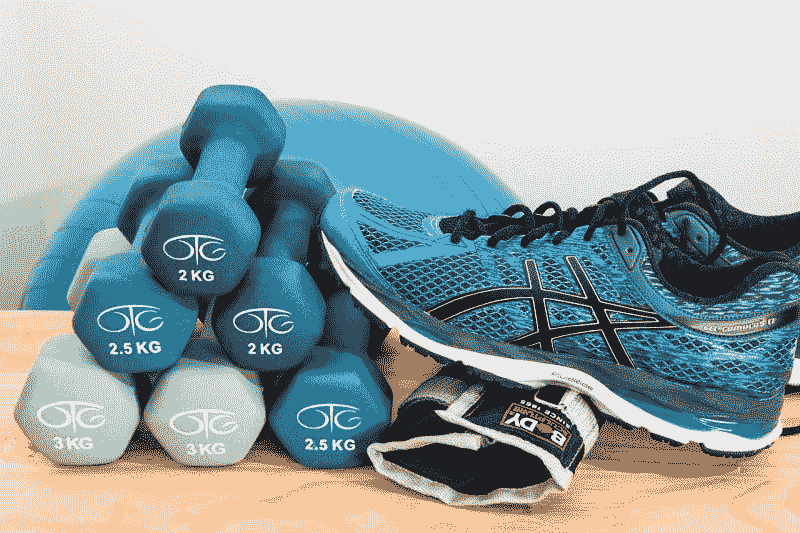
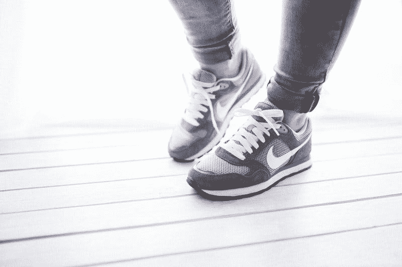
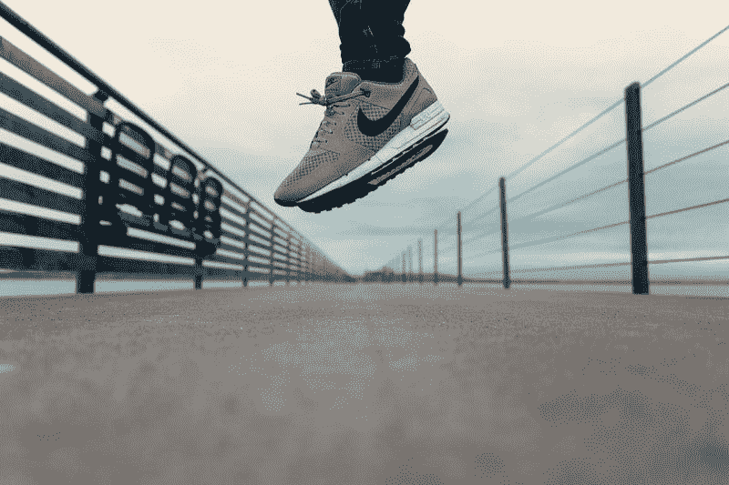
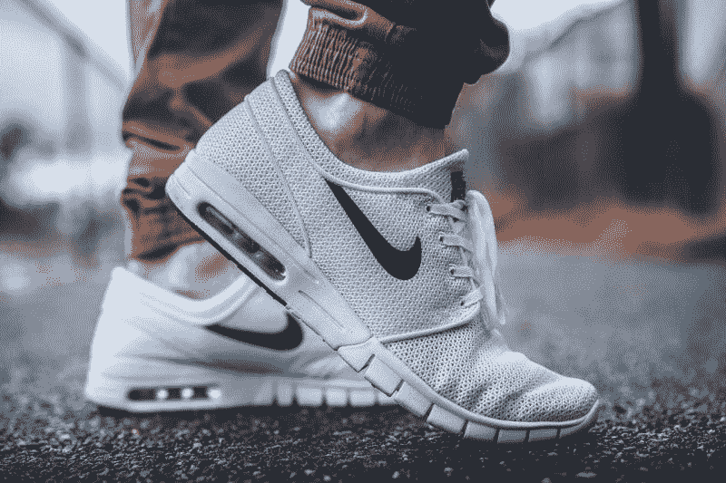

# Foot Locker 赚钱吗？—市场疯人院

> 原文：<https://medium.datadriveninvestor.com/is-foot-locker-making-money-market-mad-house-83f03af93681?source=collection_archive---------17----------------------->

如果说有哪家公司有可能在零售业末日中死亡，那就是 **Foot Locker(纽约证券交易所代码:FL)** 。解释一下，Foot Locker 与**亚马逊**直接竞争。

Foot Locker 的主要产品是鞋子，亚马逊拥有最显眼的在线鞋子；Zappos.com 商店。此外，鞋子是一种易于运输且价格低廉的产品。

目前，Foot Locker 在几个国家经营着大约 3576 家商店， *Investopedia* [估计](https://www.investopedia.com/articles/company-insights/081716/top-7-companies-owned-foot-locker-fl.asp)。目前，Foot Locker 公司经营六家连锁店；Champs Sports、Foot Locker、Kids Foot Locker、Footaction、Runners Point 和 SIX:02。

 [## 算法交易的机器学习|数据驱动的投资者

### 当你的一个朋友在脸书上传你的新海滩照，平台建议给你的脸加上标签，这是…

www.datadriveninvestor.com](https://www.datadriveninvestor.com/2019/01/30/machine-learning-for-stock-market-investing/) 

因此，Foot Locker 是美国第三大独立鞋类零售商， *Ranke* r [估计](https://www.ranker.com/list/shoe-stores-companies/reference)。因此，Foot Locker 在零售启示录和亚马逊的曝光率很高。该公司拥有数千家销售产品的商店，亚马逊可以轻松提供。

# Foot Locker 要死了吗？

我认为亚马逊注定了 Foot Locker，因为该公司从其巨大的足迹中赚了一点钱。例如，Foot Locker 在 2019 年 8 月 3 日报告的季度收入为 17.74 亿美元，季度毛利为 5.34 亿美元，季度净收入为 6000 万美元。

此外，Foot Locker 报告称，2019 年 8 月 3 日，季度运营现金流为 1000 万美元，季度自由现金流为负-2600 万美元。此外，Foot Locker 在同一天的投资现金流为-3600 万澳元和-1.58 亿澳元。

因此，Foot Locker 从其业务中产生的现金很少。然而，Foot Locker 在 2019 年 8 月 3 日拥有 9.39 亿美元的现金和等价物。因此，Foot Locker 有一些现金。

不幸的是，Foot Locker 的最大竞争对手亚马逊在 2019 年 8 月 3 日报告的现金和短期投资为 414.63 亿美元，季度运营现金为 91.18 亿美元，季度自由现金流为 64.75 亿美元，季度营收为 614.04 亿美元，季度毛利为 270.67 亿美元，季度净收入为 26.25 亿美元。

我在想 Foot Locker 怎么能和这样资源的对手竞争呢？此外，Statista [估计【2019 年 6 月，该竞争对手在美国拥有 1.05 亿亚马逊 Prime 用户。值得注意的是，Statista 估计，2018 年美国用户平均在 Prime 上花费 600 美元。](https://www.statista.com/statistics/546894/number-of-amazon-prime-paying-members/)

# Foot Locker 能否从数字鞋销售中获利？

有趣的是，Foot Locker 正在努力成为一家电子商务公司。例如，Foot Locker 推出了一款名为“温室”的新型孵化器。

温室是一个智囊团，将研究，创造和开发数字解决方案，以增加 Foot Locker 的业务，*复杂风格* [报道](https://www.complex.com/sneakers/2019/09/foot-locker-greenhouse-app-interview)。此外，Foot Locker 正在对数字风险投资进行大量投资。

例如，Foot Locker 向 GOAT 投资了 1 亿美元，Sole Collector [透露](https://solecollector.com/news/2019/02/foot-locker-invests-100-million-goat)。本质上，山羊是一个二手运动鞋的数字市场。

Foot Locker 可以利用山羊来销售其商店中未售出的商品。此外，Foot Locker 可以分析山羊销售数据，以了解运动鞋的销售情况。例如，Foot Locker 可以更改其库存，以包含在线销售最好的鞋子。

此外，Foot Locker 在 2019 年 1 月向 Pensole 设计学院投资了 200 万美元，*福布斯* [报道](https://marketmadhouse.com/is-foot-locker-making-money/#433109a9be73)。Pensole 培训鞋类设计师。Foot Locker 及其供应商将帮助 Pensole 学生和毕业生将他们的创作推向市场。希望在亚马逊上出现之前提供独特的鞋类。

# Foot Locker 能与 Zappos.com 和亚马逊竞争吗？

因此，Foot Locker 正试图收购数字鞋业务的一部分。然而，这可能为时已晚，因为亚马逊的鞋类业务正以令人难以置信的速度增长。

亚马逊的鞋类业务在 2016 年第二季度和 2017 年第二季度之间增长了 18%，*连锁店年龄* [估计](https://www.chainstoreage.com/technology/amazons-shoe-business-outpacing-brick-and-mortar-competitors/)。此外，亚马逊的鞋子业务在 2016 年增长了 35%。

亚马逊在时尚界的影响力可能是巨大的。Statista [预测](https://www.statista.com/statistics/265095/amazon-us-fashion-gmv/)2020 年，亚马逊服装和配饰的商品总销售额可能增长至 520 亿美元。因此，亚马逊可能很快成为时尚和鞋类领域最大的品牌。

具体来说，据 Coresight [估计](https://coresight.com/research/amazon-apparel-updatean-analysis-of-more-than-1-million-clothing-listings-on-amazon-fashion/)，亚马逊在 2018 年 9 月有 1200 万件服装产品的清单。值得注意的是，亚马逊与**耐克(纽约证券交易所代码:NKE)** 建立了合作伙伴关系，这导致耐克在亚马逊上的上市数量在 2018 年第一季度和第三季度之间下降了 46%。

解释一下，耐克现在直接通过亚马逊销售鞋子，尽管他们没有将其列为亚马逊卖家。作为直接销售的交换，亚马逊现在对其商品进行监管，将假冒耐克产品排除在市场之外。此外，另一款流行运动鞋阿迪达斯的亚马逊销售额在 2018 年 2 月至 9 月期间增长了 5.1%。

# 亚马逊会主导鞋类业务吗？

为了终结 Foot Locker 的厄运，亚马逊可以成为一家制鞋商，并主宰鞋类业务的所有方面。

亚马逊的私人鞋子品牌 206 Collective 正在开发一种舒适的低价运动鞋，类似于 Allbirds 的产品。The Verge [称](https://www.theverge.com/tldr/2019/9/19/20874818/amazon-allbirds-shoe-clone-copy-sneaker-206-collective-private-label) 206 Collective 为“全鸟克隆”，并指出亚马逊的鞋子售价仅为 45 美元。

206 集体只是亚马逊冰山一角。令人难以置信的是，2018 年 9 月，亚马逊上有 2783 个独特的时尚品牌。此外，Coresight 估计，2018 年 2 月至 9 月，亚马逊服装上市数量增长了 27.3%。

因此，亚马逊正在成为美国的鞋店，并对 Foot Locker 的存在提出质疑。因此，Foot Locker 可能很快会跟随其竞争对手 [Payless 鞋源](https://www.businessinsider.com/the-rise-and-fall-of-payless-shoesource-2019-6)被遗忘。Payless 该公司曾在美国所有 50 个州经营门店，于 2019 年关门。

# Foot Locker 是价值投资吗？

反向投资者会怀疑 **Foot Locker (NYSE: FL)** 是否是一项价值投资，因为它赚钱，即使大多数人认为该公司面临灭绝。

我的答案是，Foot Locker 现在是一项价值投资，因为它价格便宜，股息丰厚。具体而言，Foot Locker 于 2019 年 7 月 18 日支付了 38₵季度股息。此外，3.5₵在 2019 年增加了 Foot Lockers 的股息。为了解释，Foot Locker 于 2019 年 1 月 17 日支付了 34.5₵股息，并于 2019 年 4 月 17 日支付了 38₵股息。

Foot Locker 是一只优秀的股息股票，因为它在 2019 年 9 月 25 日提供了八年的股息增长，3.72%的股息收益率，1.52 美元的年化派息率和 34.1%的派息率。然而，Foot Locker 是一只高风险的股票，因为它的业务正在萎缩，赚不了那么多钱。

因此，我认为 Foot Locker 是市场先生高估的廉价收益股。解释一下，我认为股息是支撑 Foot Locker 股价的唯一因素；2019 年 9 月 25 日 40.91 美元。如果 Foot Locker 停止派息，我预测它的股价会像石头一样下跌。

因此，如果你想要一些便宜的股息，你可以持有 Foot Locker，但要准备好快速抛售这家零售商。我认为 Foot Locker 是一项糟糕的投资，因为它是一家没有未来的公司。砖头和砂浆鞋业务将很快消失，并采取脚锁与它。

*原载于 2019 年 9 月 25 日*[*【https://marketmadhouse.com】*](https://marketmadhouse.com/is-foot-locker-making-money/)*。*