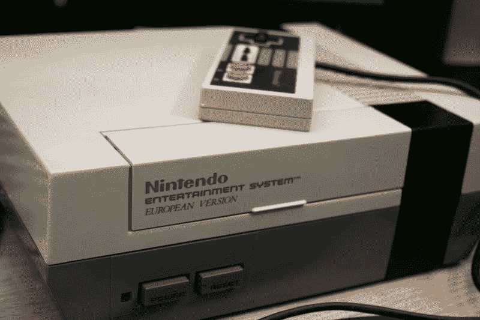
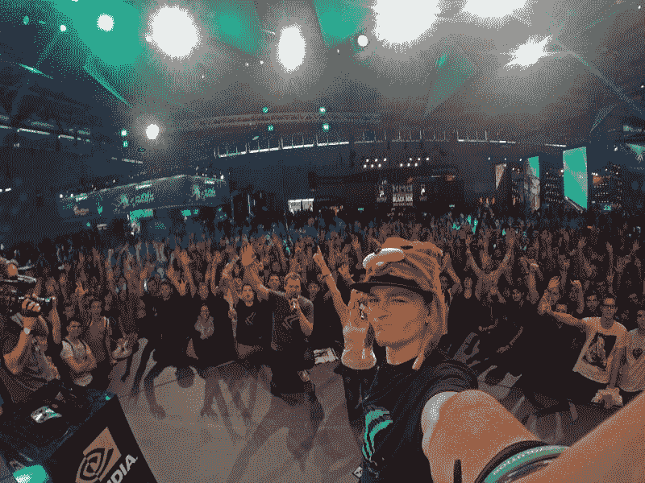
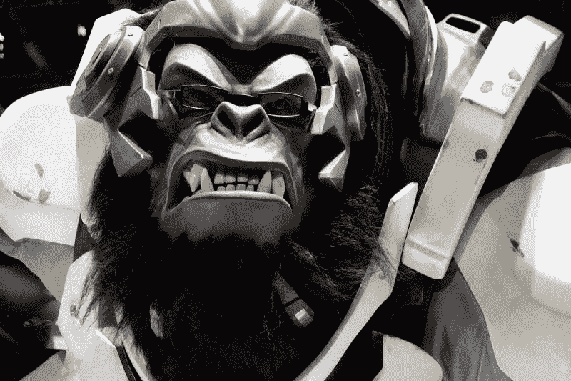

# GameStop 赚钱了吗？—市场疯人院

> 原文：<https://medium.datadriveninvestor.com/is-gamestop-making-money-market-mad-house-857bc68c2096?source=collection_archive---------6----------------------->

零售启示录海报儿童 **GameStop(纽约证券交易所代码:GS)** 有一个不太可能的救世主，他就是*大空头*英雄 Michael Burry。

奇怪的是，Burry 的投资公司 Scion Asset Management 承认拥有 300 万股股票；或者 GameStop 公司 3.3%的股份，一份新闻稿[透露](https://www.businesswire.com/news/home/20190819005633/en/Scion-Asset-Management-Urges-GameStop-Buy-238)。详细地说，Burry 是一个投机者，他在某种程度上预测了引发 2007-2008 年经济大崩溃的抵押贷款市场的崩溃。

 [## 人工智能和虚拟现实的融合-你能期待什么|数据驱动的投资者

### 在技术领域，融合是合乎逻辑的一步。就在几十年前，你可能需要一个专门的…

www.datadriveninvestor.com](https://www.datadriveninvestor.com/2018/08/30/the-convergence-of-ai-rv-what-you-can-expect/) 

具体而言，Burry 做空抵押贷款支持证券。因为他扮演了迈克尔·刘易斯的书《大短篇》中的英雄角色，所以他有着民间英雄的身份。而且，黑暗骑士本人；克里斯蒂安·贝尔在 2016 年的电影版《T8:大短剧中饰演伯里。

# 关于 GameStop，Michael Burry 说得对吗？

GameStop [声称](http://news.gamestop.com/about-gamestop)在 14 个国家经营 5600 家商店，销售视频游戏和游戏用品。

然而，GameStop 从这些商店中赚不到什么钱。此外，Game Stop 在 2019 年 5 月 5 日报告的营业收入为 1800 万美元，净收入为 680 万美元。这些数字明显低于 2018 年 5 月 5 日的 2820 万美元和 4500 万美元。

此外，GameStop 在 2019 年 5 月 4 日报告的收入为 15.48 亿美元，低于去年同期的 17.86 亿美元。另外，GameStop 在 2019 年 5 月 4 日报告的毛利为 4.48 亿美元，低于 2018 年 5 月的 5.03 亿美元。

值得注意的是，Stockrow 报告称，在截至 2019 年 5 月 4 日的季度中，GameStop 的收入增长率下降了 13.33%。此外，在截至 2019 年 2 月 2 日的季度中，GameStop 的收入增长下降了 7.26%。

# GameStop 正在亏损

我想知道 Burry 是否愿意看一下 GameStop 的财务数据，因为该公司在 2019 年 5 月 4 日报告了所有负现金流。

例如，GameStop 在同一天公布的运营现金流为 6.65 亿美元，自由现金流为 6.836 亿美元。很明显，负现金流超过了 GameStop 的现金和等价物。

GameStop 在 2019 年 5 月 4 日报告了 5.43 亿美元的现金和等价物。因此，GameStop 是价值投资的对立面，它烧钱而不是产生现金。

# GameStop 是电子游戏中的逆势玩法吗？

然而，Burry 认为 GameStop 在今天的零售市场和视频游戏市场上是一个反潮流的游戏。积极的一面是 **GameStop(纽约证券交易所:GME)** 很便宜，其股价在 2019 年 8 月 30 日为 3.97 美元。

我的猜测是，Burry 认为 GameStop 的股价会上涨，因为它在视频游戏领域。然而，今天的游戏玩家很少从商店购买游戏。相反，今天的游戏玩家在网上购买数字游戏。

例如，2018 年，Epic Games 通过为*堡垒之夜*，*今日美国*，[估计](https://www.usatoday.com/story/money/2019/07/22/fortnite-decline-hurting-microsoft-gaming-business-xbox/39794589/)销售数字设备创收 24 亿美元。事实上，*堡垒之夜*在 2019 年 5 月创造了 2.03 亿美元的收入。

史诗游戏；然而，通过销售数字服装，角色，预发行的游戏节点和 V-Bucks 数字货币来获得收入。值得注意的是，所有这些物品都是数字商品，玩家直接在网上购买，而不是在商店购买。没有玩家会去 GameStop 为自己的角色挑选一个化妆用的皮肤。

相反，游戏玩家呆在沙发上，直接在线订购游戏用具。游戏玩家可能从 GameStop 获得的唯一物品是游戏机，他们也可以从亚马逊订购。

# 为什么 GameStop 不能从今天的视频游戏中赚钱

因此，今天视频游戏的利润流向了像史诗游戏这样的游戏公司和科技巨头，比如微软(纳斯达克股票代码:MSFT)和腾讯控股。

《今日美国》*估计，游戏占微软 2018 年收入的 9%。因此，微软在 2018 年有 113.256 亿美元的游戏收入。为了澄清，Statista [估计](https://www.statista.com/statistics/267805/microsofts-global-revenue-since-2002/)微软 2018 年的收入为 1254.4 亿美元，我计算其中的 9%为 113.256 亿美元。*

微软从广受欢迎的 Xbox 游戏机和 Game Pass 游戏网络中赚钱。Statista [估计](https://www.statista.com/statistics/680526/global-xbox-gaming-consoles-unit-sales/)微软在 2108 年卖出了 696 万台游戏机。值得注意的是，微软在 2005 年至 2017 年期间销售了 8580 万台 Xbox 360 游戏机。

与此同时，中国电信巨头腾讯控股的子公司 Riot Games 在 2018 年从其*英雄联盟*大型多人在线游戏(MMOG)中赚了 14 亿美元，Statista [估计](https://www.statista.com/statistics/806975/lol-revenue/)。此外，腾讯拥有*堡垒之夜的* creator Epic Games。

# 那么 Michael Burry 在 GameStop 中看到了什么？

因此，今天游戏中真正赚钱的是科技巨头，而不是像 GameStop 这样的实体零售商。那么 Burry 在 GameStop 中看到了什么？

这不是股息，据路透社[报道](https://www.reuters.com/article/us-gamestop-results/gamestop-halts-dividend-as-console-sales-slow-shares-fall-26-idUSKCN1T52R4)，GameStop 在 2019 年 6 月停止支付股息，以节省 1.57 亿美元。也不是领导力，GameStop 在截至 2019 年 5 月的一年中有五位首席执行官。

我怀疑，Burry 认为对游戏知之甚少或一无所知的老投资者可能会购买 GameStop，因为他们在它的名字中看到了“游戏”这个词。此外，老年人可以从 GameStop 为他们的孙子购买一些东西。

然而，我认为这样的打法只会对 GameStop 的股价产生短暂的提振。如果 GameStop 的价格翻一倍或两倍，Burry 可以迅速大赚一笔；但我看不到这家公司的任何长期价值。

最终，GameStop 处于当今世界游戏的边缘。今天的游戏玩家要么玩 MMOGs，要么从像 [Gog](https://www.gog.com/) 、Steam 和 [Epic Games Store](https://marketmadhouse.com/will-the-abyss-make-money-with-fortnite/) 这样的服务上购买他们的游戏。其实*每日综艺* [估计](https://variety.com/2019/gaming/news/steam-one-billion-accounts-1203201159/)一个游戏平台；2019 年 4 月，Steam 拥有 10 亿个账户和 9000 万活跃用户。

此外，现代游戏玩家可能会从亚马逊订购新的游戏机，而不是开车去购物中心。因此，GameStop 的未来市场可能是为孩子或孙子购买游戏的老年足球妈妈或祖父母。

# 为什么投资者需要远离 GameStop

因此，Burry 可以打赌年长的选股人可以很快提高 GameStop 的股票价值。我认为这是一个糟糕的赌注，显示了 Burry 对游戏的无知。

归根结底，我认为 GameStop 将很快崩溃，使其股票一文不值。因此，我认为科技股像**微软(纳斯达克:MSFT)**；像 [**【英伟达】**](https://marketmadhouse.com/value-investing-in-robots-artificial-intelligence-virtual-reality-and-self-driving-vehicles-at-nvidia-corp-nvda/) **(纳斯达克股票代码:NVDA)** 这样的芯片制造商，或者像 [**电子艺界**](https://marketmadhouse.com/is-electronic-arts-making-money/) **(纳斯达克股票代码:EA)**这样的游戏制造商，将会更好地服务于想要在游戏**上套现的投资者。**

所有这些公司都从游戏中获得了大量现金。相比之下，GameStop 正在烧钱，并将继续烧钱，直到倒闭。因此，如果 Burry 试图长期持有 GameStop，他将会赔钱。

投资者需要远离 GameStop，把钱投给那些从游戏中赚钱的公司。

*原载于 2019 年 9 月 2 日*[*https://marketmadhouse.com*](https://marketmadhouse.com/is-gamestop-making-money/)*。*