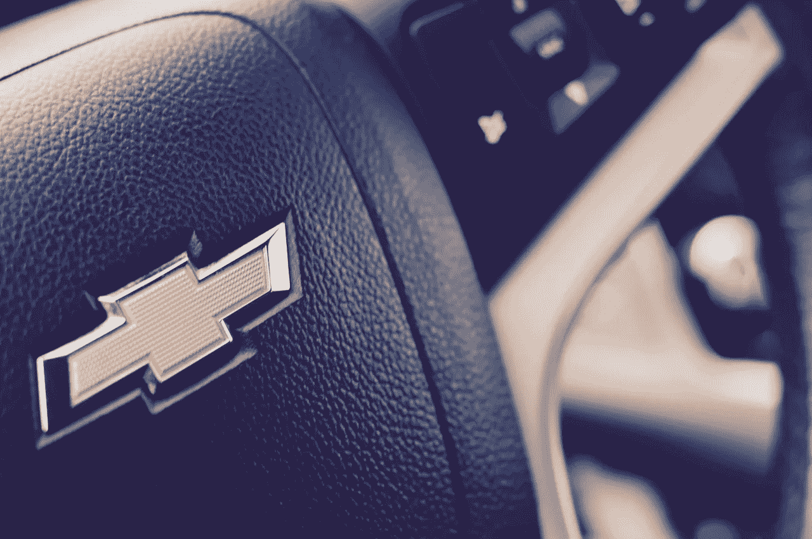
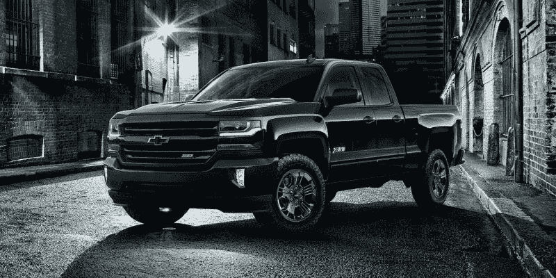
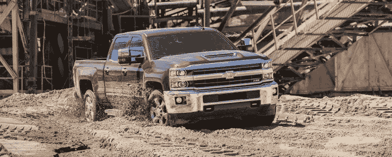
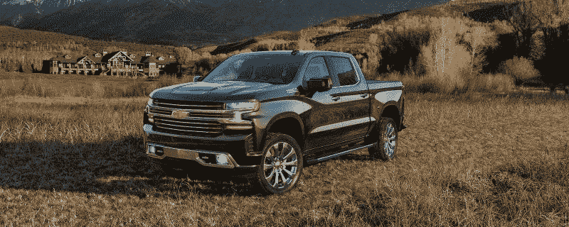
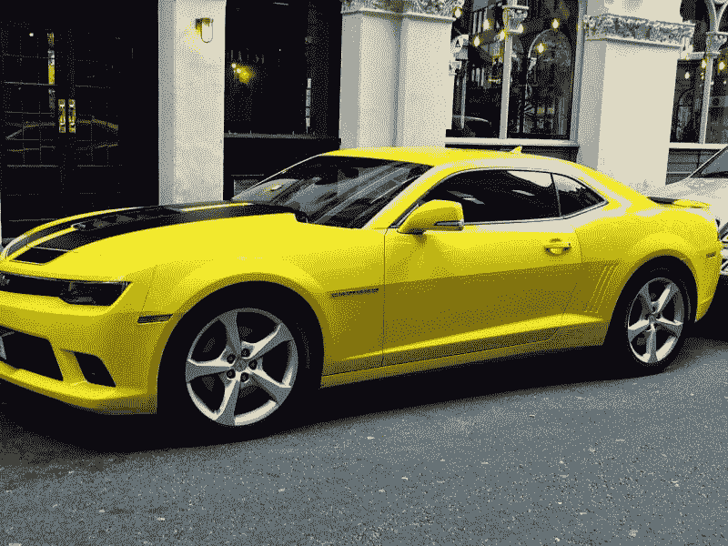
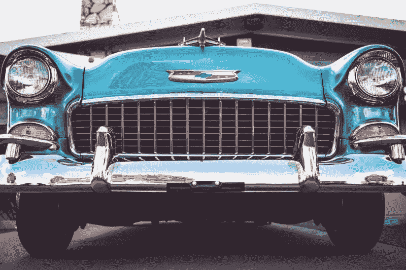

# 通用汽车是价值投资吗？—市场疯人院

> 原文：<https://medium.datadriveninvestor.com/is-general-motors-a-value-investment-market-mad-house-29c8b021257d?source=collection_archive---------9----------------------->

奇怪的是，尽管通用汽车最近出现了问题，但我认为它是一项潜在的价值投资。

**通用汽车(NYSE: GM)** 是一个潜在的价值投资，因为它赚钱，股价低。此外，通用汽车正在改变其业务战略，专注于利润更高的汽车业务领域。

 [## 在自动驾驶汽车发生事故的情况下，谁应该承担法律责任？-数据驱动型投资者

### 我仍然认为自动驾驶汽车是一种奢侈品，而不是必需品…

www.datadriveninvestor.com](https://www.datadriveninvestor.com/2018/11/02/who-is-legally-accountable-in-the-case-of-an-autonomous-vehicle-accident/) 

特别是，通用汽车在抛售汽车的同时，正在增加对利润丰厚的卡车和货车市场的投资。引人注目的是，通用汽车今年 3 月停止了俄亥俄州洛兹敦汽车工厂的生产。

CNN 财经[注意到，关闭洛兹敦使通用汽车能够停止亏损的雪佛兰科鲁兹轿车。另外，通用汽车公司计划关闭另外两家汽车工厂。](https://www.cnn.com/2019/03/04/business/general-motors-lordstown/index.html)

然而，据底特律自由新闻 [报道](https://www.freep.com/story/money/cars/general-motors/2019/05/03/expansion-plan-wentzville-missouri/3660950002/)，通用汽车可能会向其位于密苏里州温茨维尔的卡车和货车工厂投资高达 10 亿美元。此外，通用汽车公司计划开发一种电动皮卡，*底特律新闻* [透露](https://www.detroitnews.com/story/business/autos/general-motors/2019/04/30/gm-confirms-plan-build-electric-pickup/3626575002/)。

# 为什么通用汽车喜欢皮卡

因此，通用汽车正在将资源重新投资到公司能够获得最大收益的地方。通用汽车首席财务官 Dhivya Suryadevara 声称，值得注意的是，皮卡销售推动了通用汽车 2019 年第一季度的“利润”增长。

《底特律新闻》*[声称，为了详细说明雪佛兰 Silverado 和 GMC Sierra 的较高价格据称会提高通用的利润。然而，财务数据显示，通用汽车的收入从 2018 年第四季度的 383.99 亿美元降至 2019 年第一季度的 348.78 亿美元。](https://www.detroitnews.com/story/business/autos/general-motors/2019/04/30/gm-earnings-fall-amid-restructuring-and-softer-sales/3620024002/)*

*另一方面，通用汽车的毛利从 2018 年第四季度的 33.07 亿美元增长到 2019 年第一季度的 33.43 亿美元。此外，通用汽车的净收入从 2018 年第四季度的 20.44 亿美元增长到 2019 年第一季度的 21.57 亿美元。此外，营业收入从 2018 年第四季度的 8.29 亿美元增长到 2019 年第一季度的 12.44 亿美元。*

*因此，通用汽车公司可以通过制造更多的皮卡，用更少的资源赚更多的钱。例如，美国有线电视新闻网财经[报道](https://www.cnn.com/2019/03/04/business/general-motors-lordstown/index.html)，通用汽车计划通过减少汽车产量来削减 8000 个工作岗位或其美国劳动力的 15%。然而，通用汽车正在扩大其卡车业务。*

# *通用汽车在亏损吗？*

*很容易理解为什么通用汽车想要退出汽车业务。该公司于 2019 年 3 月 31 日报告了几个季度以来的首次负现金流。*

*为了解释这一点，通用汽车报告称，2019 年第一季度的运营现金流为-8100 万美元；低于 2018 年第四季度的 60.3 亿美元。与此同时，通用汽车 2019 年第一季度的自由现金流为负 20.95 亿美元，低于 2018 年第四季度的 38.31 亿美元。*

**

*然而，通用汽车仍报告 2019 年第一季度的融资现金流为 10.77 亿美元。因此，通用汽车在艰难时期仍能从其业务中产生大量现金。*

*最后，通用汽车公司在 2019 年 3 月 31 日有 231.97 亿美元的现金和短期投资。然而，这一数字低于 2018 年 12 月的 260.10 亿美元。因此，尽管存在问题，通用汽车仍是一家现金充裕的公司。*

*因此，通用汽车符合一家有问题的优秀公司的经典价值标准。因此，沃伦·巴菲特对通用汽车的信任目前看来是有道理的。*

# *通用汽车正在输掉皮卡大战*

*皮卡将拯救 T2 通用汽车公司的想法是值得怀疑的。事实上，销售数据显示通用汽车正在落后于竞争对手**、福特**和**菲亚特克莱斯勒**。*

*事实上，美国最受欢迎的汽车是福特 F 系列，Goodcarbardcar [估计](http://www.goodcarbadcar.net/2019/04/best-selling-pickup-trucks-in-america-march-2019/)。具体来说，福特在 2019 年 3 月售出了 76，243 辆 F 系列。与此同时，通用汽车最畅销的皮卡是雪佛兰 Silverado，2019 年 3 月销量为 40，611 辆。*

**

*平心而论，通用汽车卖的是皮卡车，而福特只有两辆。为了澄清，福特还在 2019 年 3 月出售了 3347 辆流浪者。除了 Silverado，通用汽车还售出了 14，405 辆 GMC Sierras、11，899 辆雪佛兰 Colorados 和 2，471 辆 GMC Canyons。*

*因此，我估计通用汽车在 2019 年 3 月销售了 69，386 辆皮卡，不到福特皮卡的一个型号。根据记录，福特在 2019 年 3 月销售了 79，850 辆皮卡。*

*此外，通用汽车在皮卡大战中也落后于菲亚特-克莱斯勒汽车公司。为了解释这一点，据 Goodcarbadcar 计算，FCA 在 2019 年 3 月销售了 45，187 辆 Ram 皮卡和 43 辆 Jeep Gladiators。*

# *通用汽车的皮卡销量正在下降*

*此外，通用汽车公司的高皮卡战略似乎正在失败。*

*为了解释这一点，Silverado 的销量从 2018 年 3 月的 52，427 辆下降到一年后的 40，611 辆。Goodcarbadcar 估计下降了 22.71%。此外，2018 年至 2019 年，所有通用皮卡车型的销量都有所下降。*

*公平地说，福特的 F 系列销量下降了 12.3%，从 2018 年 3 月的 87，011 辆下降到 2019 年 3 月的 76，243 辆。然而，游侠在 2018 年至 2019 年期间的销量保持不变。*

**

*最后，菲亚特-克莱斯勒的业务蓬勃发展，2019 年 Ram 销量增长了 9.39%。具体来说，菲亚特-克莱斯勒在 2018 年 3 月销售了 41，307 辆公羊，一年后销售了 45，187 辆(道奇)公羊皮卡。因此我认为，菲亚特-克莱斯勒正在窃取通用汽车卡车业务的一部分。值得注意的是，Trucks.com[估计【2019 年第一季度 Ram 卡车销量超过 Silverado 销量。](http://www.goodcarbadcar.net/2019/04/best-selling-pickup-trucks-in-america-march-2019/)*

*也许，通用汽车需要重新考虑它的皮卡定价。此外，通用汽车必须检查福特和 FCA，看看这些公司做得对不对。*

# *通用汽车丢弃汽车是正确的*

*然而，通用汽车公司正在做一件非常正确的事情。该公司正迅速退出轿车业务。*

*值得注意的是，面包车、卡车和运动型多功能车(SUV)占通用汽车 2019 年第一季度销量的 80%，*[汽车周刊](https://autoweek.com/article/car-news/new-car-sales-march-2019-winners-and-losers)估计。此外，2019 年第一季度，通用汽车的汽车销量下降了 21%。**

**在这种情况下，通用汽车关闭工厂、裁员和删除车型的策略是明智的。事实上，我认为美国的传统汽车市场可能很快就会消失。**

# **美国人想要卡车和 SUV，而不是汽车**

**销售数据显示，2018 年美国最畅销的六款汽车都是皮卡或 SUV。具体来说，福克斯新闻频道[估计](https://www.foxnews.com/auto/the-10-best-selling-vehicles-in-the-united-states-in-2018-were-mostly-trucks-and-suvs)2018 年美国六大最受欢迎的游乐设施是:**

****

**1.福特 F 系列皮卡——总销量 909，330 辆。**

**2.雪佛兰 Silverado 皮卡-年销量 585，581 辆。**

**3.道奇公羊皮卡——年销量 536，980 辆。**

**4.丰田 rav 4 SUV——年销量 427，170 辆。**

**5.日产 Rogue/Rogue Sport SUV 的年总销量为 412，110 辆。**

**6.本田 CR-V SUV 2018 年总销量 397，013 辆。**

**最后，美国最受欢迎的汽车是**丰田**凯美瑞，2018 年总销量为 343，439 辆。因此，美国人不再开轿车，取而代之的是皮卡和 SUV。**

**此外，通用汽车需要在 SUV 开发上投入大量资金。然而，福克斯指出，通用汽车制造了前十名中唯一的美国品牌 SUV。这款车是雪佛兰 Equinox，2018 年的销量为 332，618 辆。**

# **通用汽车不是一项价值投资**

**然而，我并不认为通用汽车与其竞争对手相比具有某些价值特征，是一只定价过高的股票。**

**为了解释这一点，通用汽车的股票在 2019 年 4 月 7 日的交易价格为 38.53 美元，而福特汽车的交易价格为 10.38 美元，菲亚特克莱斯勒的交易价格为 15.23 美元。我认为福特和 FCA 是比通用更好的公司，因为皮卡销量激增。此外，[菲亚特-克莱斯勒](https://marketmadhouse.com/fiat-chrysler-has-more-value-than-you-think/)拥有强大的 SUV 品牌吉普。**

****

**另一方面，通用汽车是一项不错的收益投资，因为它应该在 2019 年 6 月 21 日支付 38₵股息。然而，自 2016 年 36₵.以来，股息一直没有增长最后，2019 年 4 月 7 日，通用汽车股东的股息收益率为 3.94%，年化股息为 1.52 美元，股息支付率为 25.5%。**

**因此，我认为通用汽车是一只便宜但有风险的收益股，在当前条件下几乎没有增长潜力。**

***原载于 2019 年 5 月 7 日*[*https://marketmadhouse.com*](https://marketmadhouse.com/is-general-motors-a-value-investment/)*。***