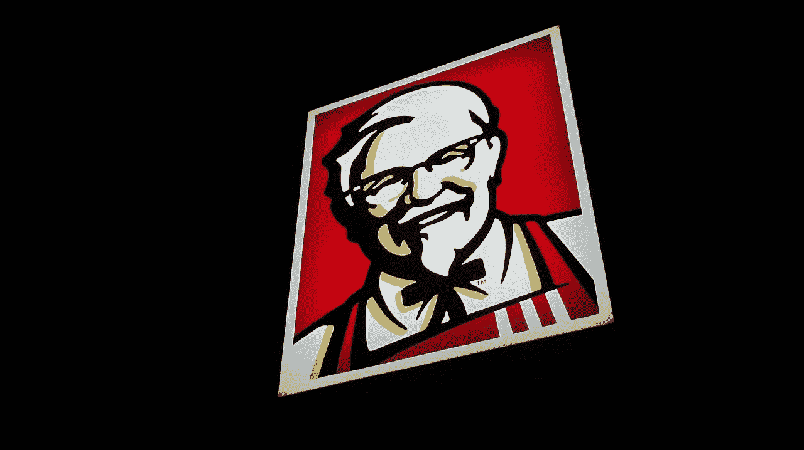
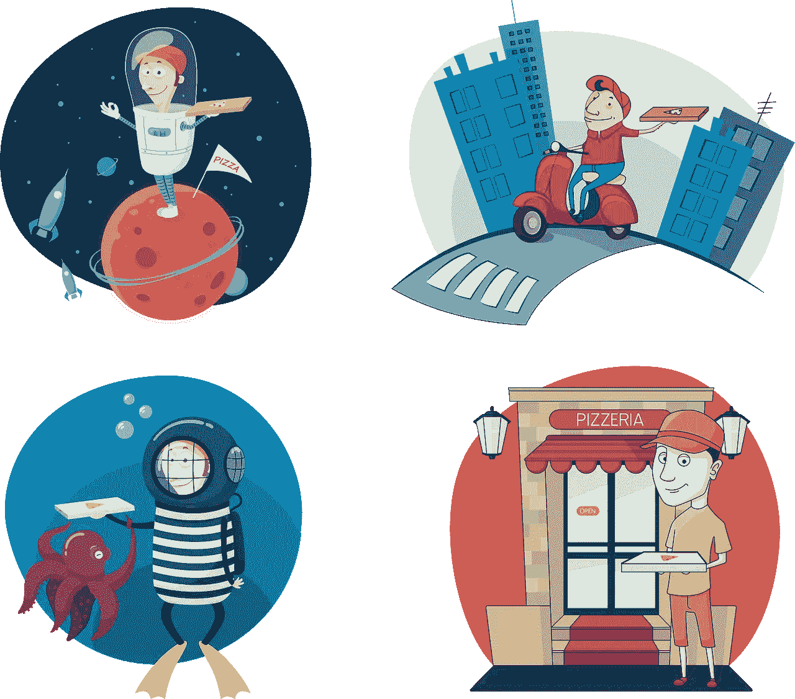

# GrubHub 对 Kroger 有威胁吗

> 原文：<https://medium.datadriveninvestor.com/is-grubhub-a-threat-to-kroger-kr-ee52c613b53?source=collection_archive---------19----------------------->

奇怪的是，像 GrubHub(纽约证券交易所代码:GRUB) 这样不起眼的外卖应用对 Kroger 来说是个威胁。送餐应用威胁到克罗格这样的杂货商，因为它们减少了消费者烹饪的需求。

GrubHub 威胁到了 **Kroger(纽约证券交易所代码:KR)** 因为它的足迹和增长的规模。例如，GrubHub [声称](https://about.grubhub.com/about-us/what-is-grubhub/default.aspx)服务于 1700 多个美国城市和 95000 家餐馆。

事实上，GrubHub 声称在 2018 年处理了 41.6 万份外卖订单。除此之外，GrubHub 现在有 1640 万活跃用户。此外，GrubHub 正在急剧增长。

特别是，根据 Statista 的计算，GrubHub 的用餐者人数从 2016 年的 817 万增长到 2017 年的 1446 万，再到 2018 年的 1640 万。因此，GrubHub 的客户群在两年内翻了一倍多。

# 【GrubHub 如何威胁 Kroger (KR)

GrubHub 对 Kroger 来说是一个威胁，因为它的食物比 Kroger 的更方便，也更有吸引力。

特别是，GrubHub 现在提供现代美式快餐；肯德基或肯德基的快餐，还有塔可钟。值得注意的是，GrubHub 与百胜集团结成了联盟。Brands (NYSE: YUM) 从肯德基和 A & W。

因此，GrubHub 现在提供的参赛作品足够便宜，几乎任何美国工薪阶层都买得起。此外，GrubHub 现在可以利用我喜欢称之为美元菜单或沙拉效应的优势。

# **行为经济学认为 GrubHub 对 Kroger 构成了威胁**

解释一下，**麦当劳(NYSE: MCD)** 提供一元菜单和沙拉，但希望没人吃。取而代之的是，Mickey D 打赌顾客会从美元菜单上买沙拉或点菜，但得到的却是一个巨无霸。

GrubHub 明白，它的顾客会拿起电话点寿司或泰国咖喱，但结果却是一桶肯德基。例如，足球妈妈可以通过说“我将使用应用程序来订购素食条目”来证明 GrubHub 的合理性。实际上，她点的是肯德基，或者必胜客(百胜的另一个品牌)，或者塔可钟。

因此，行为经济学使得 GrubHub 这样的用餐应用对 Kroger 和其他杂货商构成了巨大威胁。这样的应用程序快速、方便、易用。

显然，GrubHub 将很快面临健康饮食警察对百胜餐饮集团的愤怒。我预测新清教徒会因为 GrubHub 的百胜餐饮品牌而指责它肥胖！联盟。

# GrubHub (GRUB)真的对 Kroger (NYSE: KR)有威胁吗？

另一方面，克罗格由于拥有大量资源，在对抗格鲁布的威胁方面处于有利地位。

例如，Kroger 在 2018 年 2 月 3 日的年收入为 1226.62 亿美元，在 2018 年 11 月 10 日的季度收入为 276.72 亿美元。与此同时，GrubHub 在 2018 年 9 月 30 日的季度收入为 2.4723 亿美元，年收入为 6.83017 亿美元。

然而，GrubHub 的 Stockrow 数据显示，GrubHub 的收入正在快速增长。例如，Stockrow 给 GrubHub 的 2017 年收入增长率为 38.46%，2018 年第三季度为 51.6%。

相比之下，Kroger 在 2018 年第四季度的收入增长萎缩了 0.28%。然而，克罗格的收入在 2017 年增长了 6.35%。

# 【GrubHub(蛴螬)如何威胁克罗格

有趣的是，在合适的条件下，GrubHub 有潜力赚很多钱。解释一下，GrubHub 在 2018 年第三季度的毛利率为 60.55%。与此同时，克罗格在 2018 年第四季度的毛利率为 22.01%。

因此，GrubHub 理论上可以通过其平台产生大量现金，就像**亚马逊**所做的那样。因此，克罗格可能会发现自己受到了三大快速增长的送餐平台的挤压。

这些平台将是 GrubHub、亚马逊餐厅和 UberEats。显然，亚马逊餐馆是最危险的，因为它还可以运送食品杂货。因此，懒惰的顾客可以从同一个地方订购热餐和牛奶。

# 克罗格(KR)如何对抗 GrubHub (GRUB)的威胁

幸运的是，克罗格处于对格鲁布威胁的有利位置。尤其是 Kroger 有 GrubHub 和 DoorDash 无法比拟的三个属性。

首先，克罗格可以向客户提供各种各样的其他项目，包括:杂货、处方、啤酒、葡萄酒、酒精、烘焙食品和清洁用品。第二，克罗格有内部做饭的设施和员工。

值得注意的是，Kroger 在全国经营着 2782 家超市和购物中心，其中许多包括厨房、面包店、熟食店、民族咖啡馆，甚至比萨饼店。事实上，Kroger 正在测试各种各样的热食，从汤到面条到奶酪三明治。

第三，Kroger 可以提供 GrubHub 等服务无法比拟的大折扣。例如，Kroger 可以使用热餐作为亏损的领导者，或者允许客户将受欢迎的餐纳入其受欢迎的奖励积分计划。因此，你可以通过订购一个克罗格比萨饼来节省汽油或下一次外卖的钱。

Kroger 的管理层知道 GrubHub 等应用带来的威胁，因为该公司正在扩大其热餐和配送能力。例如，Kroger 与 Instacart 建立了密切的合作关系，为 1，372 家商店提供当日送达服务。

# **Kroger(KR)如何使用机器人对抗 GrubHub (GRUB)威胁**

此外，Kroger 和英国 Ocado Group PLC(伦敦证券交易所:OCDO) 正在[开发](https://marketmadhouse.com/kroger-kr-and-ocado-plan-robotic-warehouse-in-ohio/)下一代机器人操作的客户履行中心，以支持杂货交付。顾客服务中心的一个明显的升级是增加一个厨房，为成百上千的顾客做饭。

值得注意的是，克罗格和奥卡多履行中心可以提供必要的规模经济，使机器人食品制备成为可能。事实上，现在有许多公司正在试验烹饪机器人。

比如 CreatorBBC [称，一家三藩市的餐馆使用了两个汽车大小的机器人，一小时可以做 120 个汉堡。Creator 的机器人听起来非常适合作为履行中心。此外，加州的 Zume Pizza 正在试验机器人披萨厨师。](http://www.bbc.com/future/story/20181204-the-chef-making-fast-food-even-faster)

除了 Kroger，亚马逊可能也会采取类似的做饭策略。很能说明问题的是，亚马逊拥有全食超市(Whole Foods Market)，该超市在其门店经营咖啡馆。事实上，许多从来不在全薪商店购物的人会去那里吃午餐。

从负面来看，外卖和机器人的融合将导致关于技术失业的新辩论。特别是，亚马逊和克罗格可能会让成千上万的快餐厨师、收银员和服务员失业。

# **Kroger(KR)在 GrubHub 威胁下还是价值投资吗？**

有趣的是，尽管面临 GrubHub 的威胁，Kroger 仍然是一个价值投资。

例如，Kroger 在 2019 年 1 月 28 日向投资者提供了 27.99 美元的低股价，2%的股息收益率，56 的年化派息，26.4%的派息率和 10 年的股息增长。特别是，Kroger 于 2018 年 12 月 1 日支付了 14 英镑的股息，并于 2018 年 9 月 27 日支付了 45.5 英镑的更大红利。

此外，克罗格以非常低的价格提供了大量的资源和增长潜力。事实上，我认为 Kroger 是为数不多的将过渡到数字化电子商务平台的实体零售商之一。

然而，为了实现这一目标，克罗格将不得不与许多危险的竞争对手作战，如 GrubHub 和亚马逊。不过有一点很清楚，目前克罗格是比 GrubHub 更好的股票。

澄清一下，Kroger 比 GrubHub 便宜；其交易价格为 2019 年 1 月 28 日的 81.46 美元。此外，GrubHub 不支付股息。因此，对于杂货市场的数字化颠覆，克罗格是一项巨大的价值投资。

这个故事之前在 [*市场疯人院*](https://marketmadhouse.com/is-grubhub-a-threat-to-kroger-kr/) 看过。