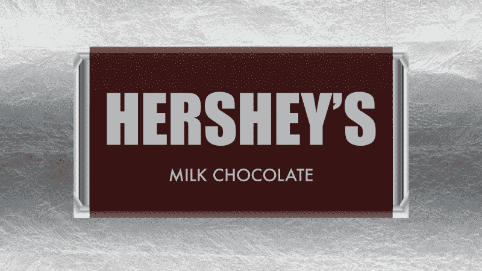
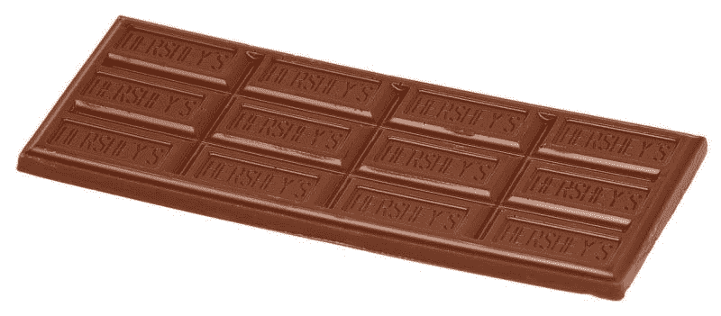
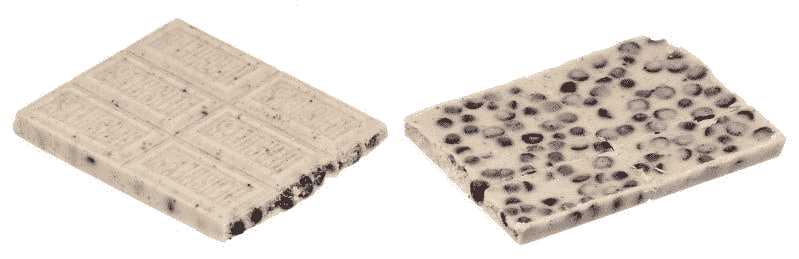
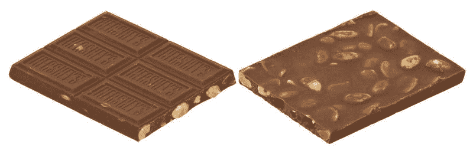
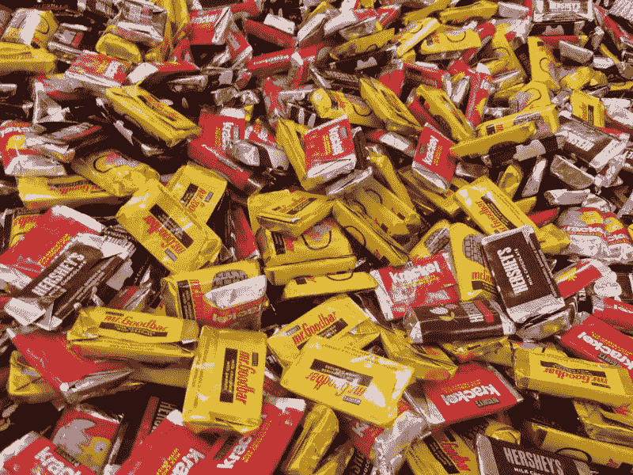

# 好时公司赚钱了吗？—市场疯人院

> 原文：<https://medium.datadriveninvestor.com/is-hersheys-making-money-market-mad-house-67cd43b14922?source=collection_archive---------15----------------------->

标志性的巧克力制造商**好时公司(纽约证券交易所:HSY)** 看起来像是巴菲特式的价值投资。

为了解释，好时制造了一种技术不会使其过时或不相关的产品，即巧克力。我想象一个世纪后，人们会在火星上吃巧克力棒和巧克力饼干。

 [## 算法交易的机器学习|数据驱动的投资者

### 当你的一个朋友在脸书上传你的新海滩照，平台建议给你的脸加上标签，这是…

www.datadriveninvestor.com](https://www.datadriveninvestor.com/2019/01/30/machine-learning-for-stock-market-investing/) 

因此，无论技术发生什么变化，好时都能赚钱。无论你是在商店购买巧克力还是通过亚马逊 Prime 订购，好时都是赚钱的。

此外，在可预见的未来，美国糖果市场看起来一片光明。大观研究[估计](https://www.grandviewresearch.com/press-release/us-candy-market-analysis)2025 年美国糖果市场将价值 196 亿美元。

加上大观估计巧克力糖果主导美国市场。因此，好时在 20 世纪的前景是光明的。有趣的是，大观预测在线糖果销售在未来十年可能会经历“利润丰厚的增长”。

# 好时赚了多少钱？

**据 Stockrow [估计，好时公司(纽约证券交易所代码:HSY)](https://stockrow.com/HSY/financials/income/quarterly)** 上个季度收入 21.34 亿美元，毛利 9.4332 亿美元。

此外，好时报告截至 2019 年 9 月 29 日的季度收入增长率为 2.64%。与此同时，毛利从 2019 年 6 月 30 日的 8.7474 亿美元增长，收入从同日的 17.67 亿美元增长。

此外，好时于 2019 年 9 月 29 日报告季度净收入为 3.2521 亿美元，季度营业收入为 4.6081 亿美元。这些数字从 2019 年 6 月 30 日的 3.1284 亿美元和 4.1007 亿美元有所增加。

好时公司从巧克力销售中获得了可观的现金收入。特别是，好时公司报告 2019 年 9 月 29 日的运营现金流为 3.1406 亿美元，自由现金流为 2.538 亿美元。相反，这些数字比 2019 年 6 月 30 日的 3.4937 亿美元和 2.6599 亿美元有所下降。

此外，赫西公司报告 2019 年 9 月 30 日的融资现金流为 1.1591 亿美元。因此，好时公司从糖果中赚钱。

然而，好时公司并没有保留很多钱。好时在 2019 年 9 月 29 日报告了 3.0264 亿美元的现金和等价物。这一数字低于 2019 年 6 月 30 日的 3.9596 亿美元和 2018 年 9 月 30 日的 8.2379 亿美元。

因此，好时公司赚钱更多，但现金更少。

# 好时的衰退有证据吗？

我认为**好时(纽约证券交易所代码:HSY)** 可以抵御衰退，因为它生产低成本奢侈品。

具体来说，即使是最穷的人也能吃得起巧克力棒、里斯巧克力块或里斯花生酱杯。事实上，当经济不景气时，巧克力的销量可能会上升，因为糖果是一些人唯一买得起的奢侈品。

工资增长停滞和收入不平等加剧正在给美国中产阶级带来压力。值得注意的是，职业建设者[估计](http://press.careerbuilder.com/2017-08-24-Living-Paycheck-to-Paycheck-is-a-Way-of-Life-for-Majority-of-U-S-Workers-According-to-New-CareerBuilder-Survey)2017 年 78%的美国工人过着领薪水的生活。令人震惊的是，这一比例高于 2016 年的 75%。

此外，Career Builder 和哈里斯民意调查估计，25%的美国工人难以维持生计。在这种情况下，糖果可能是一些人唯一买得起的奢侈品。

此外，像好时巧克力这样的低成本大众市场糖果将成为那些为收入不平等而斗争的人想要得到的糖果。因此，如果经济衰退来袭，好时的销售额和利润可能会增加。

相反，如果经济好转，好时可以赚更多的钱，因为人们会有更多的钱买糖果。

# 好时是巴菲特式的价值投资吗？

因此，好时公司有一些沃伦巴菲特喜欢的价值投资特征。

例如，好时公司生产一种简单的产品，这种产品不受经济衰退的影响，能抵抗技术变革。此外，好时公司生产的巧克力似乎永远不会过时。

著名的，**伯克希尔哈撒韦公司(纽约证券交易所代码:BRK。B)** [拥有](https://www.berkshirehathaway.com/subs/sublinks.html)一家巧克力制造商；喜氏糖果。另外，**伯克希尔哈撒韦公司(纽约证券交易所代码:BRK。A)** 拥有[麦克莱恩公司](https://www.mclaneco.com/)；向便利店和其他零售商分发糖果和其他零食。

然而，我认为市场先生在 2019 年 11 月 7 日将好时的价格定在了每股 141.32 美元。解释一下，我不认为好时赚了足够的钱来证明这个价格。因此，尽管好时有其特点，但我不能认为它是一种价值投资。

# 好时公司是好的分红股票吗？

然而，我认为**好时公司(纽约证券交易所代码:HSY)** 以其价格提供了不错的季度股息。例如，好时计划在 2019 年 11 月 21 日支付 77.3₵季度股息。

此外，好时今年的股息略有增长。好时在 2019 年 5 月 23 日支付了 77.2₵，在 2019 年 8 月 22 日支付了 77.3₵。Dividend.com[报道](https://www.dividend.com/dividend-stocks/consumer-goods/confectioners/hsy-hershey-company/)好时的股息已经增长了九年。

总体而言，好时的股东获得了 2.20%的股息收益率；2019 年 11 月 1 日的年化派息为 3.09 美元，派息率为 53.8%。因此，好时公司是市场先生高估的好股息股。

我认为好时的股息是非常安全的，因为糖果业务的性质。正如我上面提到的，巧克力销售不太可能因为经济衰退或收入不平等而下降。相反，收入不平等和经济衰退可能会促进好时的销售。

因此好时公司有很高的安全系数；但是由于现金储备少，股票价格高。我认为好时的股价正在下跌。投资者需要关注好时，但在股价下跌前不要买入。

*原载于 2019 年 11 月 7 日*[*【https://marketmadhouse.com】*](https://marketmadhouse.com/is-hersheys-making-money/)*。*