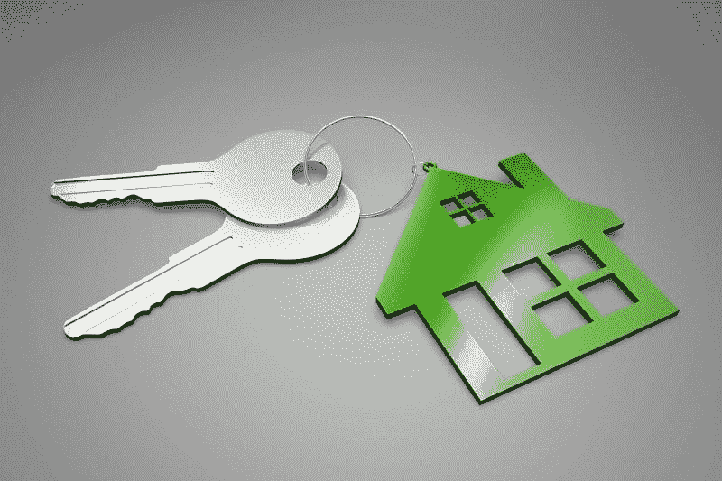
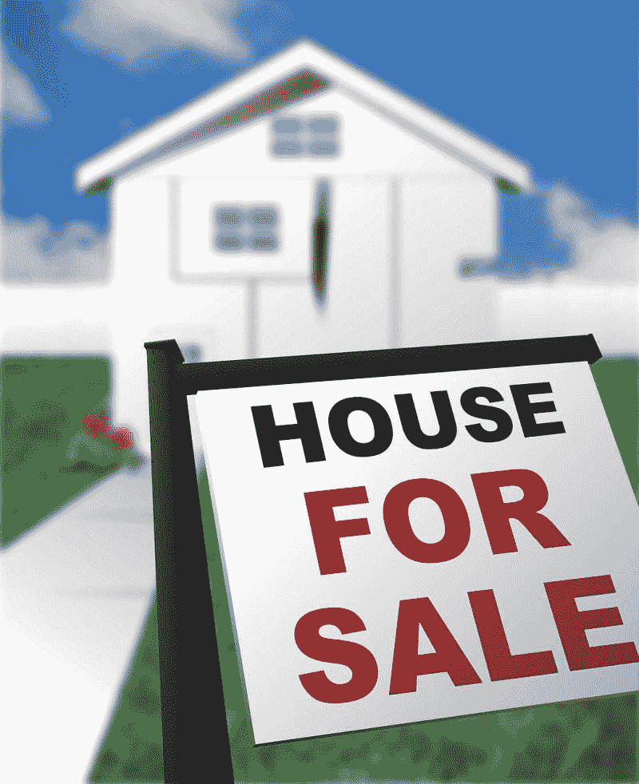
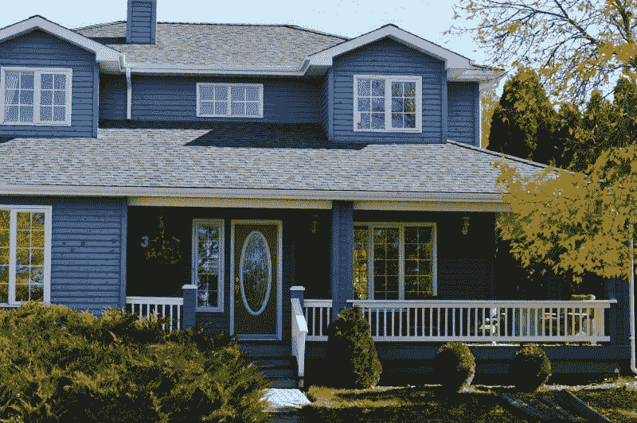
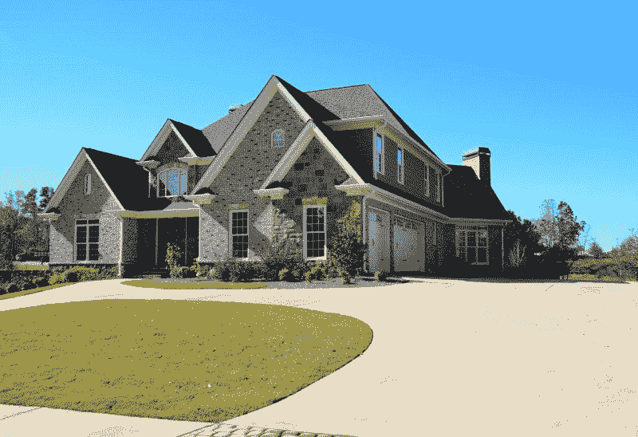
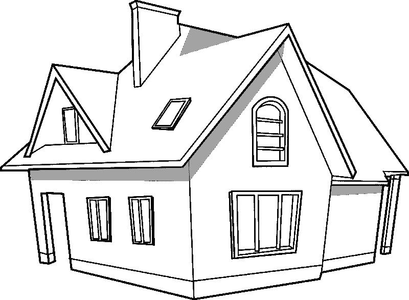
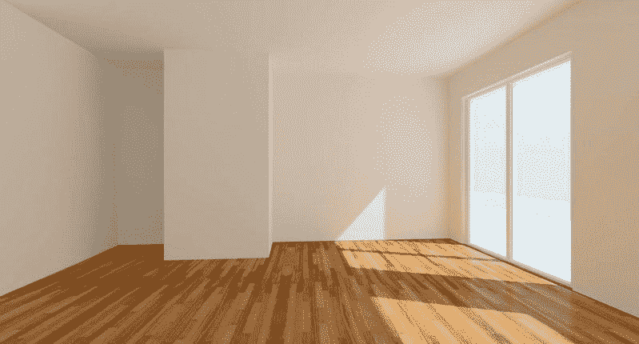
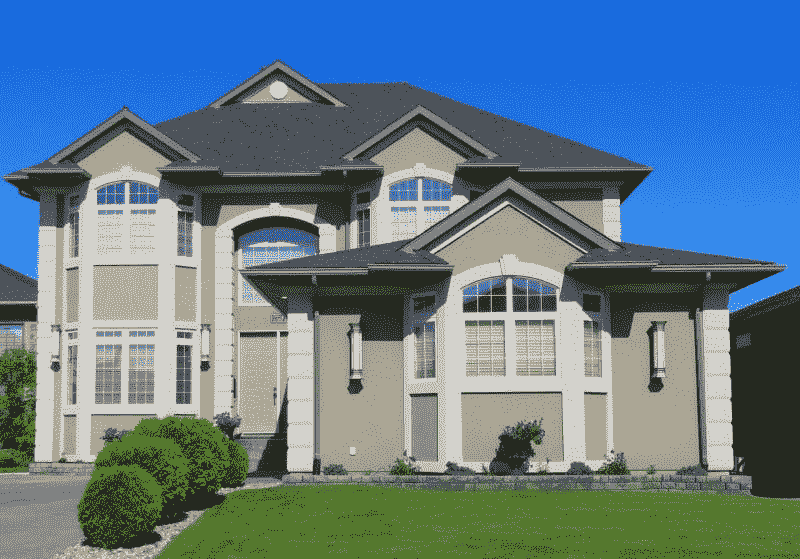

# 房市崩盘了吗？—市场疯人院

> 原文：<https://medium.datadriveninvestor.com/is-housing-crashing-market-mad-house-ecdb6eab1d8a?source=collection_archive---------9----------------------->

可怕的房地产数据让一些观察人士开始质疑“房地产市场正在崩溃吗？”

特别是，ATTOM Data Solutions [估计【2019 年 9 月至 10 月，美国止赎率上升了 13%。然而，美国的止赎率仍比 2018 年 10 月低 17%。](https://www.attomdata.com/news/market-trends/foreclosures/attom-data-solutions-october-2019-u-s-foreclosure-activity-report/)

此外，2019 年 9 月至 10 月，通过止赎收回房屋的数量上升了 14%。因此，贷方取消了更多房屋的赎回权，但赎回率仍然很低。

 [## 为什么包容性财富指数比 GDP 更能衡量社会进步？|数据驱动…

### 你不需要成为一个经济奇才或金融大师就能知道 GDP 的定义。即使你从未拿过 ECON 奖…

www.datadriveninvestor.com](https://www.datadriveninvestor.com/2019/03/08/why-inclusive-wealth-index-is-a-better-measure-of-societal-progress-than-gdp/) 

奇怪的是，丧失抵押品赎回权的情况越来越多的一个原因是，出售丧失抵押品赎回权的房产可能会更容易。解释一下，房价仍在上涨，这表明对住房的需求强劲。因此，贷款人有更多的动机取消房屋赎回权，因为他们可以出售房屋。

# 住房是泡沫吗？

据 T2 全国房地产经纪人协会估计，2013 年第三季度，美国 93%的城市地区房价上涨。

然而，据路透社[估计](https://www.reuters.com/article/us-usa-economy-housing/u-s-new-home-sales-dip-in-september-prices-fall-idUSKBN1X31VH)，2019 年 9 月美国平均房价下跌了 8.8%。详细来看，2019 年 9 月的平均房价比 2018 年 9 月低 8.8%，比 2019 年 8 月低 7.9%。

很明显，美国商务部估计，2019 年 9 月新屋销售下降了 0.7%。美国部分地区的新房销售下降更快。例如，西部新房销售数量下降了 3.8%，新房销售下降了 2.8%。

有趣的是，9 月份中西部新屋销售率上升了 6.8%。我怀疑较低的房价增加了中西部的需求。

最后，美国全国房地产经纪人协会估计，2019 年 9 月，在用现房销售额下降了 2.2%。因此，住房需求正在下降，这可能会引发经济衰退。

# 南加州存在房地产泡沫吗？

令人难以置信的是，在一些市场，住房需求仍在增长。

例如，南加州发行的新抵押贷款数量在 2018 年 10 月至 2019 年 10 月期间增长了 14%，*奥兰治县登记处* [估计](https://www.ocregister.com/2019/10/25/bubble-watch-this-housing-analyst-says-nope-no-bubble/)。相比之下，同期南加州挂牌出售的房屋数量下降了 10%。

房产分析师 Steve Thomas 告诉 *The Register* ，南加州没有泡沫。托马斯通过他的*报道追踪当地房地产的发展趋势。*

# 这比房地产泡沫更糟糕

具有讽刺意味的是，托马斯可能是对的，南加州和该国其他地区的情况可能比房地产泡沫更糟糕。

南加州可能正在经历一个“僵尸房地产市场”。当房地产价格上涨导致高价房产卖不出去时，就会出现僵尸房地产市场。

在僵尸市场中，即使没有人购买，价格仍然很高或持续上涨很长时间。因此，这个地区到处都是落满灰尘的空房子，送比萨饼的房地产经纪人，以及没有地方住的普通人。

值得注意的是，Zillow [估计【2019 年 11 月洛杉矶的平均房价为 696，900 美元。很能说明问题的是，Zillow 将洛杉矶房地产市场描述为“很酷”。这意味着洛杉矶的房地产没有动，但房价却在上涨。](https://www.zillow.com/los-angeles-ca/home-values/)

# 现在租房比买房便宜

房屋卖不出去的一个原因是，在大多数美国社区，租房可能比买房便宜。

在 ATTOM Data Solutions 分析的 755 个美国县中，有 59%的县租一套三居室的房子比买一套中等价位的房子更实惠。ATTOM 的 [*2019 年租金支付能力报告*](https://www.attomdata.com/news/most-recent/attom-data-solutions-2019-rental-affordability-report/) 估计，2018 年房价上涨率为 6.7%，而租金价格上涨率为 3.5%。

租金下降的一个原因是，ATTOM 声称，在美国 80%的县，房价的增长速度超过了工资的增长速度。因此，工薪阶层的钱少了，所以他们买的房子也少了。

# 收入不平等驱动僵尸房地产

因此，收入不平等推动了僵尸房地产，因为它创造了一个只有富人才能买得起房子的市场。由于富人数量少，房屋销售数量下降。

值得注意的是，ATTOM 调查显示，2018 年，52%的住房市场的平均租金上涨速度快于周工资。相比之下，在 at Tom 2018 年调查的 80%的市场中，房价上涨快于工资上涨。此外，在 at Tom 2018 年调查的 70%的市场中，房价上涨速度快于租金。

因此，在大多数美国房地产市场，租房更经济。这种情况产生了僵尸房地产，因为对住房的需求降低了，而对租房的需求却上升了。

一个相关的问题是，在美国许多城市很难建造新的租赁住房。澄清一下，分区和其他法律使得拆除单户住宅和建造多户出租变得困难。因此，在租金上涨的同时，房屋闲置未售。

# 美联储能做什么？

可怕的是，僵尸房地产可能成为美联储疲软房地产市场的标准疗法；利率降低，无效。该理论认为，低利率会导致更便宜的抵押贷款，从而刺激房地产市场。

值得注意的是，美联储在 2019 年三次降息。10 月，美国中央银行降息 0.25%至 1.5%，*钱* [报道](http://money.com/money/5661442/federal-reserve-interest-rate-cut-mortgage/)。然而，市场先生的反应是住房需求减弱。

我个人认为，降息通过降低抵押贷款利率，使房地产泡沫恶化。解释一下，这使得市场充斥着廉价信贷，从而更容易以高价购买房产。

这推高了房屋价值和价格，普通人被赶出了房地产市场。很明显，臭名昭著的澳大利亚房地产泡沫已经恢复，因为该国的中央银行正在降息，*卫报* [观察](https://www.theguardian.com/australia-news/2019/nov/16/from-freefall-to-boom-what-the-hell-is-happening-to-australias-housing-market)。

事实上，低利率助长了 2007—2008 年的房地产大崩盘，因为它让没钱的人很容易获得抵押贷款。例如，臭名昭著的忍者贷款。

# 僵尸地产的进攻

我认为这一次我们不会再看到这种情况了。相反，我预计我们将看到僵尸房地产价格升至普通人无法承受的新高。卖家会抬高房价，希望有一个拥有高信用额度的有钱人出现。

奇怪的是，我认为美联储能做的最好的事情是提高利率，并摧毁房地产市场。解释一下，提高利率会使抵押贷款更加昂贵，从而抑制购买。这可能会迫使业主将销售价格降至普通人能够承受的水平。

然而，我认为在今天的政治气候下，加息对美联储来说是不可能的。很明显，自由派斯科特·莫里森在 2019 年 5 月 18 日的澳大利亚大选中赢得了意外的胜利。在储备银行提高利率后，莫里森获胜。因此，尽管加息是正确的政策，但美联储不会加息。

# 美联储救不了我们

因此，美联储需要想出刺激经济的新招。不幸的是，美联储的刺激力量仅限于调整利率。

国会控制着其他形式的刺激措施，如增加政府支出、增加政府福利和扩大福利国家。联邦支出不太可能大幅增加，因为不同的政党控制着国会两院。

解释一下，民主党人；控制着美国众议院的共和党人不希望参议院共和党人因增加社会保障福利等受欢迎的新支出而邀功。同样，参议院共和党人不希望民主党承担新支出的责任。

# 政治家能做什么？

选民和总统候选人似乎意识到了这个问题。两位热门的民主党总统候选人美国参议员伯尼·桑德斯(来自佛蒙特州)和沃伦(来自马萨诸塞州)都主张增加社会保障。

具体来说，桑德斯希望将社会保障的平均支付额每年提高 1342 美元，沃伦希望将社会保障的平均支付额每月提高 200 美元，T2 希望每月提高 200 美元。黑马杨安泽(D-New York)走得更远；杨正在推动每月 1000 美元的自由红利，这是所有 18 岁以上美国人的基本收入。

我认为这些候选人说到点子上了。解释一下，我认为传统的美国住房市场将会萎缩。因此，传统的利率刺激将不再有效。无论美联储降低利率多少，房屋销售都会下降。

相反，利率刺激会让富人积累越来越多的资产，从而加剧收入不平等。日益加剧的不平等将加剧社会和政治动荡，让我们的城市变得不适合居住。

# 为什么住房需求会下降

我相信住房需求会下降，因为美国正在变老。例如，美国退休人员协会(AARP)估计，每天有 10，000 名婴儿潮出生的人年满 65 岁。

年纪大的人钱少，因为他们不太可能工作。此外，老年人通常把钱存起来，而不是花在住房上。

例如，富达估计，2019 年第三季度，196，000 名美国人的 401 (K)退休账户中有 100 万美元或更多。这一数字高于 2017 年第一季度的 93，000 人和 2018 年第三季度的 187，400 人。

因此，与其花钱；刺激经济；越来越多的美国人把现金塞在床垫里，因为老年贫困的前景让他们害怕。退休储蓄增长的一个原因是对社会保障未来的担忧。

# 社会保障将如何破坏房地产市场

从 2020 年开始，社会保障支出将超过税收和利息，*巴伦斯* [估计](https://www.barrons.com/articles/social-security-deficit-reserves-check-benefits-payroll-tax-51555958282)。因此，自 1982 年以来，社保费用将首次超过其收入。社会保障的受托人声称，如果这种情况持续下去，社会保障的资金将在 2035 年耗尽。

一个相关的问题是社会保障支付的小额款项。据社会保障管理局(SSA)估计，2019 年 9 月，平均每月社会保障老年和遗属福利为 1402.83 美元。

显然，一个月收入只有 1402.83 美元的人；也就是每年 16，833.96 美元，是买不起房子的。此外，除了社会保障以外一无所有的老年人会有强烈的动机卖掉他们的房子。

许多美国人除了社会保障什么都没有，因为商业内幕估计 26%的美国人没有退休储蓄。在这种情况下，我预测数以百万计的婴儿潮一代将很快卖掉他们的房子，让房屋充斥市场。

与此同时，年轻的美国人不会想要；或者买不起，这些房子导致大量新的僵尸房地产。那些老房子卖不出去的一个原因是许多老年人无法维护它们；因此，这些房产需要昂贵的维修或改造才能上市。正如我上面提到的，可以预见的是，许多市场的房屋销售已经在下降。

归根结底，我认为美国房价正在走向下跌。然而，我认为美国房地产将经历缓慢的下滑，而不是大崩盘。因此，在可预见的未来，美国将会有一个僵尸房地产市场。

*原载于 2019 年 11 月 18 日*[*【https://marketmadhouse.com】*](https://marketmadhouse.com/is-housing-crashing/)*。*