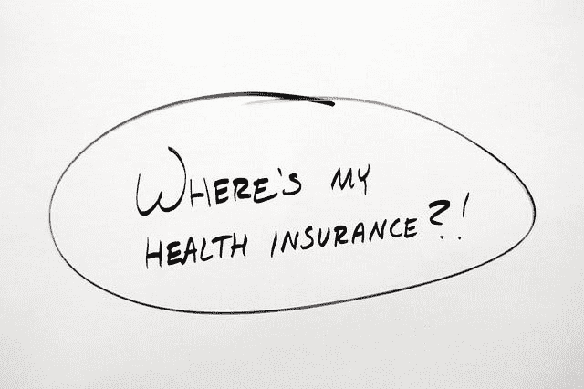
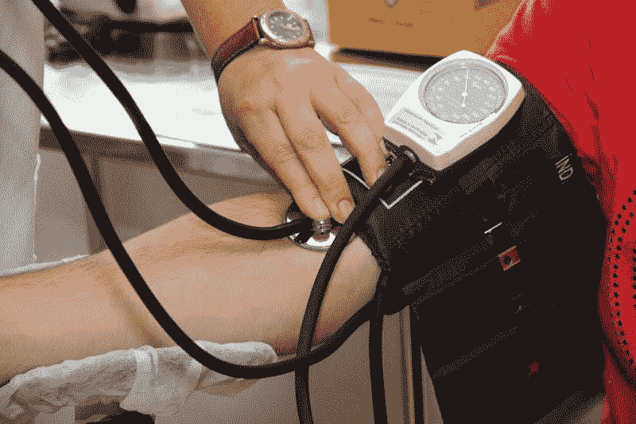

# Humana 是健康保险的价值投资吗？—市场疯人院

> 原文：<https://medium.datadriveninvestor.com/is-humana-a-value-investment-in-health-insurance-market-mad-house-aaf04668c39e?source=collection_archive---------11----------------------->

许多人会怀疑 Humana 是一项价值投资，因为健康保险公司不受欢迎。一个经典的价值投资策略是购买不受欢迎但有利可图的廉价公司。

市场先生；然而，严重高估了健康保险公司的股票。 **Humana(纽约证券交易所代码:HUM)**2019 年 8 月 14 日，股价为 296.07 美元。

健康保险公司的价值投资案例很容易证明。Humana 出售一种产品，大多数美国人使用。此外，这是一种大多数雇主和政府都愿意资助的产品。

 [## 大笔资金和尖端技术:人工智能/人工智能投资将如何革新医疗保健…

### 在过去几年人工智能(AI)和机器学习(ML)的显著发展中…

www.datadriveninvestor.com](https://www.datadriveninvestor.com/2018/03/22/big-money-and-cutting-edge-technology-how-investment-in-ai-ml-will-revolutionize-the-healthcare-industry/) 

# 健康保险是价值投资吗？

事实上，患者保护与平价医疗法案；[奥巴马医改](https://www.thebalance.com/how-does-obamacare-work-3306053)，要求雇佣 50 人以上的组织提供医疗保险。此外，奥巴马医改为一些美国人承保了私人健康保险。

最后，人们必须每月、每年或每季度向保险公司支付现金(保险费)来维持保险。因此，保险公司产生了沃伦·巴菲特最喜欢的东西之一:[浮动](https://medium.com/datadriveninvestor/is-float-the-key-to-wealth-building-82c03d5ce076)。解释一下，流动资金是一种持续的现金流，公司可以出于各种目的利用它。

详细地说，巴菲特拥有许多保险公司，因为它们产生浮存。然而，据我所知，**伯克希尔哈撒韦公司(纽约证券交易所代码:BRK。B)** 不拥有健康保险公司。反过来，巴菲特和他的朋友们；亚马逊(纳斯达克股票代码:AMZN)的杰夫·贝索斯(T9)和摩根大通(纽约证券交易所股票代码:JPM)的杰米·戴蒙(T11)正试图创建他们自己的非营利性医疗保健或健康保险公司，他们称之为避难所，美国消费者新闻与商业频道报道。

# 什么是 Humana 公司？

**Humana Inc .(纽约证券交易所代码:HUM)** 是美国第五大健康保险公司，拥有 1400 万投保人，*福布斯* [估计](https://marketmadhouse.com/is-humana-a-value-investment-in-health-insurance/#721a21a33aad)。

此外，Humana 经营着美国第七大药房，2018 年占美国处方药市场的 1.5%，*药品渠道* [估计](https://www.drugchannels.net/2019/02/the-top-15-us-pharmacies-of-2018-m.html)。详细说明，Humana 药房解决方案是一个邮购只有药房。*药品频道*估计 Humana Pharmacy Solutions 在 2018 年创造了 63 亿美元的收入。

因此，Humana 是健康保险的主要参与者，但是像 CVS 公司和联合健康集团这样的巨头要大得多。福布斯估计，联合健康集团在 2018 年拥有 4950 万保费持有人。相反，*药品渠道*估计，2018 年，Cigna/Express 脚本从 11%的美国处方药市场创造了 465 亿美元的收入。

# Humana 赚钱吗？

Humana 是健康保险的主要参与者，但它正在赚钱？目前，答案是肯定的。

具体而言，Humana 在 2019 年 6 月 30 日报告的毛利为 29.27 亿美元，收入为 162.45 亿美元。这些数字高于 2019 年 3 月 31 日的 26.14 亿美元毛利和 161.07 亿美元收入。事实上，Stockrow [估计 Humana 的收入在上个季度增长了 13.93%。](https://stockrow.com/HUM/financials/income/quarterly)

重要的是，Humana 在 2019 年 6 月 30 日报告的营业收入为 11.15 亿美元，净收入为 9.4 亿美元。这些数字高于三个月前的 8.47 亿美元和 5.66 亿美元。

# Humana 有多少现金？

此外，Humana 在 2019 年 6 月报告了 12.77 亿美元的自由现金流和 14.34 亿美元的运营现金流。这些数字比 2019 年 3 月 31 日报告的 7.57 亿美元和 8.96 亿美元大幅增加。

这些数字表明 Humana 可以生成大量的 float。另一方面，财务数字表明 Humana 不能产生恒定的浮动。

我认为，无法产生持续的浮动是沃伦·巴菲特远离医疗保险的原因。解释一下，巴菲特喜欢能产生持续现金流的公司，而不是偶尔有大笔收入的公司。因此，沃伦叔叔远离科技和医疗保险。

# Humana 有很多现金

然而，Humana 报告称，截至 2019 年 12 月 31 日，自由现金流为负-5.09 亿美元，运营现金流为负-3.33 亿美元。因此，健康保险是一场赌博，在这场赌博中，你可以很快产生或失去大量现金。

令人印象深刻的是，Humana 在 2019 年 6 月 30 日拥有 47.78 亿美元的现金和 99.91 亿美元的短期投资。因此，Humana 在 6 月底拥有 147.69 亿美元的现金资产。

相反，Humana 在 2019 年 3 月 31 日有 137.53 亿美元的现金和短期投资。Humana 的现金储备远低于去年；然而，Humana 在 2019 年 6 月 30 日有 175.16 亿美元的现金和短期投资。

# Humana 是好的分红股票吗？

Humana 于 2019 年 7 月 26 日支付了一年两次的 55₵股息。值得注意的是，该股息于 2018 年 7 月 27 日从 50₵增长。

然而，Humana 的股息可能是 27.5₵，如果他们支付季度。因此，Humana 正在使用一年两次的支付技巧来使其股息看起来更大。

另一方面，Dividend.com 认为 Humana 在 2019 年 8 月 14 日实现了八年的股息增长，股息收益率为 0.74%，年化支付额为 2.20 美元，派息率为 15.5%。

我不认为 Humana 的股息证明股价是合理的。此外,“市场先生”对 Humana 的定价过高，因此这不是一项价值投资。

# 下一代医疗保健组织威胁人类

Humana 在今天的环境中面临着几个严重的生存威胁。目前，这些威胁中最大的是下一代医疗保健组织。

下一代组织将医疗保健提供商和健康保险公司结合在一起。这种商业模式并不新鲜，[健康维护组织](https://www.investopedia.com/terms/h/hmo.asp)(HMO)，如[凯泽医疗机构](https://healthy.kaiserpermanente.org)；和英国国民健康服务(NHS)自二战以来就存在了。不同之处在于税收为国民健康提供资金，而保费为凯撒医疗保险提供资金。

然而今天，一些公司试图通过伪装成零售商店来复兴健康维护组织。另一个区别是，下一代医疗机构利用便利和低价来推销他们的服务。

例如，Humana Pharmacy Solutions 通过邮件和在线订购提供处方。因此，药房解决方案提供了一种更容易、更便宜、更方便的获取处方的方式。它的顾客不需要去药房排队领药。

# 大零售是对 Humana 的威胁吗？

像 [**【克罗格】**](https://www.thelittleclinic.com/) **(纽约证券交易所代码:KR)**[**沃尔格林**](https://www.walgreens.com/pharmacy/schedule-appointment.jsp?frm=clinic) **(纳斯达克代码:WBA)****沃尔玛(纽约证券交易所代码:WMT)** 和 CVS Health 这样的公司通过在他们的商店提供方便的低成本诊所，将这种模式推向了一个新的高度。

例如，CVS 推出了一家新概念药店，将 20%的店面空间用于医疗保健，*《今日美国》* [报道](https://www.usatoday.com/story/money/2019/02/13/cvs-concept-store-introduced-space-health-care-services/2845846002/)。与此同时， [CVS 收购安泰](https://marketmadhouse.com/will-cvs-aetna-make-money/)；美国第三大健康保险公司。

我认为下一代医疗保健提供商的下一个合理步骤是收购手术中心、医院、救护车公司，可能还有疗养院。例如，在英国，国家医疗服务体系经营着医院、诊所，甚至救护车服务。

此外，亚马逊、伯克希尔·哈撒韦和摩根大通的 [Haven Healthcare](https://havenhealthcare.com/vision) 可以开创这种模式的非营利变体。然而，Haven 的网站没有提供多少计划的细节。

公众的反对可能会阻碍这种联合医疗业务的发展。值得注意的是，在 20 世纪 90 年代，公众的愤怒阻止了美国健康保险公司转向以 HMO 为主的系统。最近，草根政治反对派阻碍了奥巴马医改。

# 全民医保来了吗？

对人类来说，一个更大但可能更致命的威胁是全民医保的政治运动。澄清一下，全民医保是由税收资助的所有公民的政府健康保险的委婉说法。

全民医保很有可能实现，因为它很受欢迎。事实上，2019 年 7 月 *NPR/PBS 新闻一小时/Marist 民意调查* [估计](https://www.npr.org/2019/07/22/743516166/npr-newshour-marist-poll-americans-not-sold-on-trump-or-democrats) 70%的美国人支持全民医保。此外，同一调查发现，41%的美国人希望取消私人健康保险。

可以预见的是，政治家们正在关注这些数字。据报道， *Axios* [报道，前四名民主党总统候选人中有三名表示支持全民医保。具体来说，美国参议员卡玛拉·哈里斯(加利福尼亚州民主党)、伯尼·桑德斯(佛蒙特州共和党)和伊丽莎白·沃伦(马萨诸塞州民主党)公开支持全民医保。](https://www.axios.com/2020-presidential-candidates-medicare-for-all-7d958bab-de34-4d8c-921d-b561f201c4c2.html)

# 全民医保即将到来，做好准备

在 2019 年 7 月 27 日至 29 日的爱默生民意调查中，领先的候选人是前副总统乔·拜登(特拉华州民主党)，支持率为 33%，桑德斯为 20%，沃伦为 14%，哈里斯为 11%。因此，45%的民主党选民支持支持全民医保的候选人。

如果再加上另外三名声称支持全民医保的候选人，杨安泽(纽约州民主党)、朱利安·卡斯特罗(得克萨斯州民主党)和美国众议员塔尔西·加巴德(夏威夷州民主党)，这个数字将上升到 50%。为了澄清，艾默生给杨 2%的可能的民主党初选选票，加巴德和卡斯特罗 1%。

鉴于这些数字，我认为为全民创造医疗保险的努力是不可避免的。此外，我怀疑民主党人如果明年赢得国会的控制权，他们会试图实施全民医保。不幸的是，没有迹象表明全民医保将如何发挥作用。

因此，全民医保对所有投资者和投机者来说都是一个威胁。我认为全民医疗保险和下一代医疗保健的威胁使得 Humana 成为一项前景黯淡的糟糕的长期投资。

因此，Humana 不是一项价值投资，因为健康保险市场的潜在变化可能会限制其增长前景。

*原载于 2019 年 8 月 14 日*[*【https://marketmadhouse.com】*](https://marketmadhouse.com/is-humana-a-value-investment-in-health-insurance/)*。*