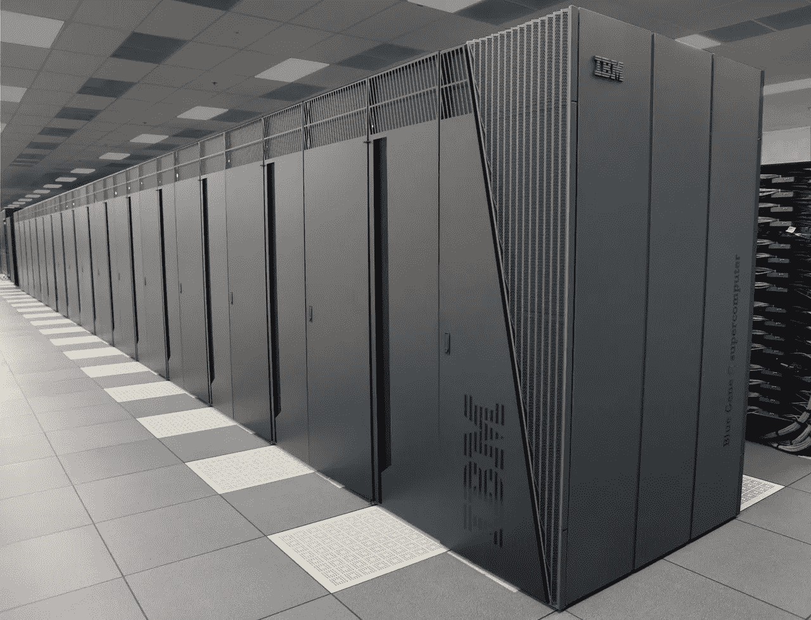

# IBM(纽交所代码:IBM)赚钱了吗？

> 原文：<https://medium.datadriveninvestor.com/is-ibm-nyse-ibm-making-money-81cc7e9dc4c7?source=collection_archive---------10----------------------->

IBM(纽约证券交易所代码:IBM) 表现得像一家绝望的公司。例如，美国计算机行业的鼻祖刚刚花了 340 亿美元收购了**红帽公司(纽约证券交易所代码:RHT)** 。

此次收购可能是一次孤注一掷的举动，因为 Red Hat 从事的业务与 IBM 截然不同。澄清一下，IBM 是一家传统的计算机公司，Red Hat 销售基于 Linux 的开源解决方案。

然而，IBM 是软件业的主要参与者。巴伦的[指出](https://www.barrons.com/articles/with-red-hat-ibm-makes-a-big-cloud-promise-the-reality-is-far-more-hazy-1541199704)，该公司长期以来一直定位于硬件之外。例如，IBM 在 2004 年将其 PC 业务出售给联想，在 2014 年将其服务器业务出售给联想。

**红帽会帮助 IBM(纽约证券交易所代码:IBM)征服云吗**

红帽将帮助 IBM (NYSE: IBM) 与微软(NASDAQ:MSFT)**和 Alphabet (NASDAQ: GOOG)** 等基于云计算的对手竞争。

值得注意的是，微软刚刚完成了对大规模开源软件注册表 GitHub 的 75 亿美元收购。GitHub 的所有权给了微软 2800 万软件开发者和 180 万组织的工作。

拥有 Red Hat 使 IBM 能够使用各种基于 Linux 的解决方案。此外，红帽的 Linux 专长是亚马逊网络服务(AWS)的东西。例如，Barron 的估计，AWS 的销售额在 2018 年第三季度增长了 46%。

人们担心亚马逊(纳斯达克股票代码:AMZN) 会用 AWS 把 IBM 挡在云之外。面向商业客户的云服务是 IBM 业务的重要组成部分。

**红帽会给 IBM 带来很多价值**

**红帽(NYSE: RHT)** 会给国际商业机器带来很多价值。

例如，红帽拥有世界上最大的开源技术组合，*福布斯*撰稿人 Panos Mourdoukoutas [声称](https://www.forbes.com/sites/panosmourdoukoutas/2018/11/03/3-things-ibm-sees-in-red-hat-that-others-missed/#6fce9ac224cf)。此外，红帽运营着一个创新的混合云平台。

锦上添花的是，Red Hat 在开源开发者社区中备受推崇。因此，IBM 获得了大量有经验的开源开发者来扩展其软件范围。

例如，IBM 可以在区块链的项目中利用这些开发人员，如 [Hyperledger](https://www.ibm.com/blockchain/hyperledger) 。除此之外，Red Hat [声称](https://www.redhat.com/en/engage/business-value-rhel-20171117?sc_cid=701f2000000tvTpAAI&gclid=CjwKCAjwsfreBRB9EiwAikSUHQK6Ei0p6hOXiA9MOM-W2XSl03KuB2ybDTfgHQ5xI4-4UAkyIj7PZBoCBmsQAvD_BwE&gclsrc=aw.ds)它的 Enterprise Linux 提供了 348%的投资回报，减少了 68%的停机时间，加快了 26%的开发速度。我怀疑这些说法，但它们展示了红帽技术的潜力。

**IBM(纽约证券交易所代码:IBM)与收入缩水作斗争**

IBM(纽约证券交易所代码:IBM) 正在与不断缩水的收入作斗争。例如，IBM 的收入在 2018 年第三季度萎缩了 2.07%。

这一数字标志着 IBM 连续三个季度收入增长的结束。详细来说，IBM 的收入在 2018 年第二季度增长了 3.7%，在 2018 年第一季度增长了 5%，在 2017 年第四季度增长了 3.55%。然而，这几个季度标志着连续几个季度收入萎缩的结束。

尽管收入缩水，IBM 仍在赚钱。例如，蓝色巨人报告 2018 年第三季度的毛利为 88.03 亿美元。此外，IBM 在 2018 年第三季度的营业收入为 31.88 亿美元，净收入为 26.94 亿美元，收入为 187.56 亿美元。

**IBM 是一家现金充裕的公司**

IBM 是一家现金充裕的公司，截至 2018 年 9 月 30 日，其自由现金流为 32.89 亿美元，运营现金流为 43.32 亿美元。

此外， **IBM(纽约证券交易所代码:IBM)** 在 2018 年 9 月 30 日记录了 117.31 亿美元的现金和等价物以及 29.32 亿美元的短期投资。因此，IBM 在 2018 年 9 月 30 日的银行存款为 146.63 亿美元。

因此，IBM 有现金购买红帽。但是红帽本身赚钱吗？红帽会给 IBM 增加收入还是拖累蓝色巨人的底线？

**红帽赚钱了吗？**

红帽赚不了那么多钱。例如，Red 在 2018 年 8 月 31 日报告的净收入为 8685 万美元，营业收入为 1.3456 亿美元。

相反，红帽在 2018 年第三季度的收入为 8.2275 亿美元，毛利润为 7.0382 亿美元。这使得红帽在 2018 年 8 月 31 日的运营现金流为 1.3275 亿美元，投资现金流为 8738 万美元，自由现金流为 1.1588 亿美元。

**红帽(NYSE:RHT)**2018 年第三季度累计现金和短期投资 17.48 亿美元。详细来说，红帽在 2018 年 8 月 31 日记录了 15.04 亿美元的现金和等价物，以及 2.6495 亿美元的短期投资。

**红帽是价值投资吗？**

从财务数字来看，红帽公司是一家盈利的公司。此外，红帽看起来像沃伦巴菲特式的价值投资。

解释一下，Red Hat 是一家默默无闻、现金充裕的公司，专门从事基础设施建设。特别是，enterprise Linux 是一种非常无趣但却是必要的计算机基础设施。

因此，Red Hat 是一项价值投资，将为 IBM 增加价值。希望 IBM 的管理层能像红帽一样进行投资。

然而，红帽不支付股息，其股价在 2018 年 11 月 5 日高达每股 171.91 美元。因此，我把 Red Hat 归类为一只你可以安全地花更多钱购买的股票。

**IBM(纽交所代码:IBM)是价值投资吗？**

**IBM(纽约证券交易所代码:IBM)**；另一方面，现在是价值投资。例如，IBM 以合理的股价提供高股息。

值得注意的是，IBM 在 2018 年 11 月 4 日向股东提供了 5.43%的股息收益率，6.28 美元的年化派息，45.4%的派息率。锦上添花的是，IBM 的股息在过去 18 年里一直在增长。

最棒的是，IBM 将在 2018 年 12 月 10 日支付 1.57 美元的股息。这一股息高于 2018 年 2 月的 1.50 美元和 2 月的 1.40 美元。因此，IBM 的股息在过去两年中增长了 17。

因此，在 2018 年 11 月 5 日报告的 119.82 美元的股价下，IBM 是一只伟大的股息股票。