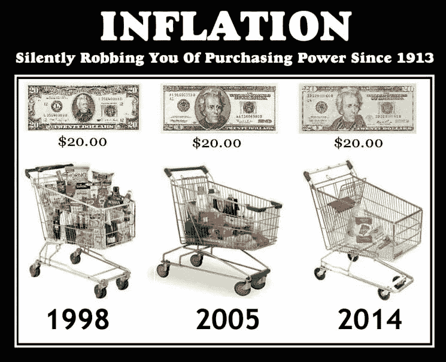

# 通胀保护是加密货币接受度的圣杯吗？

> 原文：<https://medium.datadriveninvestor.com/is-inflation-protection-the-holy-grail-for-cryptocurrency-acceptance-295c2ce72005?source=collection_archive---------3----------------------->

为什么我们会有比特币，以太，涟漪？经济需求是什么？首先让我们排除纯粹的投机因素；投机者会买卖任何东西，价格波动越大越好。那么我们为什么需要加密货币呢？先说比特币，因为这基本上是所有被接受的加密货币的起源。

比特币的诞生是为了允许不受中央政府控制的点对点资金转移。但是比特币令人难以置信的令人兴奋之处在于**供应受到控制**并且比特币的已知数量是预先确定的。换句话说，没有人可以仅仅印刷更多的比特币来摆脱预算赤字。我们知道现在有多少，将来会有多少。

那么这如何保护我们免受通货膨胀的影响呢？制造恶性通货膨胀的最可靠方法之一就是“印刷”更多的货币。想想像魏玛德国、委内瑞拉和阿根廷这样的国家，大规模印钞导致了恶性通货膨胀。那么如何才能防止通货膨胀呢？通过限制货币供应。让我们看一个假设的情况来说明这一点。

假设你和我是岛上仅有的两个人，我们使用贝壳作为交换媒介(交换媒介是货币的一种奇特说法，它是我们用来交易而不是交换的东西)。这个岛上只有 100 个贝壳，所以所有的商品和服务都用 100 个贝壳来定价。我给你两条鱼，你给我两个贝壳。你卖给我 5 个小时的农场劳动，我给你 5 个贝壳作为回报。

如果 100 个贝壳奇迹般地被冲上沙滩，会发生什么？我们每个人都多了 50 个贝壳！！万岁！我们刚刚增加了 100%的货币供应量，我们都觉得自己很富有。但是现在，当要向你购买 1 小时的农场劳动时，我给你 2 个贝壳，而不是 1 个贝壳。当我卖给你两条鱼时，我现在收到 4 个贝壳，而不是 2 个。**一切都上涨了 100%** 为什么？因为货币供应量增加了 100%。

增加货币供应，也就是印钞或量化宽松，只会增加商品成本，推高资产价格。这是我们一直存在万物泡沫的原因之一；中央银行印了大量的钱，这些钱需要投资到某个地方。我们在股票、债券、商业地产、艺术品、收藏车等方面的价格增长令人难以置信。因为这些钱需要去某个地方。如果你已经拥有了很多东西，你会变得更加富有。如果你什么都没有，那么你会看到所有东西的价格都比你的工资涨得快。

因为比特币是少数几个考虑到货币供应的加密货币之一，它明确避免了恶性通货膨胀的可能性。还有其他加密货币，特别是考虑到货币供应的 [stablecoins](https://medium.com/@sungwilshire/do-we-need-stablecoins-ef0a3af8a6c8) ，但比特币是最被接受和使用最广泛的。

