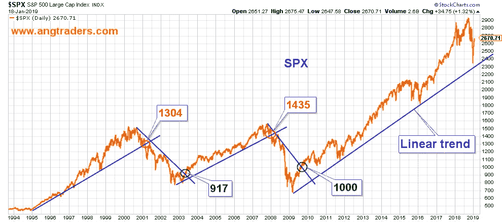
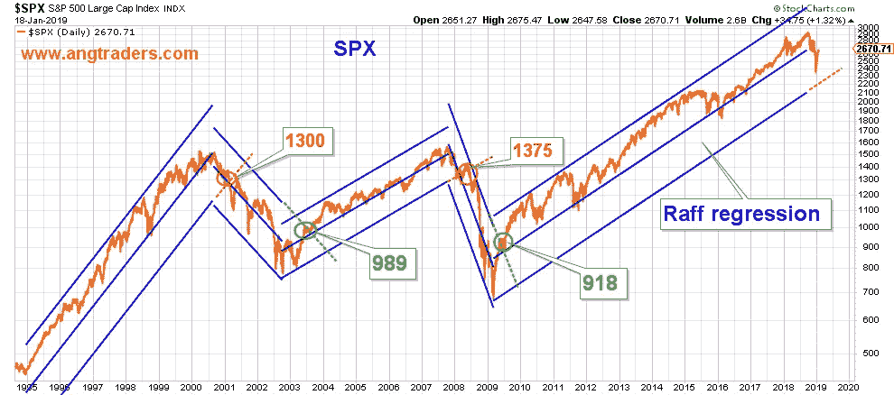

# 这是一次调整，还是熊市的开始？

> 原文：<https://medium.datadriveninvestor.com/is-it-a-correction-or-the-start-of-a-bear-market-99d67a04efb4?source=collection_archive---------22----------------------->

毫无疑问，牛市伴随着经济扩张。此外，牛市和熊市都会经历调整，而且调整的深度各不相同。熊市与牛市相反；主要趋势是在牛市中上涨，在熊市中下跌。**修正，在牛市和熊市中，** **不改变初级** **趋势**。

在最近的回调中，确定主要趋势是否被打破变得至关重要。如果主趋势被突破，那么我们需要开始平仓。但如果它没有被突破，那么我们将等待'买入'的机会。

主要趋势可以在线性图表或对数图表上显示。在前一种情况下，沿着低点画一条简单的直线来确定牛市趋势，沿着高点画一条简单的直线来确定熊市趋势(下面的第一个图表)。当 SPX 穿过趋势线时，主趋势被打破，新趋势建立。

在对数标度图上，我们使用 Raff 回归来产生上限和下限(如下图)。在这种情况下，如果突破了下限线的外推(红色虚线)，则牛市趋势被打破，如果突破了上限线的外推(绿色虚线)，则熊市趋势被打破。

在这两种情况下，科技股泡沫的破裂都发生在 1300 点左右，但在线性图上(1435 点)比在对数图上(1375 点)更早破裂。房地产泡沫的开始也是首先在线性图上标出(在 917 处)，然后在对数图上标出(在 989 处)。但是目前牛市的起点是对数图上的市场(918 点)，然后是线形图上的市场(1000 点)。

这里的教训是，我们监控两种类型的图表，并根据第一个趋势变化的图表采取行动。目前，线性图在大约 2350 处有潜在的突破，对数图在大约 2300 处有，这意味着*线性*趋势线更接近被突破。如果它被突破(收盘时)，我们将开始平仓多头头寸。**然而，考虑到经济仍处于扩张阶段，我们认为不太可能出现缺口。在持续的牛市中，我们经历了正常的调整。**

**昂商**

**在**[**www.angtraders.com**](http://www.angtraders.com)**加入我们，复制我们的交易和利润。**