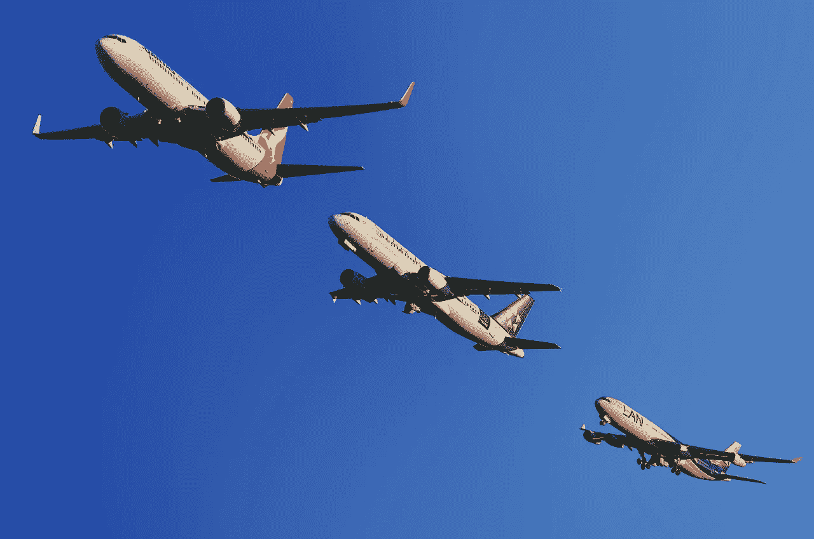
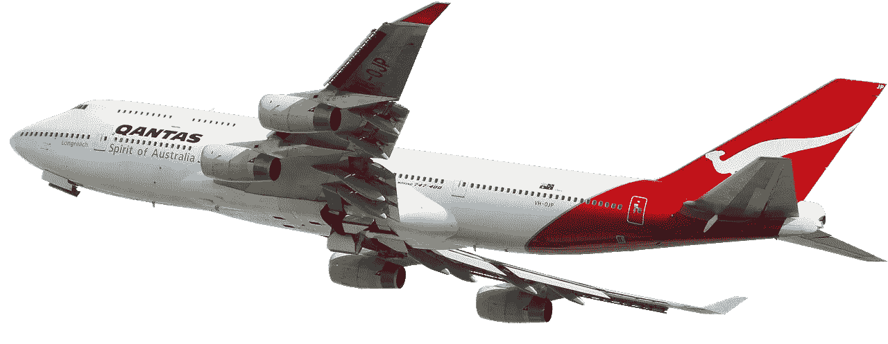
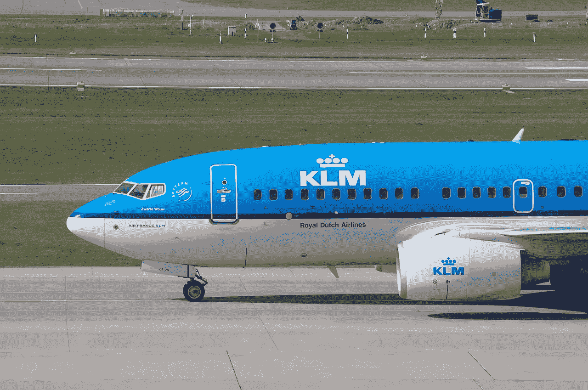
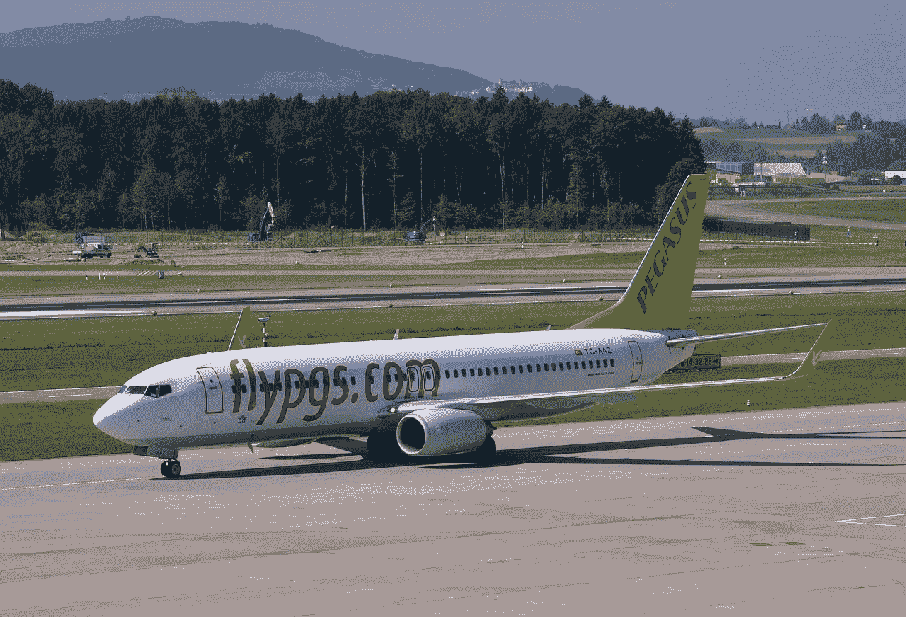

# 现在是买波音的好时机吗？

> 原文：<https://medium.datadriveninvestor.com/is-it-a-good-time-to-buy-boeing-5445aa556f12?source=collection_archive---------3----------------------->

许多人在问，根据经典的价值投资理论，现在是购买波音公司股票的好时机吗？事实上，价值投资 101 的一个关键教训是，当一家好公司出现问题时，买入它。

波音公司遇到了问题，因为它的 737 Max 客机正在坠毁。例如，彭博[报道](https://www.bloomberg.com/news/articles/2019-03-24/american-extends-737-max-flight-cancellations-through-april-24)，美国航空公司每天取消 90 个航班，因为他们停飞了 737 Maxes。另外，因为软件问题，世界上每个国家都在停飞 737 Max。

然而，737 Max 只是波音公司制造的七种客机型号之一。此外，成千上万的波音客机在世界各地飞行，没有坠毁。

最后，波音比客机赚得多。例如，波音公司为世界武装部队制造战机、直升机、无人机、货机和各种武器。除此之外，波音公司还为美国国家航空航天局和私营企业制造火箭、太空舱和探测器。

# **波音公司赚钱了吗？**

因此，737 Max 只是波音公司业务的一部分。因此，该公司可以在没有 737 Max 的情况下生存和赚钱。所以，现在是问波音是否赚钱的好时机？

最新的财务数据给出的答案是肯定的。例如，波音公司报告称，2018 年第四季度的总利润为 62.51 亿美元，收入为 283.41 亿美元。

 [## 为什么包容性财富指数比 GDP 更能衡量社会进步？-数据驱动…

### 你不需要成为一个经济奇才或金融大师就能知道 GDP 的定义。即使你从未拿过 ECON 奖…

www.datadriveninvestor.com](https://www.datadriveninvestor.com/2019/03/08/why-inclusive-wealth-index-is-a-better-measure-of-societal-progress-than-gdp/) 

此外，波音公司 2018 年第四季度的营业收入为 41.76 亿美元，净收入为 34.24 亿美元。除此之外，波音公司 2018 年第四季度的运营现金流为 29.47 亿美元，自由现金流为 24.55 亿美元。

因此，波音公司正在赚钱，并有资源度过 737 Max 的崩溃。例如，波音公司在 2018 年 12 月 31 日拥有 76.37 亿美元的现金和等价物，以及 9.27 亿美元的短期投资。因此，截至 2018 年底，波音公司的银行存款为 86.54 亿美元。

# 波音将从 737 Max 的问题中幸存下来

因此，波音公司有足够的钱支付诉讼和修理飞机。特别是，波音公司可以通过对计算机系统进行简单升级来解决 737 Max 的安全问题， *Vox* [声称](https://www.vox.com/the-goods/2019/3/22/18277694/boeing-737-max-ethiopian-airlines-lion-air-safety)。

例如，波音公司可以将 737 Max 重新命名，并在安全升级后继续销售。在这种情况下，坠机事件很难像歇斯底里的记者描述的那样是波音公司的灾难。

奇怪的是，通过迫使波音强制实施安全功能，这些事故可能会让波音成为一家更好、更赚钱的公司。因此，波音可以通过销售更安全的客机来赚更多的钱。

此外，坠机事件可能导致管理层重组，这也可能使波音成为一家更好的公司。因此，从长远来看，危机可以让好公司变得更强大、更有利可图。

# **波音是一只优秀的分红股票**

**波音(纽约证券交易所代码:BA)** 现在几乎不是价值投资，因为其股价在 2019 年 3 月 26 日高达 370.46 美元。

然而，波音公司在 2018 年 3 月 1 日向投资者支付了每股 2.055 美元的高额股息。此外，34.5₵在 2018 年 12 月至 2019 年 3 月期间增加了股息。

事实上，波音公司在 2018 年 12 月支付了 1.71 美元的股息，在 2017 年 12 月支付了 1.42 美元的股息。因此，波音公司的股息在一年多一点的时间里增长了 63.5₵。

令人印象深刻的是，波音投资者享受了七年的股息增长，年化股息为 8.22 美元，股息收益率为 2.22%，2019 年 3 月 26 日的派息率为 56.3%。总之，尽管股价很高，波音公司是一只优秀的分红股票。

# **你现在应该买波音公司的股票吗？**

波音是目前值得关注的好股票，但它的运营引发了严重的问题。特别是，波音公司的道德问题令人担忧。

令人不安的是，今年有数百人死于两起 737 Max 坠机事件。一次简单的安全升级就可能避免的撞车事故。

此外，波音公司还为军方制造战机、直升机、导弹和无人机。其中一些飞机正在军事行动中使用，包括现在对平民目标的攻击。

# **波音是很好的分红股票**

在这种情况下，对于不喜欢道德上有问题的公司的人来说，波音不是一只股票。然而，这是一只正在经历艰难时期的优秀股息股。

另一方面，在稳健的公司中寻找高股息股票的投资者可能会喜欢波音公司。尽管存在问题，波音公司仍在盈利，并支付了丰厚的股息。

我给投资者的建议是，调查波音公司，但要明白你会让自己陷入什么样的境地。波音是一家有严重问题的好公司，对一些人来说可能是一笔不错的投资。