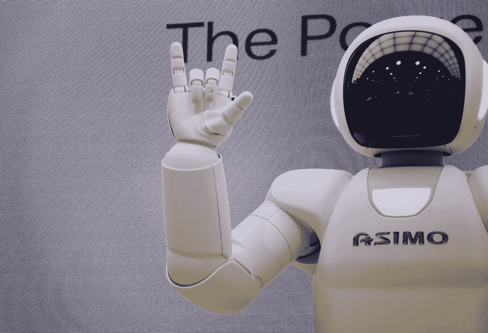

# 是 AI 还是分析学？

> 原文：<https://medium.datadriveninvestor.com/is-it-ai-or-analytics-8488cd37c450?source=collection_archive---------7----------------------->

## 内部人工智能

**这篇文章是对迈克尔·裘德的文章*“实用人工智能:或者为什么它说的一切是，不是”*的文献综述，可在**[**InfoWorld**](https://www.infoworld.com/article/3280233/practical-ai-or-why-everything-that-says-it-is-isn-t.html)**上找到。**

Franck V. @franckinjapan. Photo gallery available on Unsplash.com.

在今天这个科技发达的时代，人工智能或 AI 一词在各代人中变得越来越流行。因此，IT 公司正在利用人工智能越来越受欢迎的优势，通过声称在应用程序中实现人工智能来增加销售，这可能不是真的。事实上，围绕人工智能这个术语存在误解，因为它经常被误认为是分析。尽管这两个术语之间存在显著差异，但人工智能最常被用来指分析。

一般来说，分析使用静态数据建模和统计相关性将原始数据转化为有价值的信息；而人工智能使用动态和自动化的数据建模来创造洞察力，并可以发展到自己合并数据。使用这两个定义，似乎大多数 it 应用程序和商业智能软件都使用分析，而不是人工智能。人工智能在 IT 应用中的实现并不简单，因为它需要大量的支持才能很好地工作。人工智能需要全面的数据准备、数据预处理、定制和培训，因为大多数人工智能应用程序都是特定于任务的。因此，AI 在 IT 应用中的实现并不实用，正在考虑 AI 的 IT 公司应该在市场上寻求实用的 AI 替代方案，而不是自己开发。

 [## 模式和机器人:一个复杂的现实数据驱动的投资者

### 哈耶克的名著《复杂现象理论》(哈耶克，1964)深入探讨了复杂性的话题，并断言…

www.datadriveninvestor.com](https://www.datadriveninvestor.com/2019/03/04/patterns-and-robotics-a-complex-reality/) 

这篇文章在人工智能辩论中提出了一个很大的问题。人工智能的概念被许多人误解，它在推销中的应用错误地吸引了消费者。IT 公司正在利用围绕人工智能的炒作，并将他们的产品错误地标榜为人工智能应用，而事实并非如此。越来越需要对消费者和 IT 公司进行人工智能教育，并在 IT 应用中实现实用的人工智能。，使其词源不再被误用。此外，在大多数情况下，在 IT 应用中使用 AI 是不实际的，而使用分析是实际可行的。因此，人工智能的实施不一定比分析的使用更好，但人工智能这个术语的误用一直在歧视分析的力量。