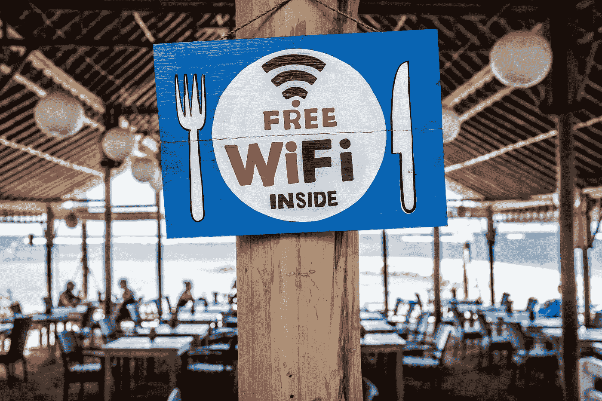

# 连接机场 WiFi 安全吗？

> 原文：<https://medium.datadriveninvestor.com/is-it-safe-to-connect-to-airport-wifi-fbf280eab9d7?source=collection_archive---------10----------------------->

Photo by [Bernard Hermant](https://unsplash.com/@bernardhermant?utm_source=medium&utm_medium=referral) on [Unsplash](https://unsplash.com?utm_source=medium&utm_medium=referral)

我在机场。我的航班已经延迟了 3 个小时。我有我的笔记本电脑，我想使用免费的 WIFI，但我一直害怕在机场使用 Wifi。我并没有隐瞒什么。反之亦然。比方说，我拥有一个人拥有的平均信息量，我想隐藏起来。但是每次我不能上网的时候，我都有一些可怕而紧急的问题，只有网络才能解决。就像……在《快乐的日子》里，那个不酷的丰兹的表弟叫什么名字，那个可以从他的胳膊肘上拿走很多硬币并且再也不会出现在所有电视连续剧里的人？还有……如果海豚和鲸鱼是哺乳动物，我们真的可以用它们的“奶”制作奶酪吗？味道如何？

为了知识的更大利益，我不得不再次放弃我的隐私，然后用谷歌搜索这些问题。“安吉”是方兹的表妹。不清楚奶酪。潜在的可能性，但没有人这样做。

完成了。我的隐私没了。但是连接公共 WIFI 实际上有多安全呢？我的意思是机场 wifi 的条款和协议公平吗？如果是的话，连接到公共 wifi 有多安全？

关于第一个问题。即使我有三个小时的时间，我也不能在没有睡着的情况下看完任何条款和协议的前三行，但爱德华·斯诺登公布了关于这个问题的文件。加拿大国家安全局有一个程序，能够在连接发生后的几周内跟踪和获取连接到机场 wifis 的手机/设备的信息，即使机场已经关闭。我想这不是他们的条款和协议，所以我节省了很多时间…

专家表示，他们拥有“关于我们运动和社会关系的非常精确的信息。”Wifi 提供商 Boingo 表示，他们从未向 CSEC 或其他加拿大情报机构提供乘客的 Wi-Fi 使用信息。目前还不清楚他们是如何入侵该系统的。其他泄露的文件显示，一个项目的试点能够利用他们的技术在一个中等城市(30 万人口)跟踪一个虚构的绑架目标。即使有可能，这两种技术也不能说是有联系的。

所以第一个问题的答案是:有证据表明政府机构可能会监视我们，尽管已经证明这种事只发生在加拿大。

关于另一个问题，如果连接到公共 wifi 是安全的，答案是:是和不是。

HTTPS 网站使所有数据加密，很难“嗅”我们的连接，所以如果我们不是一个特定的目标，我们正在访问这类网站是不太可能的。而且现在一半以上的网站都是 Https。但谷歌 2018 年的一项审计称，前 100 名网站中有 80%没有默认部署 HTTPS。

黑一个公网有多容易？当我快速按下键盘上的键时，我真的需要流汗吗？当绿色的代码行显示在我的屏幕上，伴随着嘈杂的哔哔声，倒计时慢慢变为零。

答案是“只要你真的想做得有风格”。即使你对安全领域知之甚少，只要花 99 美元，你就可以用一个名为“菠萝”的特殊设备成为一名黑客。显然，他们甚至向不戴厚眼镜的人出售这种眼镜。难以置信。

它的创造者达伦·基钦是一名圣灵降临派教徒。他创建这个工具的原因是为了提高对网络安全的认识，让大众可以使用这个产品来展示现代网络中一些非常容易受到影响的大漏洞，以便内部人员在处理这些事情时采取预防措施。

该设备非常容易安装，并带有一系列标准功能。

“绵羊墙”利用前面提到的 HTTP 网站的弱点，显示访问某个网络中不安全网站的所有设备。

“中间人”使用设备的一个特征来连接到已知的网络。当你回家时，你的手机会自动连接到家庭网络，这是因为你的家庭网络有一个特定的 SSID，可以被你的设备识别。中间人攻击读取附近路由器的 SSID(例如在免费 wifi 中)并复制它，因此您的设备将自动连接到它。

这种攻击的第二步是创建一个伪造版本的网站，受害者通过[邪恶门户](https://github.com/kbeflo/evilportals)访问该网站，这将创建一个本地网络版本的网站，所有密码/信用卡数据都将存储在该网站中。另一种可能性是进行另一次 pinepple 攻击，这将改变用户发出的 HTTP 请求。因此，当用户访问一个网站时，发送一个请求，并收到该请求的安全版本的网站，菠萝能够剥离安全版本，并提供一个 http 版本，易于嗅探。

我们如何避免陷入这些攻击？

最重要的建议是:使用网络后，永远不要忘记你的网络。仔细看你的网名，看是不是原创。使用 VPN。使用 VPN，即使您连接到菠萝，也只会在流量事件中显示加密消息。一定要用 Https 网站！

使用 WireShark 之类的软件也可以实现上述所有功能以及更多功能。

我刚写完就发现了，之前的延迟现在又加了一个小时。我确信这是国家安全局对这篇文章的惩罚。

来源:[副](https://motherboard.vice.com/en_us/article/pa39xv/pineapple-wifi-how-to-mitm-hack)和 [CBC](https://www.cbc.ca/news/politics/csec-used-airport-wi-fi-to-track-canadian-travellers-edward-snowden-documents-1.2517881)