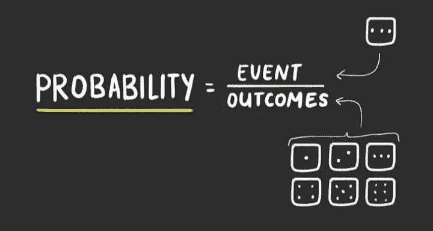
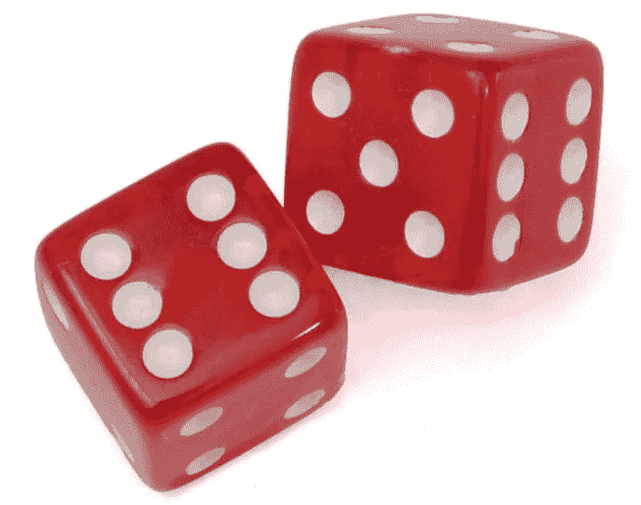
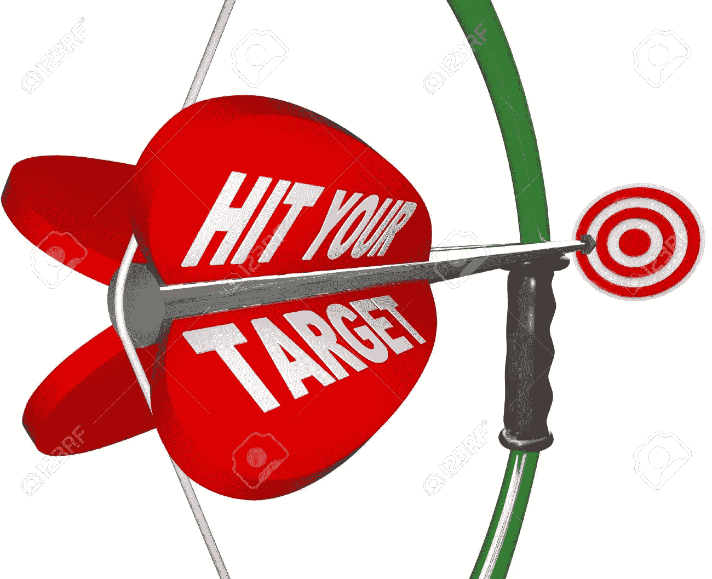
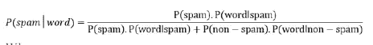
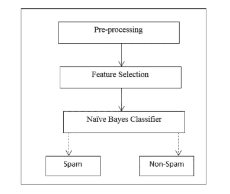

# 是正确的选择还是错误的选择？大概我不知道或者大概这个在左边！

> 原文：<https://medium.datadriveninvestor.com/is-it-the-right-choices-or-the-wrong-one-probably-i-dont-know-or-probably-this-in-the-left-82a3c66b8b78?source=collection_archive---------8----------------------->

## “我们在一个不确定的世界里为确定性而奋斗”

from wikihow.com

在大多数情况下，我没有确定性，我的意思是，我采取的每一个行动都是基于我每天做出的选择，我应该喝茶还是咖啡，我应该去健身房还是和朋友出去玩..它永远不会结束，选择一个选项的概率取决于几个因素，环境会导致你有不同的可能结果。你看，生活不是必然的，我们的选择越多，我们就越会不知所措，不知该选择哪一种，我应该从这个还是这个开始..这会让我大吃一惊的。…

最后，你必须做出一个选择，做出这个选择的概率是可能发生的有利结果的数量除以可能结果的总数。

 [## DDI 编辑推荐:5 本让你从新手变成专家的机器学习书籍|数据驱动…

### 机器学习行业的蓬勃发展重新引起了人们对人工智能的兴趣

www.datadriveninvestor.com](https://www.datadriveninvestor.com/2019/03/03/editors-pick-5-machine-learning-books/) 

什么是**概率**？它是某事发生的可能性，它可能是由偶然性或逻辑性决定的几种可能结果中的任何一种。

这些结果可能是掷硬币时得到正面，在六面骰子上掷出 4，例如掷硬币，有两种可能的结果得到正面或得到反面，这意味着我们有两个可能的事件，每个事件的概率是一半(0.5)。

如何解读这些概率值？概率为一(1)表示事件发生的绝对确定性，概率为零表示事件不发生的绝对确定性。

比如彩票中奖的概率是 1/175000000 ~ 0.0000000005

1 是你买的一张票，1.75 亿是可能结果的总数！

根据 spare.com 的说法，你死于 2029 年小行星碰撞的可能性是中彩票的 45 万到 300 万倍！

由于概率定理，有许多方法可以预测结果，它们被用于不同的行业和领域。

例如，你正试图用一把你练得足以射中靶心的弓和箭击中一个目标，这样做的概率可以用数学方法计算出来。

[www.123rf.com](http://www.123rf.com)

此外，让你预测结果的方法是所谓的**期望值** (esperance)，这些在预测天气时，它们为我们提供了对多少雪、雨或风、温度(高/低)的预期。简而言之，期望值用于预测未来事件。

**贝叶斯概率**在这种预期结果的方式中也工作得很好，任何常规计算机都使用它，最好的例子是电子邮件帐户上的**垃圾邮件过滤器**使用贝叶斯定理并且做得很好，但是一些垃圾邮件没有被标记为垃圾邮件，因为电子邮件过滤没有检测到该电子邮件是垃圾邮件，尽管朴素贝叶斯算法因其简单、易于实现并且只需要很短的训练时间或快速评估来过滤垃圾邮件而受到欢迎。过滤器需要来自先前垃圾邮件和非垃圾邮件的训练数据集。

from explorable.com

p(垃圾邮件):任何给定消息是垃圾邮件的概率。

p(垃圾邮件/单词)是给定电子邮件是垃圾邮件的情况下，电子邮件具有特定单词的概率

p(单词/垃圾邮件)是特定单词出现在垃圾邮件中的概率。

p(非垃圾邮件)是任何特定单词不是垃圾邮件的概率。

p(单词非垃圾邮件)是特定单词出现在非垃圾邮件中的概率。

正如我之前提到的，朴素贝叶斯算法简单，速度快 100 倍，对数据变化稳定。

总而言之，概率就像是生活的指南，这是一门强大的科学，它至少让我们认识到，如果你不知道什么是真的，我们就根据最有可能的事情采取行动。