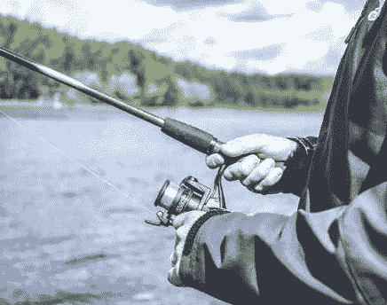

# 是去钓鱼的时候了吗？

> 原文：<https://medium.datadriveninvestor.com/is-it-time-to-go-fishing-5ba8aef0a643?source=collection_archive---------16----------------------->

在接下来的一周，我们将有几个重大事件有可能推动市场。周四的英国大选、美联储会议以及美国的重要投票。

一段时间以来，我们一直处于波动性非常低的交易环境中，机会有限，市场停留在小的交易区间内。我将关注市场对这些事件的反应，以确定这种环境是否会持续更长时间，或者结束是否已经在望…

美元继续显示出[大幅(长期)走低的真实迹象，但是这一趋势还没有真正开始(到目前为止)。](https://mangrovetrading.krtra.com/c/tUEYkQaP8h9c/kOJV)

虽然美元看起来疲软，但贵金属也是如此。我们通常会认为这些市场的交易方向相反，但这种背离恰恰说明了最近的不确定性和缺乏透明度。

 [## 总部位于瑞士的 ETP 进入加密交易市场|数据驱动的投资者

### 虽然金融市场几乎没有沉闷的时刻，特别是在引入…

www.datadriveninvestor.com](https://www.datadriveninvestor.com/2019/03/10/swiss-based-etp-enters-the-crypto-trading-market/) 

英镑一直是最近市场波动的唯一来源，我预计[将继续保持强劲。大多数英镑对的任何抛售都应被视为买入机会。](https://mangrovetrading.krtra.com/c/UMEa4W9hItrK/kOJV)

因此，在市场开始觉醒和波动性回归之前，我将继续对我的交易非常谨慎，在没有 100%明确机会的情况下，我将主要坐以待毙。

**本周交易:*去钓鱼(或者任何你喜欢做的不属于交易的事情……)***

传奇交易者杰西·利弗莫尔创造了“钓鱼”这个词。知道何时不交易和交易本身一样重要，如果不是更重要的话。当市场处于艰难的交易环境中时，他没有试图与之对抗，而是暂时离开市场，让这个阶段结束，等待不可避免的波动回归的时刻，这样他就可以获利了。

这样做的能力是至关重要的，因为这是大多数交易者被吃掉的时期。不要害怕错过潜在的机会…总会有另一个机会的！！！

*我试图在每周交易中关注长期交易，这样即使你在我的学生之后收到它们，也许没有立即看到分析，你仍然有机会从我分享的观点中获利。*

你想学习如何从市场中持续获利吗？ [*点击此处*](https://go.mangrovetrading.com/freetraining) *，我们将通过一系列免费培训视频带您一步步了解我们的整个交易策略。*