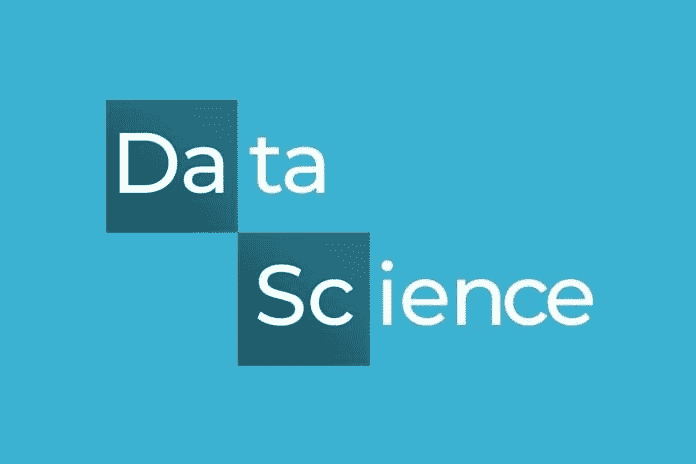

# 从事数据科学和人工智能——数据驱动的投资者——值得吗

> 原文：<https://medium.datadriveninvestor.com/is-it-worth-pursuing-a-career-in-data-science-artificial-intelligence-data-driven-investor-823242e1a51d?source=collection_archive---------11----------------------->

过渡到数据科学或 T2 的人工智能职业是一个难题。这并不是因为你听到人们传言你需要学习数学，精通统计学或者你必须成为一名程序员。你需要学习所有这些，但更需要首先与这些神话战斗。

现在你一定想知道人们是如何转变为数据科学家或[人工智能](https://www.datadriveninvestor.com/glossary/artificial-intelligence/)专业人士的。所有这些专业人士一定是极端的天才。嗯，我很抱歉地说，但你全搞错了。无论你是应届毕业生、专业人士还是 IT 行业的领导者，首先了解数据科学及其运作方式是至关重要的。

 [## AI 会取代你的工作吗？-数据驱动型投资者

### 人工智能(AI)通过赋予机器有效的方法来实现以下目标，从而彻底改变了科技行业

www.datadriveninvestor.com](https://www.datadriveninvestor.com/2018/04/16/will-ai-replace-your-job/) 

[人工智能](https://www.datadriveninvestor.com/glossary/artificial-intelligence/)和数据科学市场正在各行业呈指数级增长。几个行业和组织都期待着在这个部门招聘人才。

IBM 预测，在 2 年的时间内，91%的数据都是由。每天产生 2.5 万亿字节的数据，每天大约有 400 小时的视频内容上传到 YouTube。互联网和手机彻底改变了人们日常使用互联网的方式。

据估计，全球约有 40 亿人正在使用互联网并产生大量数据。

除非数据得到利用并转化为可操作的结果，否则它毫无用处。

数据无处不在。组织、政府、品牌和企业现在正在寻找新的方法来利用这些数据进行更好的运作和有利可图的业务预测。[数据科学](https://www.datadriveninvestor.com/glossary/data-science/)职业前途无量；然而，公司仍在努力寻找合适的人才。

银行业显示分析就业市场的人数最多，其次是公用事业和能源以及电子商务。据估计，自 2017 年 4 月至 2018 年 4 月进行最后一次计算以来，分析工作每月增长约 76%。从 2015 年 4 月到 2016 年 4 月增长了 56%左右。

[**数据科学职业**](https://www.dasca.org/) 仍然被吹捧为 IT 市场上最好的职业之一。毫无疑问，人工智能和数据科学市场有着巨大的增长。这确实是一个令人兴奋的过渡阶段。

对于数据科学家和人工智能专业人士来说，这将是一个很好的职业前景。

我们已经依赖人工智能，也许我们只是没有意识到这一点。从旅行机票到欺诈支付的检测和汽车导航，人工智能已经进入了我们的生活。人工智能有一个耐人寻味的概念，它吸引了世界上许多专业专家。人工智能现在正以一种事物已经在转变的方式领导着世界。如果我们讨论人工智能如何改变世界的因素，有很多例子可以引用。然而，人工智能被认为是人类的福音，因为它消除了许多单调乏味的任务，而正常人需要花费数天甚至数小时才能完成这些任务。

人工智能最好的一点是它使用了很多技术，而且都是无错的。很明显，人类可能会导致错误，但人工智能不会，因此，消除了人为错误的所有范围。

这是技术描绘的。因此，现在是时候我们需要承认这样一个事实，即数据科学专业人员和 [**人工智能专业人员**](https://www.artiba.org/the-artiba-edge) 在可预见的未来之前都将保持需求。

请放心，数据科学和人工智能领域的专业人士的未来将在未来几年激增。

作家、客座博主、社交媒体战略家。技术领域经验丰富的策展人——人工智能、区块链、数据科学、营销和创业公司。