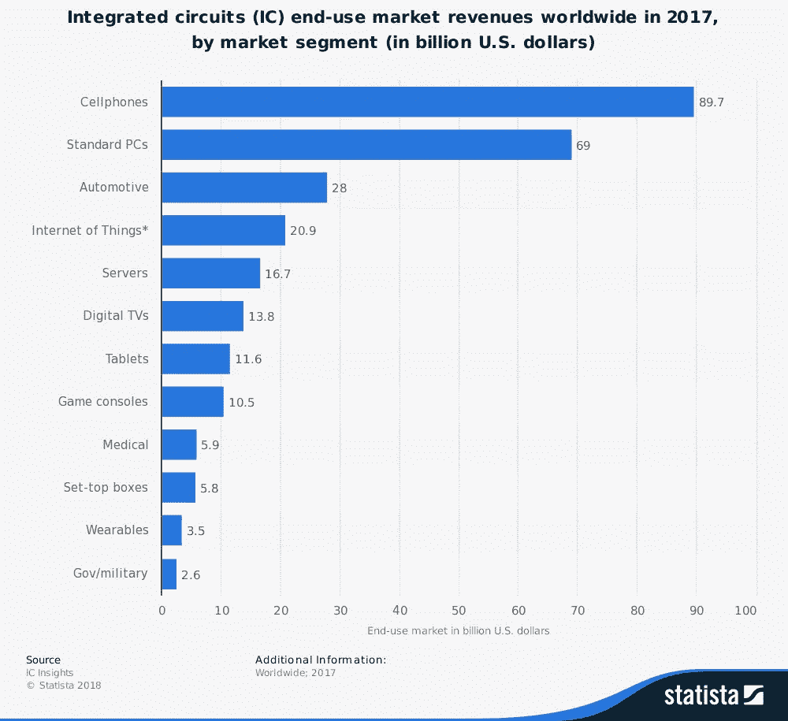
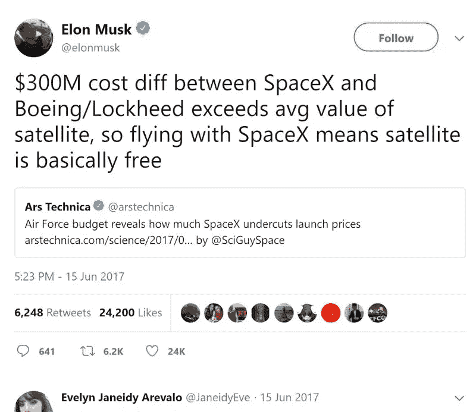
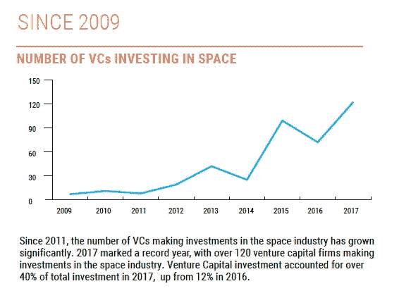
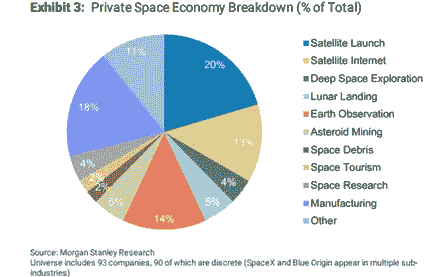
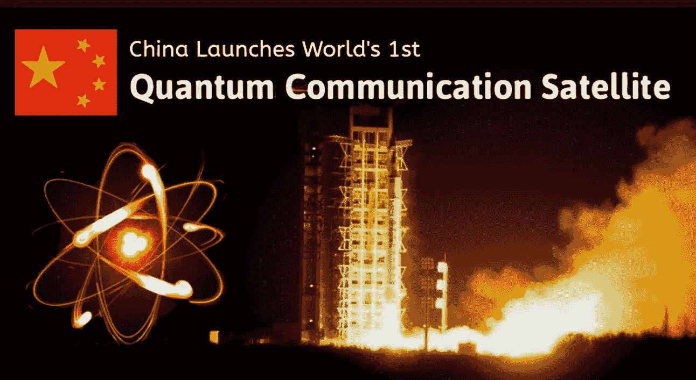
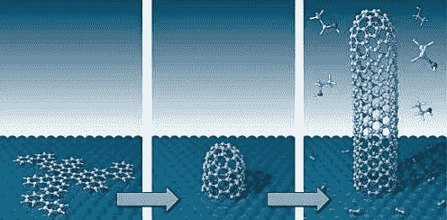

# 花钱探索太空值得吗？

> 原文：<https://medium.datadriveninvestor.com/is-it-worth-spending-money-to-explore-space-c67cfd0556ae?source=collection_archive---------7----------------------->

> “美国知识分子的显著特征归功于边疆……在一瞬间，在边疆，习俗的束缚被打破，不受约束正在胜利……尽管有环境，尽管有习俗，每个边疆确实提供了一个新的机会…”弗雷德里克·杰克逊·特纳在《边疆在美国历史上的意义》(1893)中写道。

Motivational Space [Video](https://www.youtube.com/watch?v=oY59wZdCDo0)

阿波罗计划(1961-1972)是人类所有成就中的一个突出的胜利。以 2016 年美元计算，美国宇航局能够将人类送上月球，总成本为 1070 亿美元。当我们考虑太空探索的未来时，回顾阿波罗计划有助于理解一个重点研究项目的全部影响。当时推动太空探索的两个因素是:

> 1.科学探索和发现——发展人类安全往返太空的技术能力的愿望
> 
> 2.地缘政治环境——第一个登上月球的压力很大，这创造了一种竞争的氛围，集中了美国人民及其政治领导人的意愿

这篇博文将关注另一个在当时不被认为是动力的因素。

> 3.开辟一个全新市场的经济优势(空间！)

> 在这篇文章的其余部分，我将讨论我们的政府投资于像阿波罗这样的项目的好处。然后，我将谈到目前的私人投资前景，太空投资创造的经济机会，企业需要克服的障碍以及克服这些障碍的巨大回报。

阿波罗计划让美国人登上月球的疯狂冲刺带来了许多技术突破，这些突破后来被应用于消费者和应用。我们登上月球的飞船需要一个导航系统，它由一台比当时可用的更小、更轻、更强大的计算机驱动。纯粹出于需要，集成电路被开发出来[1]。

$278B End-Use Market for the Integrated Circuit

集成电路在当时是独一无二的，因为所有组件都由同一块材料制成，允许更小尺寸的电路、自动化组装和降低故障率(这是为 NASA 航天器提供动力的任何设备的关键特征)。

美国国家航空航天局订购的 100 万台设备启动了这个新兴产业，并为现代技术铺平了道路。大多数现代电气设备依赖于集成电路，微处理器是最著名和最普遍的。

这个行业现在的价值超过 2780 亿美元。

为了看看美国宇航局正在研究什么技术，请查看[这张](https://www.nasa.gov/directorates/spacetech/techtransfer)。

> 政府项目不需要像公共和私人公司一样显示相同的投资回报。创办或投资一家专注于开发太空技术的公司有什么好处？

令人兴奋的增长领域——SpaceX 和蓝色起源正在帮助揭露私人太空公司的想法。随着获得投资资本变得更加容易，将继续有更多的私营企业开发空间技术。更多的竞争将催生创新，这将导致该领域更快的增长，并有可能获得 10 倍的投资回报。

**成本效益—** 公私合作有助于降低成本，这使得美国宇航局可以更加灵活地分配预算。大(或小)公司可以通过节省政府资金赢得大合同。

**经济—** 私营太空探索公司正在一个直到最近还不存在的领域创造机会。这些新企业将创造就业机会，促进经济发展。这个飞轮将会把更多聪明的人带到这个领域来开发更好的技术和产品。

> 你:给我举一个以前不存在的特定市场机会的例子…
> 
> 我:…

> “第一个万亿富翁将会是开发小行星上自然资源的人。”
> 
> ——尼尔·德格拉塞·泰森([美国天体物理学家](https://en.wikipedia.org/wiki/Neil_deGrasse_Tyson))

在地球附近，大约有 10，000 颗小行星含有金属、铁、镍、钴、水合粘土和水。这些元素中的每一种都是有用的，并且是地球上所需要的；其他的，比如水，对太空探索是有用的——水可以通过分解氢转化为火箭燃料，使宇宙飞船不用返回地球就能补充燃料。开采小行星的潜力激发了几家私营公司开始探索的初始阶段。主导这项工作的两家公司是行星资源和深空工业，它们目前正在设计和测试必要的技术，以便能够将原材料从太空大规模运输到地球。[【2】](#_ftn4)

> 航天行业有哪些公司在努力赚钱？

太空产业预计在未来三十年将达到 2.7 万亿美元。受到最多压力的公司( [SpaceX](http://www.spacex.com/about) 、[蓝色起源](https://www.blueorigin.com/)和[维珍银河](http://www.virgingalactic.com/))一直致力于降低进入太空的成本——主要是通过重复使用发射器和航天器——以便让没有受过特殊训练的宇航员也能进入太空。

其他将太空商业化的著名公司有 OneWeb 和 Ligado，它们参与发射卫星以提供宽带通信；[公理空间](https://axiomspace.com/)，旨在 2024 年前建成首个商业空间中心；月球快递公司，一家正在开发机器人宇宙飞船的公司；Planet，建造地球成像卫星；还有[毕格罗宇航](http://bigelowaerospace.com/)，计划在太空推出酒店。风投正密切关注这些公司，并表明他们对这个领域越来越感兴趣[😏].

In 2017, private investors put $3.9B into commercial space companies [Link](https://www.cnbc.com/2018/01/18/space-companies-got-3-point-9-billion-in-venture-capital-last-year-report.html)

> 你，又来了:好吧，我相信太空中有商机…我们需要克服什么样的挑战来建立这个新行业？

●这个行业的创业型公司历来承诺过多，兑现不足。在 2010 年之前，超过 12 家公司试图进入发射业务，只有一家成功转型为规模可观的公司(轨道科学公司)。

●美国宇航局将不得不建立一个更有效的系统，以认证商业轨道飞行器对人类运输的安全性，如果他们使用受官僚主义繁文缛节束缚的当前系统，这将需要数年时间。现在没有我们在阿波罗计划期间那样的紧迫性，当前的航天工业被政客们用来将猪肉桶美元输送回他们的家乡。这不是一个理想的启动环境。

●全球空间公域的法律挑战。目前，所有国家都有探索的权利，但是对于谁有权利标出资源(例如，一旦小行星被开采，谁拥有它们)却没有一致的意见。现行的《外层空间条约》是 50 年前制定的，它禁止各国对太阳系的资源提出任何主权要求。月球快车在经历了漫长的法律辩论后(2016 年)获得了美国的批准前往月球。如果我们不能与其他国家合作，可能会很快成为赢家，赢得所有的太空竞赛，带来无数的地缘政治风险。

***这些问题使得说服投资者在一个资本密集型行业花钱变得非常困难。***

> 你，第三次:这似乎是一个巨大的头痛。所有好的技术都已经被发明出来了。我们为什么要费心去改变我们当前的系统呢？
> 
> 我:有一些突破性的技术已经开发出来，但没有得到媒体的太多关注。我会帮你看一些。

**量子通信—** 能够减少对大型天线的依赖，同时改变我们加密信息的方式。量子通信利用纠缠光子现象来实现安全、高数据速率、跨空间的长距离通信。几个月前我写了一点关于量子计算的东西。如果你需要复习，从这里开始。

**损伤容限系统—** 一种纳米级方法，可显著改善工程材料和结构，使其能够承受高压和高温。两个例子包括生长碳纳米管以增加材料的韧性，以及模仿贝壳的纳米级特征以改善陶瓷。这些方法不仅能提高可靠性和安全性，还能减轻高达 25%的重量。

**小型化核空间反应堆—** 科学家已经开发出小型核反应堆([甜视频](https://www.youtube.com/watch?time_continue=1&v=bdMzFQOABcQ))，比我们目前使用的高浓缩铀反应堆危险小得多。当我在洛斯阿拉莫斯的时候，我能够和一些科学家一起研究这个项目。我写了我在新墨西哥州实验室度过的夏天(不是关于这枚火箭，也不是研究它的团队)，就在这里。

> 如果我们想要去太空的巨大回报，我们就必须接受对风险和未知的高度容忍，包括在地球上爆炸。

___________________________________________________________________

他的职位在很大程度上依赖于一个更大的项目，那是我在德克萨斯大学奥斯汀分校完成 MBA 课程“网络经济战略”的时候，老师是 T2 教授。和我一起从事这项工作的同学有[莫希特·马赫什瓦里](https://www.linkedin.com/in/mohit-maheshwari-mba2019/)和[朱莉娅·布兰南](https://www.linkedin.com/in/juliabrannan/)以及其他几个人。如果你觉得这篇文章内容丰富或者喜欢阅读，请分享！

**参考或引用的作品**

美国宇航局。阿波罗计划:回顾性分析。2014 年 4 月 21 日 https://history.nasa.gov/Apollomon/Apollo.html.

美国宇航局。*受益于阿波罗计划:技术上的巨大飞跃。2004 年 7 月*https://www . NASA . gov/sites/default/files/80660 main _ Apollo fs . pdf

美国宇航局。STMD:技术转让。[https://www.nasa.gov/directorates/spacetech/techtransfer](https://www.nasa.gov/directorates/spacetech/techtransfer)

Nobelprize.org。*集成电路的历史*。2003 年 5 月 5 日[https://www . nobel prize . org/educational/physics/integrated _ circuit/history/](https://www.nobelprize.org/educational/physics/integrated_circuit/history/)

[【2】](#_ftnref4)石头，麦蒂。小行星采矿如何支付我们的第一个太空殖民地。2016 年 2 月 17 日。文章。https://gizmodo . com/how-asteroid-mining-could-pay-for-our-first-space-colon-1685429089。