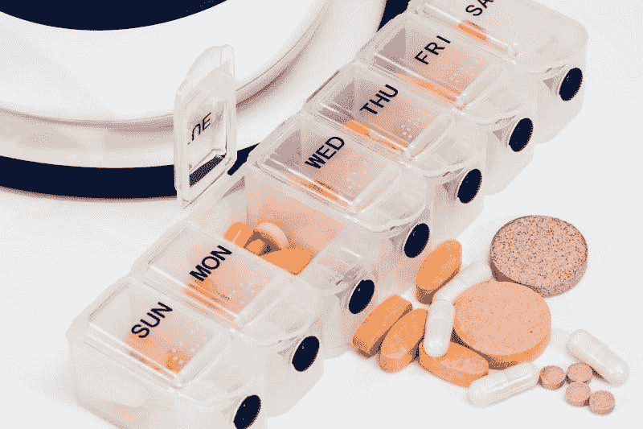
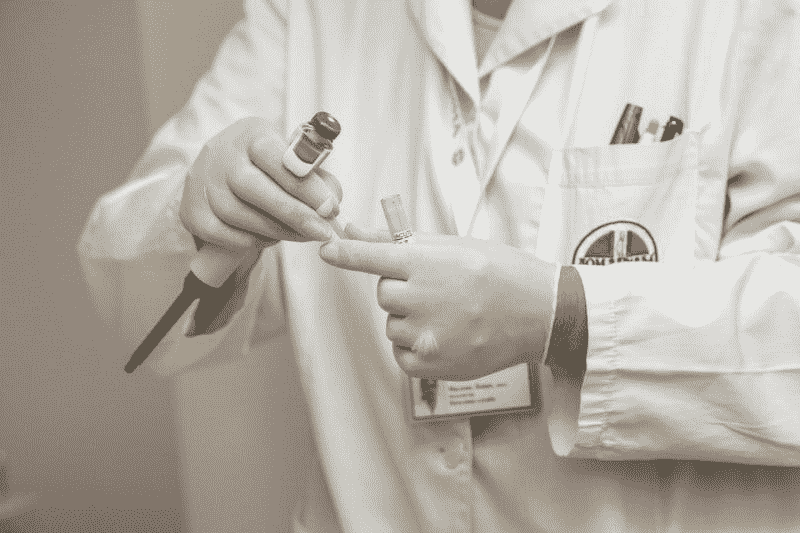
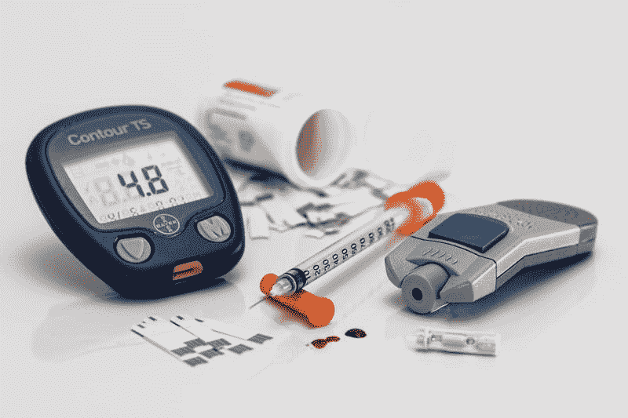
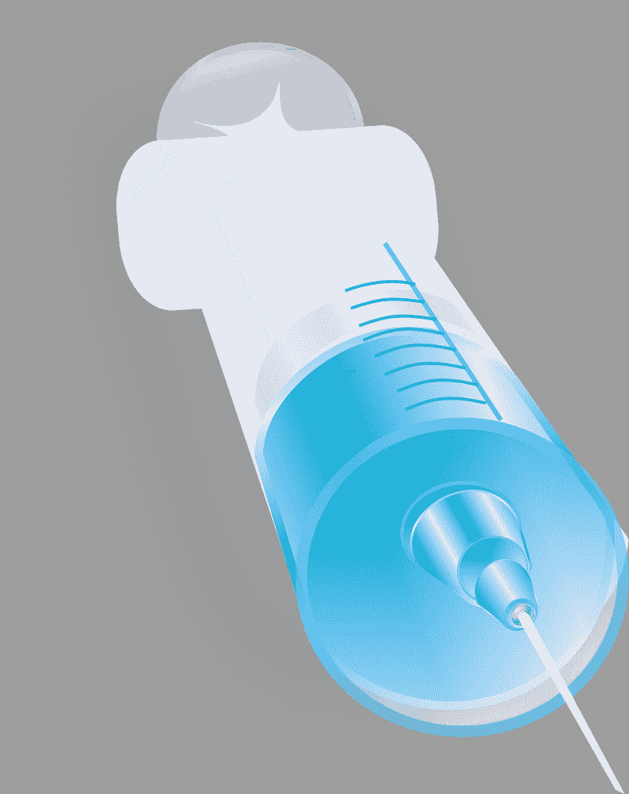

# 强生赚钱了吗？—市场疯人院

> 原文：<https://medium.datadriveninvestor.com/is-johnson-johnson-making-money-market-mad-house-b0385b373bc5?source=collection_archive---------9----------------------->

如今，大型制药公司不受欢迎，但利润丰厚。例如， **Johnson & Johnson(纽约证券交易所代码:JNJ)** 于 2019 年 6 月 30 日报告了 136.22 亿美元的季度毛利。

然而，J&J 正处于美国阿片类药物丑闻的中心。据*商业内幕* [报道](https://www.investors.com/news/technology/opioid-crisis-pharma-company-jj-settles-ohio-10-million/)，强生公司可能支付 2040 万美元在俄亥俄州解决一桩与阿片类药物相关的诉讼。具体来说，约翰逊计划支付 1000 万美元的和解费、500 万美元的律师费和 540 万美元的慈善捐款来了结此案。

 [## 医疗保健的未来正在被一场大型技术入侵所塑造|数据驱动型投资者

### 过去十年，全球经济的所有部门都经历了大规模的数字颠覆，而卫生部门现在…

www.datadriveninvestor.com](https://www.datadriveninvestor.com/2018/11/02/the-future-of-healthcare-is-being-shaped-by-a-big-tech-invasion/) 

该诉讼称，强生公司谎报了其在农村地区销售的阿片类止痛药的潜在危险。法院计划于 2019 年 10 月 21 日开始审理此案。因此，强生公司将避免此案的负面影响。

# 强生公司正在赚大钱

目前，强生公司正在赚大钱。2019 年 6 月 30 日，该药品和消费品公司报告季度营业收入为 53.53 亿美元，季度净收入为 56.07 亿美元。

强生公司的季度收入为 202.62 亿美元。因此，制药是一个有利可图的行业。

此外，J&J 证明了制药行业是一个现金充裕的行业。截至 2019 年 6 月 30 日，强生公司的运营现金流为 59.48 亿美元，自由现金流为 51.11 亿美元。

与此同时，截至 2019 年 6 月 30 日，强生公司拥有 143.76 亿美元的现金和等价物，以及 9.02 亿美元的短期投资。因此，强生公司在上个季度末有 152.78 亿美元的现金。

鉴于这些数字，我认为强生公司可以解决几十起阿片类药物诉讼，并赚很多钱。因此，我认为强生公司是一家安全边际很高的公司，因为它能产生现金。

# 强生是价值投资吗？

在第一个分析中，强生公司有两个价值投资属性。首先，它是一家制药公司，所以 J&J 在美国是一家不受欢迎和不受欢迎的公司。其次，J&J 是一家现金充裕的公司。

但是[约翰逊&约翰逊](https://www.jnj.com/healthcare-products)还有什么价值呢？强生公司是美国发展最快的医疗保健行业中的一家多元化公司。

事实上，你可以把强生描述成三个不同的公司。首先，J&J 生产各种各样的消费者健康产品。强生公司的消费者健康品牌包括邦迪、利斯特林、Neosporin 和强生公司。

其次，强生医疗设备公司向医疗保健提供商提供各种设备。J&J 制造用于整形外科、手术、视觉和介入解决方案的设备。

第三，强生拥有[让桑制药公司](https://www.jnj.com/healthcare-products/prescription)。让桑的专长包括治疗心血管代谢问题的药物、免疫学、传染病疫苗、神经科学、肿瘤学和肺动脉高压。因此，强生公司提供多样化的医疗服务。

# 强生是成长股吗？

医疗保健是美国经济中增长最快的部分之一。例如，医疗保险和医疗补助服务中心(CMS) [预计](https://marketmadhouse.com/is-johnson-johnson-making-money/cms.gov/Research-Statistics-Data-and-Systems/Statistics-Trends-and-Reports/NationalHealthExpendData/NationalHealthAccountsHistorical.html)美国医疗保健支出将在 2019 年至 2027 年间每年增长 5.5%。

此外，CMS 估计，到 2027 年，美国的医疗支出可能会增长到 6 万亿美元。有趣的是，CMS 预计到 2027 年，医疗保健支出将占美国国内生产总值(GDP)的 19.4%。CMS 估计，2017 年医疗保健支出占美国国内生产总值的 17.9%。

因此，医疗保健是美国最大和发展最快的行业之一。强生公司经营三种不同的医疗保健业务。然而，Stockrow 给 J&J 截至 2019 年 6 月 30 日的季度的收入增长率仅为 1.05%。

此外，截至 2019 年 3 月 31 日的季度，强生的收入增长萎缩了 3.88%。因此，你可以计算出 J&J 上个季度的收入增长了 4.93%。

# 单一支付者医疗保健正在走向美国

此外，政府越来越多地为美国的医疗保健买单。CMS 估计，美国政府在医疗保健方面的支出正以每年 2%的速度增长。此外，CMS 声称，到 2027 年，政府将支付 47%的美国医疗费用。

因此，美国可能在十年内拥有单一支付者医疗保险和政府运营的医疗保健。此外，民主党总统初选的四名领先者中有三名支持全民医疗保险(单一支付者健康保险)。

具体来说，2019 年 9 月的爱默生民意调查[将](https://marketmadhouse.com/democratic-upset-andrew-yang-is-fourth-in-national-poll-and-warren-is-second/)乔·拜登(特拉华州民主党)、美国参议员利兹·沃伦(马萨诸塞州民主党)、美国参议员伯尼·桑德斯(佛蒙特州共和党)和杨安泽(纽约州民主党)列为民主党的领跑者。杨、桑德斯和沃伦都支持全民医保。全民医保是单一支付者健康保险的委婉说法。

我认为全民医疗保险对强生公司有好处，因为它可以显著扩大 J&J 在美国的客户群。理论上，全民医保可以为每个公民支付医疗费用；也是美国的合法居民。

因此，全民医疗保险可以支付 3.29065 亿美国人使用强生产品的费用。Worldometers 估计，2019 年 9 月美国人口为 3.29065 亿。

# 强生公司如何从老龄化的美国获利

除此之外，还有美国老龄化和经常不健康的人口。[让桑制药公司](https://www.jnj.com/healthcare-products/prescription)的专业药品包括治疗与年龄相关疾病的药物。

一些让桑产品线包括心血管(心脏)和代谢疾病(如糖尿病)、肺动脉高压(高血压)和肿瘤(癌症治疗)药物。那些都是与年龄相关的疾病。

与此同时，人口研究局(PRB) [估计，65 岁以上的美国人有 5200 万，占美国人口的 13%。此外，PRB 估计，到 2060 年，美国老年人口可能增长到 9500 万，占全国人口的 23%。](https://www.prb.org/aging-unitedstates-fact-sheet/)

# 强生公司如何从医疗保险中获利

为了 J&J 的利益，山姆大叔已经支付了这些人的大部分医疗费用。

凯撒家庭基金会估计有 5986.9 万美国人参加了医疗保险。医疗保险是美国为老年人和残疾人提供的单一付款人健康保险计划。如果愿意，所有 65 岁以上的美国人都可以参加医疗保险。

此外，FFF 估计，1986.1 万美国人参加了私人医疗保险优势计划，可以支付 100%的医疗费用。在医疗保险优势中，私人保险公司支付大部分医疗费用，但联邦政府支付保险费。 *Propublica* [声称](https://www.propublica.org/article/the-villages-trump-visit-medicare-advantage-retired-insured-the-government-pays-for-it)老年公民；唐纳德·j·特朗普总统(纽约州共和党人)喜欢医疗保险优势，因为它为美国老年人提供了廉价而丰富的医疗保健。

因此，强生公司的许多产品拥有不断增长的市场。此外，政府将为许多消费者买单。因此，我认为 J&J 可能是一家现金充裕的公司，也是未来几十年的成长股。

吸引人的是，许多政客想用税收为强生公司的增长提供资金。此外，鉴于美国老年人的政治影响力，医疗保险削减或资金危机不太可能发生。

美国人口普查局[估计](https://www.census.gov/library/stories/2019/04/behind-2018-united-states-midterm-election-turnout.html) 66.1%的 65 岁以上美国人在 2018 年中期选举中投票。鉴于这一数字，我相信政治家们会扩大医疗保险并提高医疗保险税来让老年选民满意。

# 强生是好的分红股吗？

我认为**Johnson&Johnson(NYSE:jnj)**是一只很好的股息股票，因为它在 2019 年 8 月 26 日支付了 95₵季度股息，并在 2019 年 10 月 11 日支付了 131.75 美元的股价。

此外，强生的股息在 2019 年上涨了 5₵。强生于 2019 年 2 月 25 日向 90₵付款，2019 年 5 月 24 日向 95₵付款。

此外，Dividend.com[认为 J](https://www.dividend.com/dividend-stocks/healthcare/drug-manufacturers-major/jnj-johnson-and-johnson/)J&J 取得了令人震惊的 56 年股息增长。具体而言，2019 年 10 月 10 日，JNJ 股票的股息率为 2.88%，年化股息为 3.80 美元，派息率为 46.7%。

如果你正在寻找一个安全的股息，收入和一些价值特征的成长股。我强烈建议你调查强生公司。我认为，由于美国的人口结构和政治气候，J&J 将迎来多年的增长。

*原载于 2019 年 10 月 11 日*[*https://marketmadhouse.com*](https://marketmadhouse.com/is-johnson-johnson-making-money/)*。*