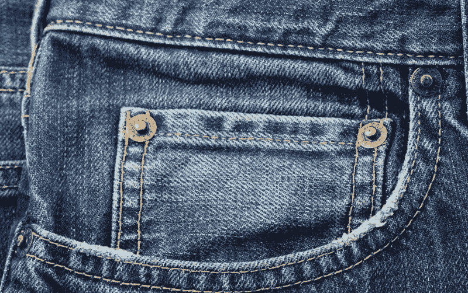
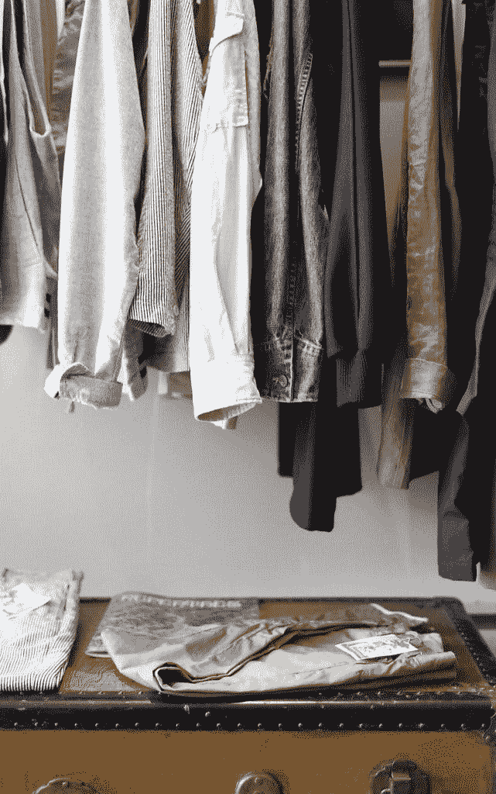
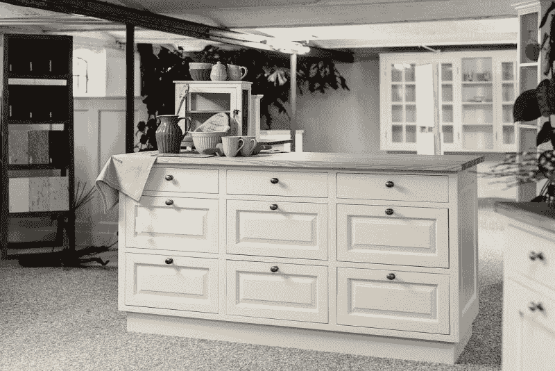
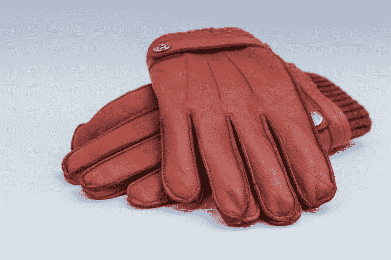

# 美国柯尔百货公司赚钱了吗？—市场疯人院

> 原文：<https://medium.datadriveninvestor.com/is-kohls-making-money-market-mad-house-e6aaf3342846?source=collection_archive---------12----------------------->

投资者在问，美国柯尔百货公司是否在赚钱，因为这个折扣百货品牌正在收缩其门店，并与其他零售商合作。因此，投资者会问，美国柯尔百货公司的核心业务是否不再盈利。

例如，**美国柯尔百货公司(纽约证券交易所:KSS)** 将与健身房运营商 Planet Fitness 共享其部分门店的空间，[的新闻稿指出](http://investor.planetfitness.com/investors/press-releases/press-release-details/2019/Planet-Fitness-Announces-Development-Partnership-With-Kohls/default.aspx)。具体来说，美国柯尔百货公司将让一些 Planet Fitness 特许经营商在精选商店中租赁 20，000 至 25，000 英尺，以降低成本和吸引业务。希望在行星健身中心工作的女士们会在美国柯尔百货公司购物。

 [## 算法交易的机器学习-数据驱动的投资者

### 当你的一个朋友在脸书上传你的新海滩照，平台建议给你的脸加上标签，这是…

www.datadriveninvestor.com](https://www.datadriveninvestor.com/2019/01/30/machine-learning-for-stock-market-investing/) 

# 伙伴关系能把美国柯尔百货公司从零售业的末日中拯救出来吗

此外，PYMNTs.com[报道](https://www.pymnts.com/news/retail/2019/aldi-kohls-partnership-department-store-grocery/)，美国柯尔百货公司将向快速增长的折扣杂货商阿尔迪出租或出售 10 家店铺的空间。再次，人们希望非常受欢迎的 Aldi 将顾客吸引到美国柯尔百货公司，该国的市场份额正被亚马逊(NASDAQ: AMZN)夺走。

值得注意的是，Aldi 和 Planet Fitness 都在增长，而百货商店的业务却在萎缩。例如，阿尔迪现在是美国第四大杂货商，在 35 个州拥有 1800 多家商店，并计划再开 400 家。

NPR [报道](https://www.npr.org/2019/04/24/716757082/kohls-will-now-accept-amazon-returns-at-all-its-stores)很能说明问题的是，美国柯尔百货公司通过在其服务柜台接受亚马逊退货来与亚马逊合作，试图吸引顾客到其商店。此外，据 PYMTS.com 报道，美国柯尔百货公司正在探索与百思买(纽约证券交易所:BBY)、巴诺书店(纽约证券交易所:BKS)、PetSmart 等连锁店的合作关系。

# 美国柯尔百货公司是否与其他品牌合作以求生存？

美国柯尔百货公司正与其他品牌合作以求生存。解释一下，被称为 Amazon.com.Moreover 的大型零售平台正在抢走美国柯尔百货公司业务，亚马逊的资源大大超过美国柯尔百货公司。

例如，美国柯尔百货公司报告 2019 年 1 月 31 日的年收入为 202.3 亿美元。与此同时，2019 年 3 月 31 日的年收入为 2415.4 亿美元。此外，亚马逊报告 2019 年 3 月 31 日的净收入为 120 亿美元，而美国柯尔百货公司报告的净收入为 8 亿美元。

很明显，美国柯尔百货公司在 2019 年 2 月 2 日有 9.34 亿美元的现金和等价物，没有短期投资。相比之下，截至 2019 年 3 月 31 日，亚马逊拥有 231.15 亿美元的现金和等价物，以及 139.05 亿美元的短期投资。因此，截至 3 月底，杰夫·贝索斯有 370.2 亿美元的现金和短期投资可供使用。

# 美国柯尔百货公司与亚马逊合作生存

因此，美国柯尔百货公司缺乏与亚马逊竞争的资金。面对这种威胁，美国柯尔百货公司有两个选择，要么建立自己缺乏资源的平台，要么连接到别人的平台。因此，美国柯尔百货公司试图连接亚马逊的平台。

对美国柯尔百货公司来说，与亚马逊合作是一个非常明智的举动，因为它的一些竞争对手正试图建立像 Everything Store 这样大而危险的平台。例如，**沃尔玛(纽约证券交易所:WMT)** 正在对[人工智能](https://marketmadhouse.com/walmarts-ai-customer-surveillance-raises-ethical-questions/)和[机器人](https://techcrunch.com/2019/04/10/the-startup-behind-walmarts-shelf-scanning-robots/)进行巨额投资。

此外，**Kroger**和 **Ocado Group PLC (LSE: OCDO)** 正在[建造](https://marketmadhouse.com/kroger-kr-and-ocado-plan-robotic-warehouse-in-ohio/)机器人履行中心。很能说明问题的是，克罗格通过其巨大的超市销售服装和一些家具。因此，克罗格是美国柯尔百货公司的竞争对手。

# 美国柯尔百货公司收入增长崩溃

此外，美国消费者新闻与商业频道[报道](https://www.cnbc.com/2019/05/15/kohls-explores-acquisition-of-at-home-group.html)美国柯尔百货公司正在探索通过收购家居装饰零售商来扩展家居装饰业务。

我的猜测是，这一收购努力是为了对抗快速增长的折扣百货运营商 [**TJX 公司**](https://www.cnbc.com/2019/05/15/kohls-explores-acquisition-of-at-home-group.html) **(纽约证券交易所代码:TJX)** 。值得注意的是，TJX 拥有家居用品连锁店 HomeGoods、HomeSense 和 Sierra。然而，TJX 一直在增长，而美国柯尔百货公司却在苦苦挣扎。

例如，TJX 2018 年的年收入增长率为 8.67%。相比之下，美国柯尔百货公司承认 2018 年收入增长率为 0.72%。

此外，Stockrow 估计美国柯尔百货公司收入增长在 2018 年第四季度萎缩了 3.32%。然而，TJX 的收入在 2018 年最后一个季度增长了 1.52%。

# 为什么美国柯尔百货公司想进入家居用品行业

我的猜测是，TXJ 比美国柯尔百货公司做得更好，因为消费者不太可能在线订购家具，而不是服装。解释一下，退回一件你不想要的衬衫既容易又便宜。你只要把它放在盒子里打电话给 UPS，或者把它留给邮递员。

然而，归还一盏灯或一把椅子并不容易。因此，人们仍然会去商店看家具和装饰品，但不会在实际地点购买服装。

在这种情况下，收购 **At Home Group (NYSE: HOME)** 对美国柯尔百货公司来说是一个明智之举。值得注意的是，At Home Group 目前的市值为 14.54 亿美元，2019 年 5 月 20 日的股价为 22.84 美元。

# 科尔可以通过租赁中心或西尔斯赚钱吗？

但是，与家居用品品牌如家居用品的合作关系；或者像 [**康恩的**](https://www.conns.com/yes-money-credit/?utm_medium=cpc&utm_source=google&utm_campaign=Brand+-+Trademark+(BMM)&utm_content=Trademark&utm_term=%2Bconns&device=c&gclid=EAIaIQobChMIi5OutPin4gIV2rjACh18KQNXEAAYASAAEgKNEfD_BwE&gclsrc=aw.ds) **(纳斯达克股票代码:CONN)** 或者[**Rent-A-Center**](https://marketmadhouse.com/rent-center-collapsing-bad-economy/)**(纳斯达克股票代码:RCII)** 这样的租赁公司，可以更聪明一些。

澄清一下，我认为租赁店与美国柯尔百货公司资金紧张的客户相比，可以产生更大的协同效应。尤其值得一提的是，Conn's 和 Rent-A-Center 可以吸引顾客，因为它们除了销售家具之外，还销售电子产品和电器。

另一个有趣的合作伙伴是破产的西尔斯百货公司，该公司正在开设小商店。特别是，西尔斯正在开设 10，500 至 15，000 平方英尺的家庭生活商店，主要集中在电器、工具、床垫和户外机器，如割草机和链锯。

我认为美国柯尔百货公司与西尔斯结盟会有很多协同效应。值得注意的是，西尔斯和亚马逊正在家电销售方面进行合作。详细地说，一个人可以在西尔斯商店买割草机；而他的妻子或伴侣在美国柯尔百货公司买衣服。

# 克罗格能拯救美国柯尔百货公司吗？

我认为美国柯尔百货公司应该寻求的其他合作伙伴包括美食家天堂 Trader Joe 的 T1；和它的姐妹店 [Lidl](https://www.lidl.com/) 都在扩张；亚马逊的全食 360，西夫韦，**沃尔格林(NASDAQ: WBA)** ， **CVS Health (NYSE: CVS)** ，克罗格。

有趣的是，克罗格公司的首席执行官兰迪·麦克马伦希望将尽可能多的购物者安置在克罗格一英里范围内，*网络零售商* [声称](https://www.digitalcommerce360.com/2019/01/14/kroger-ceo-outlines-its-digital-investments-at-nrf/)。因此，克罗格和美国柯尔百货公司的合作是有可能的。

对于美国柯尔百货公司来说，在克罗格和奥卡多的机器人杂货店平台的开端加入可能是一个聪明的举动。例如，购物者可以在美国柯尔百货公司挑选或退回克罗格的杂货订单。此外，美国柯尔百货公司可以在克罗格的市场上开设较小的商店。

# 美国柯尔百货公司还在赚钱吗？

此外，截至 2019 年 2 月 2 日，TJX 的季度收入为 112.27 亿美元，季度毛利为 30.93 亿美元。

与此同时，美国柯尔百货公司报告称，2018 年第四季度的季度收入为 68.23 亿美元，毛利为 24.78 亿美元。不祥的是，美国柯尔百货公司上个季度 2017 年的收入为 70.57 亿美元，高于 2018 年的收入。因此，美国柯尔百货公司 2018 年圣诞季的收入低于 2017 年假期。

然而，美国柯尔百货公司正在赚钱，因为它在 2019 年 2 月 2 日报告的营业收入为 4.41 亿美元，净收入为 2.72 亿美元。此外，美国柯尔百货公司在 2019 年 2 月以 6.84 亿美元的运营现金流和 5.64 亿美元的自由现金流的形式产生了一些现金。

# 美国柯尔百货公司是个好行业吗？

因此**美国柯尔百货公司(纽约证券交易所:KSS)** 赚钱了，但这是一个好的投资吗？我会说不，因为我认为市场先生高估了美国柯尔百货公司在 2019 年 5 月 21 日交易的 63 美元。

值得注意的是，TJX，我认为是一家好得多的公司，在同一天以每股 52.92 美元的价格交易。因此，我认为 TJX 是一个价值投资，而美国柯尔百货公司不是。

然而，科尔于 2019 年 4 月 3 日支付了 67₵股息。此外，该股息已于 2018 年 12 月 26 日从 61₵上调。相比之下，TJX 将于 2019 年 6 月 6 日支付 23₵股息。然而，TJX 的股息将于 2019 年 3 月 7 日从 19.5₵开始增长。

因此，美国柯尔百货公司是一只优秀的股息股票，在 2019 年 5 月 17 日为投资者提供了 4.25%的股息收益率，年化股息为 2.68 美元，回报率为 49.2%。此外，美国柯尔百货公司的合作伙伴关系和家居战略也给了它一些增长潜力。归根结底，我认为美国柯尔百货公司是一只有趣的高股息零售股票。

*原载于 2019 年 5 月 20 日*[*【https://marketmadhouse.com】*](https://marketmadhouse.com/is-kohls-making-money/)*。*

*免责声明:文章中表达的观点和意见仅属于作者，并不一定反映数据驱动投资者的立场。本文无意成为投资建议*。