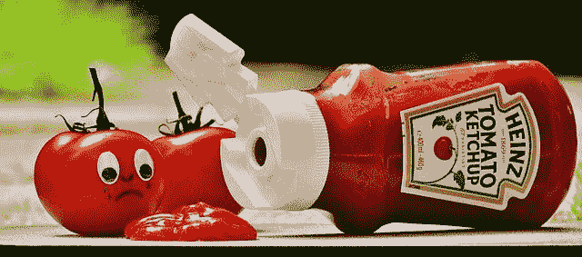
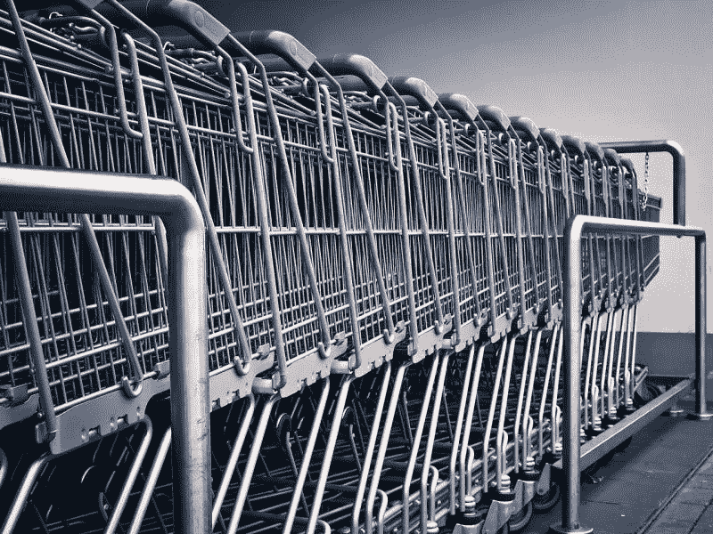
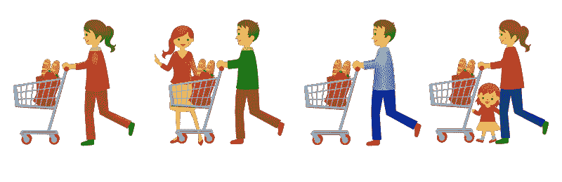
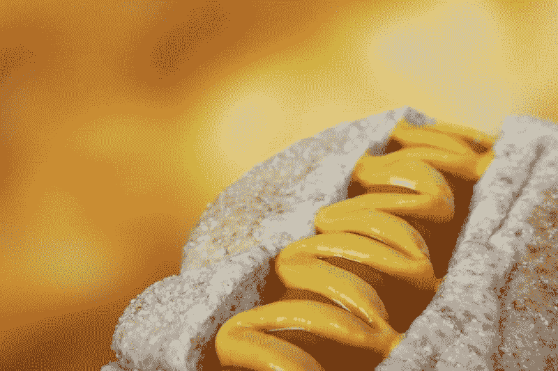
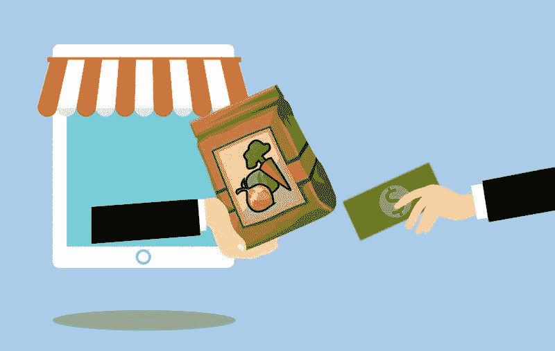
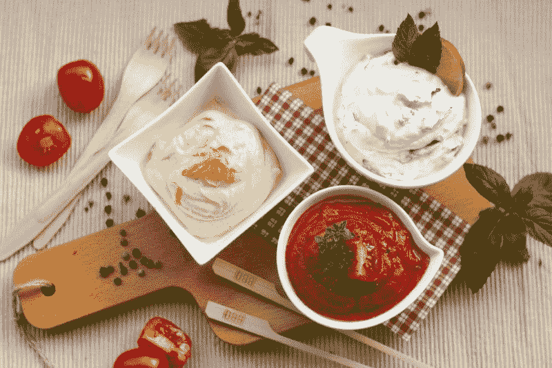

# 卡夫亨氏还是价值投资吗？—市场疯人院

> 原文：<https://medium.datadriveninvestor.com/is-kraft-heinz-still-a-value-investment-market-mad-house-e4c81813e656?source=collection_archive---------3----------------------->

观察家们在问；“卡夫亨氏还是价值投资吗”，因为沃伦巴菲特自己也在唱衰该公司。

“我在卡夫亨氏食品上犯了几个错误，”巴菲特 2 月份告诉美国消费者新闻与商业频道电视台。"我们为卡夫食品支付的价格过高。"

 [## 算法交易的机器学习-数据驱动的投资者

### 当你的一个朋友在脸书上传你的新海滩照，平台建议给你的脸加上标签，这是…

www.datadriveninvestor.com](https://www.datadriveninvestor.com/2019/01/30/machine-learning-for-stock-market-investing/) 

巴菲特的态度很奇怪，因为伯克希尔哈撒韦公司(纽约证券交易所代码:BRK。A) 和 3G 资本在 2015 年创建了**卡夫亨氏公司(NASDAQ: KHC)** 。为了解释这一点，两家公司合并了。路透社[报道](https://www.reuters.com/article/us-berkshire-buffett-kraft-heinz/warren-buffett-says-berkshire-overpaid-for-kraft-heinz-idUSKCN1QE1F0)称，亨氏与卡夫食品的子公司 J.J。

因此，伯克希尔拥有卡夫亨氏 26.7%的股份，卡夫亨氏是一家上市公司，在 BH 网站上链接为伯克希尔子公司。然而，巴菲特仍然站在卡夫亨氏一边。

# 巴菲特认为传统品牌已经死了吗？

巴菲特在谈到卡夫亨氏时表示:“如果让我以某种方式打赌，我认为今年人们会比去年吃更多我们的产品。”。然而，巴菲特承认卡夫亨氏的历史品牌无法与像 Costco Wholesale(纳斯达克股票代码:COST)这样的大折扣商店的自有品牌产品竞争。

巴菲特本人估计，好市多的柯克兰自有品牌销量超过了卡夫亨氏的所有品牌。沃伦大叔估计柯克兰 2018 年的销售额为 390 亿美元。

与此同时，Stockrow 报告称，卡夫亨氏 2018 年的年收入为 262.7 亿美元。因此，柯克兰的价值超过了卡夫亨氏的整个历史乐队。

著名的卡夫亨氏品牌包括 Oscar Meyer、Kool-Aid、Planters Peanuts、Maxwell House Coffee、Bakers Chocolate、Heinz 57 Sauce、Velveeta、Grey Poupon mustard、Ore Ida Potatoes 和 Capri-Sun。卡夫亨氏最有价值的资产其品牌正在失去大部分价值。

# 为什么品牌正在失去价值

要理解为什么像 Oscar Meyer 这样的品牌正在失去大部分价值，我们必须了解零售市场是如何变化的。

制造商在 19 世纪和 20 世纪创造品牌，因为零售系统完全分散。回到 1890 年或 1910 年，没有全国性的零售连锁店或品牌。

相反，乡村商店或社区市场是一个真正独立的行业。因此，通常很难保证商店里产品的质量。消费者无从得知胡珀先生在他的香肠里到底放了什么，或者他在咖啡里加了什么。

麦克斯韦尔和奥斯卡·迈耶通过在食品上贴标签并保证产品质量解决了这个问题。当你从一个城镇旅行到另一个城镇时，你可以看出产品是否好，因为它们带有国家品牌。

# 品牌是如何失去价值的

然而，在当今世界，我们大多数人在大型企业商店购物，那里的管理层有强烈的动机保证货架上所有商品的质量。因此，品牌没有存在的理由。

因此，如今的购物者对价格比对品牌更感兴趣。祖母总是种植花生，因为她信任这个品牌。今天，我买柯克兰花生，因为便宜，质量高。

此外，像好市多、**、沃尔玛(纽约证券交易所:WMT)** 、**、克罗格(纽约证券交易所:KR)** 和阿尔迪这样的零售商有强烈的动机将卡夫亨氏品牌赶出他们的商店。零售商从自有品牌中获利更多，因为他们拥有品牌并控制价格。

事实上，像 [Aldi](https://marketmadhouse.com/why-aldi-is-americas-most-disruptive-grocer/) 和 Trader Joe’s stock 这样的零售商大多是自有品牌，以确保尽可能低的价格。阿尔迪和好市多可以比镇上几乎所有其他零售商的价格都低，因为它们的库存大多是自有品牌。

# 美国人现在购买自有品牌

因此，卡夫亨氏面临着被操纵的分销系统的噩梦。此外，很大比例的购物者会抢商店品牌(自有品牌)，因为它通常是最便宜的，而且与国家品牌一样好。

值得注意的是，我们现在有两代购物者；千禧一代和 x 世代，他们在沃尔玛和好市多购物长大。皮尤研究中心估计千禧一代(1981 年以后出生的人)现在是美国最大的一代，有 7300 万成员。与此同时，1965 年至 1980 年出生的 X 一代有 5100 万人。

因此，卡夫亨氏品牌对今天的大多数消费者来说是一个很难推销的产品。今天的年轻母亲不能伸手去拿矿石伊达，因为她从一开始就没有买过。

更糟糕的是，今天的大多数零售商故意囤积商品，以阻止购买其他品牌的商品。例如，他们用商店的自有品牌产品填充端盖，而不是卡夫亨氏品牌。

# 卡夫亨氏有什么价值？

因此，卡夫亨氏的价值现在很成问题。值得注意的是，该公司自 2018 年 12 月以来一直没有报告季度收入。

当时，卡夫亨氏报告季度收入 69 亿美元。令人不安的是，卡夫亨氏正在亏损。事实上，该公司在 2018 年新年前夕报告了 125.7 亿美元的季度净亏损，并在 2019 年 12 月 29 日报告了 141 亿美元的运营亏损。

然而，卡夫亨氏在 2019 年 12 月 28 日记录了 16.75 亿美元的运营现金流和 14.43 亿美元的自由现金流。因此，卡夫亨氏产生了一些现金，但没有收入。

# 卡夫亨氏支付股息

有趣的是，卡夫亨氏在 2018 年 12 月 29 日报告了 11.13 亿美元的现金和等价物。因此，尽管存在问题，卡夫亨氏仍能赚些钱。

奇怪的是，卡夫亨氏在 2019 年 6 月 14 日支付了 40₵的股息。然而，该股息低于 62.5₵2018 年 12 月 14 日支付的股息。奇怪的是，卡夫亨氏看起来像一只不错的股息股，因为 2019 年 7 月 3 日的股价为 31.25 美元。

因此，卡夫亨氏股东在 2019 年 7 月 3 日获得了 5.15%的股息率，年化派息 1.6 美元，派息率 43.1%。此外，Dividend.com 认为卡夫亨氏已经连续五年实现了股息增长。

# 卡夫亨氏是一只很有潜力的糟糕股票

我的观点是卡夫亨氏是一只很有潜力的烂股。尽管公司亏损了很多钱，它仍然支付很高的股息。

奇怪的是，我认为卡夫亨氏有增长潜力，因为互联网。为了解释这一点，我认为像 Oscar Meyer 这样的卡夫亨氏品牌可能是有价值的，如果该公司能够通过亚马逊(NASDAQ: AMZN)和 Instacart 这样的平台直接向消费者销售这些品牌。

例如，卡夫亨氏可以通过直接在亚马逊履行中心进货来参与[亚马逊的 Prime Fresh](https://www.amazon.com/gp/help/customer/display.html?nodeId=202052140) 。最好的新鲜食品运送车会运送热狗、番茄酱等。，给顾客。

# Instacart 或 McLane 能拯救卡夫亨氏吗？

此外，卡夫亨氏可以直接向 Instacart 销售，也许是通过租赁商店空间，Instacart 承包商将在那里取货。

另一个解决方案是在商场或商业区的空地上建立迷你仓库。举例来说，Instacart 司机可以从旧店面的迷你仓库里取货。

然而，卡夫亨氏将不得不发展自己的分销网络。或许，另一家伯克希尔哈撒韦子公司[麦克莱恩](https://www.mclaneco.com/)；该公司将食品分发到数千家便利店、折扣店和餐馆，可以解决这个问题。为了解释这一点，麦克莱恩可以将卡夫亨氏的产品分发到当地的工厂，让 Instacart 司机去取货。

# 为什么亚马逊应该收购卡夫亨氏

归根结底，卡夫亨氏有很多未开发的价值，但是，没有人知道如何挖掘这些价值。尽管有可能将卡夫亨氏出售给克罗格或亚马逊这样的零售商。

我认为卡夫亨氏的品牌可以成为亚马逊生态系统的一大补充。而不是私有标签；只有亚马逊可以出售像亨氏 57 和卡夫奶酪这样的最爱。同样，卡夫亨氏可能成为 Instacart 的独家自有品牌。

我只建议对损失有很高容忍度的投资者，和烧钱买**卡夫亨氏(纳斯达克代码:KHC)** 。我建议其他人远离这只股票，直到沃伦·巴菲特想出如何处置它。

*原载于 2019 年 7 月 3 日*[*【https://marketmadhouse.com*](https://marketmadhouse.com/is-kraft-heinz-still-a-value-investment/)*。*