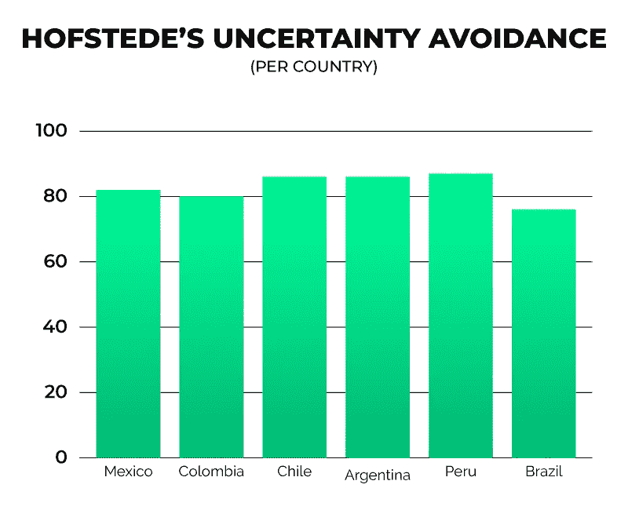

# 拉美的风险投资行业够冒险吗？

> 原文：<https://medium.datadriveninvestor.com/is-latin-americas-venture-capital-industry-adventurous-enough-contxto-931e149259b1?source=collection_archive---------11----------------------->

拉丁美洲的风险投资正达到一个临界点。

不出所料，我最近看到的许多风投交易都很平淡。至少，从我的写作经验来看。

也许他们并没有给人留下深刻印象，因为拉丁美洲的第一批风险投资浪潮似乎并没有真正寻求支持创新、颠覆性和本土创业公司。与寻求连任的总统相似，许多风投大多是在为自己着想。

长话短说，他们很谨慎。

# 两个词——规避风险

现实是，拉美人在文化上厌恶风险。此外，这些基金中的大多数都是这些本地公司的第一或第二只基金，这是投资于我喜欢称之为“科技型中小企业”的完美配方。不是创业公司。

他们不想“太”冒险。他们只想活下去，说实话，我不怪他们。

*Source:* [*Contxto*](https://www.contxto.com/) *with* [Hofstede-Insights](https://www.hofstede-insights.com/country-comparison/chile,colombia,mexico/) *data.*

我们都知道风险回报权衡以及这种动态如何运作。投资风险越大，初始投资的潜在变化就越大。这可能是一个潜在的上升或下降，意味着你要么打了一个本垒打，要么摔了个嘴啃泥。

如果这些基金支持高风险(但有潜在回报)的公司，失败的可能性会成倍增加。

如果这些高风险的投资组合公司被证明是糟糕的投资，普通合伙人不仅会面临糟糕的公众形象，还会被边缘化，而且不太可能再筹集到另一只基金。还有，谁愿意资助一个亏损的投资者呢？

对许多人来说，这是一种合理的恐惧。然而，这不应该是风险投资的本质。也就是说，拉丁美洲的风投并不像美国投资者当年那样玩游戏。

如果你不同意，让我来问你:你认为拉丁美洲的风险投资公司会在优步、Spotify、脸书或 Palantir 等公司的早期阶段为其提供资金吗？

我会诚实地对这个问题说不。现在，考虑时间优势。当时，没有任何迹象或可比数据来思考 Paypal 或 Netscape 是否会成功。想想那些公司在 Powerpoint 层面听起来有多疯狂。

# 恶性循环

老实说，我理解他们的想法。然而，安全行事的问题在我看来更糟糕。甚至有更多的缺点，但可能是以一种更功利的方式。如果一个投资者投资了一些风险太大的东西，嗯，是的，可能会对那个人不利。

然而，如果整个生态系统未能投资于风险更高的项目，那么整个生态系统都会失败。对于创业公司和投资者来说，这是一个非常简单的恶性循环。

现在，想想这个。如果你是一个梦想成为下一个埃隆·马斯克的开发者，那么你很可能会决心推出有争议的、颠覆性的、甚至可能是幼稚的产品。然而，一旦你开始向风投推销，你很可能会吓跑他们。

首先，要么是产品太复杂，难以理解，尤其是考虑到大多数风投都来自投资银行、咨询或实体商业背景，而非技术领域。或者，投资非常早期或地下产业的恐惧太高了。

接下来会发生什么？好吧，尽管有这么多闲聊和促进创新，但实际上，许多投资者和拉美其他国家一样厌恶风险。你可能会感到失望和沮丧，因此，你的下一个伟大的想法可能不会是开创性的。

# 一切为了生存

或许现在你更熟悉这些投资者支持的交易类型。自然地，你会成为那些产品中的一员，增加你进入主流风险投资/创业世界的机会。

风险更小，破坏性更小，但肯定对投资者有吸引力。嗯，鞋城怎么样？听起来刚刚好。底层编码的完美数量，巨大的市场和传统的、模仿的商业行为。请记住，没有什么比成为“科技型中小企业”更不花哨、更稳定(有预见性)的了

如果每个人都大规模这样做，生态系统将会毁灭。也就是说，有限合伙人可以继续赚取同样的金额，用更安全、更传统的资产获得可靠的回报。

任何投身于未知行业(如科技)的动机都将被抛到九霄云外。反过来，生态系统的支持系统会继续保持安全。

风险投资的资金和资源将变得更加稀缺，使得合伙人在配置资本时更加挑剔。尽管可能有很多需求，但供应最终可能会不足。持续的恶性循环。

# 去哪里寻找灵感？

硅谷等更成熟的生态系统有什么不同？好吧，富有冒险精神的风投(听起来很多余，因为这本来就是风投应该做的)敢于为疯狂的想法提供资金。

在经历了多次失败后，这些大规模的退出无疑吸引了非科技投资者的注意力。这对生态系统产生了巨大的影响。越来越多的公司对通过 M&A 提供退出选择感兴趣，同时越来越多的工程人才认识到在初创公司工作的好处。

第一批成功的创业者中，许多人离开了他们的公司，再次成为风投或创业者。唯一的不同是，第二次他们更有勇气。

那些在这些公司工作过的人现在更有能力、更有经验、更有知识来创办自己的公司。像这样，就成了倍增的“滚雪球”效应。更多的公司意味着更多的财富可以分配。

前创始人风投精通创业运营、产品设计、增长黑客等。正因为如此，许多人现在向投资组合创始人的成员提供有价值的建议，最终增加了成功的可能性。

然而，许多人也更愿意投资颠覆性公司，因为他们熟悉这个行业。这是一个良性循环。

我们正处于转折点。现在是第一波新的投资者开始退出他们的头寸的时候了，只是为了揭示他们的收益或损失。如果其中一些收益不足以弥补损失，那么当地有限合伙人的融资速度肯定会放缓。

# 安全行事的问题是

这一切都始于对冒险的渴望。寻找有风险的努力。寻找指数的输赢。留意离群值。VC 不应该遵循正态分布或钟形曲线，它应该是偏斜的。

投资和传统的规避风险的有限合伙人当然会带来一些障碍，但这是普通合伙人要克服的工作。为了所有参与者，要么努力，要么回家。

为了保持相对安全，投资者正在进入低资本需求、低进入壁垒和低差异化的公司。最终，随着竞争变得越来越容易，这些行业将开始饱和。

具有讽刺意味的是，在类似企业之间存在如此多不可避免的竞争的情况下，投资这些公司比投资资本密集型、破坏性、未经证实的商业模式风险更大。

# 比较数字

> 根据 LAVCA 的数据，2017 年，拉丁美洲的风险投资总额为 11.41 亿美元。其中，3.36 亿美元只投给了支付创业公司。不是 fintechs，而是 payments 获得了全部配置资本的 30%。

有了这些，想象一下其他行业和子行业所剩无几。这听起来可能像是我讨厌支付公司，我没有，我只是对缺乏多样化有问题，在众所周知的市场中谨慎行事。

大多数风险投资只资助收入和产品符合市场需求的公司。换句话说，他们更有可能投资于成熟的公司以降低风险，同时期待类似风险投资的回报。这很讽刺。

# 结论

是的，投资小额债券，保持多元化，但要早投资。如果你是一个风投，你可能会厌恶地阅读这篇文章。你可能会想，“这些创业公司不是优步或脸书！”但是听着，这种不情愿是你的基金的主要限制。

考虑一下这个。你刚刚与之聊天的那个极度活跃的创始人，提出了一个听起来亵渎神明的雄心勃勃的想法——这可能是你的黄金入场券。起初，Spotify 听起来一定很荒谬，尤其是在 Napster 崩溃并烧毁之后。

此外，当优步启动时，出租车行业是一个腐败的黑手党。此外，谁会想到一个除了随意评论陌生人的帖子之外没有其他目的的平台会像 Twitter 一样受欢迎？

这篇文章的目的无非是唱反调，至少引发一些对你的投资论点的“怀疑”，并希望让一些疯狂的创始人获得一些资本继续下去。

乐意讨论你的想法！下面评论。

-VC

*原载于 2019 年 7 月 22 日*[*【https://www.contxto.com】*](https://www.contxto.com/en/opinion/is-latin-americas-venture-capital-industry-adventurous-enough/)*。*