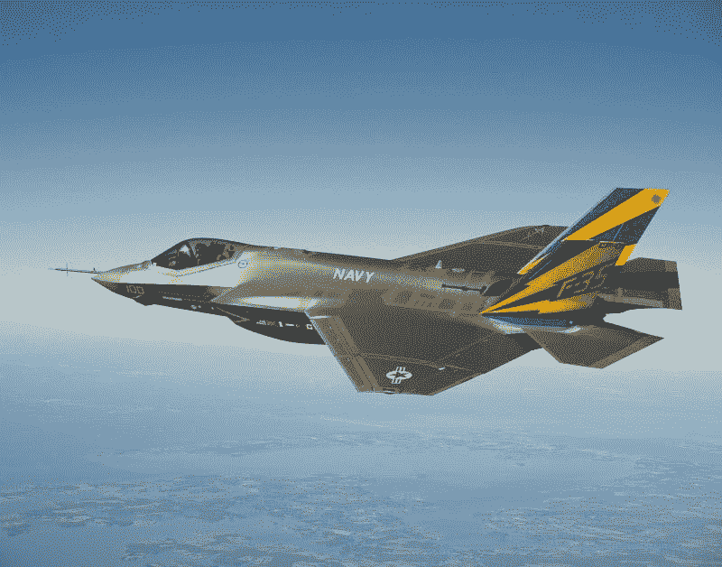
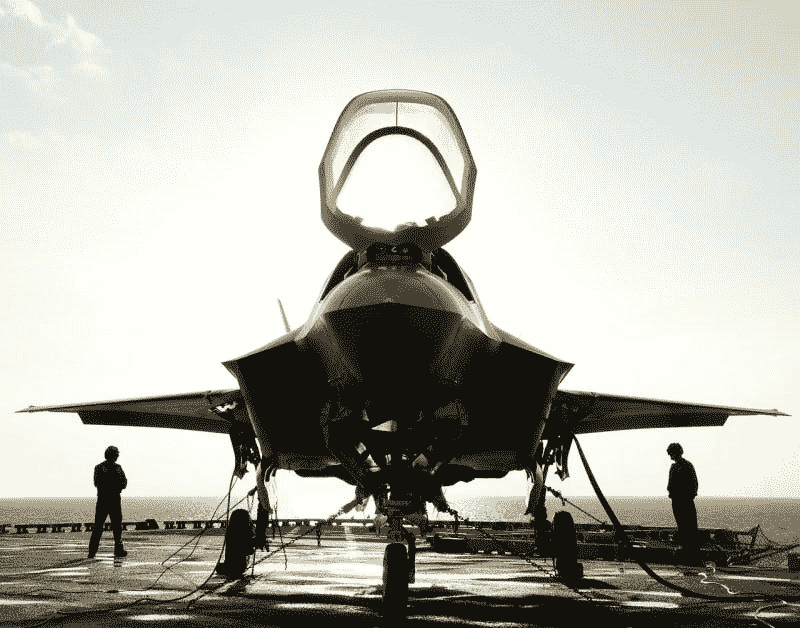
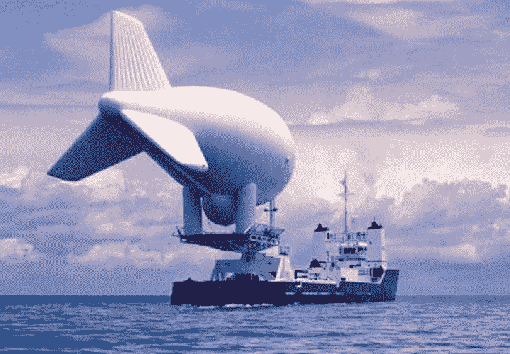
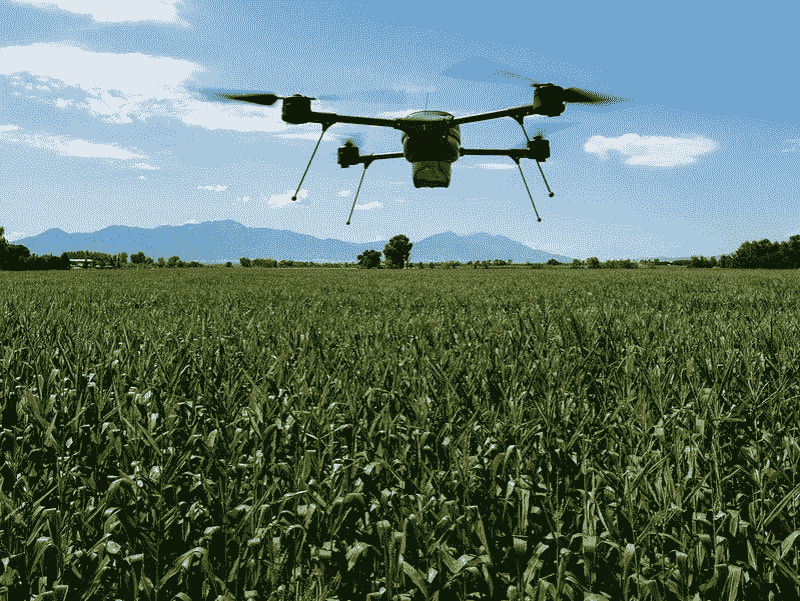
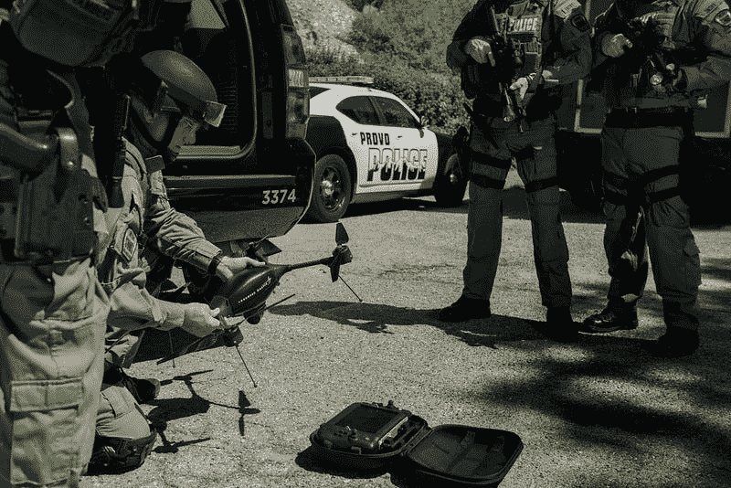
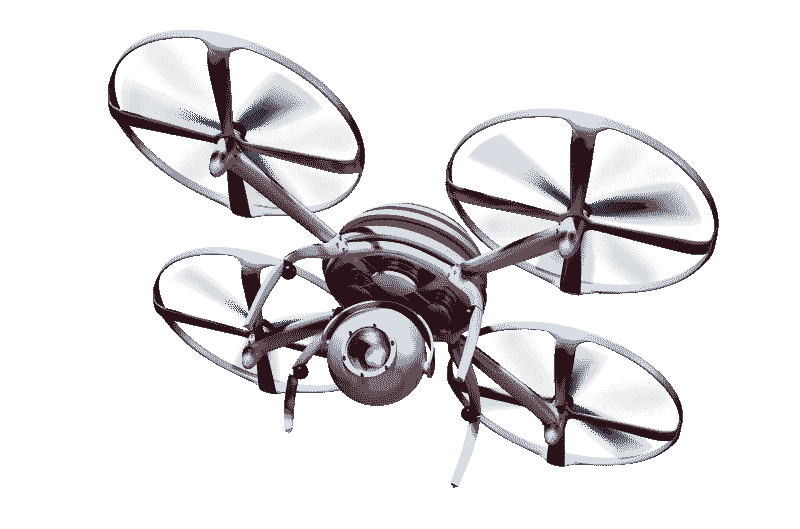
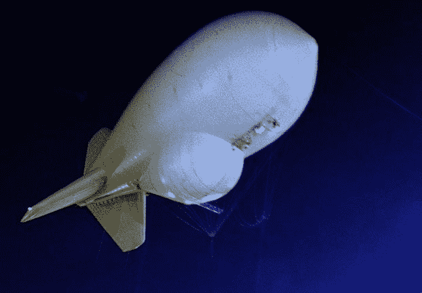
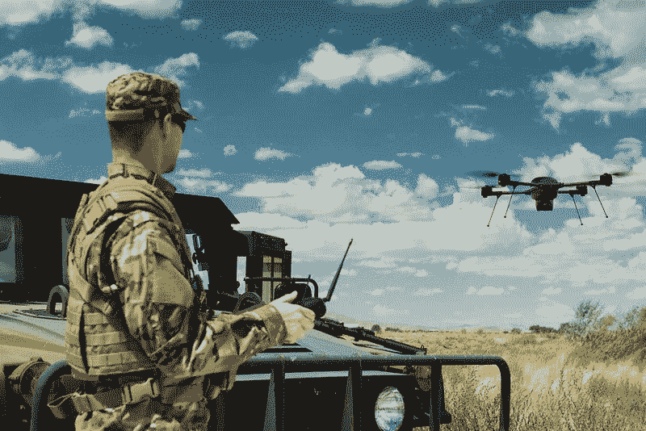

# 洛克希德·马丁公司注定要失败吗？—市场疯人院

> 原文：<https://medium.datadriveninvestor.com/is-lockheed-martin-doomed-market-mad-house-494698e6ee3f?source=collection_archive---------9----------------------->

由无人机引领的新技术可能会给洛克希德·马丁公司带来厄运。以及每股 388.26 美元的股票。

奇怪的是，也门的胡塞叛乱分子在 2019 年 9 月 14 日炸毁了两个沙特石油加工设施，可能摧毁了洛克希德·马丁公司的大部分业务。解释一下，胡塞人用一次[无人机袭击](https://marketmadhouse.com/is-america-defenseless-against-drone-attacks/)瘫痪了沙特一半的石油生产，扰乱了世界石油市场。

这些无人机的成本可能只有 15000 美元，但它们让沙特阿拉伯大吃一惊，*纽约时报* [声称](https://www.nytimes.com/2019/09/14/world/middleeast/saudi-arabia-refineries-drone-attack.html)。事实上，无人机轻松躲过了沙特阿拉伯的 313 架战斗机和 122 组防空导弹。

 [## 我们为军事人工智能做好准备了吗？数据驱动的投资者

### 今天，算法可能会以迷人的形状出现，例如索菲亚，一个态度可爱、开明的机器人…

www.datadriveninvestor.com](https://www.datadriveninvestor.com/2019/02/21/are-we-ready-for-military-ai/) 

“尽管沙特去年在国防预算上花费了 676 亿美元(540 亿英镑)，其中很大一部分是在极其昂贵的飞机和防空系统上，这显然未能阻止袭击，”帕特里克·考克伯恩在独立报上写道。考克伯恩声称，洛克希德·马丁公司制造的一架 F-35 Lighting II 战斗机价值 1.22 亿美元。

# 军工复合体彻底失败了

基本上，现代军工综合体在 2019 年 9 月 14 日失败了。事实上，2019 年 9 月 14 日可能标志着自 1941 年珍珠港事件以来美国军工复合体最大的失败。

这威胁到了洛克希德·马丁公司，因为洛克希德·马丁公司是军工联合体。例如，洛克希德·马丁公司建造了导弹防御系统。然而，胡塞人和他们的伊朗朋友刚刚展示了导弹防御系统在今天的战争中毫无用处。

此外，洛克希德·马丁公司还制造了 F-16 战斗猎鹰、F-2 支援战斗机、F-21、F-22 猛禽、武装黑鹰直升机和有争议的 F-35 闪电 II 等战斗机。Houthis 只是证明了你不再需要昂贵的战斗机，顶尖飞行员，以及所有的支持系统来造成数十亿美元的损失。

因此，洛克希德·马丁公司的大部分产品线将不再有市场。事实上，我想象许多外国领导人将在未来几个月取消他们的武器订单。洛克希德·马丁公司可能很快就会关闭许多工厂，把飞机从装配线上直接送到墓地。

进步威胁着洛克希德的业务，因为政府可以通过无人机获得更多的“物有所值”。例如，理论上你可以用一架 F-35 的价格购买数千或数万架无人机。

# 洛克希德·马丁能活下来吗？

从积极的方面来看，洛克希德·马丁公司制造了几款无人机，包括[沙漠之鹰 III](https://www.lockheedmartin.com/en-us/products/desert-hawk.html) 、Indago、混合飞艇、X56A、 [74K 浮空器](https://www.lockheedmartin.com/en-us/products/unmanned-aerostats-airships-and-lighter-than-air-technology.html)和 X59 QuessT。

此外，洛克希德·马丁公司计划开发一些下一代无人机，包括[战神](https://www.lockheedmartin.com/en-us/products/ares.html)。具体来说，他们将 Ares 设计成一种无人驾驶的垂直起降(VTOL)运输机。因此，战神可以向未来的战场运送军队、补给、机器人坦克或机器人士兵。

此外，空军可以很容易地将洛克希德·马丁公司的许多飞机改装成无人机投送平台。例如，CJ130J 超级大力神、74K 浮空器和 [C-5 银河](https://www.lockheedmartin.com/en-us/products/c-5.html)运输机可以向战场运送大群[无人机](https://www.defenseone.com/technology/2018/11/us-militarys-drone-swarm-strategy-just-passed-key-test/153007/)。此外，洛克希德·马丁公司可以将其拟议中的[混合飞艇](https://www.lockheedmartin.com/en-us/products/hybrid-airship.html)变成无人机的飞行航母。

最后，无人机可以发射许多洛克希德·马丁公司的武器。例如，无人机可以轻松发射标枪导弹或远程反舰导弹。最终，洛克希德·马丁公司可以将其多管火箭系统之一(MLRS)建造到战神火箭中。战神可以在没有人类帮助的情况下用 [MLRS](https://www.lockheedmartin.com/en-us/products/multiple-launch-rocket-system-m270.html) 降落并粉碎任何目标。

因此，洛克希德·马丁公司在无人机战争时代有很大的价值。洛克希德·马丁公司可以迅速将其大部分武器装备用于无人机作战。此外，洛克希德公司正在“臭鼬工厂” [Procerus Technologies](https://www.lockheedmartin.com/en-us/products/procerus-technologies.html) 研究新型无人机，并投资在战场上使用[人工智能](https://marketmadhouse.com/will-artificial-intelligence-make-the-thucydides-trap-worse/) (AI)。

我认为洛克希德·马丁公司的管理层知道无人机的威胁，并正在为此做准备。因此，这家国防承包商可以在一些标志性产品过时后继续生存。

# 洛克希德·马丁公司是价值投资吗？

有趣的是，洛克希德·马丁公司正在成长并赚钱。例如，**洛克希德·马丁公司(纽约证券交易所代码:LMT)** 在 2019 年 6 月 30 日报告的收入为 144.27 亿美元。

在截至 2019 年 6 月 30 日的季度中，洛克希德公司的收入增长率为 7.68%。此外，洛克希德报告称，截至 2019 年 6 月底，季度毛利为 19.93 亿美元。此外，洛克希德报告称，该季度净收入为 14.2 亿美元，税前利润为 16.83 亿美元。

这些数字导致季度自由现金流为 16.68 亿美元，自由现金流为 14.19 亿美元。然而，洛克希德·马丁公司在 2019 年 6 月 30 日记录了负投资现金流-2.51 亿美元和负融资现金流-12.41 亿美元。

最终，在制造了所有这些武器和车辆后，洛克希德·马丁公司几乎没有剩余现金。该公司于 2019 年 6 月 30 日拥有 11.67 亿美元的现金及等价物。

鉴于这些数字，我不认为 LMT 是一个有价值的投资，因为它几乎没有现金。相反，我认为洛克希德·马丁公司可能会削减几个大的国防开支，从而引发严重的麻烦。

# 洛克希德·马丁公司的股息有多安全？

因此，洛克希德·马丁公司(纽约证券交易所代码:LMT)投资者享受的高额股息可能会受到威胁。

令人印象深刻的是，洛克希德·马丁公司于 2019 年 8 月 30 日支付了 2.20 美元的季度股息。此外，2018 年 20₵的股息增长了 10%。为了澄清，LMT 于 2019 年 8 月 31 日支付了 2 美元的股息，并于 2019 年 11 月 30 日支付了 2.20 美元的股息。

总的来说，洛克希德·马丁公司向投资者提供的股息收益率为 2.27%，年化股息为 8.80 美元，股息支付率为 51.1%。此外，Dividend.com 报告称洛克希德·马丁公司实现了 16 年的股息增长。

我认为这些数字解释了美国军工复合体的持久性和力量。归根结底，军工复合体的报酬很高。

# 美国军事工业综合体的道德困境

然而，军工综合体和洛克希德·马丁公司给投资者带来了严重的道德困境。首先，这家公司生产杀人产品。因此，LMT 违反了基督教，犹太教，佛教和伊斯兰教神学的基本原则。也就是说，你应该杀人。

第二，2019 年 9 月 14 日的事件证明了洛克希德·马丁公司；和整个军事工业综合体都可能无法完成他们的主要任务。这个任务是通过提供创新的军事技术来保护美国和其他国家免受攻击。

2019 年 9 月 14 日，沙特阿拉伯的军事工业综合体令人瞩目地失败了。事实上，我认为对美国军方及其供应商来说，无人机地狱可能是比 2001 年 911 袭击更大的灾难。

澄清一下，9·11 是一次性事件，是可能死一次的狂热分子实施的自杀式袭击。9 月 14 日无人驾驶飞机袭击者仍然逍遥法外，他们很容易再次发动袭击。因此，无人机战争已经开始，美国毫无准备。

# 无人机战争已经开始

无人机战争已经进行了一段时间，但华盛顿没有人注意到。事实上，沙特石油设施只是一系列破坏性越来越大的无人机袭击中的最新一起。

例如，2017 年 3 月 23 日，*Market Mad House*T2 指出，一架无人机引发了一场火灾，据报道，这场火灾摧毁了乌克兰 Balakliya 价值 10 亿美元的弹药。具体来说，无人机可能通过投掷铝热剂手榴弹点燃了一个巨大的政府弹药库。

铝热剂手榴弹是一种简单的燃烧装置，可以产生高达 4000 华氏度(2204 摄氏度)的温度。2017 年，我估计一枚铝热剂手榴弹 ZMG-1 的成本为 12.50 美元至 110 美元。因此，乌尔卡尼亚叛军可以摧毁价值 10 亿美元的弹药，只需 12.50 美元加上无人机的成本。

因此，无人机可以摧毁昂贵的美国军事装备；比如价值 1220 亿美元的 F-35 闪电 II。不到 100 美元。解释一下，一架无人驾驶飞机可以通过投掷一枚铝热剂手榴弹摧毁一架战斗机。

# 无人机战争升温

无人机也不仅仅可以打击陆基目标。2017 年 8 月 14 日，一架无人机轻松[穿透](https://marketmadhouse.com/350-drone-penetrated-security-5-02-billion-aircraft-carrier/)英国皇家海军全新的价值 50.9 亿美元(39 亿英镑)的航空母舰*号 HMS 伊丽莎白女王*的安保。

无人机降落在航母甲板上，拍照后飞走。如果无人机可以降落在航母甲板上，它可以很容易地放置铝热剂手榴弹或大型炸弹。如果一架无人驾驶飞机在飞机加油时在航母甲板上投掷一枚铝热剂手榴弹，它可能会把*号皇家海军舰艇伊丽莎白女王*号变成漂浮的地狱。

在这个过程中，无人机可以摧毁 10 架直升机和 40 架 F-35B 战斗机，并削弱英国的防御。此外，无人驾驶飞机袭击伊丽莎白女王号可能会导致 1600 名船员伤亡。

受到威胁的不仅仅是军方。2018 年 8 月，一架无人机在一次演讲中差点[杀死](https://www.nytimes.com/2018/08/04/world/americas/venezuelan-president-targeted-in-attack-attempt-minister-says.html)委内瑞拉总统尼古拉斯·马杜罗。无人机几乎让该国陷入混乱，因为马杜罗在袭击期间正在全国电视上讲话。

令人不安的是，袭击发生时，马杜罗正在参加一场军事活动，被士兵包围。Marduro 幸免于难，但其他无人机受害者就没有这么幸运了。2019 年 9 月 19 日，美国无人机袭击阿富汗楠格哈尔省，造成 30 名松子农民死亡，40 人受伤，*半岛电视台* [称](https://www.aljazeera.com/news/2019/09/afghanistan-dozens-civilians-killed-drone-attack-190919072728303.html)。无人机在袭击农民时试图杀死 ISIS 恐怖分子。

因此，无人机对平民和军队都是一种威胁。然而，军事工业联合体对此毫无准备。

# 洛克希德·马丁公司为无人机战争做好准备了吗？

洛克希德·马丁公司有资源在无人机战争中获利。该公司传奇的[臭鼬工厂](https://www.lockheedmartin.com/en-us/who-we-are/business-areas/aeronautics/skunkworks.html)是世界上最成功的飞机研发机构之一。

例如，臭鼬工厂正在开发下一代无人驾驶飞机，可以从美国的基地打击地球上任何地方的目标。此外，洛克希德·马丁公司可以将其许多飞机重新用作无人机。

然而，如果无人机战争促使国会取消 F-35 和其他昂贵的战斗机项目，洛克希德·马丁公司可能会遭受重大打击。因此，我认为洛克希德·马丁公司的风险很高，投资者需要回避价格过高的股票。

由于无人驾驶飞机，战争的未来在不断变化。这可能会威胁到马丁·洛克希德公司的盈利能力和股息。

*原载于 2019 年 9 月 24 日*[*【https://marketmadhouse.com】*](https://marketmadhouse.com/is-lockheed-martin-doomed/)*。*